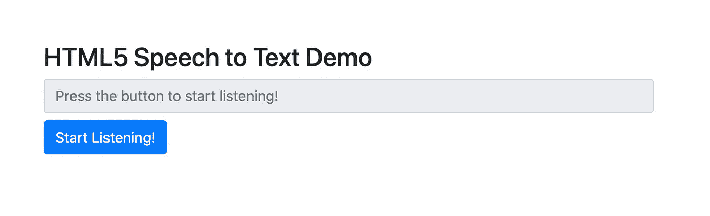
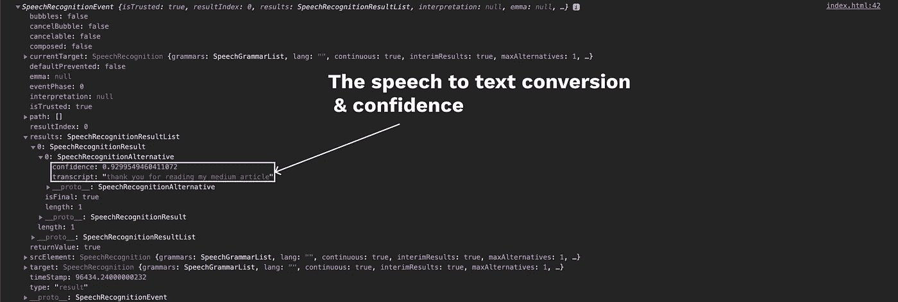

# 创建监听的 Web 应用程序！👂

> 原文：<https://levelup.gitconnected.com/create-web-apps-that-listen-e44002e0b4dd>

你的网络应用也可以有耳朵！

语音技术是下一件大事，它有巨大的潜力来减少后电晕世界的表面接触。在过去的几年里，我们已经看到谷歌和亚马逊等科技巨头进入虚拟语音助手领域，他们创造的产品不仅能听，还能理解并回复用户的需求。

虽然谷歌助手和亚马逊 Alexa 等产品拥有复杂的架构，能够理解用户所说的话，但它们都是从基础开始的，将用户的语音转录为文本。

让我们看看如何让我们的网络应用程序能够倾听用户的心声。

倾听很重要。照片由 Unsplash 上的 Alireza Attari 拍摄

## 它是如何工作的

从技术上来说，谷歌 Chrome 不执行开箱即用的语音识别。它将音频发送到谷歌的服务器，服务器执行转录并返回结果。这在[谷歌 Chrome 隐私白皮书](https://www.google.com/chrome/privacy/whitepaper.html#speech)中有所提及和澄清。

因为`SpeechRecognition`使用服务器端 API，你的用户必须在线才能使用它。让我们希望谷歌引入本地语音识别，但在此之前，这是一个限制，我们的用户将不得不接受。

## 入门指南

让我们创建一些带有输入元素和按钮的 HTML，它将开始监听用户。请确保您不会在页面加载后立即开始收听，以确保您的用户选择使用此服务。

这个 starter HTML 将给我们一个非常简单的视图，如下所示:

现在，我们将添加 JavaScript 代码片段来启用语音识别&自己看看结果吧！将以下代码添加到您的`body`元素的`script`标签中。

这就是我们所需要的听力和语音转换成文本。现在，让我们浏览一下 JavaScript 代码片段。

在第 2 行，我们创建了一个`webkitSpeechRecognition` API 的实例。然后我们创建一个布尔变量来知道浏览器是否应该监听。

然后我们定义 3 个函数，`start, stop, and onResult`，它们改变按钮的文本以反映正确的状态，并启动或停止识别服务。

但是，`onResult`似乎在做别的事情。它似乎是编译语音识别结果并将其显示给我们的用户的方法。

当你运行代码并点击按钮开始收听时，Chrome 会请求你允许使用麦克风。一旦你点击“允许”，Chrome 就会开始听你说什么。一旦你停止讲话，你应该会看到一个`SpeechRecognitionEvent`贴在控制台上。让我们深入研究一下那个事件。

`The SpeechRecognitionResult event in the Developer Console`

最重要的属性是`results`，它是一个`SpeechRecognitionResult`对象的列表。这里只有一个结果，因为我们只说了一句话，然后就不再听了。

结果对象包括一个`SpeechRecognitionAlternative`对象的列表，第一个对象包括您所说内容的副本和一个介于 0 和 1 之间的置信度值。置信度值有助于确定可用选项中哪一个是最正确的副本。

接收多个`SpeechRecognitionAlternative`对象在某些情况下会很有用，比如您希望用户选择最佳选项。

`recognition.continous`控制是捕获连续结果(`true`)，还是每次开始识别时只捕获一个结果(`false`)。

`recognition.interimResults`定义了语音识别系统是应该返回中间结果还是只返回最终结果。

API 在识别单词和句子方面确实很好，但在标点符号方面就不太好了。

## 浏览器支持

对 Web Speech API 语音识别的支持目前仅限于 Chrome for Desktop 和 Android——Chrome 从版本 33 左右开始支持它，但带有前缀接口，因此我们使用`webkitSpeechRecognition`。

享受创建倾听的 web 应用程序的乐趣！👂 ❤️