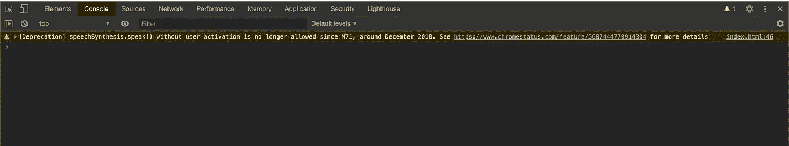
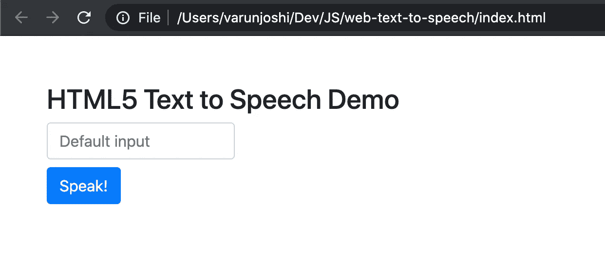

# 创建会说话的 Web 应用程序！🔊

> 原文：<https://levelup.gitconnected.com/create-web-apps-that-talk-1aedbf48a6e5>

## 网络语音合成 API 简介。

网络提供了巨大的机会。我们很难想象没有互联网的生活。它提供了一种无需离开舒适的沙发就能与世界联系的方式。随着我们在旅途中收听有声读物，音频形式的互联网每天都在增长。它还允许有视觉障碍的个人享受书籍和文章。

因为我们都是开发者，所以理解如何让你的应用程序/网站更容易被所有用户访问是很有意义的。


照片由[亚当·所罗门](https://unsplash.com/@solomac)在 Unsplash 上拍摄

[](https://skilled.dev) [## 编写面试问题

### 一个完整的平台，在这里我会教你找到下一份工作所需的一切，以及…

技术开发](https://skilled.dev) 

Web Speech API 使您能够将语音数据添加到 Web 应用程序中。Web 语音 API 有两个部分:

1.  语音合成(文本到语音)
2.  语音识别(异步语音识别。)

让我们看看 SpeechSynthesis API。

`SpeechSynthesisUtterence`界面允许您向浏览器提出语音请求。这个界面最棒的部分是它可以让你控制声音、语言、音量，甚至是声音的速率和音调！

`SpeechSynthesisUtterance`的属性是:

1.  `SpeechSynthesisUtterance.lang`:获取并设置演讲的语言。
2.  `SpeechSynthesisUtterance.pitch`:获取并设置演讲的音调。
3.  `SpeechSynthesisUtterance.text`:要合成的文本。
4.  `SpeechSynthesisUtterance.rate`:获取并设置讲话的速度。
5.  `SpeechSynthesisUtterance.voice`:获取并设置将要使用的声音。
6.  `SpeechSynthesisUtterance.volume`:获取并设置演讲的音量。

让我们来看一下文本到语音转换 API 的基本演示。

在上面的代码片段中，我们使用了`SpeechSynthesisUtterance`接口来指示浏览器说出消息(“Hello，World！”)还给我们。

但是，如果直接在 HTML 文件的一个`<script>`标签中运行上面的代码，就听不到任何声音了！现在，在你开始怀疑你的扬声器是否正常工作，或者这段代码是否合法之前，打开你的浏览器开发工具，根据浏览器的不同，你可能会在控制台上看到警告，也可能看不到。

我一直推荐你使用谷歌浏览器，因为它有最好的开发工具。



如果您直接在一个

这是谷歌 Chrome 新[政策](https://www.chromestatus.com/feature/5687444770914304)的一部分，允许从标签页播放声音。这很好，因为有些网站臭名昭著，在没有用户互动/允许的情况下播放广告或声音，让你陷入尴尬的境地。

简而言之，在文档的生命周期中，您的用户至少需要与您的页面交互一次，直到您可以播放页面中的声音。

您只需提供某种 UI 元素，确保您的用户在调用该方法之前已经与页面进行了交互。让我们在代码中添加一个。

现在你可以在输入框中输入内容了，浏览器会把你的信息读给你听。



这是我们最终的用户界面应该是什么样子。

## 使用不同的声音

如果您想使用不同的可用声部，您可能需要试验声部参数。

您可以通过在您的`click`监听器中运行`for-loop`来获得所有可用声音的列表。

```
*for* (*let* voice *of* window.speechSynthesis.getVoices()) {
    console.log('voice', voice.name);
}
```

另外，请注意，这些声音是异步加载的，因此您可能会在第一次点击时听到默认的声音。之后，您应该可以听到选定的声音。

让我们在例子中使用`Google UK English Male`的声音。在第 25 行的 click listener 中添加以下代码。

试着改变`msg.volume`、`msg.rate`、&、 `msg.pitch`的值来获得不同版本的声音！

## 浏览器支持

Chrome 33+ & Firefox 49+ & Safari 7+完全支持 Web Speech API，但您可能希望明确检查 Web Speech API 的每个功能是否都受支持:

```
*if* ('speechSynthesis' *in* window) {
    console.log('Speech Synthesis available!');
}
```

厉害！现在你可以给你的网站增加额外的可访问性。当开发人员和产品设计人员考虑到他们的所有用户，并付出一点额外的努力让所有人都能使用时，这总是好的！

享受创建会说话的网络应用程序的乐趣！🔉 ❤️