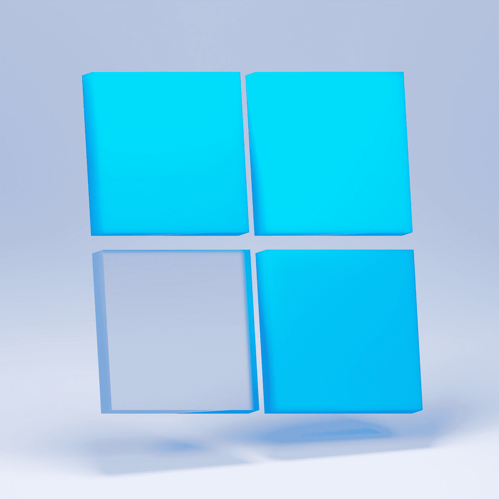
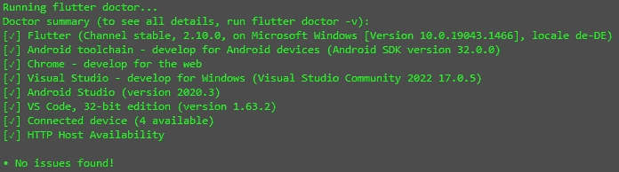
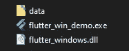
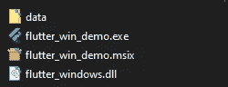
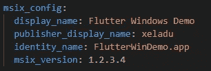
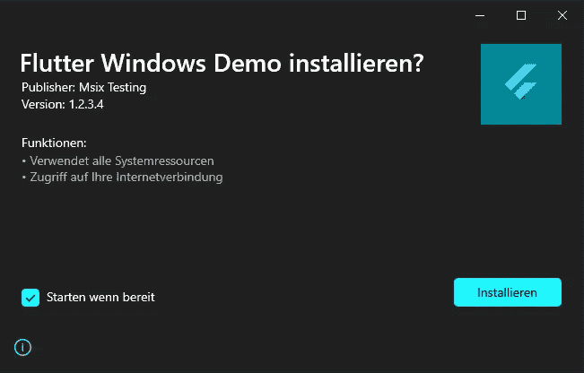
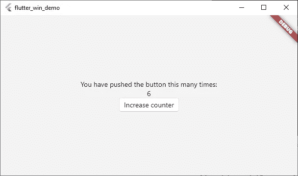
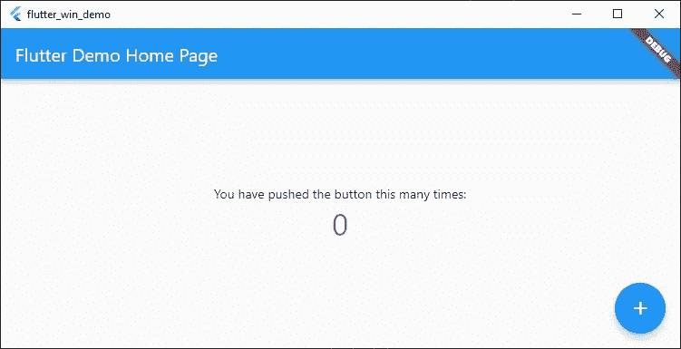

# 如何用 Flutter 创建 Windows 应用程序

> 原文：<https://levelup.gitconnected.com/create-windows-apps-with-flutter-cd287c9a029c>

## 用于 Flutter 的 Windows 桌面就在这里！

## 关于如何使用新的 Flutter 2.10 版本创建可执行文件和 MSIX 包的简短指南。



照片由 [Unsplash](https://unsplash.com?utm_source=medium&utm_medium=referral) 上的 [Sunder Muthukumaran](https://unsplash.com/@sunder_2k25?utm_source=medium&utm_medium=referral) 拍摄

自从 Flutter 2.10 发布以来，Windows 桌面被标记为稳定。在本文中，我将向您展示构建可执行文件和 MSIX 包需要做些什么。如果你没听到这个消息，这里是关于所有变化的相关消息来源。

[](https://medium.com/flutter/whats-new-in-flutter-2-10-5aafb0314b12) [## Flutter 2.10 的新特性

### Windows 稳定、性能改进、材料 3 更新等等！

medium.com](https://medium.com/flutter/whats-new-in-flutter-2-10-5aafb0314b12) [](https://medium.com/flutter/announcing-flutter-for-windows-6979d0d01fed) [## 宣布 Windows 颤振

### 构建高质量的 Windows 应用程序，同时运行在手机和网络上

medium.com](https://medium.com/flutter/announcing-flutter-for-windows-6979d0d01fed) 

## 升级颤振

如果你还没有升级你的 Flutter 版本，去 [Flutter 发布页面](https://docs.flutter.dev/development/tools/sdk/releases?tab=windows)，下载你的操作系统的最新版本，并安装它。
或者使用您选择的命令行工具并执行`flutter upgrade`。这将为你做所有的工作。当然，这只有在您已经在系统上安装了一个旧版本的 Flutter SDK 的情况下才有可能。

如果您不知道您当前的配置，调用`flutter doctor`命令并检查结果。



升级到 Flutter 2.10 后的 Flutter doctor 输出

## 构建可执行文件

要为你的 Flutter 项目创建一个可执行文件，你需要运行命令`flutter build windows`。包括应用程序在内的创建文件将被放在子文件夹`build\windows\runner\Release`中。该应用程序不是独立的，这意味着它依赖于数据文件夹和 DLL 文件。如果您想要分发应用程序，请确保包含所需的数据。



执行构建命令后的输出文件

## 构建 MSIX 包

MSIX 软件包提供安装和卸载例程，并包含运行应用程序所需的一切。因此，如果你想发布你的应用程序，他们会更适合。构建 MSIX 包需要 [MSIX 包](https://pub.dev/packages/msix)。您可以通过运行命令`flutter pub add --dev msix`或者通过手动将引用添加到您的 pubspec.yaml 文件来将其添加到您的项目中。


MSIX 开发依赖项已添加到 pubspec.yaml

要创建包，首先创建可执行文件，然后使用以下命令创建包

```
flutter build windows
flutter pub run msix:create
```

创建的包存储在与可执行文件`build\windows\runner\Release`相同的子文件夹中。



执行构建和打包命令后的输出文件

您可以将 MSIX 软件包分发给任何运行最新 Windows 10 或 Windows 11 版本的用户，他们可以安装该软件包。甚至可以使用[窗口商店](https://www.microsoft.com/en-us/store/apps/windows)进行分发。如果您想要定制包信息，您只需要在您的 pubspec.yaml 中添加一个`msix_config`部分，或者将信息作为参数传递给`msix:create`调用。所有可用的参数都可以在 [MSIX 包](https://pub.dev/packages/msix)的文档中找到。请看下图中的小例子:



pubspec.yaml 中 MSIX 包的配置

安装程序如下所示(语言取决于您的系统语言):



MSIX 软件包的安装例程示例

## 使用流畅的设计语言

如果想让你的 app 看起来像真正的 Windows 应用，建议使用[微软的流畅设计语言](https://www.microsoft.com/design/fluent/#/)。谢天谢地，有一个 Flutter 包，它提供了几乎所有你需要的东西，让你的应用程序具有 Windows 风格。fluent_ui 包包含了几乎所有的控件、字体、图标等，它们可以在 Flutter 应用程序中使用。文档非常好，甚至有材料控件和流畅的 UI 控件之间的映射，如果你想修改现有的应用程序，这很方便。下面的图片可以让你对这些差异有一个初步的印象。



使用流畅设计语言的颤振演示应用程序



使用材料设计语言的颤振演示应用程序

## 结论

在本文中，我们看到了如何使用 Flutter 2.10 版本构建可执行文件和 MSIX 包。此外，我们还了解了如何使用微软的 Fluent 设计语言来设计我们的应用程序。

## 源代码

你可以在 [GitHub](https://github.com/xeladu/flutter_win_demo) 上找到源代码。

如果你喜欢这篇文章，我会很高兴得到掌声👏(你知道可以拍几次吗？😎)另外，如果你还没有跟上我，我也很感激。

🌲 [linktr.ee](https://linktr.ee/xeladu) |☕ [咖啡](https://www.buymeacoffee.com/xeladu) |🎁[捐赠](https://www.paypal.com/donate/?hosted_button_id=JPWK39GGPAAFQ) |💻GitHub |🔔[订阅](https://xeladu.medium.com/subscribe)

顺便说一句:如果你还没有 Medium 会员，我推荐你使用[│我的推荐链接◀](https://medium.com/@xeladu/membership) ，因为它会让你访问 Medium 上的所有内容，并以一小部分费用支持我，而不会为你带来任何额外费用。谢谢大家！✨

## 相关文章

随意看看我其他扑的文章。

[](https://xeladu.medium.com/show-test-coverage-of-a-flutter-app-in-visual-studio-code-7e26c3b94aaf) [## 在 Visual Studio 代码中显示 Flutter 应用程序的测试覆盖率

### 下面是一个简短的指南，介绍如何在 Visual Studio 代码中可视化 Flutter 应用程序的代码覆盖率。

xeladu.medium.com](https://xeladu.medium.com/show-test-coverage-of-a-flutter-app-in-visual-studio-code-7e26c3b94aaf) [](https://xeladu.medium.com/building-flutter-apps-with-azure-devops-eaf9ae7ad158) [## 使用 Azure DevOps 构建 Flutter 应用程序

### Azure DevOps 的现成可用的构建管道，用于构建 iOS 和 Android 的 Flutter 应用程序

xeladu.medium.com](https://xeladu.medium.com/building-flutter-apps-with-azure-devops-eaf9ae7ad158) [](https://xeladu.medium.com/flutter-unit-test-basics-a8c6815f7712) [## 颤振单元测试基础

### 我们讲述了一个基本的例子，在一个颤振项目中，单元测试是怎样的。包括解释的代码示例。

xeladu.medium.com](https://xeladu.medium.com/flutter-unit-test-basics-a8c6815f7712)