# 用 Flutter 在 5 天内创建你的应用

> 原文：<https://levelup.gitconnected.com/create-your-app-with-flutter-in-5-days-412ee41de22a>

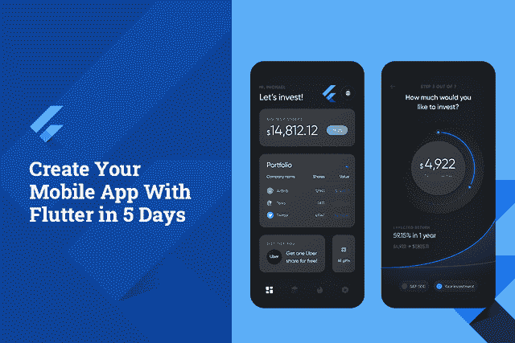

由[迈克尔·菲利匹克](https://dribbble.com/michael-filipiuk)由[艺术工作室](https://dribbble.com/Fireart-d)创作

扑扑扑扑。从 Twitter 推荐到 app 开发推荐视频，Flutter 已经成为一个遍布互联网的流行语。毫无疑问，Flutter 的一长串功能已经风靡全球，但如何在 5 天内入门才是中心问题。

那些需要坐下来，闭上眼睛，花很长时间思考允许为多种操作平台开发任何类型应用程序的编程语言的日子已经一去不复返了。

随着谷歌 Flutter 的推出，现在你不需要花费不眠之夜来学习新的语言和框架。应用程序开发过程从来都不容易，但 Flutter 通过提供与所有小部件和插件兼容的高级软件开发工具包，使开发者变得更加容易和简单。

用 Flutter 开发一个应用，无非就是一个幻想的故事。在现实中，无论你在应用程序开发方面多么精通，你都必须处理大量的技术及其缺陷。事实上，在移动应用程序开发领域，iOS 和 Android 两大巨头之间的竞争永无止境。

***所以在这里，作为一个创业公司你有两个顾虑:***

*   首先，如果你选择开发一个原生的 iOS 和 Android 应用程序，那么你需要很高的预算。
*   其次，如何占领更广泛的市场？

虽然每个领域都需要特定的技能，因此，你从软件开发公司得到的最常见的答案是为 iOS 选择 Swift，为 Android 选择 Kotlin。

> 但是我对你的两个问题的简单回答是——颤动！

## 颤动:一个幻想的故事

Flutter 是谷歌最近推出的 SDK，允许开发者使用单一代码库为 iOS 和 Android 创建应用程序。与其他流行的解决方案不同，Flutter 不是一个框架，而是一个完整的 SDK，它提供了构建跨平台应用程序所需的一切。从渲染引擎、现成的小部件到测试和集成 API，Flutter 应有尽有。

> 从这里开始，在直接进入开发过程之前，让我快速介绍一下 Flutter 的一些亮点，这使它变得非常困难:

*   尽管它是在 2017 年推出的，但它已经被全球 39%的开发者使用，并迅速巩固了其作为跨平台应用开发第二高要求框架的地位。
*   Dart 是 Flutters 面向对象的语言，它使用高级技术并编译成本机代码，从而大大提高了速度。
*   Flutter 使用操作系统作为画布来构建界面，并将手势、渲染和动画等服务移入框架本身，使开发人员能够完全控制系统。
*   Flutter 拥有现成的和定制的小部件，用于快速 UI 编码，使您能够进行任何级别的定制。
*   与其他应用相比，Flutter 拥有最温和的学习曲线和不断增长的社区，允许编程知识有限的开发人员进行原型开发和构建应用，也可以开始使用 Flutter。
*   热重新加载功能可以十倍的开发速度，并提高程序员的生产力，最终让您可以尝试新的东西，而不必担心这么长的延迟。
*   Flutter 应用因其高性能而闻名，因为它使用 CPU 使用率、每秒请求数、平均响应时间、每秒帧数等。
*   它提供了出色的应用程序可移植性，并允许您从任何平台迁移到 Flutter。

**简而言之:**Flutter 的所有这些特性和功能，肯定会鼓励你更深入地挖掘它的核心机制，并开始使用第一个 Flutter 应用程序。现在你一定想知道如何在 5 天内构建一个 Flutter 应用程序，而一个 [**移动应用程序开发公司**](https://www.xicom.ae/services/mobile-app-development/) 至少需要 4 到 6 周的开发时间。因此，让我们直接进入 Flutter 应用程序开发流程

# 用 Flutter 在 5 天内创建一个应用程序

Flutter 是一种易于应用程序开发的技术。所以在写这篇文章的时候，我们把重点放在了新手和专家身上，并试图让这篇教程简单、有序和直接。

所以不管你是做自由职业者，还是做 app 开发公司，这些知识一定会帮助你成为一名颤振开发者。

通过这篇教程，你将更深入地了解 Android 平台的 Flutter 开发，但是记住你需要 Android Studio for Android 和 XCode for iOS。因此，在开始应用程序开发流程之前，有必要设置一个环境。

*首先确保你有 Android Studio 版本。如果你没有做到这一点，那么按照以下简单的步骤:*

> 让我们从主要步骤开始:

## 第一步:安装 Android Studio

Android Studio 为 Flutter 提供了完整的集成 IDE 体验。此外，您可以将 Flutter SDK 用于任何文本编辑器开发体验。但是，ide 为您提供了语法高亮、代码完成和调试器等功能，这些功能在开发过程中非常有用。

*   因为我们专注于 Android。所以建议专家使用 [Android Studio](https://developer.android.com/studio) 。
*   或者，你也可以使用 Flutter 插件 IntelliJ:
*   [IntelliJ IDEA 社区](https://www.jetbrains.com/idea/download/#section=linux)，版本 2017.1 或更高版本
*   [IntelliJ IDEA Ultimate](https://www.jetbrains.com/idea/download/#section=linux) ，2017.1 版或更高版本

如果你使用的是 Android Studio 和 IntelliJ，请记住重启 IDE 来激活最近启动的插件。此外，这将帮助你开始使用 ide 的稳定版本，因为 Flutter 插件可能无法在 Beta 版、Canary 版或 EAP 版上正常工作。

## 步骤 2:安装 Flutter 和 Dart 插件

安装这些软件，自己或在软件开发公司的帮助下开始一个新项目:

*   启动 Android Studio
*   打开插件首选项(*在 macOS 上转到首选项>插件；在 Windows & Linux 上转到文件>设置>插件*。
*   打开插件首选项(*从 v3.6.3.0 或更高版本*开始配置>插件)。
*   浏览 Flutter 插件的存储库，然后单击 install
*   当提示安装 Dart 插件时，单击是。
*   出现提示时，单击重新启动。

这样，现在你就可以为 Flutter 创建一个新项目: ***文件>新建>新建 Flutter 项目*** 。

## 步骤 3:创建一个颤振项目

要创建一个新的颤振项目，你需要选择*颤振应用>开始一个新的颤振项目> Android Studio。*

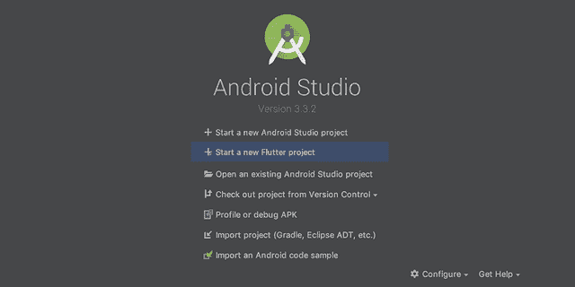

图片来源:作者

单击 Flutter 应用程序后，在下一个屏幕上，您需要提供 Flutter SDK 路径和基本项目详细信息。

让我们以创建一个歌曲应用程序为例，你相应地需要在下面的列中添加详细信息:

**Song_App，/home/user/flutter，/home/user/AndroidStudioProjects，歌曲库**

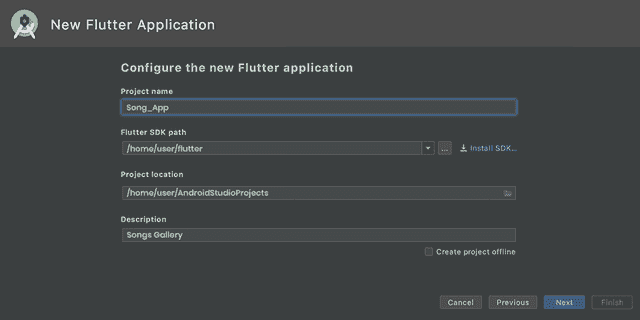

图片来源:作者

最后，现在为包设置一个域名。为包使用唯一的名称很重要(为了签名和发布)。如果你没有任何域名，那么你可以使用 com.github. <your login="">。将其他选项设置为默认值，并通过单击 finish 进行确认。</your>

*万岁！我们的项目已成功创建！*

## 步骤 4:运行构建:颤动博士

为了确保您的 app 设置环境正确工作，值得打开终端***(Android Studio 中的 Alt+F12)***并涉及*颤振医生*命令。

为了让它正常工作，您至少需要一个可用的 Flutter，它带有一个工作的 IDE 和一个连接的设备(物理的或模拟器)

*   ***在 Android 上测试构建***

如果使用设备本身，请确保它必须通过 USB 电缆连接，并启用 USB 调试。

在 Android 模拟器的情况下，您需要创建一个虚拟设备。为此，你可以 [**雇佣移动应用开发者**](https://www.xicom.ae/services/mobile-app-developers/) 或者只需打开一个 AVD 管理器，方法是使用工具栏上的或者按下 ***Ctrl Alt+F12*** 并键入动作名称。

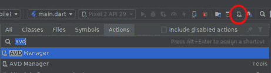

图片来源:作者

保留屏幕上的默认设置。现在是时候运行你的应用了。只需选择所需的设备或模拟器，然后按“Shift+F10”或简单地使用运行按钮。当你点击运行按钮时，下面的图标会自动改变。

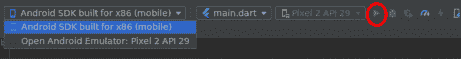

图片来源:作者

*   ***在 iOS 上测试一个 App***

在 iOS 模拟器上测试应用程序时，您需要首先使用下拉设备菜单。请记住，Xcode 安装程序会提示您安装应用程序中缺少的组件。

但是，如果是物理 iOS 设备，测试起来可能会有点复杂。当设备通过 USB 电缆连接并解锁时，您需要首先在 Xcode 中打开 iOS 模块。

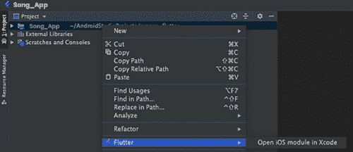

图片来源:作者

打开 Xcode 后，接下来进入应用程序的签名和功能设置。登录您的 Apple ID，关闭“帐户”窗口后，将会生成预置描述文件。

如果您发现任何错误，说明应用程序标识符无法注册，那么这意味着其他人已经在使用该标识符。在这里，您需要将包标识符值更改为其他值。一旦签名配置完成，你就可以试着从 Android studio 运行这个应用了。由于预置描述文件在设备上不受信任，因此第一次尝试将会失败。

在 iOS 设备上测试您的应用时，请记住，不可能在运行 iOS 13.3.1 的设备上运行使用个人团队预置描述文件提供的 Flutter 应用。这个限制是苹果自己定的。一旦档案被信任，你就可以从主屏幕启动应用程序。由于在 iOS 设备上进行测试相当复杂，因此 [**雇佣具备所有专业技能和知识的应用程序开发人员**](https://www.xicom.ae/solutions/hire-developers/) 是有意义的。

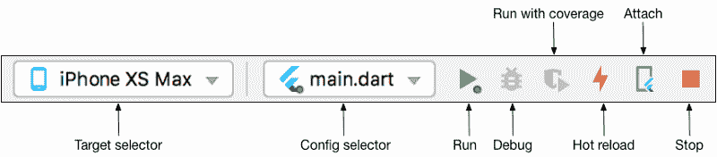

[图像来源](https://flutter.dev/docs/get-started/test-drive)

## 第五步:开始编写 Flutter 应用程序

因为您已经创建了名为 Song_App 的项目。一旦开始编写应用程序，大多数应用程序开发人员都会编辑 lib/main.dart，dart 代码就在那里。您可以替换 lib/main.dart 的内容，或者删除 lib/main.dart 中的所有代码。将所有代码替换为以下代码，该代码将在屏幕中央显示“Songs Gallery”。

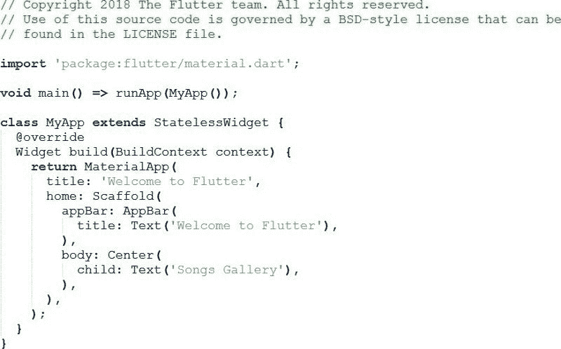

图片来源:作者

> **专业提示:**在将这些代码粘贴到您的应用程序中时，您可以使用我们在步骤 1 中提到的工具来解决这个问题。

其次，根据您的设备，按照步骤 4 指南运行应用程序，并使用建议的 Android 和 iOS IDEs。

## 第六步:使用外部包装

为了使您的任务保持有序和简单，建议您开始使用一个名为 english_words 的开源包。尽量使用有一定功能的普通英语单词。通常情况下，扑 [**app 开发公司**](https://www.xicom.ae/services/mobile-app-development/) 在 https://pub.dev/[pub . dev .](https://pub.dev/)上找到 english_words 包等开源包

> **在 lib/main.dart 中，导入新的包:**

*导入‘package:flutter/material . dart’；*

*导入' package:English _ words/English _ words . dart '；*

一旦你开始打字，Android studio 就会开始给你库导入的建议。然后，它通过提醒您导入的库尚未保存，将导入字符串呈现为灰色。

此外，使用英文单词包来生成文本，而不是使用字符串“ **Songs_Gallery** ”。

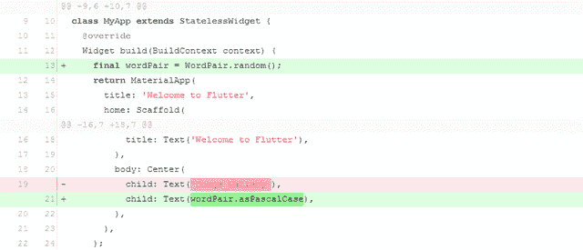

[图库](https://flutter.dev/docs/get-started/codelab)

接下来，如果应用程序正在运行，您可以使用热重新加载功能，用您在应用程序中需要的更改来更新正在运行的应用程序。你可以看到下图中随机选择的一对单词在应用程序中运行。万一你的应用运行不正常，可以找找错别字或者试试 Flutter 的调试工具。软件开发公司更愿意使用“ [pubspec.yaml](https://raw.githubusercontent.com/flutter/codelabs/master/startup_namer/step2_use_package/pubspec.yaml) ”或“ [lib/main.dart](https://raw.githubusercontent.com/flutter/codelabs/master/startup_namer/step2_use_package/lib/main.dart) ”来调试 app。

## 步骤 7:在你的应用程序中添加一个有状态的部件

在 Flutter 应用程序开发中，一切都是一个小部件，它本身就是一个应用程序。无状态和有状态小部件是带有可变和不可变条件的小部件。scaffold 小部件是一个包括标准屏幕组件的框架。层级可能是一个相当困难的过程，有一个应用程序栏，主体，菜单和其他。

Flutter 的 widget 为你节省了很多 app 开发的时间和精力，但是它涉及到一个构建 Widget 的方法。小部件应该包含其他小部件。

无状态小部件是不可变的，这意味着它们的属性不能改变，所有的值都是最终的。另一方面，有状态小部件维护可能在小部件的生命周期中改变的状态。因此，当您实现有状态小部件时，它至少需要两个类:

*1)创建*实例的 StatefulWidget 类

*2)一个状态类*

StatefulWidget 类本身是不可变的，可以被丢弃并重新生成。但是 State 类在小部件的整个生命周期中都存在。

所以基本上，您需要通过添加 RandomWordsState 来添加 State 类。因此，要添加 _ RandomWordsState，作为现有 MyApp 无状态小部件中的一个子部件，您需要遵循以下两点:

通过将所有代码放在 lib/main.dart 中，并输入几次 Return 键，从新的一行开始，为有状态小部件创建样板代码。

输入 RandomWords 作为小部件的名称。

**现在这两个类将如下所示:**

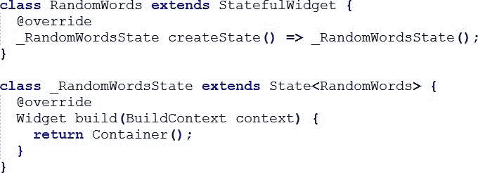

图片来源:作者

> 通过在下面的代码中进行反映的更改，从应用程序中删除单词生成代码。

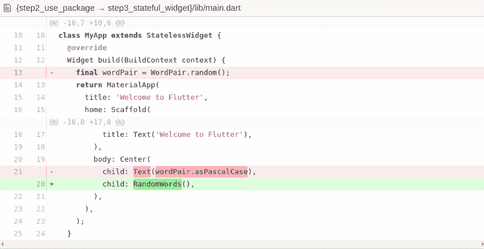

图片来源:作者

最后重新启动应用程序，让它像以前一样运行，并在每次重新加载或保存应用程序时显示一个单词配对。

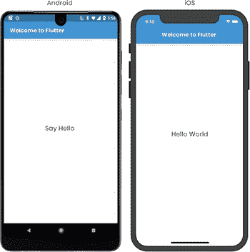

## 步骤 8:创建一个无限滚动的列表视图

在这里创建一个最常用单词的列表，并添加一个标记单词的可能性，并添加一个标记我们最喜欢的单词的可能性，并将它们拖到新屏幕上以添加一些功能。基本上，完整的逻辑位于条件类中。下面是一些简单的代码，你需要作为一个带注释的类来遵循:

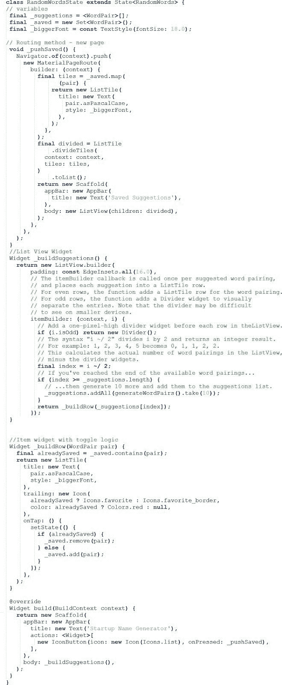

图片来源:作者

> **该应用程序的最终输出将如下图所示:**

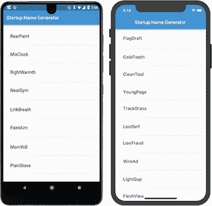

*恭喜你！你已经学会了编写一个可以在 iOS 和 Android 上运行的交互式 Flutter 应用程序。*

# 用 Flutter- Closing 语句设置你的第一个应用程序

通过这个快速教程，你一定已经理解了 Flutter 是如何让开发者的应用开发过程变得更容易、更快速、更简单的。 [**用 Flutter 开发一个 app**](https://www.xicom.ae/services/mobile-app-development/) 可以让开发者的生产力提高十倍，让企业可以快速将其 app 推向市场。

> **通过本 app 开发教程，你已经学会:**

*   创建一个应用程序开发平台。
*   编写 Dart 代码。
*   使用外部或第三方库。
*   使用热重装功能加快开发周期
*   实现有状态小部件
*   创建了一个无限滚动列表。

应用程序开发的步骤很长，但是仔细理解后，你可以很快地将这些步骤付诸实施。但是，如果你仍然有疑问，那么最好找一家 [**的手机 app 开发公司**](https://www.xicom.ae/services/mobile-app-development/) ，它可以帮助你在 5 天内毫不拖延地上手 Flutter app。