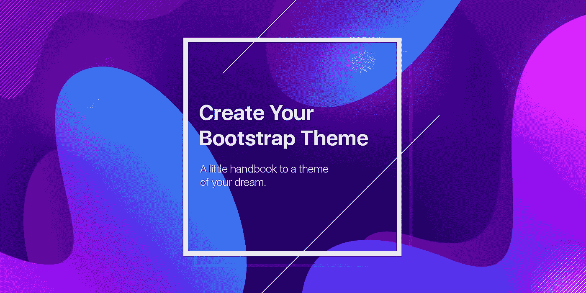
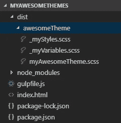
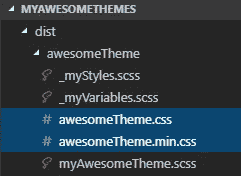
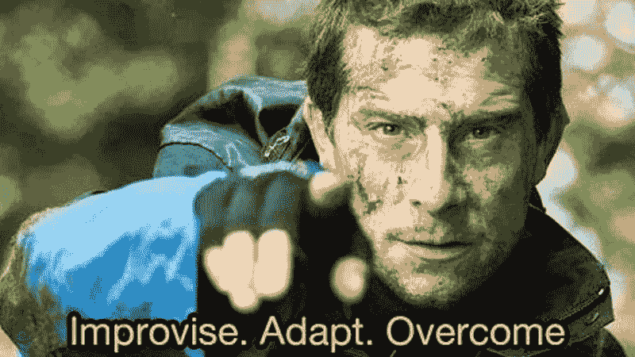
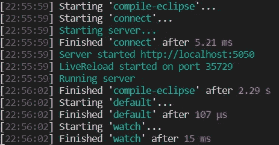
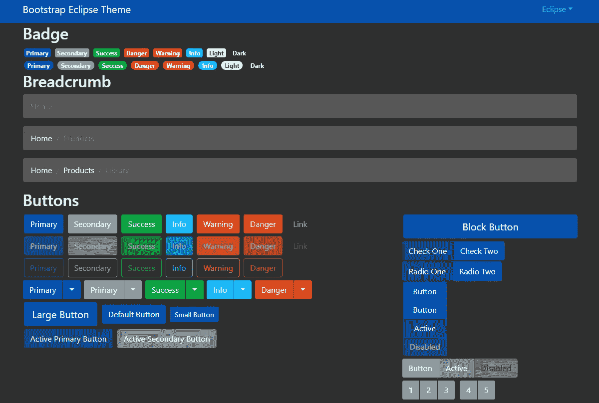

# 如何创建您的自定义引导主题

> 原文：<https://levelup.gitconnected.com/create-your-bootstrap-theme-4228aca9117a>



众所周知，Bootstrap 是最流行的前端框架之一(甚至可能是最流行的框架)。您可能已经尝试了不同的引导主题集，但是如果没有一个满足您的需求呢？如果你想创作*你自己的*主题呢？

在这篇文章中，我将描述创建自定义引导主题的关键步骤。最后你会得到*奖励*。那么，让我们开始吧！

## **步骤 1 —准备**

创建主题的过程需要时间和耐心。为了节省你的时间，我推荐使用 **npm** 和 **gulp** 。你也可以使用 [Grunt](https://gruntjs.com/) 、 [Webpack](https://webpack.js.org/) 或者其他的包管理器。

创建一个*根*文件夹，并命名为，例如:*myawesommes*。通过 [package.json](https://docs.npmjs.com/files/package.json) 文件为必要的库配置 npm。使用以下`dependencies`和`devDependencies`创建一个主题:

```
{ … "dependencies": { "bootstrap": "^4.1.3", "jquery": ">=1.12.4", "popper.js": "^1.14.3" }, "devDependencies": { "autoprefixer": "^8.2.0", "gulp": "^3.9.1", "gulp-clean-css": "^3.9.3", "gulp-connect": "^5.6.1", "gulp-postcss": "^7.0.1", "gulp-rename": "*", "gulp-sass": "^4.0.1", "gulp-sourcemaps": "^2.6.4", "lazypipe": "^1.0.1" }}
```

**注**:上面有三个点( **…** )，表示我漏掉了一些不重要的部分。你可以在这里找到完整的 package.json 文件。

添加带有所有标准引导组件的*index.html*文件，看看你的定制主题看起来如何。你可以从[这里](https://github.com/HackerThemes/theme-kit/blob/master/index.html)下载。

在根文件夹中添加一个新的 *gulpfile.js* 文件。其配置将在后面介绍。

在你的终端中，进入你的主题工作区文件夹( *cd your_path* )并执行`npm install`命令。完成后，您将看到一个沉重的(不要惊慌😉)“node_modules”文件夹中。为您未来的主题创建另一个文件夹:`dist`。创建一个“ *awesomeTheme* ”文件夹，它将包含给定自定义主题的样式。特别是，我建议在那里保存三个文件:

> 有变量的文件:创建一个“***_ my variables . scss***”文件
> 
> 具有自定义 CSS 规则的文件:创建一个“_myStyles.scss”文件
> 
> 一个包含自定义样式、变量和默认引导主题的主题文件:创建一个“myAwesomeTheme.scss”文件。

最后，您将看到以下结构:



那么，下一步是什么？

## **第二步——SCSS 编译**

SCSS 应该被编译成 CSS。使用 Gulp，您可以自动化这个过程。打开`gulpfile.js`并声明变量:

```
var theme = "awesomeTheme";var gulp  = require('gulp'), sass = require('gulp-sass'), sourcemaps = require('gulp-sourcemaps'), cleanCss = require('gulp-clean-css'), rename = require('gulp-rename'), lazypipe = require('lazypipe'), postcss = require('gulp-postcss'), autoprefixer = require('autoprefixer'), connect = require('gulp-connect');var compileTheme = lazypipe() .pipe(sourcemaps.init) .pipe(function () { return sass().on('error', sass.logError); }) .pipe(postcss, [ autoprefixer({ browsers: [ 'Chrome >= 35', 'Firefox >= 38', 'Edge >= 12', 'Explorer >= 10', 'iOS >= 8', 'Safari >= 8', 'Android 2.3', 'Android >= 4', 'Opera >= 12']}) ]) .pipe(sourcemaps.write) .pipe(rename, {basename: theme});var minifyCss = lazypipe() .pipe(cleanCss) .pipe(rename, {suffix: '.min'});
```

这里，最重要的选项是:

- " **主题**:允许你设置你的主题名称

- " **basename** ":输出 CSS 文件的名称

现在我们需要写一些任务。声明只编译主题的默认任务:

```
gulp.task('default', ['compile-' + theme], function () {});
```

为了捕捉变化，创建一个任务来‘监视’每个“*”的变化是非常方便的。scss”和“index.html”文件:

```
gulp.task('watch', ['default', 'connect'], function () { gulp.watch(['dist/' + theme + '/*.scss'], ['compile-' + theme]); gulp.watch(['./*.html'], ['html']);});
```

其中 *connect* 任务使用 [gulp-connect](https://www.npmjs.com/package/gulp-connect) 插件，该插件在必要时刷新所需文件:

```
gulp.task('connect', function () { connect.server({ livereload: true, port: 5050 });});
```

实时重载应该应用于*index.html*文件，并且在编译主题的任务结束时:

```
gulp.task('html', function () { gulp.src('./*.html') .pipe(connect.reload());});gulp.task('compile-' + theme, function() { return gulp.src(['dist/' + theme + '/*.scss']) .pipe(compileTheme()) .pipe(gulp.dest('dist/' + theme + '/')) .pipe(minifyCss()) .pipe(gulp.dest('dist/' + theme + '/')) .pipe(connect.reload());});
```

*compileTheme* 和 *minifyCss* 函数被调用，在你的 *dist/YourTheme* 文件夹中，你会看到两个 Css 文件，你可以用它们来代替默认的 Bootstrap 主题:



## **步骤 3——造型**

现在我们有两个由“吞咽”或“吞咽观察”任务创建的文件，但是它们是空的。让我们改变*。scss 文件。

*看看*，填写*myawesomesheme . scss*文件的内容有多简单:

```
@import 'myVariables';@import '../../node_modules/bootstrap/scss/bootstrap';@import 'myStyles';
```

我承认这是我最喜欢的部分。所以*容易*吧？注意唯一的事情——顺序:你的变量必须在默认引导主题导入之前声明。

我们继续吧。

*_myVariables.scss* 文件应该只包含可以如下设置的变量:

```
$primary: #0454b6;$secondary: #959fa4;$success: #04b041;…
```

> 这些变量覆盖了默认的引导变量。看一下*\ node _ modules \ Bootstrap \ scss \ _ variables . scss*文件，其中默认的引导变量带有"*！默认*标志位于行尾。

这样，您可以通过提前声明它们来覆盖这些变量中的任何一个。默认用例 ) **而不改变默认主题**，这就是为什么*myawesomesheme . scss*文件中的*导入*顺序如此重要。此外，你可以创建自己的变量。但是，请注意**默认引导文件不应更改！**仅适用于您的客户*。scss 文件。

现在最有趣的部分开始了:



在你的终端上运行“吞咽观察”任务。您将看到输出:



到 [http://localhost:5050](http://localhost:5050) 网址说“*醒醒！*“以你的设计师技能！创建、创建、创建自定义规则，直到甜蜜的蛋糕做好😊。在 *_myStyles.scss* 文件中使用 *_myVariables.scss* 文件中的变量，并使用浏览器的开发工具[检查某些元素](https://developers.google.com/web/tools/chrome-devtools/inspect-styles/)。在这之后，你就知道你应该在你的 _myStyles.scss 文件中写什么 CSS 规则了。不达目的不罢休！

## **总结**

现在您知道了创建自定义引导主题的关键步骤。还有很多漂亮的主题是免费的。这里有一些我很欣赏的，你肯定想在实际应用中使用它们:

1.托马斯·帕克——对 Bootstrap 了如指掌。他是主题的[boots watch collection](https://github.com/thomaspark/bootswatch)和令人印象深刻的交互式引导教程的作者。

2.DevExpress——著名的 UI 控件供应商，为他们的引导控件和任何引导组件创建了[免费的引导主题](https://github.com/DevExpress/bootstrap-themes)。

3.最后但同样重要的是，亚历山大·雷奇斯坦纳和他惊人的黑客技术。还有一个“[初学者主题工具包](https://github.com/HackerThemes/theme-kit)”存储库。我更喜欢的是，这个家伙还写了一篇文章，描述如何创建这样的自定义引导主题。所以，如果你觉得这篇文章无聊，信息不够丰富，那就看看这篇。

## **奖金**

正如我在开始时承诺的，我已经准备好了奖励:这是一个定制的黑暗引导主题——“*月食*”。请欣赏:



可从以下网址获得:

[https://github.com/paulwolf7/bootstrap-eclipse](https://github.com/paulwolf7/bootstrap-eclipse)

因为“日蚀”主题是黑暗的，如果你想创建一个黑暗的主题，安迪·克拉克在[为黑暗模式](https://stuffandnonsense.co.uk/blog/redesigning-your-product-and-website-for-dark-mode)重新设计你的产品和网站的文章中的建议会对你有用。

如果您决定在您的 Bootstrap 应用程序中使用“Eclipse”主题，我将很高兴听到您的反馈。在 GitHub 上叉一下，根据自己的需求定制。

最诚挚的问候，保罗

附:你可能注意到了(也可能没有)，这是我在这里的第一篇文章。我将继续写一些有用的帖子，与你分享我的经验和知识，并从你和你的反馈中学到一些新的东西。谢谢你。

[](https://levelup.gitconnected.com/)[](https://gitconnected.com/learn/css) [## 学习 CSS -最佳 CSS 教程(2018) | gitconnected

### 排名前 40 的 CSS 教程。课程由开发者提交和投票，使您能够找到最好的 CSS 课程和…

gitconnected.com](https://gitconnected.com/learn/css)