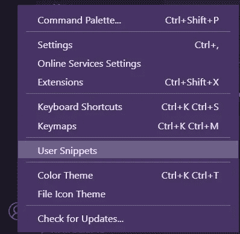

# 在 VS 代码中创建您的自定义代码片段

> 原文：<https://levelup.gitconnected.com/create-your-custom-snippet-in-vs-code-19c68067953a>

我最近开始学习 React，发现每当我想创建一个新组件时，我都要重复相同的代码行。要么是类组件，要么是功能组件。我持续重复了一个月的代码，但是后来我累了。

最后，我决定在网上寻找如何创建自己的 VS 代码片段。我发现了有用和直接的结果，最终，我创建了我的自定义片段😁。

打开 Visual Studio 代码，进入设置，点击`User Snippets`，如下所示



设置>用户片段

然后选择`Add New Global Snippet`并给它起一个你喜欢的名字。

我们用一个对象创建了代码片段文件(JSON)。在对象内部，有一个注释，我将取消注释并粘贴到这里，以使它更具可读性和可理解性。

> 将您的全局代码片段放在这里。每个代码片段都在一个代码片段名称下定义，并且具有范围、前缀、主体和描述。在范围字段中添加代码片段适用的语言的逗号分隔 id。如果 scope 为空或省略，该代码段将应用于所有语言。前缀是用来触发代码片段的，主体将被扩展和插入。可能的变量有:$1，$2 用于制表位，$0 用于最终光标位置，以及${1:label}，${2:another}用于占位符。
> 
> 具有相同 id 的占位符被连接。
> 
> 示例:“打印到控制台”:{
> 
> "范围":" javascript，typescript "，
> 
> "前缀":"日志"，
> 
> "正文":[
> 
> " console . log(' $ 1 ')；",
> 
> ],
> 
> "描述":"将输出记录到控制台"
> 
> },

请看给出的例子，这是 JavaScript 的`console.log()`的一个片段。要使用这个代码片段，您只需在代码编辑器中键入`log`并按 enter 键。

让我们添加更多的片段。就像我之前说的，我最近开始学习 React。我们将创建两个片段:一个函数组件和一个类组件。我已经清空了 JSON 对象。这是我现在拥有的:

```
{}
```

首先创建功能组件片段，这是我想要实现的

```
import React from "react"const name = (*props*) => {return (<div></div>)};export default name;
```

这是代码片段的代码

```
{
  "React Functional Component": {"prefix": "ReactFunc","body": ["import React from \"react\"","","const ${1:name} = (props) => {","  return (","    <div>","      $2","    </div>","  )","};","","export default ${1:name};",""],"description": "React Functional Component"}
}
```

*   该代码片段被命名为 React Functional Component。
*   具有字符串属性的`prefix`键`ReactFunc`
*   一个`body`键，包含我们想要呈现的每行代码的数组。
*   然后是描述代码片段的`description`键。

每当我们想要使用代码片段时，我们输入前缀属性`ReactFunc`并按回车键。有时，只需键入`RF`并按下 enter 键也能工作。

让我们将第二个片段添加到 JSON 对象，一个类组件。

这是我想要实现的

```
import React, { Component } from "react";class name extends Component {render(){return(<div></div>)}}export default name;
```

我们将它添加到 JSON 对象中

```
{
  {
    the first snippet here...
  },
  "React Class Component": {"prefix": "ReactClass","body": ["import React, { Component } from \"react\";","","class ${1:name} extends Component {","  render(){","    return(","      <div>","        $2","      </div>","    )","  }","}","","export default ${1:name};"],"description": "React Class Component"}
}
```

每当我想创建一个 React 类组件时，我要做的就是键入`ReactClass`。

总而言之，我们的代码片段文件将如下所示

```
{"React Functional Component": {"prefix": "ReactFunc","body": ["import React from \"react\"","","const ${1:name} = (props) => {","  return (","    <div>","      $2","    </div>","  )","};","","export default ${1:name};",""],"description": "React Functional Component"},"React Class Component": {"prefix": "ReactClass","body": ["import React, { Component } from \"react\";","","class ${1:name} extends Component {","  render(){","    return(","      <div>","        $2","      </div>","    )","  }","}","","export default ${1:name};"],"description": "React Class Component"}}}
```

你也可以通过使用像 [snippet.generator.app](https://snippet-generator.app/) 这样的在线代码片段生成器来更聪明地工作。它支持 VS 代码、Atom 和 Sublime 文本。

要阅读更多关于 VS 代码片段的内容，请查看 Visual Studio 中的[代码片段](https://code.visualstudio.com/docs/editor/userdefinedsnippets#:~:text=Code%20snippets%20are%20templates%20that,Snippet%20in%20the%20Command%20Palette).)