# 使用类型脚本创建高级 CLI

> 原文：<https://levelup.gitconnected.com/create-your-own-advanced-cli-with-typescript-5868ae3df397>

## 已经知道如何做一个简单的 CLI？通过这篇文章增加你的知识


照片由[詹汀·杜恩博斯](https://unsplash.com/@jantined?utm_source=medium&utm_medium=referral)在 [Unsplash](https://unsplash.com?utm_source=medium&utm_medium=referral) 拍摄

这篇文章是为那些已经有构建 CLI 的基本经验的人写的，我们将制作一个小版本的`[CGX CLI](https://github.com/jeroenouw/cgx)`并使用相同的文件夹结构。CLI 执行以下操作:

> 为 Github、Gitlab 和 Bitbucket 社区标准生成所有推荐的 markdown 文档(预填充)

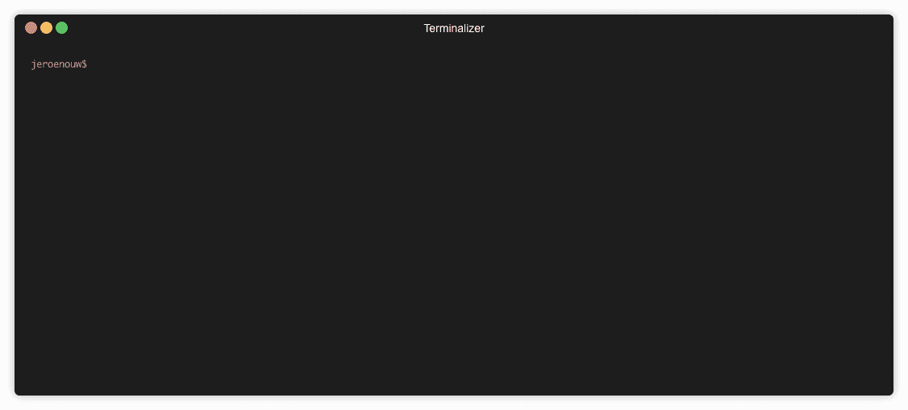

用户将得到一个带有选项列表的问题，选择一个选项将导致不同的结果。

**备注:**

**—** 这与我在[上一篇文章](https://itnext.io/how-to-create-your-own-typescript-cli-with-node-js-1faf7095ef89)中写的关于用 TypeScript 制作一个小型“pizza”CLI 的设置有些重叠。

—本文中提到的每个文件都有一个指向完整/原始文件的链接。

# 项目设置

首先，我们要用`npm init`初始化一个`[package.json](https://github.com/jeroenouw/cgx/blob/master/package.json)`。您可以选择名称、作者、版本、描述、关键字和许可证。

## 属国

*   figlet —从字符串中获得一个漂亮的 ASCII 艺术作品
*   inquirer —一组常见的交互式命令行用户界面。
*   fs-extra — fs-extra 包含 vanilla Node.js fs 包中不包含的方法。例如 mkdir -p、cp -r 和 rm -rf。
*   types/fs-extra—fs-extra 的类型脚本定义
*   inversify——一个强大的轻量级反转控制容器，用于 TypeScript 支持的 JavaScript 和 Node.js 应用程序。
*   kleur——用 ANSI 颜色格式化终端文本的最快 Node.js 库！
*   反射-元数据-元数据反射 API 的多填充
*   ts lib—TypeScript 助手函数的运行时库

我们需要安装所有的依赖项:

```
npm i figlet inquirer fs-extra @types/fs-extra inversify kleur reflect-metadata tslib
```

## 开发依赖性

*   types/node-node . js 的类型脚本定义
*   类型/查询者—查询者的打字稿定义
*   types/fig let—fig let 的类型脚本定义
*   liftr/tscov —使用这个简单的 npm 包检查任何 TypeScript 项目的类型覆盖率
*   ts-node—node . js 的类型脚本执行环境和 REPL，支持源映射
*   typedoc—为 typescript 项目创建 api 文档。
*   typescript — TypeScript 是一种用于应用规模 JavaScript 开发的语言

然后安装我们的 devDependencies:

```
npm i @types/node @types/inquirer @types/figlet @liftr/tscov ts-node typedoc typescript --save-dev
```

[](https://github.com/jeroenouw/liness) [## jeroenouw/early

### CLI 计算当前项目中使用的行数。这个项目有 99+%的类型覆盖率由 tscov 检查…

github.com](https://github.com/jeroenouw/liness) 

## Bin 和 main

在我们的`[package.json](https://github.com/jeroenouw/cgx/blob/master/package.json)`中，我们需要设置应用程序的入口点(main 和 bin)。这将是我们在`lib`文件夹中编译的`index.js`文件:`./lib/index.js`。

`advanced-cli`是您最终用来调用 CLI 的命令。

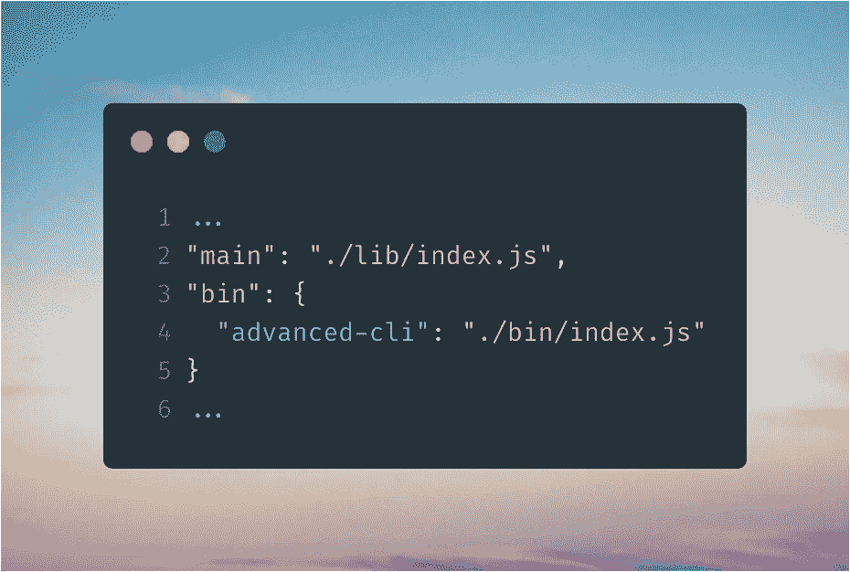

杰克·凯恩在 unsplash 上拍摄的照片

## 剧本

现在我们需要一些脚本来简化我们的工作。我们有十个剧本:

*   `npm start`—一起运行我们的`build`和`global`脚本。使用它来启动您的 CLI
*   `npm run build`—运行我们的`clean:some`脚本并将我们的类型脚本文件传输到`lib`文件夹中的 JavaScript 文件
*   `npm run global` —全局安装我们的 CLI 并运行 CLI
*   `npm run clean:some`—删除`lib`和`docs`文件夹
*   `npm run clean:all`—删除`node_modules`、`package-lock.json`、`lib`和`docs`文件夹和文件
*   `npm run refresh`—运行我们的`clean:all`脚本并运行`npm install`
*   `npm run tscov`—检查至少 90%的类型覆盖率
*   `npm run tscov:d`—参见缺失类型覆盖范围
*   `npm run publish-package`—运行我们的`build`和`npm publish`脚本
*   `npm run docs`—在`docs`文件夹中生成自动化文档

将以下内容写入`[package.json](https://github.com/jeroenouw/cgx/blob/master/package.json)`:

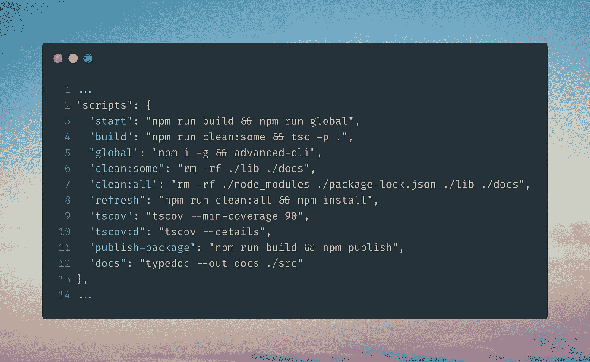

## TSconfig

对于我们的 CLI，我们在名为`[tsconfig.json](https://github.com/jeroenouw/cgx/blob/master/tsconfig.json)`的文件中设置了一些类型脚本配置，在根目录下创建该文件，并将以下配置写入其中:

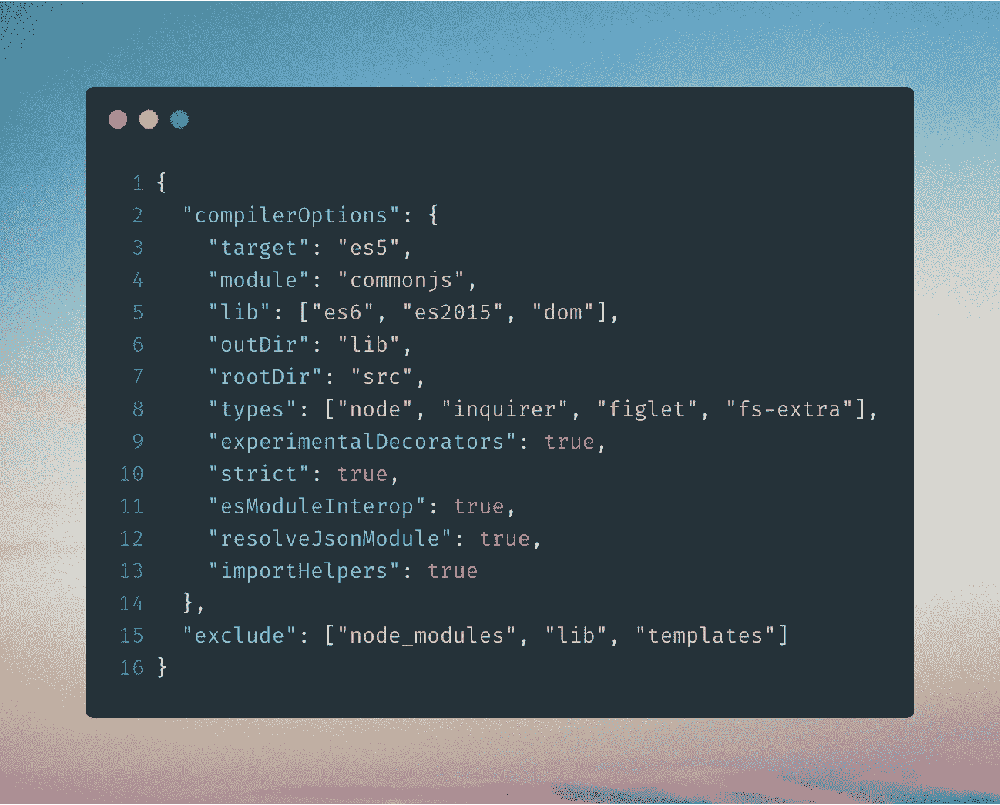

## 环境

在名为`bin`的文件夹中创建一个名为`advanced-cli`的文件。有了这个内容:


# 编码时间！

## 文件夹结构— 1

用以下文件夹创建一个`src`文件夹:

*   模型
*   问题
*   模板
*   实用工具

另外，在`src`文件夹中创建以下文件:

*   index.ts
*   客户

## 型号— 2

接下来我们将开始在我们的`models`文件夹中制作一些界面和枚举，在名为`[answer-choice.ts](https://github.com/jeroenouw/cgx/blob/master/src/models/choice.ts)`的文件中。我选择枚举而不是常量，因为其中的属性与其他属性有相似之处。因此应该组合在一起。`Answer`和`choice`接口的名称不言自明。

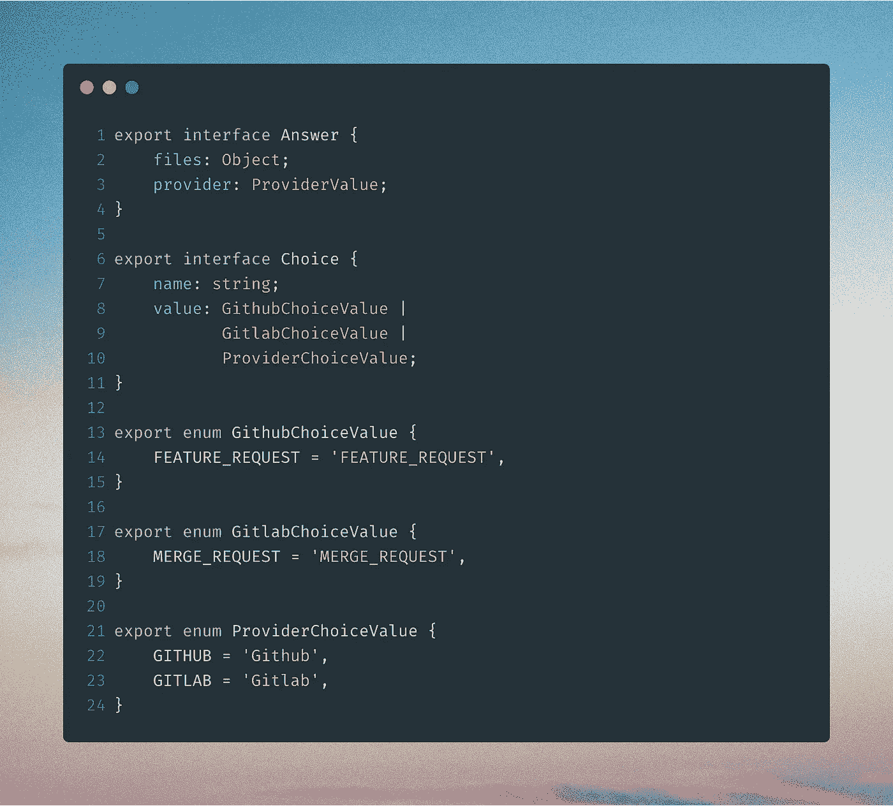

下一个文件；`[filename.ts](https://github.com/jeroenouw/cgx/blob/master/src/models/file.ts)`包含文件名及其扩展名。在这种情况下`.md`用于降价。

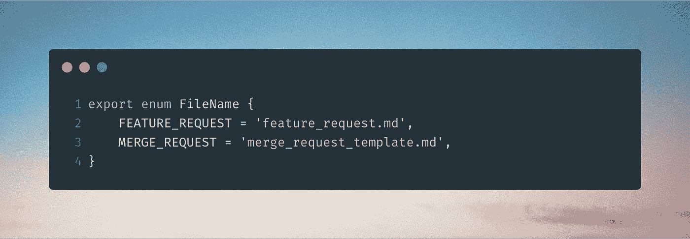

我们最后的文件；`[path.ts](https://github.com/jeroenouw/cgx/blob/master/src/models/path.ts)`确实有需要生成文件的具体路径。这对于`gitlab`和`github`是不同的。

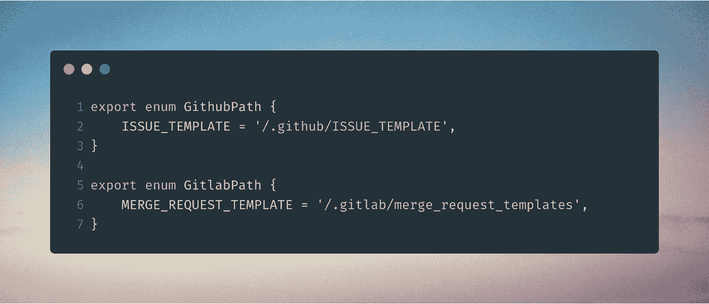

## 问题— 3

现在我们将在问题中使用枚举和接口。在我们的问题文件夹中创建一个名为`[provider.question.ts](https://github.com/jeroenouw/cgx/blob/master/src/questions/provider.question.ts)`的文件。导入`inquirer`，这让我们可以在命令行中提问，并根据答案采取行动。我们有一个包含列表和提示的异步函数。它返回一个答案。

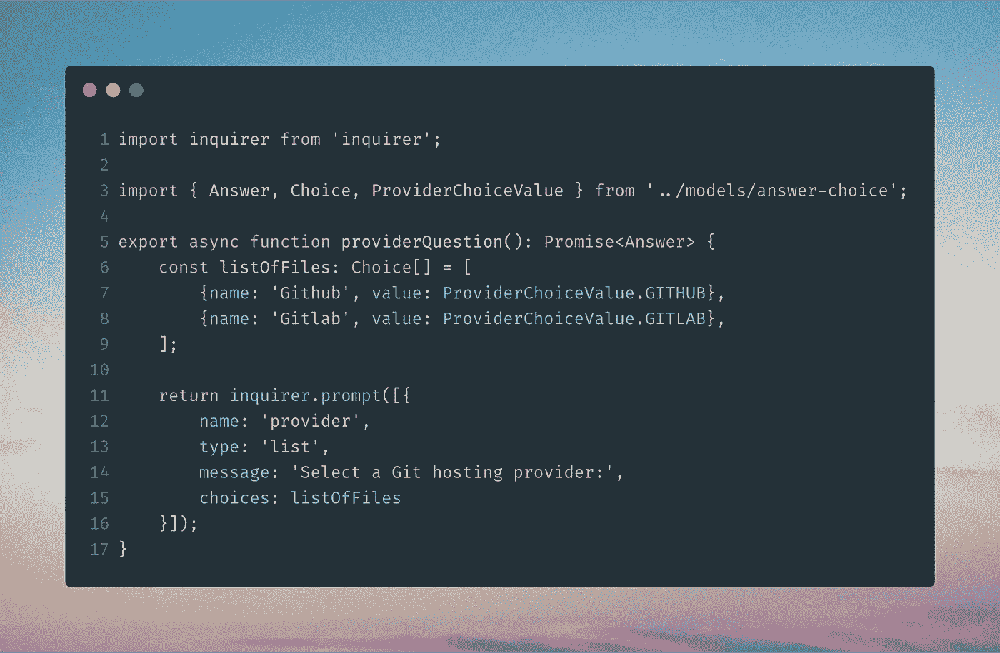

创建另一个名为`[gitlab-file.question.ts](https://github.com/jeroenouw/cgx/blob/master/src/questions/gitlab-file.question.ts)`的文件:

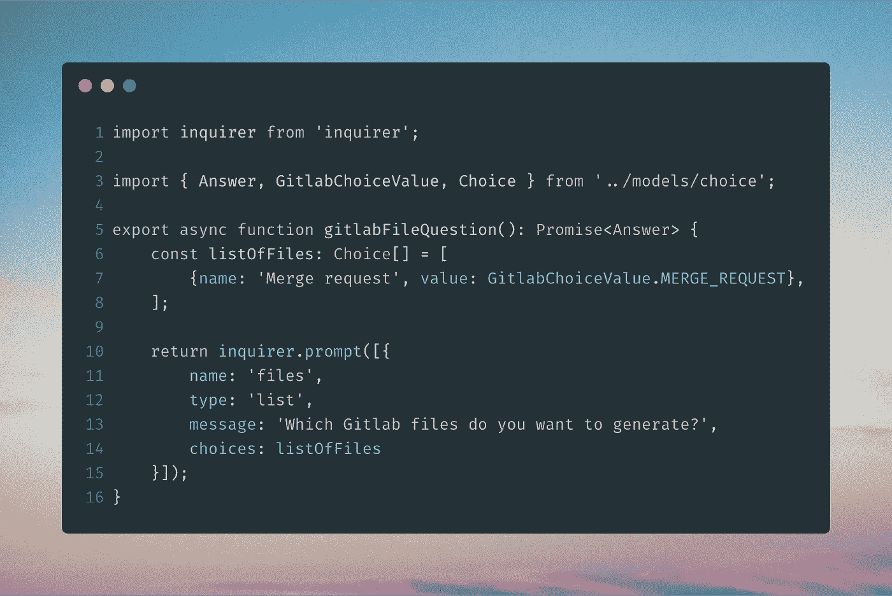

最后一个问题文件叫做`[github-file.question.ts](https://github.com/jeroenouw/cgx/blob/master/src/questions/github-file.question.ts)`:

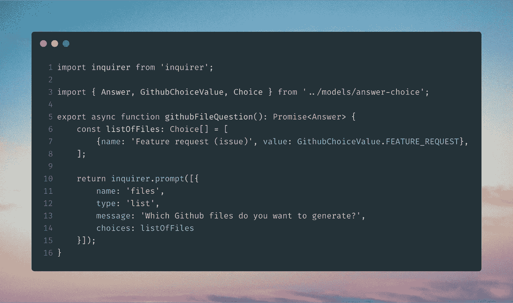

当每个提供者有更多文件时，您现在可以轻松地将它们添加到`listOfFiles`中。

将问题导出到`index.ts`文件中:

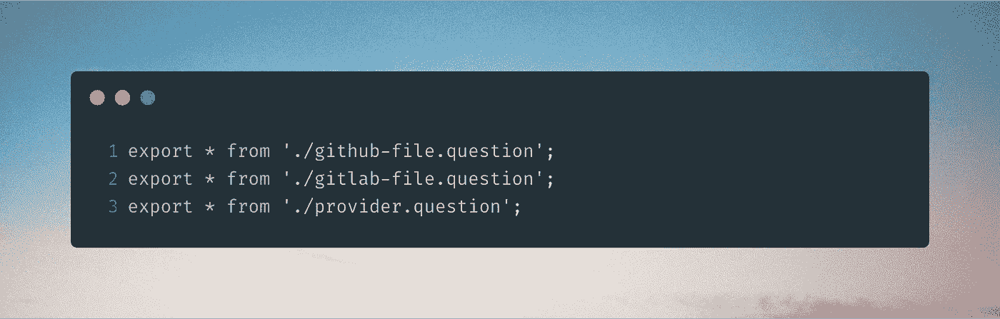

## 实用工具— 4

**可选:**实用程序是可选的。在我自己的项目中，我使用了一个 util 来检查一个文件/文件夹是否已经存在，如果不存在，就创建一个文件/文件夹。另一个 util 是用于可重用和“漂亮”的控制台日志(错误、成功、信息等)。).他们可以在这里找到。

## 模板— 5

在我们的`templates` 文件夹中，我们创建了一个名为`default`的文件夹。在默认文件夹中，我们创建了一个文件`[default.template.ts](https://github.com/jeroenouw/cgx/blob/master/src/templates/default/default.template.ts)`。正如文件名所说，这将是我们的默认模板，不同的文件将在这里生成。我们通过`inversify`使用依赖注入。因为有了`@injectable`装饰器，我们的模板可以`Injected`到其他模板中。为了在您的本地机器上创建一个文件，我们使用来自`fs-extra`的`fs.writeFile`。

**注:**[原](https://github.com/jeroenouw/cgx/blob/master/src/templates/default/default.template.ts) `generateFile`方法包含文件/文件夹是否存在以及覆盖文件的选项。


在`templates`中创建另一个名为`gitlab`的文件夹。在这个文件夹中创建一个名为`[merge-request.template.ts](https://github.com/jeroenouw/cgx/blob/master/src/templates/gitlab/merge-request.template.ts)`的文件。在我们的模板类中，有三个属性:

*   fileName —我们使用之前创建的 enum 作为文件名和扩展名
*   hasPath —如果生成的文件不在项目的根目录中，则设置为 true
*   path offfile—指定文件所属的路径

我们再次使用了`@injectable`装饰器，但是现在也使用了`@inject`装饰器来注入我们的默认模板。

一个公共方法，其中我们调用默认模板的公共可重用`generateFile`方法。和一个私有方法，我们在其中粘贴我们的 markdown 文件内容。

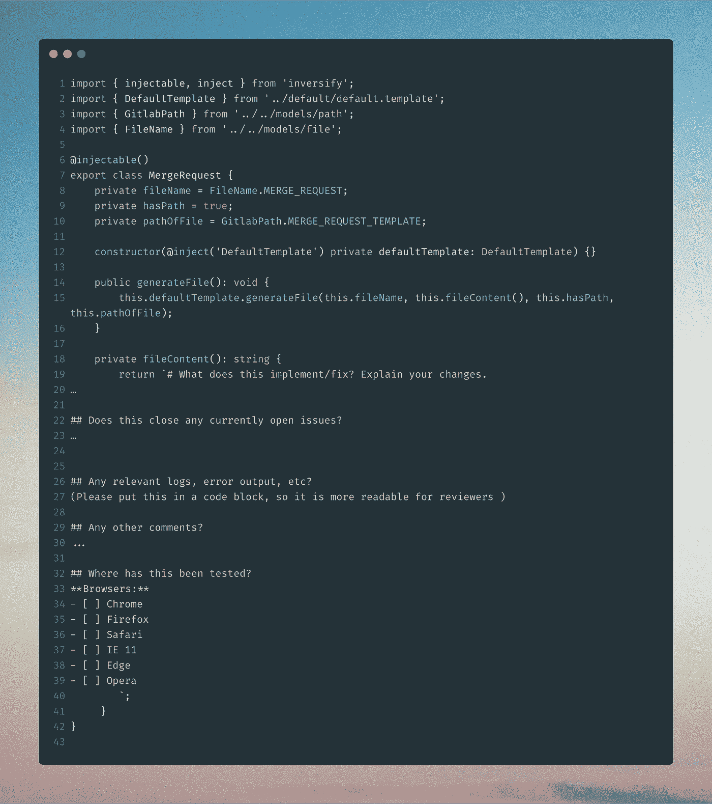

接下来在我们的`templates`文件夹中创建一个名为`github`的文件夹。在这个文件夹中创建一个名为`[feature-request.template.ts](https://github.com/jeroenouw/cgx/blob/master/src/templates/github/feature-request.template.ts)`的文件。这个文件与前一个文件非常相似。但是具有不同的属性值和文件内容。我们现在可以很容易地为未来的文件制作更多的模板。

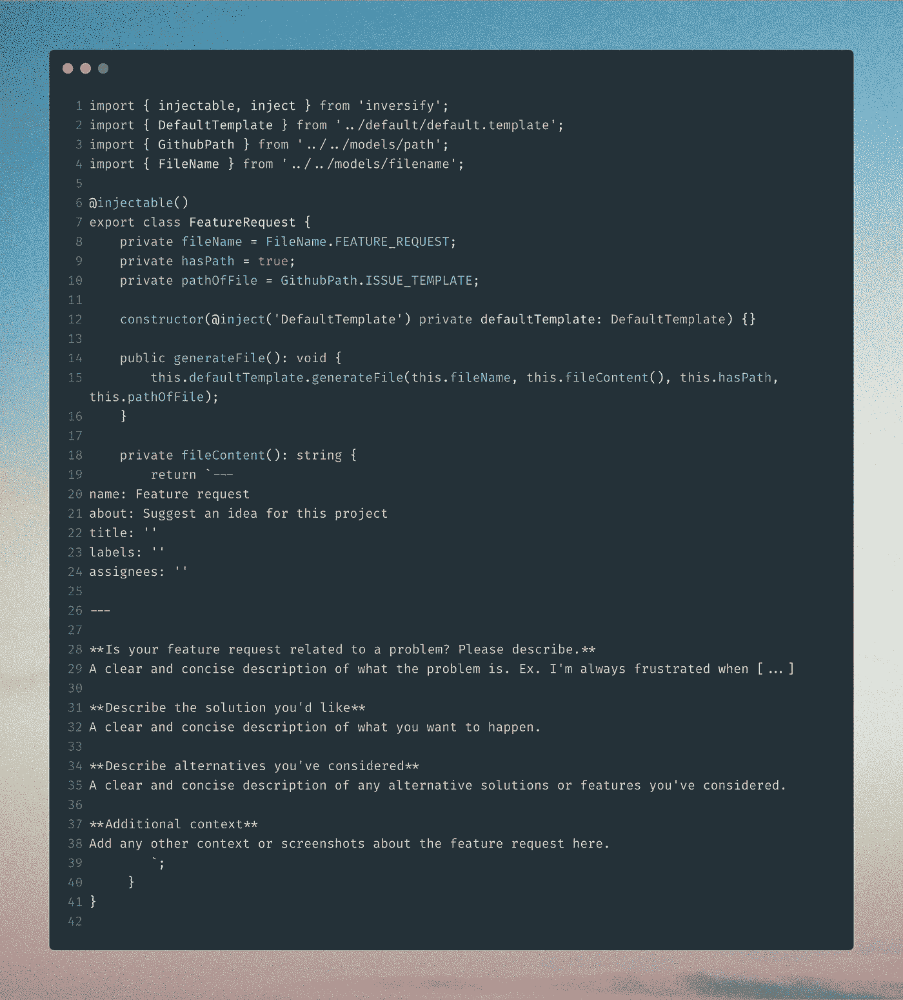

## 客户端-6

倒数第二档是`[cli.ts](https://github.com/jeroenouw/cgx/blob/master/src/cgx.ts)`。我们在构造函数中注入两个模板，并调用`executeCLI`方法。在这个方法中，我们询问用户他想要选择哪个提供商。如果他选择 Github，那么我们的`githubActions`方法将被调用。这里提出了第二个问题。用户想要生成哪个文件。在这种情况下，我们只有一个文件。选择文件后，它将被生成。如果我们选择了 Gitlab，这同样适用。

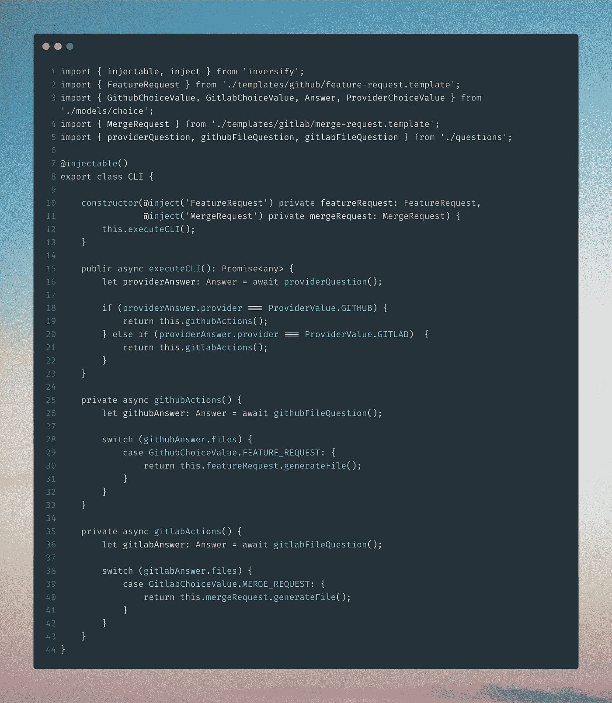

## index.ts — 7

我们的最后一个文件`[index.ts](https://github.com/jeroenouw/cgx/blob/master/src/index.ts)`，是我们的 CLI 初始化的地方。我们需要这个项目中使用的自定义装饰`reflect-metadata`。index 函数包含一个容器，我们将所有的类(包含可注入的 decorator)绑定到这个容器，作为一个单独的作用域。最后，我们返回 CLI，在那里我们会被提问。

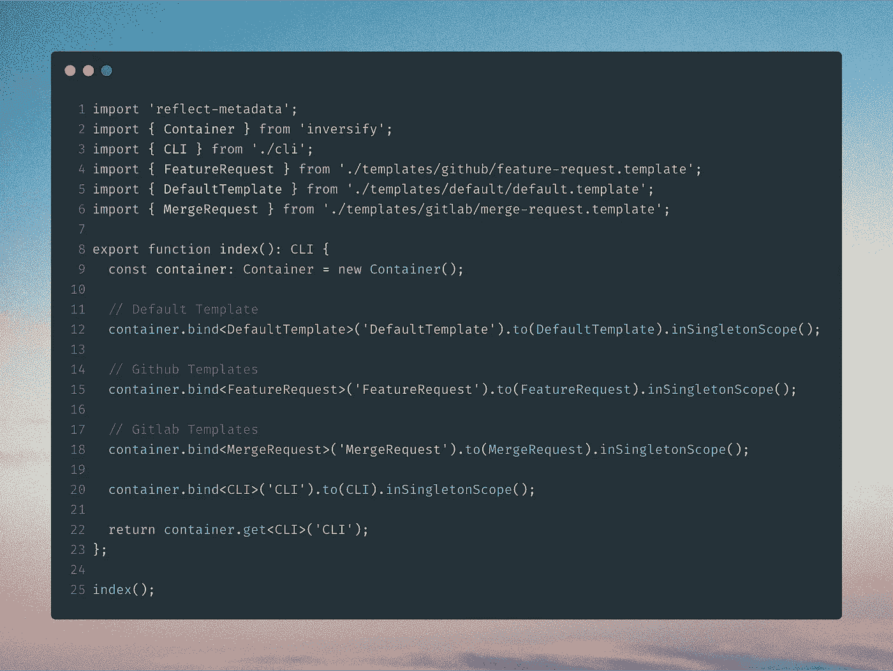

如果我们现在运行`npm start`，我们应该得到两个问题。回答完这些问题后，我们现在在本地项目中有了一个生成的文件

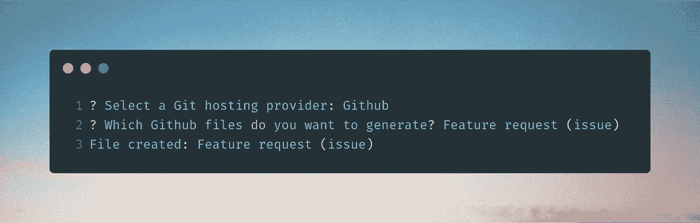

## 感谢您的阅读！我的 [Github](https://github.com/jeroenouw/) 。考虑阅读我的其他文章，看看我的开源项目:

[](https://github.com/jeroenouw/cgx) [## 杰罗诺/cgx

### 💻🔥为 Github、Gitlab 和 Bitbucket 社区生成所有推荐的文档/模板(预填充)

github.com](https://github.com/jeroenouw/cgx) [](https://itnext.io/javascript-array-loop-methods-46ad0d7a5a7c) [## JavaScript —数组循环方法

### 数组方法 forEach，map，flatMap，filter，reduce，sort，some，every —简单的例子

itnext.io](https://itnext.io/javascript-array-loop-methods-46ad0d7a5a7c) [](https://medium.com/@jeroenouw/ecmascript-vs-typescript-private-fields-640ae37aa162) [## EcmaScript 与 TypeScript —私有字段

### TypeScript 的 private 关键字和 EcmaScript/JavaScript 的#字符有什么区别

medium.com](https://medium.com/@jeroenouw/ecmascript-vs-typescript-private-fields-640ae37aa162)