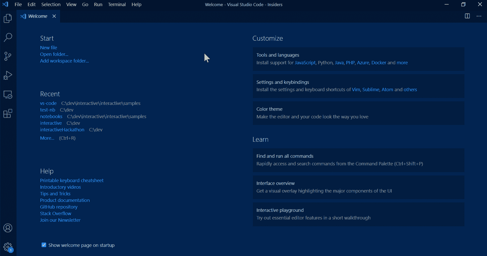

# 创建自己的 C#和 F#游乐场

> 原文：<https://levelup.gitconnected.com/create-your-own-c-and-f-playground-16a2568465df>

## 使用 Jupyter 笔记本轻松编写和测试您的代码

Vika Strawberrika 在 [Unsplash](https://unsplash.com?utm_source=medium&utm_medium=referral) 上拍摄的照片

# 介绍

大部分开发者大概都会认可这种感觉；由于在编码时没有人能记住所有的文档，你会到达这样一个点**，你不确定你想要达到的目标是否真的可能**。例如，您正在尝试编写一个排序函数，但是您知道它在第一次尝试时可能不会工作，所以您想先测试它。您开始调试您的应用程序，经历所有步骤，当您最终到达排序点时，发现排序算法没有给出预期的结果。

这个**占用了大量的时间**，所以你在寻找一种只测试排序算法的方法。我调试 C#的第一个网站是[try.dot.net](https://try.dot.net/)。但是今天我将向你介绍一种更容易和有用的方法。我们将使用 Jupyter 来创建我们自己的本地游乐场

> Jupyter 是运行笔记本电脑的主干

# 朱皮特

Jupyter Notebook 是一个**开源 web 应用**，它允许你创建和共享**包含实时代码、等式、可视化和叙述性文本**的文档。它可以用作交互式开发和展示数据科学项目的工具。大多数情况下，它与脚本语言 Python 和 R 一起使用。但是，它也可以用于编译语言，如。NET 编程语言、Go 和 Julia。有关支持的编程语言列表，请参考 GitHub 中的 [Jupyter 内核](https://github.com/jupyter/jupyter/wiki/Jupyter-kernels)页面。

本文解释了为设置 Jupyter Notebook 的步骤。NET 核心编程语言。它基于[。NET 笔记本预览版 2](https://devblogs.microsoft.com/dotnet/net-interactive-is-here-net-notebooks-preview-2/) 支持 **C#、F#和 PowerShell** 。本文还提供了几个 C#示例，展示了如何使用它们。

# 设置您的设备

为了在你自己的设备上创建 C#操场，我们需要安装一些东西。但最重要的是安装 [Visual Studio 代码](https://code.visualstudio.com/download)。现在，在我们使用 C# Jupyter 笔记本之前，我们需要安装两个重要的扩展:

*   Jupyter : Jupyter 是运行上一段所述笔记本电脑的主干。
*   [。NET 交互式笔记本](https://marketplace.visualstudio.com/items?itemName=ms-dotnettools.dotnet-interactive-vscode):这个扩展增加了对使用。NET 交互式的 Visual Studio 代码笔记本。

嗯……就这些，就是这么直观。

# 创建您自己的笔记本

现在，要创建你的第一个 C#笔记本，你有两个选择。第一个选项是键入全局`Ctrl + Shift + P` 命令来弹出您的命令窗口并寻找”。网络互动:创建新的空白笔记本”。**或**你可以直接使用快捷键创建一个新的。NET 互动笔记本(`Ctrl + Shift + Alt + N`)。

现在将笔记本创建为`.ipynb`，并选择首选语言。就我而言，我选择了 C#并开始编写我的愚蠢错误，因为我经常忘记如何正确使用时区🤣。

# 结论

有时调试你的整个应用程序只是为了达到那一点**会花费太多的时间**所以你只是想测试那一点点代码。通常我会使用像 try.dot.net 这样的在线 C#游戏平台，但是它永远不会记住我以前犯的愚蠢错误。幸运的是，创建您的本地 C#或 F#游乐场比您想象的要容易得多。**您可以在 visual studio 代码环境中安装所有的东西**并点击(`Ctrl + Shift + Alt + N`)来快速测试您的代码是否真的可以工作。

我希望我今天帮助了某人。

快乐编码😊