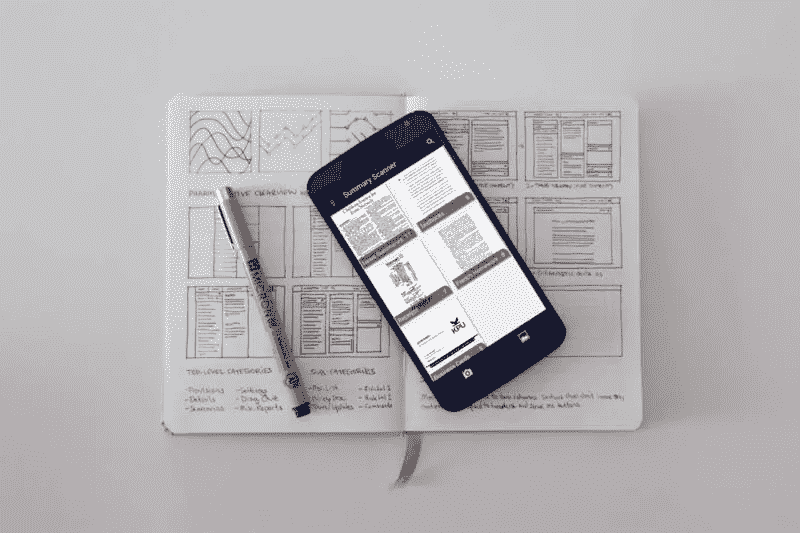
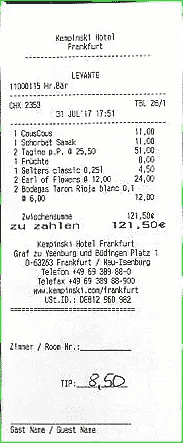

# 使用 Python 和 OpenCV 创建自己的“摄像机”

> 原文：<https://levelup.gitconnected.com/create-your-own-camscanner-using-python-opencv-2dd8355432de>



我们几乎都在生活中使用过 CamScanner(或者类似的 app)。这是一个非常有效的应用程序，允许用户从你的手机扫描文件，并将其作为图像分享。该应用程序的最大优势是它“清理”(去噪，旋转，锐化等)了一个相机点击图像到一个非常精致的输出。但是你知道吗，计算机视觉是其背后的科学，我们可以使用 Python 中 OpenCV 的基础知识来创建我们自己的 CamScanner。

# 导入库

```
import numpy as np
import cv2
import re
from matplotlib import pyplot as plt
```

# 图像路径

```
path = "/Users/Harshil/Downloads/"
image = cv2.imread("/Users/Harshil/Downloads/billtest2.jpg")
```

## 模糊

模糊的目的是减少图像中的噪声。它从图像中移除高频内容(例如:噪声、边缘)，从而导致边缘模糊。OpenCV 中有多种模糊技术(滤镜)，最常见的有:

**平均** —它只是取内核区域下所有像素的平均值，并用这个平均值替换中心元素

**高斯滤波器**——使用高斯内核，而不是由相等滤波器系数组成的箱式滤波器

**中值滤波器** —计算内核窗口下所有像素的中值，中心像素用该中值替换

**双边滤镜** —高级版高斯模糊。它不仅可以消除噪声，还可以平滑边缘。

```
def blur_and_threshold(gray):
    gray = cv2.GaussianBlur(gray, (3, 3), 2)
    threshold = cv2.adaptiveThreshold(gray, 255, cv2.ADAPTIVE_THRESH_GAUSSIAN_C, cv2.THRESH_BINARY, 11, 2)
    threshold = cv2.fastNlMeansDenoising(threshold, 11, 31, 9)
    return threshold
```

# 阈值处理

在图像处理中，阈值化是分割图像的最简单的方法。从灰度图像，阈值可以用来创建二进制图像。这通常是为了清楚地区分不同色调的像素强度。OpenCV 中最常见的阈值技术有:

**简单阈值** —如果像素值大于阈值，则为其分配一个值(可能是白色)，否则为其分配另一个值(可能是黑色)

**自适应阈值** —算法计算图像小区域的阈值。因此，对于同一幅图像的不同区域，我们得到不同的阈值，并且对于具有变化的图像，它给我们更好的结果

Canny 边缘检测与最大轮廓提取

在图像模糊和阈值处理之后，下一步是找到最大的轮廓(最大的边界框)并裁剪出图像。这是通过使用 Canny 边缘检测，然后使用四点变换提取最大轮廓来完成的。

# 锐利的边缘

Canny 边缘检测是一种可以检测边缘的多步算法。我们应该向该算法发送去噪声的图像，以便它能够只检测相关的边缘。



# 查找轮廓

找到边缘后，将图像通过`cv2.findcontours()`。它连接所有连续的点(沿着边缘)，具有相同的颜色或强度。在这之后，我们将得到所有的轮廓——矩形、球形等

使用`cv2.convexHull()`和`cv2.approxPolyDP`找到照片中最大的矩形轮廓(大约)。

```
def biggest_contour(contours, min_area):
    biggest = None
    max_area = 0
    biggest_n = 0
    approx_contour = None
    for n, i in enumerate(contours):
        area = cv2.contourArea(i)

        if area > min_area / 10:
            peri = cv2.arcLength(i, True)
            approx = cv2.approxPolyDP(i, 0.02 * peri, True)
            if area > max_area and len(approx) == 4:
                biggest = approx
                max_area = area
                biggest_n = n
                approx_contour = approx

    return biggest_n, approx_contour

def order_points(pts):
    # initialzie a list of coordinates that will be ordered
    # such that the first entry in the list is the top-left,
    # the second entry is the top-right, the third is the
    # bottom-right, and the fourth is the bottom-left
    pts = pts.reshape(4, 2)
    rect = np.zeros((4, 2), dtype="float32")

    # the top-left point will have the smallest sum, whereas
    # the bottom-right point will have the largest sum
    s = pts.sum(axis=1)
    rect[0] = pts[np.argmin(s)]
    rect[2] = pts[np.argmax(s)]

    # now, compute the difference between the points, the
    # top-right point will have the smallest difference,
    # whereas the bottom-left will have the largest difference
    diff = np.diff(pts, axis=1)
    rect[1] = pts[np.argmin(diff)]
    rect[3] = pts[np.argmax(diff)]

    # return the ordered coordinates
    return rect 
```

# 最后—锐化和亮度校正

现在我们已经从图像中裁剪出了相关的信息(最大的轮廓)，最后一步是锐化图片，这样我们就可以得到清晰易读的文档。

—为此，我们使用*色调、饱和度、值(h，s，v)* 概念，其中*值*代表*亮度。*可以用这个值来增加文档的亮度

— ***内核锐化—* 一个内核**、**卷积矩阵**，或者**遮罩**就是一个小矩阵。它用于模糊、锐化、浮雕、边缘检测等。这是通过在内核和图像之间进行卷积来实现的

完整代码—[https://github . com/its-har shil/document _ scanner _ python/blob/main/scan](https://github.com/its-harshil/document_scanner_python/blob/main/scan)

感谢 Adrian Rosebrock 在 [PyImageSearch](http://www.pyimagesearch.com/) 上的所有有用的博客。有用的博客—
1。[https://www . pyimagesearch . com/2014/09/01/build-kick-ass-mobile-document-scanner-just-5-minutes/](https://www.pyimagesearch.com/2014/09/01/build-kick-ass-mobile-document-scanner-just-5-minutes/)

2.[https://www . pyimagesearch . com/2014/08/25/4-point-opencv-get perspective-transform-example/](https://www.pyimagesearch.com/2014/08/25/4-point-opencv-getperspective-transform-example/)

3.[https://www . pyimagesearch . com/2016/03/21/ordering-coordinates-顺时针-with-python-and-opencv/](https://www.pyimagesearch.com/2016/03/21/ordering-coordinates-clockwise-with-python-and-opencv/)