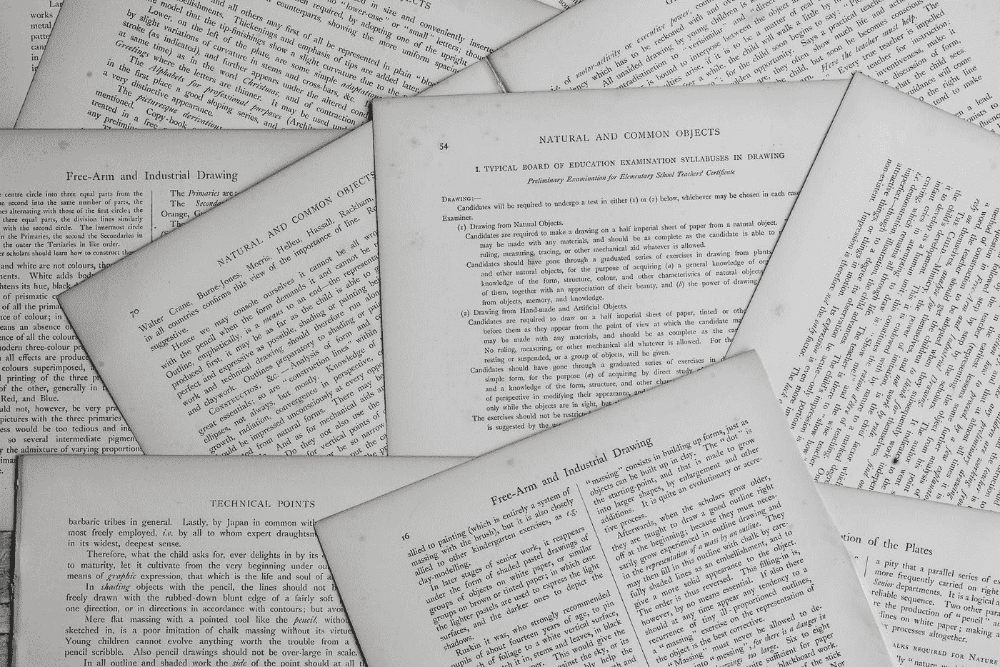

# 使用 Python 和 OpenCV 创建自己的“摄像机”

> 原文：<https://levelup.gitconnected.com/create-your-own-camscanner-using-python-opencv-66251212270>

## 你有没有想过一个“摄像头扫描仪”是如何将你手机里模糊的文档图片转换成清晰的、光线合适的扫描图像的？我做过，直到最近我还认为这是一项非常困难的任务。但事实并非如此，我们可以用相对较少的几行代码来制作我们自己的“摄像机”。(与我们的想法相比)

安妮·斯普拉特在 [Unsplash](https://unsplash.com?utm_source=medium&utm_medium=referral) 上的照片

## 感谢 [Soham Mhatre](https://medium.com/u/ed0ec1818937?source=post_page-----66251212270--------------------------------) 对本文做出的重要贡献。

# 计算机视觉为什么这么热门？

计算机视觉是一个跨学科的科学领域，研究计算机如何从数字图像或视频中获得高层次的理解。从工程的角度来看，它寻求理解和自动化人类视觉系统可以完成的任务。 ***基本上是*** *，*让计算机理解一张照片/视频，就像人类理解它一样，这是一个科学领域。

## 那么，为什么会有这样的议论呢

人工智能和机器学习的进步加速了计算机视觉的发展。早期，这是两个独立的领域，两者都有不同的技术、编码语言和学术研究者。但现在，这一差距已经显著缩小，越来越多的数据科学家正在计算机视觉领域工作，反之亦然。原因是这两个领域有一个简单的共同点——数据。

最终，计算机将通过消耗数据来学习。人工智能不仅帮助计算机进行处理，还通过反复试验来提高它的理解/解释能力。所以现在，如果我们可以结合来自图像的数据，并在其上运行复杂的机器学习算法，我们得到的就是一个实际的人工智能。

> 一家引领计算机视觉技术的现代公司是特斯拉汽车公司

> 特斯拉汽车公司(Tesla Motors)因在世界上开创自动驾驶汽车革命而闻名。它们还因在自动驾驶汽车中实现高可靠性而闻名。特斯拉汽车完全依赖计算机视觉。

# 我们今天要实现什么？

对于本文，我们将只关注计算机视觉，机器学习留待以后讨论。我们也将只使用一个库***【OpenCV】****来创建整个东西* ***。***

# **索引**

1.  OpenCV 是什么？
2.  使用不同的概念对图像进行预处理，例如模糊、阈值处理、去噪(非局部方法)。
3.  Canny 边缘检测与最大轮廓提取
4.  最后—锐化和亮度校正

# 什么是 OpenCV

OpenCV 是一个主要针对实时计算机视觉的编程函数库。最初由英特尔开发，后来得到了 Willow Garage 和 Itseez 的支持。该库是跨平台的，在开源 BSD 许可下可以免费使用。它最初是用 C++开发的，但现在可以跨多种语言使用，如 Python、Java 等。

# 从预处理开始

## **模糊**

模糊的目的是减少图像中的噪声。它从图像中移除高频内容(例如:噪声、边缘)，从而导致边缘模糊。OpenCV 中有多种模糊技术(滤镜)，最常见的有:

**平均** —它只是取内核区域下所有像素的平均值，并用这个平均值替换中心元素

**高斯滤波器**——使用高斯内核，而不是由相等滤波器系数组成的箱式滤波器

**中值滤波器** —计算内核窗口下所有像素的中值，中心像素被替换为该中值

**双边滤镜**——高斯模糊的高级版本。它不仅可以消除噪声，还可以平滑边缘。

原始 Vs 高斯模糊

## 阈值处理

在图像处理中，阈值处理是分割图像的最简单的方法。从灰度图像，阈值可以用来创建二进制图像。这通常是为了清楚地区分不同色调的像素强度。OpenCV 中最常见的阈值技术有:

**简单阈值** —如果像素值大于阈值，则为其分配一个值(可能是白色)，否则为其分配另一个值(可能是黑色)

**自适应阈值** —算法计算图像小区域的阈值。因此，对于同一幅图像的不同区域，我们得到了不同的阈值，并且对于具有不同光照的图像，它给出了更好的结果。

> 注意:记住在设定阈值之前将图像转换为灰度

原始灰度与自适应高斯

## 去噪

我们还进行了另一种去噪——***非局部去噪。*** 最初的去噪方法的原理是用邻近像素的颜色平均值来代替一个像素的颜色。概率论中的方差定律保证了如果对 9 个像素进行平均，则平均值的噪声标准差除以 3。因此给了我们一个去噪的图像。

但是，如果有边缘或*拉长的*图案，平均去噪不起作用，该怎么办？因此，我们需要扫描图像的大部分，以搜索所有真正类似于我们想要去噪的像素的像素。然后通过计算这些最相似像素的平均颜色来进行去噪。这叫做— ***非局部的意思就是去噪。***

同样使用`cv2.fastNlMeansDenoising`。

原始与高斯模糊与非局部均值去噪

# Canny 边缘检测与最大轮廓提取

在图像模糊和阈值处理之后，下一步是找到最大的轮廓(最大的边界框)并裁剪出图像。这是通过使用 Canny 边缘检测，然后使用四点变换提取最大轮廓来完成的。

## 锐利的边缘

Canny 边缘检测是一种可以检测边缘的多步算法。我们应该向该算法发送去噪声的图像，以便它能够只检测相关的边缘。

## **寻找轮廓**

找到边缘后，将图像通过`cv2.findcontours()`。它连接所有连续的点(沿着边缘)，具有相同的颜色或强度。在这之后，我们将得到所有的轮廓——矩形、球形等

使用`cv2.convexHull()`和`cv2.approxPolyDP`找到照片中最大的矩形轮廓(大约)。

原始与具有最大边界框的原始

## 提取最大轮廓

虽然我们已经找到了看起来像矩形的最大轮廓，但我们仍然需要找到*角，以便找到精确的坐标来裁剪图像。*

*首先传递近似矩形(最大轮廓)的坐标，并在其上应用 ***顺序点*** 变换。结果是最大轮廓的精确(x，y)坐标。*

***四点变换**——使用上述(x，y)坐标，计算轮廓的宽度和高度。通过`cv2.warpPerspective()`来裁剪轮廓。瞧——你已经成功地从输入图像中裁剪出了*相关的*数据*

****

*原始图像与裁剪图像*

> *请注意——即使是一张光线不佳、点击次数不多的图片，它的裁剪效果也很好*

# *最后—锐化和亮度校正*

*现在我们已经从图像中裁剪出了相关的信息(最大的轮廓)，最后一步是锐化图片，这样我们就可以得到清晰易读的文档。*

*—为此，我们使用*色调、饱和度、值(h，s，v)* 概念，其中*值*代表*亮度。*可以用这个值来增加文档的亮度*

*— ***内核锐化—*一个内核**、**卷积矩阵**，或者**遮罩**就是一个小矩阵。它用于模糊、锐化、浮雕、边缘检测等。这是通过在内核和图像之间进行卷积来实现的*

## *结果*

****

*原始结果与最终结果(裁剪、增亮和锐化)*

# *完全码*

*这是最终的代码*

*要浏览我的其他数据科学/机器学习博客，请访问:*

* [## 谢里什·古普塔培养基

### 阅读希利什·古普塔在媒介上的作品。我是学术界的经济学家，专业的数据科学家和旅行者…

medium.com](https://medium.com/@shirishgupta) 

暂时结束了。有什么想法来改善这一点或希望我尝试任何新的想法？请在评论中给出你的建议。再见。* 

*感谢 [Adrian Rosebrock](https://medium.com/u/2b8f8f0c68a1?source=post_page-----66251212270--------------------------------) 在 [PyImageSearch](http://www.pyimagesearch.com) 上发表的所有有用的博客。有帮助的博客—
1。[https://www . pyimagesearch . com/2014/09/01/build-kick-ass-mobile-document-scanner-just-5-minutes/](https://www.pyimagesearch.com/2014/09/01/build-kick-ass-mobile-document-scanner-just-5-minutes/)*

*2.[https://www . pyimagesearch . com/2014/08/25/4-point-opencv-get perspective-transform-example/](https://www.pyimagesearch.com/2014/08/25/4-point-opencv-getperspective-transform-example/)*

*3.[https://www . pyimagesearch . com/2016/03/21/ordering-coordinates-顺时针-with-python-and-opencv/](https://www.pyimagesearch.com/2016/03/21/ordering-coordinates-clockwise-with-python-and-opencv/)*