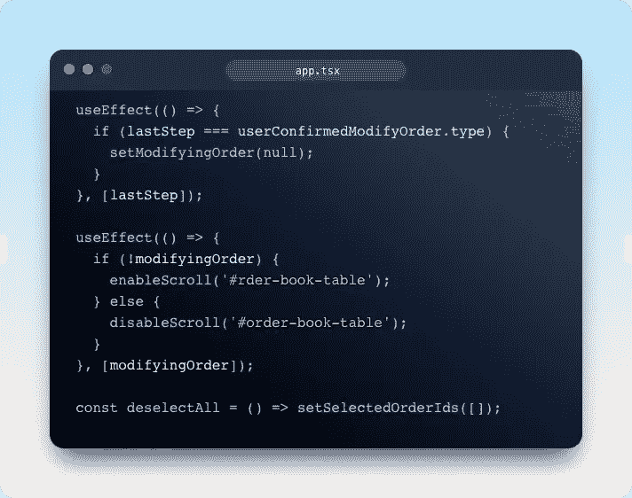
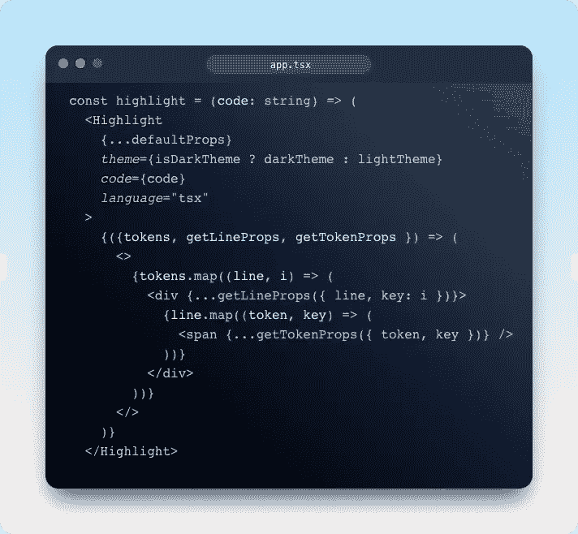
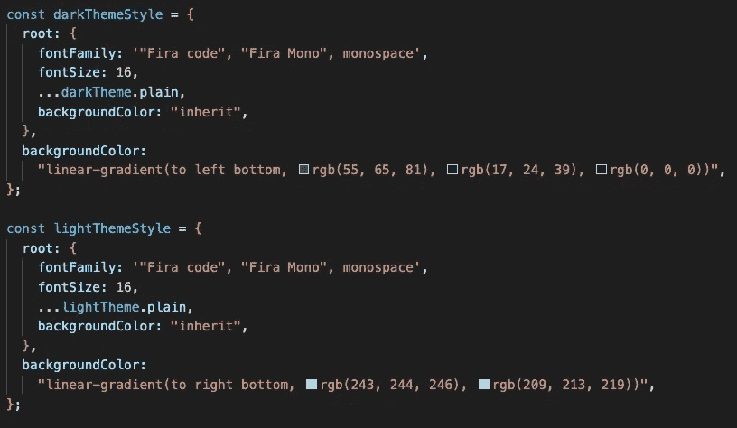
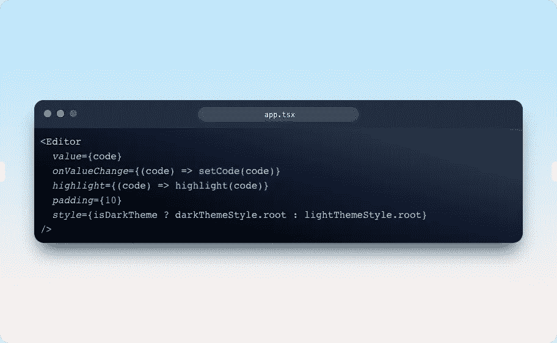

# 在 React 中创建自己的代码编辑器

> 原文：<https://levelup.gitconnected.com/create-your-own-code-editor-in-react-d75e8e7e1940>



# 介绍

几个基于浏览器的代码编辑器提供了在网页中嵌入全功能代码编辑器的能力。然而，如果您只需要一个简单的编辑器，带有语法高亮显示，没有任何额外的功能，它们可能是多余的，因为它们通常没有一个小的包大小。这可能会使你的应用程序变得更大。

在这篇文章中，我将指导你如何制作一个简单的带有语法高亮的代码编辑器，使你的网站适合简单的嵌入

# 设置

首先用 TypeScript 创建一个 React App，我会用 Vite，你想用什么都可以

```
yarn create vite my-code-editor --template react-ts
```

接下来，我们安装所需的依赖项

```
cd my-code-editor
yarn add react-simple-code-editor prism-react-renderer
```

# 开始编码

是一个库，旨在提供一个简单的代码编辑器，支持语法高亮显示，没有任何额外的特性。

`prism-react-renderer`是一个使用 Prism 的库，提供了一个小的渲染道具驱动的组件来快速渲染到 React 中。

合并两个库将有助于我们创建应用程序。\

```
import Editor from "react-simple-code-editor";
import Highlight, { defaultProps } from "prism-react-renderer";
import darkTheme from "prism-react-renderer/themes/nightOwl";
import lightTheme from "prism-react-renderer/themes/nightOwlLight";
```

如果它没有至少两个主题和荧光笔，它就不是一个好的编辑器。

首先，我们需要我们的国家

```
const [code, setCode] = useState(`function add(a, b) {\n  return a + b;\n}'`);const [theme, setTheme] = useState("dark");
```

一个州持有代码，另一个州持有主题。

接下来，我们创建高光函数:



这个功能非常简单。使用带有`prism-react-renderer`及其 defaultProps 的`Highlight`组件，传递正确的主题和代码。选择你的语言，我选择了`tsx`。



最后是渲染功能，我们使用上面导入的`Editor`组件。`value`将是代码，不要忘记下面的 setter。`highlight`道具将是上面的`highlight`功能。设置`padding`和`style`，你就可以开始了。

# 结果

随着更多的造型，结果将看起来像上面的所有图片(我使用自己的编辑器应用程序)，你可以在这里找到[源代码](https://gitlab.com/letrongduc1999/live-code-editor)

# 遗言

虽然我的内容对每个人都是免费的，但是如果你觉得这篇文章有帮助，[你可以在这里给我买杯咖啡](https://www.buymeacoffee.com/kylele19)