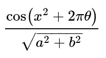
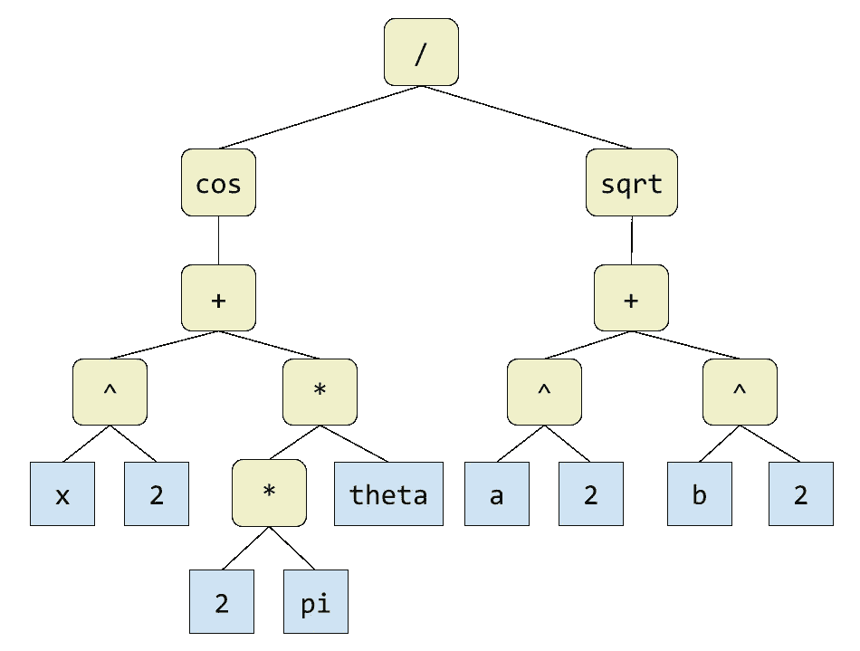

# 创建自己的表达式解析器

> 原文：<https://levelup.gitconnected.com/create-your-own-expression-parser-d1f622077796>

## 打造自己的编程语言的一步


维克多·加西亚在 [Unsplash](https://unsplash.com?utm_source=medium&utm_medium=referral) 上拍摄的照片

你有没有想过创造一种自己的编程语言？我做过几次。这是一项令人着迷的事业。我亲身体会到，当你坐下来开始追求这个想法时，你会感到不知所措。

创建编程语言的学科跨越了许多主题。以下是在给定编程语言的实现中可能会发现的一些组件:

*   **解析器**:将源代码转换成可操作的数据结构，称为*解析树。*
*   **代码生成器**:将解析树翻译成机器代码、字节码或其他可执行格式。
*   **解释器**:根据语言设计执行解析树或字节码图像。
*   **优化器**:通过巧妙修改编译后的机器码，提高执行速度或减少代码大小。
*   **运行时**:支持可执行文件的标准代码库，包括内置函数、内存分配器、垃圾收集器、线程管理器和其他关键子系统。

这只是一个简单的例子。还有许多其他可能的组件，多到无法在此解释。

在本文中，我将重点讨论解析器。具体来说，我将描述一个解析器，它将一个数学表达式转换成一个叫做*解析树*的数据结构。编程语言在更大的语义结构中使用表达式作为构建块。例如，在大多数语言中，每个条件“if”语句中都有一个表达式，如下所示:

```
**if** **(** *expression* **)** 
    *statement*
**else**
    *statement*
```

在本文中，我不会涉及解析编程语言的全部语法。我将只关注一种简单的方言表达。然而，一旦你理解了如何为表达式创建一个语法，以及如何从头开始为它编写一个解析器，处理一门编程语言的全部语法就只是一个努力和时间的问题了。理解一个表达式解析器会给你一个很好的基础，让你一路走到你自己的语言设计。

## 目标

一旦你解析了一个表达式，你可以对它做很多不同的事情。您可以从中生成可执行代码。你可以画出它的图表。你可以做符号数学——例如，解方程或求导。

在这篇文章中，我认为做一些不同的事情会很有趣。我将展示一个用 JavaScript 编写的基于浏览器的程序，它接受用户的输入，如下所示:

```
cos(x^2+2*pi*theta)/sqrt(a^2+b^2)
```

然后它会把这个文本转换成一个漂亮的公式，就像这样:



## 现场演示

您可以在另一个浏览器选项卡中打开解析器的[现场演示，并继续阅读本文的其余部分。](https://doncross.net/parser/)

## 步骤概述

代码首先将用户的输入文本解析到一个解析树中。下面是上面显示的表达式的解析树的样子。



然后程序使用解析树创建一个 [TeX](https://en.wikipedia.org/wiki/TeX) 格式的表达式:

```
\frac{ \cos \left( x^2 + 2\pi\theta \right) } {\sqrt{a^2 + b^2}}
```

最后，它使用 [MathJax](https://www.mathjax.org/) JavaScript 库在浏览器中将 TeX 表达式呈现为优雅的排版数学。

## 限制

为了保持代码有趣而简单，我将支持的数学语法限制为以下几项:

*   拉丁字母变量:`a`到`z`和`A`到`Z`。
*   希腊字母变量，小写`alpha`到`omega`，大写`Alpha`到`Omega`。
*   整数(`724`)、浮点数(`4.39254`)和科学记数法(`6.27e+20`)形式的数值。
*   二元运算符加法(`+`)、减法(`-`)、乘法(`*`)、除法(`/`)和求幂(`^`)。
*   一元前缀运算符`+`(正)和`-`(负)。请注意，根据上下文的不同，同一个符号可以表示不同的意思！
*   余弦(`cos`)、正弦(`sin`)、绝对值(`abs`)和平方根(`sqrt`)函数。如果你愿意，以后添加更多的功能会很容易。
*   使用括号`()`来覆盖运算符优先级。

## BNF 语法

不，“BNF 语法”不是一个时髦的连锁餐厅的名字。 *BNF* 代表[Backus–Naur Form](https://en.wikipedia.org/wiki/Backus%E2%80%93Naur_form)，这种符号使你能够定义编程语言的语法。语言的语法是制作解析器的关键的第一步。这是你的路线图。它简明地定义了什么可以出现在一个有效的程序中。在为解析器编写代码时，您将不断地参考语法。

这是我们表达式解析器的 BNF 语法。

```
expr ::= mulexpr { addop mulexpr }
addop ::= "+" | "-"
mulexpr ::= powexpr { mulop powexpr }
mulop ::= "*" | "/"
powexpr ::= "-" powexpr | "+" powexpr | atom [ "^" powexpr ]
atom ::= ident [ "(" expr ")" ] | numeric | "(" expr ")"
numeric ::= /[0-9]+(\.[0-9]*)?([eE][\+\-]?[0-9]+)?/
ident ::= /[A-Za-z_][A-Za-z_0-9]*/
```

语法是一系列的定义。每个定义都以类似于`expr`的名称开头，后面跟有`::=`符号，意思是“被定义为”每个`::=`的右边是`::=`左边命名的概念所允许的语法。

我们将从第一个定义开始，`expr`，它代表任何要解析的数学表达式。当你看到

```
mulexpr { addop mulexpr }
```

这意味着一个表达式由一个`mulexpr`和零个或多个`addop mulexpr`对组成。换句话说，这些都是有效的`expr`字符串:

```
mulexpr
mulexpr addop mulexpr
mulexpr addop mulexpr addop mulexpr
mulexpr addop mulexpr addop mulexpr addop mulexpr
```

一般来说，任何包含在`{}`中的东西都意味着它可以出现任意次，包括零次。

为了理解`mulexpr`和`addop`的意思，继续阅读语法。你可以看到一个`addop`既可以是字符串`+`也可以是字符串`-`。文字文本用双引号括起来，就像这样:`"+"`。符号`|`代表选择:解析器允许由竖线符号分隔的任何互斥选择。

语法定义中的方括号`[]`表示内容是可选的:它们要么不存在，要么出现一次。

最后，为了方便起见，我使用嵌入在`//`中的 JavaScript 风格的正则表达式来定义符号`numeric`和`ident`。这是我自己的做事方式，尤其是当我用支持正则表达式的语言编写解析器时。

## 标记器

一旦你理解了如何为你的语言编写 BNF 语法，下一步就是创建一个标记器，它可以识别你的语言中的*标记*。记号是你的语言中文本的基本单位，就像不能分裂的原子。在我们的示例表达式语言中，标记是标点符号，如`+`和`-`，标识符，如`theta`，以及数字文字，如`47.259`。

有些人把记号赋予器叫做*扫描器*、词汇分析器*或*词法分析器*。它们的意思都一样。关键是，您需要某种东西将输入中的字符序列预处理成代表您的语言的基本文本单元的块。构建解析树的代码部分将使用来自记号赋予器的一系列记号。记号赋予器和解析器之间的职责分离保持了代码的模块化和维护的灵活性。*

除了组成令牌的字符块之外，还可以方便地将一些其他数据附加到每个令牌上:

*   **令牌在输入**中的位置。如果您正在从一个文件中解析源代码，记住每个标记的位置的一种自然方法是根据它在该文件中的行号和列号。如果解析器在某个特定的标记处检测到语法错误，那么它可以报告一条错误消息，其中包括行号和列号。这样做有助于用户找到问题所在。在本文的演示程序中，输入是单行文本。因此，每个标记都在输入字符串中存储自己的从零开始的索引。当出现错误时，演示程序会在文本输入框中突出显示有问题的令牌。
*   **令牌的类型**。在我的示例解析器中，所有标记都被分类为标识符、运算符或数字。确定标记的类型有助于解析器理解如何处理它看到的每个标记。

下面是我如何实现代表输入中每个标记的`Token`类:

为了简单起见，`Parser`类在其构造函数中完成了所有的标记化工作。要解析的文本被传递到构造函数中，结果产生的`Token`对象列表存储在`this.tokenList`中。记号赋予器逻辑使用检查数字文字或标识符的正则表达式(`reToken`)来识别记号。如果两者都不匹配，它会将下一个非空白字符视为一个标记。因此，每个空白字符都被忽略，每个非空白字符都包含在某个标记中。

帮你自己一个忙。如果能像这样使用正则表达式，标记化就容易多了。否则，您必须进行一些繁琐的编码来从输入中提取标记。

解析器构造函数对输入进行标记。

## 创建解析树

在`Parser`类中解析表达式的主要方法叫做`Parse`。它调用一个助手方法`ParseExpr`，该方法遵循 BNF 语法中的`expr`规则。`ParseExpr`实现了一个递归下降、贪婪的解析器，它试图在遵守语法的同时消耗尽可能多的标记。

有些情况下，无效的语法会导致`ParseExpr`放弃并返回一个有效的解析树，用于它能够根据语法匹配的最左边部分的标记。这就是为什么`Parse`需要确保所有的代币都被消费掉。如果`ParseExpr`返回后还有剩余的令牌，说明有语法错误。在这种情况下，`Parse`抛出一个异常。

你可能会问，当有未解析的令牌时，为什么`ParseExpr`本身不抛出异常。这是因为解析器是一个相互递归的函数系统。有些情况下`ParseExpr`需要识别另一个表达式中的一个表达式。例如，考虑这个语法规则的粗体部分:

```
atom ::= ident [ "(" expr ")" ] | numeric | **"(" expr ")"**
```

一个表达式可以出现在另一个表达式的括号内。一旦解析器看到一个`(`，它就调用`ParseExpr`来处理括号内的表达式。`ParseExpr`一碰到`)`就会停止，因为那个令牌不是`addop`。右括号标记不是语法错误；这是必须的！所以这就是为什么你需要一个额外的函数`Parse`在顶层被调用，以便在未处理的令牌剩余时失败。

## 例外是你的朋友

如果您用来编写解析器的编程语言中有异常，那么利用它们是个好主意。我用 C 写了一个解析器，少了很多乐趣。代码很快变得臃肿，检查其他函数的返回值，并在它们指出错误时退出。C 中的一个替代方法是使用`setjmp`和`longjmp`，尽管由于各种原因这是[危险的。抛出异常消除了大量庞大、重复的编码。在调用其他可能失败的函数后，解析器中的每个函数都可以轻松地继续运行。](https://en.wikipedia.org/wiki/Setjmp.h#Caveats_and_limitations)

有人可能会反对异常是“昂贵的”。我的回答是，考虑只有当语法错误时才会发生异常。在这种情况下，一切都会停滞不前。用户必须找出如何解决问题，编辑代码，并再次启动解析器。因此，处理语法错误的额外毫秒开销可以忽略不计。一旦源代码有了正确的语法，就没有异常开销。可以说，在性能很重要的成功案例中，基于异常的代码更快，因为它不必一直检查返回值！

## 根据语法编写您的解析器

让我们来看看`ParseExpr`功能。我喜欢在每个规则解析函数中包含相关的语法规则作为注释。这样做可以在代码审查期间作为一个方便的参考。我邀请您花一点时间来验证语法注释与其下面的代码是否匹配。

助手函数`NextTokenIs`验证至少还有一个令牌，并且下一个令牌在传递给它的字符串列表的选项中。如果是，它返回该令牌，并通过递增`nextTokenIndex`前进到下一个令牌。否则，它什么也不做并返回`null`。

`ParseExpr`迭代查找由`+`或`-`操作符分隔的`mulexpr`项，调用`ParseMulExpr`处理语法中的`mulexpr`规则。它发现的增加/减少的`mulexpr`项越多，构建的树就越深。

其余的语法规则以类似的方式实现。

## 表达式类

解析函数都返回从基类`Expression`派生的类的实例。`Expression`类的一个实例充当解析树中的一个节点。每个节点在成员变量`arglist`中包含零个或多个子表达式。

每个表达式节点还持有在原始文本中表示它的标记。例如，在表达式`a+b`中，解析树的根节点包含令牌`+`，并且该根节点的子节点是作为叶节点的表达式`a`和`b`(没有子节点的节点)。

所有从`Expression`派生的类都有相同的内部数据结构。这个类集合的存在是为了覆盖成员函数，以便生成 TeX 输出，我们将在下面看到。

## 使用解析树

从`Expression`派生的每个类都包含一个名为`PrettyMath`的成员函数。它的工作是生成一个包含 TeX 代码的字符串。例如，`Expression_Function`类为函数`abs`、`sqrt`、`sin`和`cos`处理解析树中的节点。它知道 TeX 语法是不同的，取决于这些函数中的哪一个出现。

这个例子表明，作为语言实现者，您可以自由地检查各种错误。我可以让扫描仪拒绝任何未知功能。相反，扫描器将任何字母数字序列识别为可能的变量或函数名。如果`PrettyMath`函数不知道如何处理给定的符号，它的工作就是抱怨。在解析后检查未定义的符号更适合大多数语言，因为知道一个符号是否被定义通常是一个语义问题，而不是语法问题。

## 运算符优先级

在表达式中，某些运算符必须在其他运算符之前计算。例如在`a*b+c*d`中，常规是`a`和`b`相乘，然后是`c`和`d`，最后是乘积`a*b`和`c*d`相加。我们说乘法比加法有更高的优先权。

基于规则的嵌套方式，优先级隐含在语法中。事实是

```
expr ::= mulexpr { addop mulexpr }
```

被定义为

```
mulexpr ::= powexpr { mulop powexpr }
```

告诉您这种语法将乘法置于比加法更高的优先级，因为语法分析器在更深层次的递归中处理乘法。

运算符优先级在生成 TeX 输出时也很重要，如下面的函数所示，该函数用于确定每个子表达式是否需要括号:

## 结合性

除了运算符优先级，理解结合性也很重要。对于中缀二元操作符(出现在两个参数之间的操作符，如`a+b`中的`+`)，同一操作符的长链可以是左关联的，也可以是右关联的。

左关联运算符从左到右分组。这对于减法和除法来说是最重要的，因为它们的顺序很重要。例如:`a-b-c-d`解释为`((a-b)-c)-d`。这是通过使用大括号的“零个或多个”语法规则的简单迭代从语法中产生的，如

```
expr ::= mulexpr { addop mulexpr }
```

因为解析器从左到右处理迭代，所以构建了节点链，使得最左边的术语位于树的最深处。因此，它们在转换为 TeX 时首先被处理。

右关联运算符从右向左分组。该语法中唯一的右关联二元运算符是取幂运算符`^`。当解析器看到`a^b^c^d`时，我们希望它将这个字符串解释为`a^(b^(c^d))`。该语法使用递归而不是迭代来确保右边在结果解析树中更深。请参见以下规则的粗体部分。

```
**powexpr** ::= "-" powexpr | "+" powexpr | **atom [ "^" powexpr ]**
```

类似地，`powexpr`定义中的一元前缀操作符`+`和`-`在其右侧使用递归来加强右结合性。

## 无法表达

正如我上面提到的，一旦您理解了如何为表达式创建解析器，您就可以扩充您的语法以包括函数定义、条件语句、循环语句和您自己的编程语言的其他部分。你可以研究像 [ANSI C](https://www.lysator.liu.se/c/ANSI-C-grammar-y.html) 或 [C#](https://docs.microsoft.com/en-us/dotnet/csharp/language-reference/language-specification/lexical-structure) 这样的现有编程语言的语法来寻找灵感。

编程语言原型化的一个好方法是构建一个直接执行解析树的解释器。稍后，您可以尝试为给定的处理器发出字节代码甚至机器代码。 [LLVM](https://llvm.org/) 编译器基础设施项目可能有助于以严肃的编程语言生成机器代码。

## 为什么要做这个疯狂的事情？

有些人会嘲笑并告诉你，世界最不需要的就是另一种编程语言。已经有数百种编程语言。任何新的尝试都应该有一个令人信服的理由来激励大量的人去尝试新的东西。如果你的目标是创造一种接管世界的超级流行的语言，那么这种可能性对你来说是不利的。

然而，创造一种编程语言还有其他很好的理由。在现有的软件系统中，您可能特别需要一种简洁优雅的语言。许多文本编辑器、电子表格和计算机辅助设计系统都有内置的脚本语言，允许用户创建自己的宏或自定义应用程序。

在创建和使用我自己的编程语言后，我现在对编程有了更深层次的理解。编译器和解释器似乎不再神秘。我也对大量的工作和天赋留下了深刻的印象，这些工作和天赋进入了健壮且被广泛采用的语言，如 C#、JavaScript 和 Python。

无论你的目标是什么，我相信你会发现创造一种你自己的编程语言是一种有益的、具有挑战性的、迷人的经历。

## 读者练习

GitHub 上提供了演示解析器的完整源代码。如果您有兴趣自己学习更多，以下是一些您可以练习的想法，基于此源代码:

*   将输入表达式转换为 LISP 语法。例如:以`3*x+47/y`为输入，生成输出`(+ (* 3 x) (/ 47 y))`。
*   修改语法、解析器和 TeX 生成器，以允许任何数量的逗号分隔参数的函数:`max(a, b, c, ...)`。
*   给定一个解析树，编写创建另一个解析树的代码，该解析树是第一个解析树相对于变量`x`的[偏导数](https://en.wikipedia.org/wiki/Partial_derivative)。将所有其他变量视为常数。例如:将`(x^3+5)^2`转换为`2*(x^3+5)*3*x^2`。
*   添加表达式简化器，消除表达式中不必要的复杂性。例如，它可能会将`1*x+0*y-7*x`转换为`-6*x`。本练习将让您了解优化器在编译器中的作用。
*   制作一个 2D 函数绘图仪，绘制关于自变量`x`的表达式。

## 参考

1.  本文中使用的完整源代码可以从以下网址获得:[https://github.com/cosinekitty/parser](https://github.com/cosinekitty/parser)
2.  这里有一个在你的浏览器中运行的解析器的现场演示:[https://doncross.net/parser/](https://doncross.net/parser/)