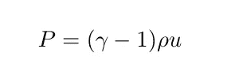
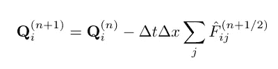

# 创建自己的有限体积流体模拟(使用 Python)

> 原文：<https://levelup.gitconnected.com/create-your-own-finite-volume-fluid-simulation-with-python-8f9eab0b8305>

对于今天的娱乐编码练习，我们将用有限体积法模拟**开尔文-亥姆霍兹不稳定性**。我们将考虑一种可压缩流体，其高密度流沿与背景相反的方向运动。速度切变引发了一个著名的不稳定性，这种不稳定性有时会在云层中以及木星的大红斑中看到。

你可以在 github 上找到附带的 [Python 代码。](https://github.com/pmocz/finitevolume-python)

在我们开始之前，下面是运行模拟的 gif 图:

## 有限体积法

我们将描述有限体积法来模拟理想的可压缩流体。该方法还可以扩展到模拟其他类型的流体。理想的可压缩流体由**欧拉流体方程**描述。为了讨论的目的，让我们考虑 2D 的系统(把这里介绍的扩展到 3D 并不太困难)。流体由所谓的原始变量描述:

*   密度 *ρ*
*   速度*vᵧvₓ*
*   压力 *P*

随时间演化这些参数的方程可以写成**原始形式**的欧拉方程:

这里 *γ* 是理想气体绝热指数参数。比如单原子理想气体有 *γ* =5/3。该参数出现在当地流体声速 *c* 的计算中:

有限体积法实际上将主要使用不同形式的欧拉方程。在理想流体中，总质量、动量和能量是守恒的，有限体积法旨在确保这一点。定义**保守变量**是有意义的，它们是:

*   质量密度 *ρ*
*   动量密度 *ρvₓ，ρvᵧ*
*   能量密度 *ρe*

能量密度通过流体的**状态方程与压力相关:**

其中 *u* 是流体的内能(即温度)，它与总能量 *e* 的关系为:

(这个表达式是整体流体运动的内能和动能之和)

欧拉方程可以用**保守形式**重写:

这组方程被称为保守形式的原因是因为它具有以下一般结构:

其中 **U** 是保守变量的集合， **F** 是通量函数。保守变量的时间演化随着通量的发散而演化。

在计算机上，流体被离散成大小为δ*x*乘*δ*x*的单个流体单元(正方形“单元”)。细胞通过细胞界面的**通量**交换保守量。因为细胞只是在交换数量，而不是通过其他方式获得或失去数量，所以它们的总和总是保持不变。对于数值方法来说，这是一个非常好的特性。*

为了了解这是如何工作的，让我们通过乘以单元体积(δ*x*)来定义每个单元的质量、动量和能量:

然后，有限体积法的核心在于计算通过细胞界面的通量。我们将充实在实践中如何计算通量的细节，但现在让我们假设它们是可以获得的。一旦获得，解可以从时间步长 *n* 更新到下一个时间步长 *n* +1，如下所示:

其中 *F* ᵢⱼ是指相邻小区 *i* 和 *j* 之间的数值通量。一般来说，流量是作为界面“左”和“右”侧流体变量的函数来计算的。该总和是对所有 4 个邻居(在 2D)的总和。δ*x*因子是界面的面积。这个简单方程的推导来源于微积分中的[散度定理](https://en.wikipedia.org/wiki/Divergence_theorem#:~:text=In%20vector%20calculus%2C%20the%20divergence,field%20in%20the%20volume%20enclosed.&text=In%20two%20dimensions%2C%20it%20is%20equivalent%20to%20Green's%20theorem.)。

## 原始变量和保守变量之间的转换

让我们深入研究用 Python 实现一个简单而强大的有限体积代码的细节。我们将解决方案变量表示为一个矩阵，并在矩阵上执行操作，以避免因 For 循环而降低 Python 代码的速度。

定义一个将原始变量转化为守恒量的函数似乎很有用

反之亦然:

## 用 CFL 条件设置时间步长

为了数值稳定性和准确性，模拟时间步长不能任意大。它必须遵守 CFL 条件:

其中 *C* _{CFL}≤1 为阶单位常数。时间步长表达式中的最小值取自所有单元 *i* 。速度 *c* ᵢ+| *v* ᵢ|是小区中最大信号速度的代表。从概念上讲，CFL 条件说的是，在一个时间步长的持续时间内，最大信号速度可能不会超过一个单元的长度。

## 计算渐变

在我们的有限体积表示中，我们跟踪并发展以细胞为中心的流体变量。在计算通量时，我们需要知道界面“左”和“右”两侧的流体变量值。当然，我们可以仅通过以单元格为中心的值来近似表面值。但是我们可以做得更好。我们可以测量空间梯度，并用它们来推断从细胞中心到面部的变量。这就产生了一种高阶方法，它更精确，数值扩散性更小。

所以让我们构造一个函数，计算任意场的梯度 *f.* 我们稍后会用这个函数来计算原始变量的梯度，但是现在让我们只构造一个通用的方法。我们可以使用二阶有限差分公式:

其中在该等式中，根据一对索引 *i，j* 以逻辑方式索引单元，指示它们在 2D 网格中的位置。

以下是以矢量化方式计算周期域上的梯度的函数(即，一次性作用于变量矩阵)。请注意 [np.roll()](https://numpy.org/doc/stable/reference/generated/numpy.roll.html) 函数的使用，这是一种沿 *x* 或 *y* 方向周期性移动矩阵元素的有效方式，以便查找相邻值。

## 斜率限制器

我们不会在这里进入斜率限制器的高级主题，而只是简单地提到，有时流体在流体变量中表现出不连续性，这被称为**冲击**。当你有超音速运动时，这可能会发生，这在天体物理学中很常见。在这种情况下，梯度是不明确的，测量它会导致数字伪影。在我们的例子中，我们不需要斜率限制器，但我注意到，通常可以识别可能存在不连续性的界面，在这种情况下，斜率通常设置为 0 或某个降低的值，以防止来自单元中心的重构场中的小规模振荡。

## 空间二阶外推

我们提到过，我们希望在通量计算的单元面的“左”和“右”侧查找流体变量。最简单的一阶方法是只取界面左右两边以单元格为中心的值。但是有了估计的梯度，我们可以使用该信息来沿着从单元中心到脸部的距离δ*x/2*外推值。例如，从单元格 *i，j* 到其右侧的面( *i+1/2，j* )的空间外推如下完成:

以下函数对任意场执行空间外推到单元的 4 个面中的每一个。

事实证明，通常最好是外推原始变量并转换回保守变量，而不是直接外推保守变量，以确保压力不会由于截断误差而意外地重建为负值。

## 时间上的二阶外推

除了在空间外推之外，为了使该方法更精确，在计算通量之前在时间上外推半个时间步长是有用的。这是通过使用欧拉方程的原始形式将时间梯度简单地表示为空间梯度(我们知道)的函数来实现的。

我们将在即将呈现的模拟主循环中包含这样做的代码。如果细节还没有意义，不要担心。我们正在勾勒出大图和主要步骤，并将很快填充细节。

## 计算和应用通量

有限体积的核心在于计算数值通量，给定界面“左”(L)和“右”(R)侧的流体状态 *u* (表示为保守变量的集合)。这可以通过多种方式实现，精确度各不相同(有些方式可能比其他方式更擅长处理冲击)。这里我们描述一个简单的稳健近似，称为**鲁萨诺夫通量**。通量是:

第一项是从左侧或右侧流体变量得出的流量的简单平均值。然后，有一个额外的条款，创造数字扩散率。它保持解的数值稳定。 *c* _{max}为最大信号速度。通量求解器的高级版本可以用更少的数值扩散率更精确地求解强激波结构，但是对于我们这里的目的，Rusanov 通量就足够了。

下面是计算 Rusanov 通量的代码。

一旦计算出通量，就可以将它们应用于每个单元中的守恒流体量 **Q**

## 时间积分

让我们通过充实时间积分主循环将所有的细节放在一起。在每个时间步，有限体积法将:

*   从保守变量中获取以单元格为中心的原始变量
*   计算下一个时间步长δt
*   计算原始变量的梯度
*   使用梯度将原始变量在时间上外推δt/2
*   使用渐变将基本变量外推至面
*   输入面左侧和右侧的流体状态，以计算每个面上的流量
*   通过将通量应用于保守变量来更新解

就是这样！看看下面包含的主循环代码:

## 输入条件

在这个模拟中，我们的领域被假设为二维和周期性的。该代码指定了初始原始变量(密度、速度、压力场)和理想气体参数 *γ* 。为了设置开尔文-亥姆霍兹不稳定性，代码初始化一个向右移动的高密度区域和向左移动的背景。压力是均匀的。在界面边界处，垂直于这种剪切方向的速度的微小扰动被加入以引起不稳定性。

运行该代码可让您实时可视化模拟，并将生成下图:

有限体积方法是计算天体物理学中一个非常有力的工具。这是一种特别好的配方，用于捕获高度可压缩的气体，具有震动和可忽略的粘度。大部分星际和星系间气体都处于这种物理状态。下面是用有限体积法对可压缩湍流的模拟。

有限体积在科学上有应用。作为另一个例子，它被用于气候建模。

来自[劳伦斯利弗莫尔国家实验室](https://www.llnl.gov/news/high-resolution-climate-simulations-thunder)的地面风环流气候模拟

正如我们已经提到的，木星的大红斑是开尔文亥姆霍兹不稳定性的一个很好的例子，我们已经用我们的代码教程进行了模拟。

木星的大红斑。致谢:[美国宇航局/JPL/太空科学研究所](https://www.nasa.gov/feature/goddard/jupiter-s-great-red-spot-a-swirling-mystery)

为我们的有限体积算法下载 github 上的 [Python 代码，以实时可视化模拟，并在初始条件下进行试验。尽情享受吧！](https://github.com/pmocz/finitevolume-python)