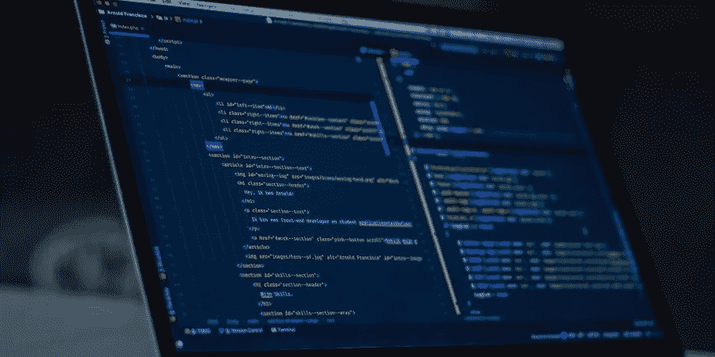
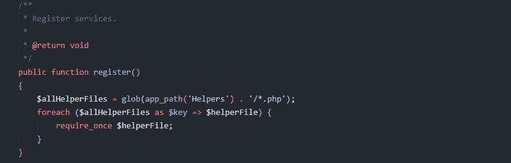
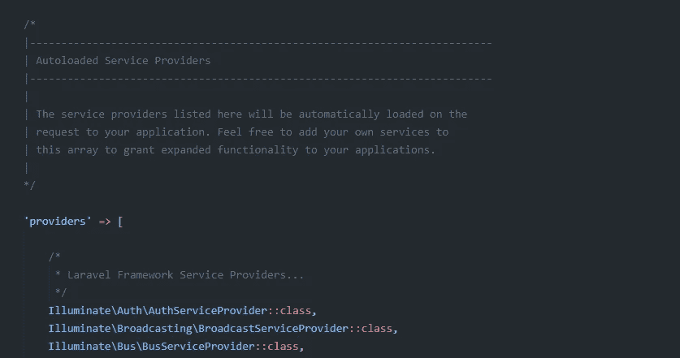
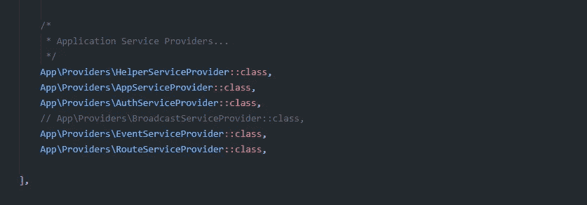
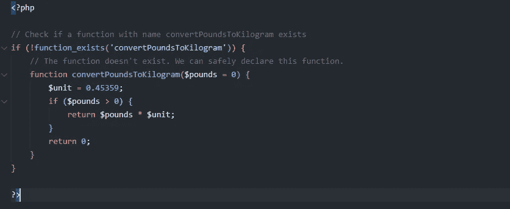

# 在 Laravel 框架中创建自己的助手函数

> 原文：<https://levelup.gitconnected.com/create-your-own-helper-function-in-laravel-framework-a2395d6408f1>

在本文中，您将看到如何为您的 Laravel 应用程序创建一个助手函数。如果你正在寻找这个，你是在正确的地方。

我在网上看过很多文章，很多出版商都展示了如何通过将助手函数添加到 Laravel 项目的 composer.json 文件中来快速实现这一功能。我觉得这不是一个准确的方法，因为它会很快让你的项目看起来很糟糕。

在这篇文章中，我将向你解释一种更好的方法来创建一个助手函数，它符合编写更干净的代码的概念，从而使你的应用程序对你的编码伙伴更具可读性。

# 什么是助手功能？

如果您想要向 Laravel 应用程序添加一个可以在控制器、视图或模型文件中的多个位置使用的特性，那么 helper 函数通常会很方便。这些函数可以被认为是全局函数。

默认情况下，Laravel 包含许多辅助函数。其中有: **abort()、dd()、route()、validator()、transform()、session()** ，还有很多。点击下面的链接查看 Laravel 提供的帮助函数的完整列表。

 [## 助手

### Laravel 包括各种全局“助手”PHP 函数。这些函数中有许多是由框架本身使用的…

laravel.com](https://laravel.com/docs/8.x/helpers) 

# 让我们开始创建助手函数

使用 PHP artisan 命令创建一个服务提供者文件。在项目中启动命令提示符，并运行下面的命令。

**PHP artisan make:provider HelperServiceProvider**

执行此操作后，您将看到在 app\Providers 文件夹中创建了一个新文件。具体路径是:**app \ Providers \ helperserviceprovider . PHP**

现在，如果你打开文件，你会看到类 **HelperServiceProvider** 里面有两个方法，分别是 **register()** 和 **boot()** 。您可以删除 **boot()** 方法，因为我们不会使用它。

现在，将下面的代码块写入 **register()** 方法。它应该是这样的。

app \ Providers \ helperserviceprovider . PHP

那么上述 PHP 代码是做什么的呢？它会扫描 **app\Helpers** 文件夹中的任何 PHP 文件，并包含所有文件。添加到这些文件中的任何功能都可以在任何地方使用，如控制器、模型和视图。

但是等等！它还没有完成。您需要包含 **HelperServiceProvider** 类，以便 Laravel 可以加载它。打开文件 **config\app.php** ，搜索 **providers** 数组。见下面截图。

config/app.php 文件中的 Providers 数组

现在在 **AppServiceProvider** 之前加入 **HelperServiceProvider** 。见下面截图。

现在，让我们在 **app\Helpers** 目录下创建一个名为【BodyWeight.php 的新文件。您不需要向该文件添加名称空间。

现在添加一个名为**convertpoundsto 千克($pounds = 0)** 的函数。该函数将负责根据提供的输入将磅转换为千克。如果想检查这个函数之前是否已经声明过，那么可以使用这个检查: **if(！function _ exists('convertpoundsto 千克')**。见下面截图。

app\Helpers\BodyWeight.php

您已经为 Laravel 设置好了新的助手文件。继续创建一些你可以经常使用的助手，不要重复你的代码。俗话说“不要重复自己”。