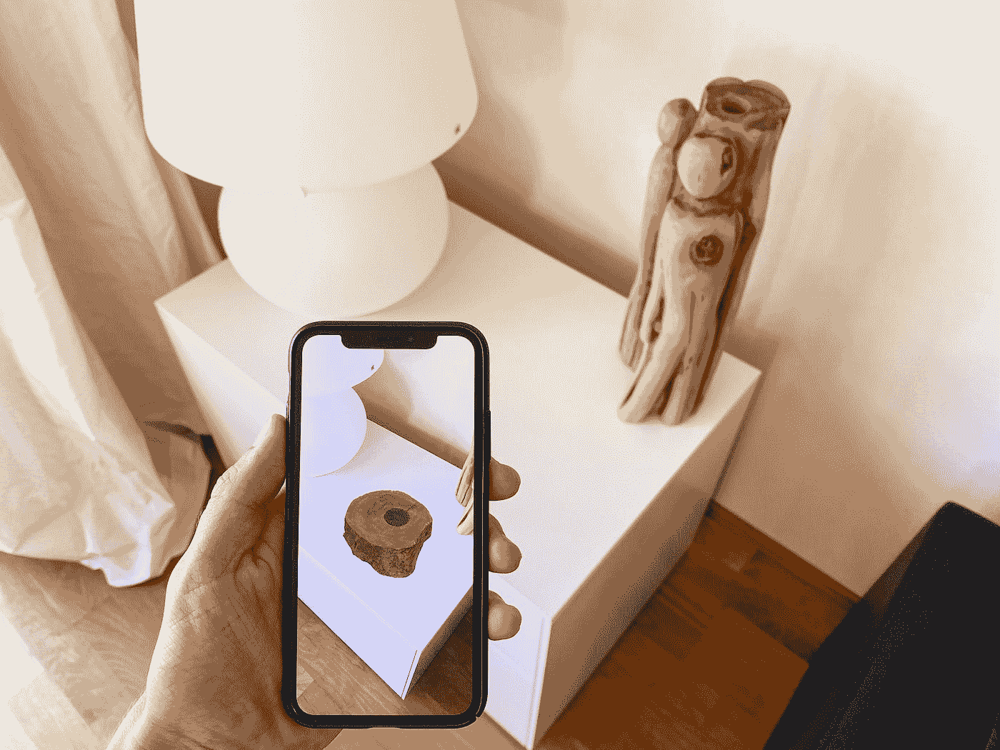
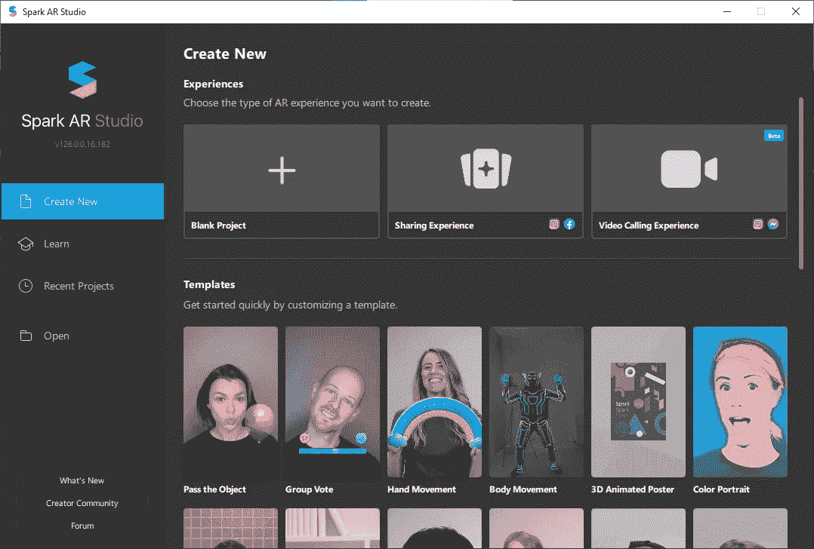
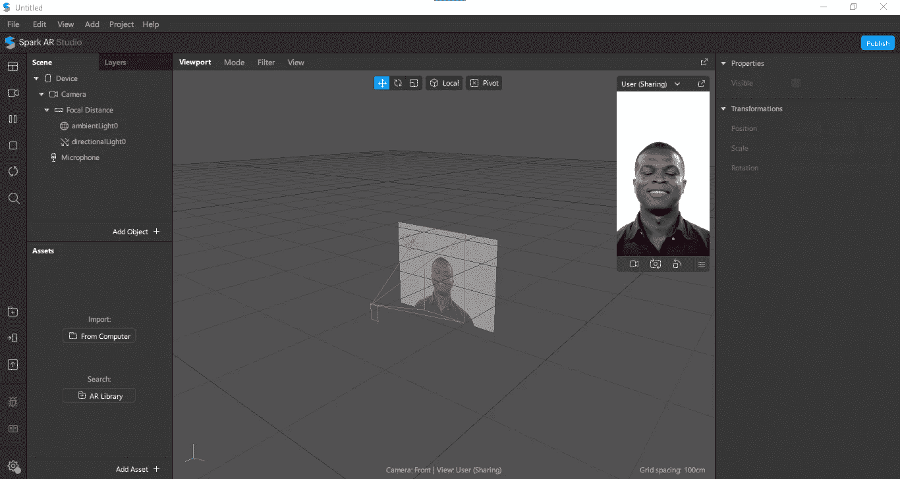
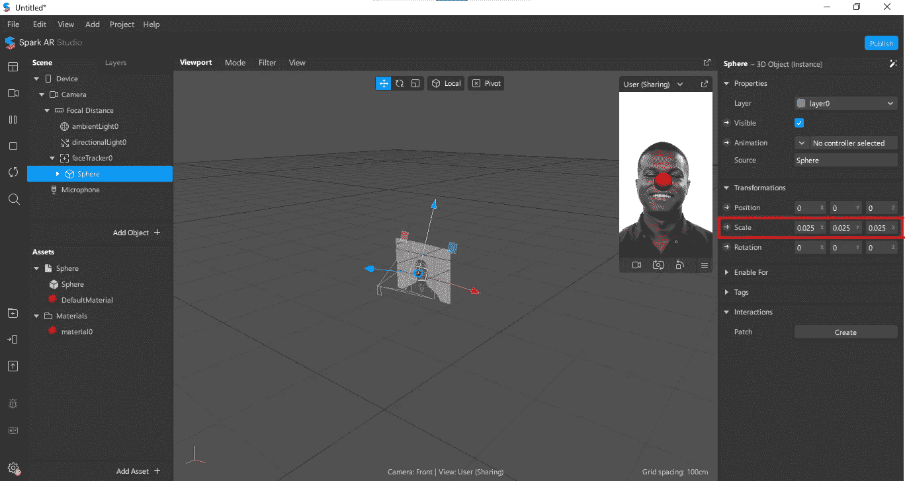
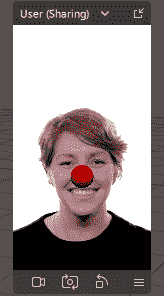

# 创建您自己的 Instagram 滤镜，并与世界分享。

> 原文：<https://levelup.gitconnected.com/create-your-own-instagram-filter-and-share-it-with-the-world-26702c427ea3>

## 构建您的第一个增强现实滤镜，并将其发布在 Instagram 上。

UNIBOA 在 [Unsplash](https://unsplash.com?utm_source=medium&utm_medium=referral) 上拍摄的照片

> 我对增强现实感到兴奋，因为与封闭世界的虚拟现实不同，增强现实允许个人存在于世界中，但有望改善目前正在发生的事情。
> 
> 苹果公司首席执行官蒂姆·库克。

上周，我在测试 Instagram 的一些功能，发现了一些令人惊叹的滤镜和效果。老实说，我知道这些过滤器存在很久了，但我从未亲自尝试过。在尝试了它们之后，我认为自己制作这些过滤器并向世界展示它们会很有趣。

我像往常一样用谷歌搜索了一些新东西。然后我意识到，这些滤镜使用增强现实(AR)来实时应用这些效果。你也可以做一些严肃的生意，通过做一些疯狂的事情来赚一些钱。但我不会在这个故事中谈论你的 AR 项目的货币化，因为我也是这个 AR 世界的新成员。

# AR 到底是什么？

AR 是增强现实的简称。通俗地说，就是将虚拟或数字物体置入现实世界的一种方式。从某种意义上来说，我们不是将物体放在现实世界中——它们是虚拟的，我们感觉不到它们，但我们可以通过相机的镜头看到它们。他们利用设备上可用的硬件来进行一些实时计算，使这些事情在飞行中发生。在某种程度上，这项技术节省了金钱和时间来可视化现实世界中的物理对象，而无需在现实世界中实际制作或购买该对象。

# 用 AR 有什么意义？

> 虚拟现实和增强现实将改变我们的购物方式。
> ~加来道雄，理论物理学家

AR 的一个漂亮实现是名为 [*Pokémon Go*](https://play.google.com/store/apps/details?id=com.nianticlabs.pokemongo&hl=en&gl=us) 的游戏。我记得在 2016 年推出时，它在互联网上掀起了风暴。它给视频游戏行业带来了一种新的沉浸感。不幸的是，它太受欢迎了，导致了它的衰落。但它证明了 AR 带来的一些重要的东西——更高水平的用户体验和沉浸感。

不仅仅是游戏，购物行业也能从这项技术中受益匪浅。想象一下，你正在试图购买口红，有 40 种颜色可供选择。没有试过，你不知道哪种颜色最适合你。但在 AR 的帮助下，你可以尝试每一种颜色并做出相应的选择，而无需实际应用。这种体验适用于你能买到的所有东西，比如衣服、鞋子、手表等等。

事实上，有一家叫做 [*Lenskart*](https://www.lenskart.com) 的公司，他们出售眼镜。在他们的移动应用程序中，你可以在购买镜架之前想象自己戴着镜架的样子。你也可以选择镜架的尺寸，检查它是否适合你的脸。

这些是 AR 的一些实现，当然还有很多其他的用途，它本身值得单独写一篇文章。可能现在已经很明显了，为什么它在当今的行业中如此流行。

# 让我们制作第一个 Instagram 滤镜

Spark AR 工作室

一个名为 Spark AR Studio 的软件让我们在 AR 中创建了许多令人惊叹的滤镜和效果。我们将使用这个特定的应用程序来创建我们的基本 ar 滤镜，并免费发布到 Instagram！ [**下载 Spark AR 工作室**](https://sparkar.facebook.com/ar-studio/download) 。

首先，我们可能需要登录我们的脸书帐户，因为这个程序是由脸书又名 Meta 所有。登录后，我们可以看到应用程序的主屏幕类似于上面的图像。从“体验”选项卡中选择空白项目卡。

迎接我们的将是一个空白的项目，以及播放一些演示视频的设备模拟。我们可以通过单击设备右下角的三个栏来更改设备。我们还可以通过单击摄像机图标并从可用视频中选择或捕捉网络摄像头来更改演示视频。

Spark AR 空白项目

现在我们可以从*场景*面板内的“**添加对象+** ”按钮添加任何类型的对象。单击该按钮将弹出另一个窗口，其中有各种选项，如面部追踪器、平面追踪器、手追踪器、3D 对象等等。这些选项非常简单明了，旁边还有文档。

出于我们的目的，我们将在场景中插入面部跟踪器对象，因为我们需要跟踪用户的面部。我们将通过右键单击**脸部追踪器对象**在脸部追踪器对象内添加另一个 3D 对象，选择**添加对象**和 **3D 对象**。然后，我们需要选择一个 obj 文件，其中包含我们的 3D 球体模型。3D 球体可以在 GitHub 存储库中获得——在*对象/球体*目录中。

 [## GitHub-ankan gab 101/Demo-AR-Filter

### 此时您不能执行该操作。您已使用另一个标签页或窗口登录。您已在另一个选项卡中注销，或者…

github.com](https://github.com/ankanbag101/Demo-AR-Filter) 

添加球体后，它可能对整个屏幕来说太大了，所以我们需要改变球体的比例。我们可以通过选择球体对象并从窗口右侧的属性中更改缩放选项来更改球体的比例。我发现将所有三个轴的比例设置为 **0.025** 看起来足够好了。我们也可以从*资产*面板中的球体对象资产内的**默认材质**的属性中将材质的颜色改为**红色**。

我们还可以检查球体是否沿着人脸移动。这是因为我们已经在面部追踪器对象中添加了对象，面部追踪器对象已经追踪了人的头部。最终结果将类似下图。 [**你也可以自己测试滤镜**](https://www.instagram.com/ar/660308295353911/?ch=NDAyMDQ5YTIyYmM3Yjg0ZjZhNDcyNGE0YzQ0ZDQzY2Q%3D) 。现在我们可以通过点击应用程序左下角的*发布图标*在 Instagram 上**发布**了。发布标准要求我们录制一段自己的短视频，然后专家团队将审查过滤器，它将提供给每个人使用，通常在一天内。

完成的项目

我们可以做很多比这更复杂的事情。使用 ***JavaScript*** 也可以编写脚本，用于开发一些复杂的特性和逻辑。**你可以从他们的** [**官方课程**](https://sparkar.facebookblueprint.com/student/catalog?locale=en) 中学到这一切。你也可以通过完成他们的 90 分钟 [**考试**](https://www.facebook.com/business/learn/certification/exams/700-101-exam) 获得脸书的专业证书。

# 最后的想法

创建 AR 体验从未如此简单。与世界分享它们会更有趣，你也会交到更多的朋友。使用 AR 增强了终端用户的产品体验。

> 尽管 AR 仍处于起步阶段，并没有很多开发人员在那里创造 AR 体验，所以潜力真的很大。