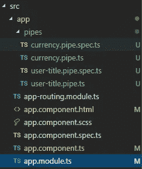
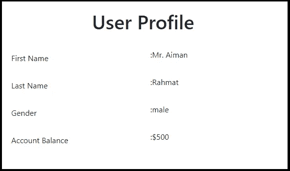

# 在 Angular 8 中创建自己的管道

> 原文：<https://levelup.gitconnected.com/create-your-own-pipe-in-angular-8-35f1f969ec49>

## 在 Angular 8 中构建自定义管道的指南


照片由[路易斯·托斯塔](https://unsplash.com/@luis_tosta?utm_source=medium&utm_medium=referral)在 [Unsplash](https://unsplash.com?utm_source=medium&utm_medium=referral) 上拍摄

# 什么是角管？

角管道是一种编写显示值转换的方法，可以在 HTML 模板中声明。

在 Angular 应用程序中，从后端接收到的数据通常不会提供给用户。例如，用户更喜欢看到简单的日期格式，如`January 22, 2020`，而不是原始的字符串格式`Wed Jan 22 2020 00:00:00 GMT-0800 (Pacific Daylight Time)` *。*

显然，数据在显示给用户之前需要一些修改。您可能认为数据的转换是样式。实际上，您可能想在 HTML 模板中应用它们，就像处理样式一样。这就是应用角管的地方。

在这个演示中，我们将在 Angular 8 中生成自定义管道。

# 创建新的角度应用程序

首先，运行以下命令创建一个新的应用程序，并导航到根文件夹。

```
ng new customPipe
cd customPipe
```

我们将在应用程序中使用 Bootstrap。可以参考这个[链接](https://medium.com/javascript-in-plain-english/build-angular-8-project-with-bootstrap-7b89775e5764)安装 Bootstrap。

# 生成角形管道

接下来，生成两个管道，分别叫做**current pipe**和 **UserTitlePipe** 。

对于`CurrencyPipe`，我们将在数字的开头添加一个美元符号，`UserTitlePipe`将用于添加“先生”或“小姐”，基于我们将发送给`UserTitlePipe`的参数性别。

运行这些命令，在名为 pipes 的文件夹中生成上述管道。

```
ng g pipe pipes/currency
ng g pipe pipes/user-title
```

这是应用程序的文件夹结构。



文件夹结构

# 修改角形管道

打开 currency.pipe.ts 和 user-title.pipe.ts 并添加下面的代码。

**货币管道**

```
import { Pipe, PipeTransform } from '@angular/core';@Pipe({
  name: 'currency'
})export class CurrencyPipe implements PipeTransform {
  transform(value: number): any {
    return "$" + value;
  }
}
```

您可以根据需要修改管道的名称，以便在 HTML 模板中使用。至于现在，我们先把它作为‘货币’保存。

**用户标题.管道. ts**

```
import { Pipe, PipeTransform } from '@angular/core';@Pipe({
  name: 'userTitle'
})export class UserTitlePipe implements PipeTransform {
  transform(name: string, gender: string): string {
    if (gender === 'male')
      return "Mr. " + name;
    else
      return "Miss " + name;
  }
}
```

这里，我们添加了另一个名为“性别”的参数作为比较值。

不要忘记更新 **app.module.ts** 如下。

```
import { BrowserModule } from '@angular/platform-browser';
import { NgModule } from '@angular/core';
import { AppRoutingModule } from './app-routing.module';
import { AppComponent } from './app.component';
import { ReactiveFormsModule } from "@angular/forms";
import { UserTitlePipe } from './pipes/user-title.pipe';
import { CurrencyPipe } from './pipes/currency.pipe';@NgModule({
 declarations: [
  AppComponent,
  UserTitlePipe,
  CurrencyPipe
 ],
 imports: [
  BrowserModule,
  AppRoutingModule,
  ReactiveFormsModule
 ],
 providers: [CurrencyPipe, UserTitlePipe],
 bootstrap: [AppComponent]
})
export class AppModule { }
```

# 应用角形管道

为了应用角形管道，我们将显示一个包含一些细节的用户配置文件——名字、姓氏、性别和帐户余额。

`UserTitlePipe`应用于名字，而 CurrencyPipe 应用于帐户余额。

**app.component.html**

```
<div class="container">
 <div class="row py-4">
  <div class="col text-center">
   <h1>User Profile</h1>
  </div>
 </div> <div class="row justify-content-center">
  <div class="col-md-6">
   <div class="form-group row">
    <label for="firstname" class="col-sm-6 col-form-label">First Name</label>
    <div class="col-sm-6">
     <p>:{{ user.firstname | userTitle:user.gender }}</p>
    </div>
   </div> <div class="form-group row">
    <label for="lastname" class="col-sm-6 col-form-label">Last Name</label>
    <div class="col-sm-6">
     <p>:{{ user.lastname }}</p>
    </div>
   </div> <div class="form-group row">
    <label for="gender" class="col-sm-6 col-form-label">Gender</label>
    <div class="col-sm-6">
     <p>:{{ user.gender }}</p>
    </div>
   </div> <div class="form-group row">
    <label for="balance" class="col-sm-6 col-form-label">Account Balance</label>
    <div class="col-sm-6">
     <p>:{{ user.balance | currency}}</p>
    </div>
   </div>
  </div>
 </div>
</div>
```

**app.component.ts**

```
import { Component, OnInit } from '@angular/core';
import { FormBuilder, FormGroup } from '@angular/forms';
import { CurrencyPipe } from './pipes/currency.pipe';
import { UserTitlePipe } from './pipes/user-title.pipe';@Component({
 selector: 'app-root',
 templateUrl: './app.component.html',
 styleUrls: ['./app.component.scss']
})export class AppComponent {
 title = 'customPipe';
 user = {
  firstname: 'Aiman',
  lastname: 'Rahmat',
  gender: 'male',
  balance: 500
 }; 
}
```

这是我们应用管道后的最终效果。



决赛成绩

# 结论

如果您想对应用程序中收到的原始数据进行一些修改，角形管道非常有用。将数据转换成用户喜欢看到的内容。

编码快乐！

# 资源

*   [棱角分明的文件](https://angular.io/guide/pipes)