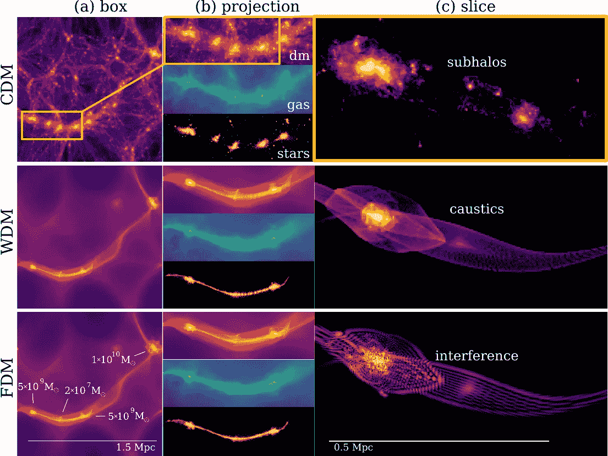

# 创建自己的量子力学模拟(使用 Python)

> 原文：<https://levelup.gitconnected.com/create-your-own-quantum-mechanics-simulation-with-python-51e215346798>

今天的娱乐编码练习，我们将看看**量子力学系统**，特别是*薛定谔-泊松*方程。我们将建立一个波函数在自然势下演化的模拟。这样的系统可能描述某些超流体/玻色-爱因斯坦凝聚体或奇异的暗物质。

你可以在 github 上找到附带的 [Python 代码。](https://github.com/pmocz/quantumspectral-python)

在开始之前，下面是运行我们的模拟看起来像什么的 gif:

## 薛定谔-泊松方程

我们将考虑薛定谔方程下波函数*ψ(****x****)*的演化:

波函数 *ψ* 用空间坐标 ***x*** 描述域中的量子场。对其进行归一化，使其空间平均值为 1:

在方程式中， *m* 是粒子质量，h-bar (ℏ)是简化的普朗克常数。

波函数感受到电势 *V，*的影响，在我们的例子中，我们假设它是由泊松方程给出的自然电势:

其中 *G* 为牛顿引力常数。这种方程组与量子波暗物质(也称为模糊暗物质)的研究相关。很容易实现各种其他势来研究不同的量子系统。例如，实现静态势，如[库仑势](https://en.wikipedia.org/wiki/Electric_potential#Electric_potential_due_to_a_point_charge)模拟氢原子。另一个例子是[量子谐振子](https://en.wikipedia.org/wiki/Quantum_harmonic_oscillator)。

在下面的讨论中，我们将通过假设一个具有以下单位的系统来保持符号的简单:

## 谱方法

*谱方法*使用快速傅立叶变换(FFT)算法将物理域 ***x*** 上的解转换成波的叠加，每个波由波数 ***k*** 描述。这种方法被证明对发展薛定谔方程和求解泊松方程特别有用。 [FFT](https://en.wikipedia.org/wiki/Fast_Fourier_transform) 的细节超出了我们今天的练习范围，但是该算法是一个常用工具，在许多编程语言中都有有效的实现，我们提供了一个关于它如何以及为什么有用的高级讨论。

FFT 变换波函数:

因此，将傅立叶变换应用于薛定谔方程将取代:

此外，它将改变梯度 **∇** 为:

这也是这个方法如此强大的部分原因。在傅立叶空间，求导变成了简单的向量乘法。多重数字很容易。

薛定谔方程中的拉普拉斯算子将因此转换为:

暂时忽略薛定谔方程中的势项，应用傅里叶变换，我们得到方程:

如果我们将时间离散成步长*δ*t*，那么，波函数的傅立叶变换可以用所谓的**漂移**算子从一个时间步长更新到下一个时间步长:*

**

*然后，我们可以使用逆 FFT 来恢复实空间中的波函数。*

**

*现在，我们如何应用势的效应呢？让我们考虑一下，这是薛定谔方程中唯一的一项:*

**

*这个方程中没有空间梯度。在这种情况下，我们不需要变换到傅立叶空间。我们可以雇佣所谓的 **kick** 操作员。要通过*半个*时间步长δ*t*/2 来更新解决方案，我们可以执行以下操作:*

**

*我们将用来完全演化波函数的完整方案将是**反冲-漂移-反冲**方案，它包括应用半步反冲，接着是全步漂移，接着是另一个半步反冲。这只是 kick 和 drift 运算符的一种可能组合，它提供了二阶精度。让人联想到我们 [*N 体教程*](https://medium.com/swlh/create-your-own-n-body-simulation-with-python-f417234885e9) 中使用的 kick-drift-kick 算法。操作符的其他组合也是可能的，具有不同的精度水平。*

*为了能够应用“踢”，需要解决的是势的泊松方程。幸运的是，我们可以再次使用傅立叶变换方法来求解这个方程。应用傅立叶变换，泊松方程变为:*

**

*给定波函数 *ψ* 和波矢 ***k*** *，这很容易解决。*我会注意到我们之前已经求解过泊松方程，在我们的 [PIC 等离子体模拟教程](https://medium.com/swlh/create-your-own-plasma-pic-simulation-with-python-39145c66578b)中。然而，在这个例子中，我们采用了二阶有限差分法。谱方法是优越的，因为它具有指数精度，只要周期域上的所有相关波数都是可分辨的。*

*我们现在需要将上述所有内容付诸实践。在我们的例子中，我们将考虑一个周期域上的 2D 系统。修改 1D 或 3D 应用程序的代码非常简单。*

*在 Python 中，我们可以为波向量***【k=(kₓ,kᵧ】***构造一个矩阵，如下所示:*

*然后，可以如下实施“反冲-漂移-反冲”方案，在需要时应用 FFT。请注意，在反冲步骤之后，需要重新计算电位，以便进行下一次“反冲”。*

*最终结果非常简单和简短。这个算法背后有很多理论，我们还没有详细介绍。但我希望这展示了使用 FFT 求解微分方程的能力。FFT 的一个限制是它假设了一个周期域，其他边界条件将需要对该方法进行进一步的修改。*

## *输入条件*

*我们的模拟只是将一些随机的高斯形状的超密度放在一个周期性的 2D 盒中，让它在自引力下演化。这些结构通过重力相互吸引，并表现出波状波动。*

*运行该代码可让您实时可视化模拟，并生成波函数的振幅和相位图:*

**

*计算天体物理学家使用这种类型的模拟来模拟被称为“模糊暗物质”的奇异物质，这是一种假设，即宇宙中神秘的暗物质粒子是超轻的(即质量比电子小得多)。*

*对于模糊暗物质晕的 3D 模拟可视化，请查看以下视频:*

*天文学家和物理学家还不知道暗物质是什么，但他们可以用不同的模型模拟宇宙，并与观测结果进行比较。下图显示了在[冷暗物质(CDM)模型下演化的年轻宇宙与暖暗物质(WDM)和模糊暗物质](https://www.nature.com/articles/s41550-019-0947-0?error=cookies_not_supported&code=8c081490-d3e7-449e-ac06-e1e1ab685b31) (FDM)的对比:*

**

*为我们的薛定谔-泊松解算器下载 github 上的 [Python 代码，以实时可视化模拟并处理初始条件。尽情享受吧！](https://github.com/pmocz/quantumspectral-python)*