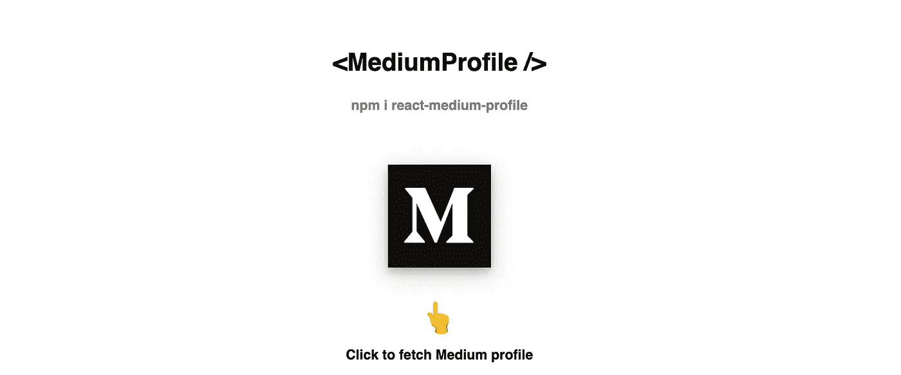
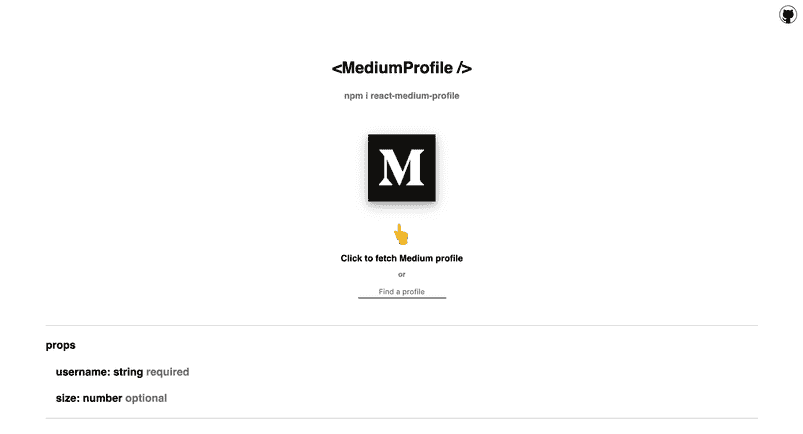
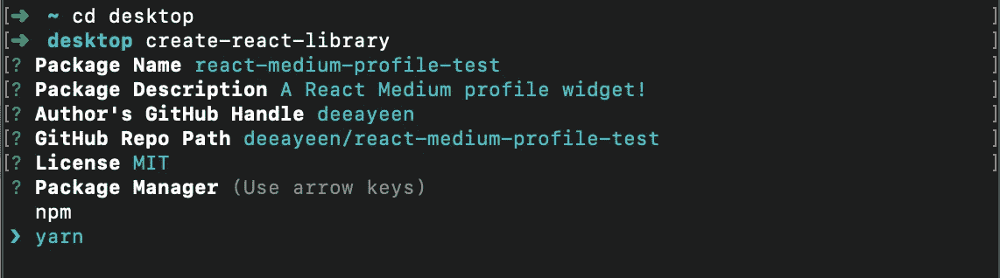
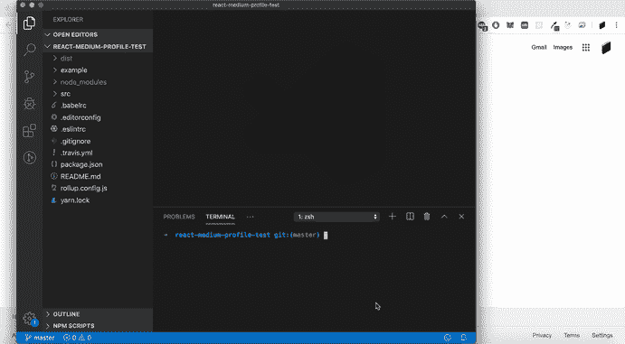
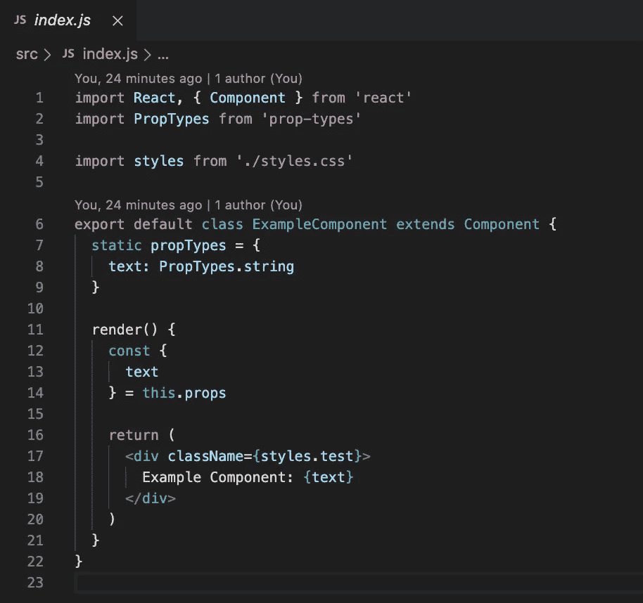
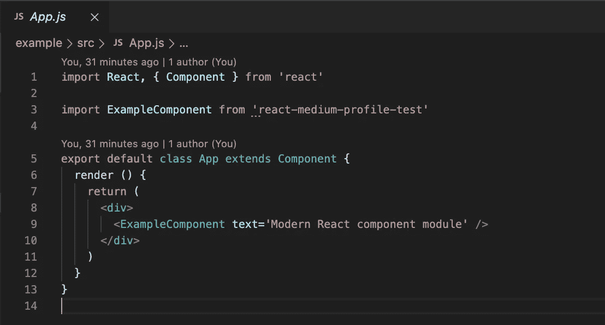
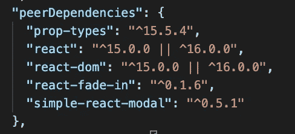
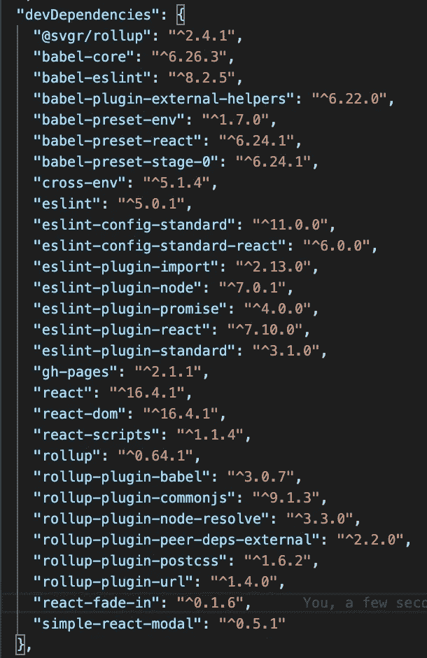

# 2020 年创建自己的 React 库:一步一步来

> 原文：<https://levelup.gitconnected.com/create-your-own-react-library-in-2020-step-by-step-7c39eb1b2d7b>

## 将您的 React 组件发布到 NPM



2020 在我 React 职业生涯的大部分时间里，我的主要目标是**开发应用程序。虽然我对建立自己的 NPM 图书馆很感兴趣，但它似乎遥不可及。**不是的。在 NPM 上发布一个其他开发人员可以使用的 React 组件是一个简单的过程，而且会有令人难以置信的回报。接下来的一年是扩展我们视野的好时机，看看我们如何利用我们的反应技能来回馈社区。****

# 我们将构建什么:



今天，我们将构建一个在 NPM 上发布的示例组件，一个简单的中型小部件。该组件将用户名作为道具，然后获取用户的最新活动。用户的故事和评论将以模态显示。

您可以将这个小工具插入您的网站，展示您的媒体故事。玩玩[演示](https://deeayeen.github.io/react-medium-profile/)并查找您的用户名，感受一下它是如何工作的。

# 我们将如何构建它:

多亏了简单的[创建-反应-库](https://www.npmjs.com/package/create-react-library)，这个过程基本上是自动化的。让我们一步一步地创建一个`<MediumProfile />`组件。

全局安装`create-react-library`:

```
npm install -g create-react-library
```

启动库:

```
create-react-library
```

系统将提示您输入以下详细信息:



使用默认模板

所有的东西都已经打包好了，随时可以给你。

第一步:`cd`进入项目并运行`npm start`。这将监视`src/`模块，并在您做出更改时将其重新编译成`dist/`。

第二步:打开第二个命令行，cd 到`/example`文件夹，运行`npm start`。

我们现在有了一个实时服务器来监视`src`或`example`中的变化，并实时重新加载，这样你就可以轻松地开发你的组件。

这些步骤应该是这样的:



我们将使用两个主要文件。
1:`src/index.js`2:`example/src/App.js`

第一个文件(src/index.js)是我们导出的组件，将被其他开发人员使用。

这个文件将包含一个组件，该组件将从用户接收道具并产生某种结果。

注意**我们检查收到的道具的类型**。例如，我们将允许用户传入一个“size”属性(一个数字),它将调整 Medium 按钮的大小。这意味着我们必须将`size: Proptypes.number`添加到我们的 proptypes 中。



src/index.js

第二个文件(example/src/App.js)是一个导入我们的组件的示例应用程序。

它将为组件提供支持并产生结果。这是将在我们的浏览器上运行的内容。



示例/src/App.js

现在我们已经有了我们需要的两个文件，我们可以开始在`src/index.js`中构建我们的组件。

我们的组件将简单地显示一个按钮，用户可以单击它来获取中级用户的活动。

单击后，会打开一个模式并显示提取的用户数据。添加一些错误检查和加载状态，我们就有了一个功能齐全的组件。

**为了利用外部包** ( [比如 react-simple-modal](https://www.npmjs.com/package/simple-react-modal) )我们必须将它们添加到我们的 package.json，**中，既作为** `**peerDependencies**` **又作为** `**devDependencies**`。将以下依赖项添加到主 package.json 中:

`"react-fade-in": "^0.1.6",
"simple-react-modal": "^0.5.1"`



现在只需从主目录中选择`yarn install`，再从主目录和示例目录中选择`npm start`。

我们现在可以在我们的组件中使用 [react-fade-in](https://www.npmjs.com/package/react-fade-in) 和 [simple-react-modal](https://www.npmjs.com/package/simple-react-modal) 包，当其他开发人员安装我们的包时，他们也会安装与之关联的`peerDependencies`。

太好了，现在我们可以实际构建我们的组件了。

我构建了一个 API 来获取中等用户的 RSS 提要，并将其托管在 Heroku 上。鉴于本文的范围，我将简单地让您将整个组件复制到`src/index.js`中，因为我们希望将重点放在**在 NPM** 上发布组件上。

将以下代码复制到`src/index.js`，替换之前的所有内容:

该按钮将是一个图像(medium.png ),因此继续从这里下载图像[,并将其放在`/src`文件夹中。](https://miro.medium.com/max/390/1*emiGsBgJu2KHWyjluhKXQw.png)

就是这样！现在转到`example/src/App.js`，用以下代码替换内容:

我们简单地从“react-medium-profile”导入了`MediumProfile`组件，为它提供了一个`username`道具，它现在可以获取我们的配置文件了。

# 发布到 NPM

这一部分再简单不过了。create-react-library 从您的`examples`文件夹中自动生成一个 GitHub pages 演示，并使用您的自述文件作为描述发布到 NPM。

确保您首先使用`npm login`登录到 NPM，然后运行:

`npm publish`:这将自动将您的包发布到 NPM

`npm run deploy`:这会自动将您的示例部署到 Github 页面

[在 Github 上查看我们的完整项目](https://github.com/deeayeen/react-medium-profile)

# 你做到了！

您已经成功发布了一个 React 包，其他开发人员现在可以将它集成到他们的项目中。

为开发者编写组件而不是为用户编写应用会让你接触到不同的思维方式。这是很好的实践，让你成为更强的程序员，也是回报开源社区的好方法。

一定要写一个带有一些 gif 的漂亮的自述文件，让你的包更有吸引力和直观，并添加一些关于可以传入哪些道具的说明。

就是这样！如果您正在寻找 2020 年的更多 React 提示，请查看如何在来年升级您的 React UX:

[](/master-ux-with-react-in-2020-four-ways-to-upgrade-your-react-app-user-experience-a053b3ffbf59) [## 2020 年 React 掌握 UX:升级 React 应用用户体验的四种方式

### 如果你的应用程序给用户良好的感觉，他们更有可能继续使用它。

levelup.gitconnected.com](/master-ux-with-react-in-2020-four-ways-to-upgrade-your-react-app-user-experience-a053b3ffbf59)