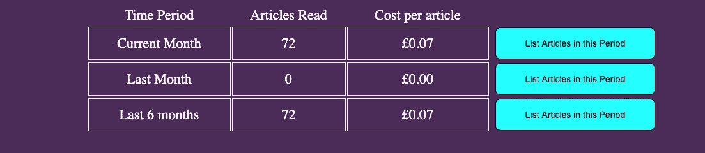
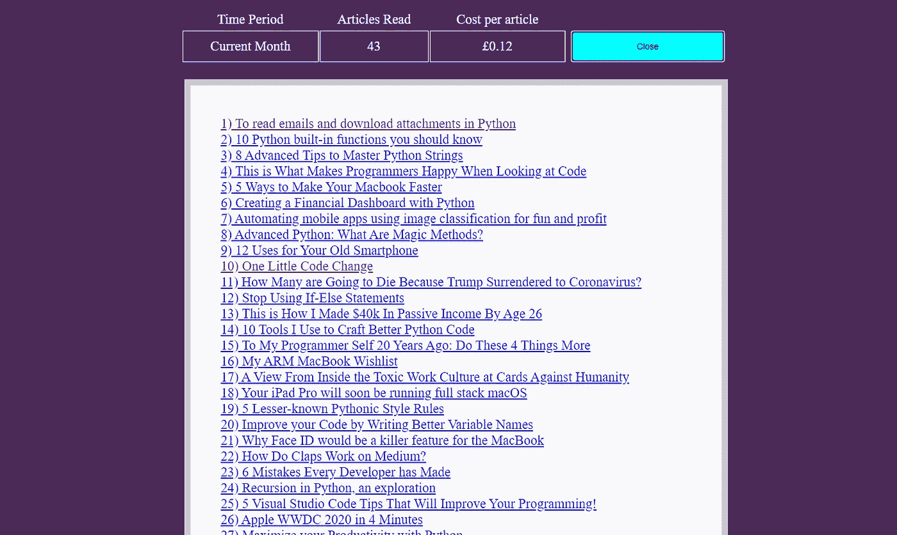
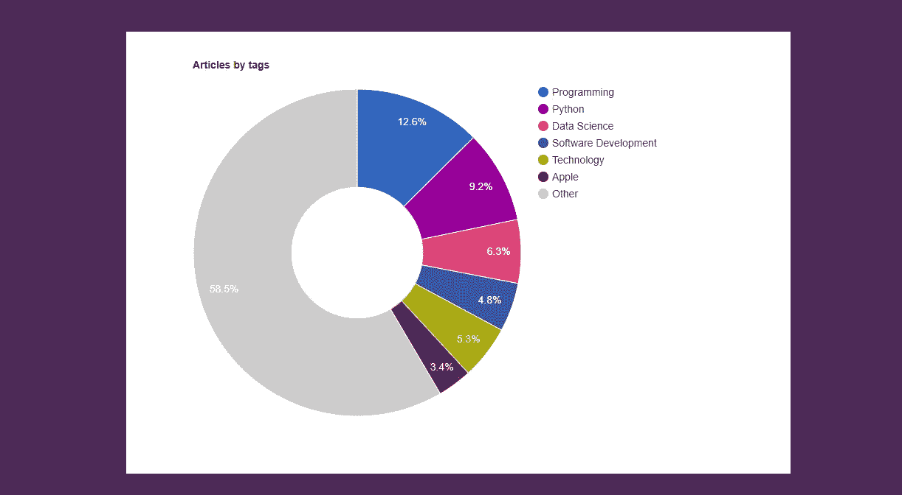
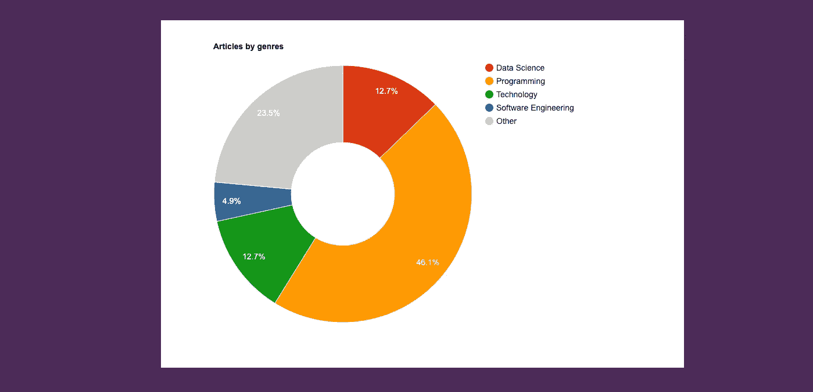

# 使用 Python 为 medium.com 创建自己的“阅读统计”页面

> 原文：<https://levelup.gitconnected.com/create-your-own-reading-stats-page-for-medium-com-using-python-4fcadef8baa7>

## 第 2 部分:呈现数据！


由[吉尔博特·易卜拉希米](https://unsplash.com/@jilburr?utm_source=unsplash&utm_medium=referral&utm_content=creditCopyText)在 [Unsplash](https://unsplash.com/s/photos/reading-stats?utm_source=unsplash&utm_medium=referral&utm_content=creditCopyText) 上拍摄的照片

本文是“使用 Python 为 medium.com 创建自己的‘阅读统计’页面”的第 2 部分。第一部分指出，你的媒体账户中的“统计”页面都是关于作者的，几乎没有为强迫性读者提供任何有用的统计数据(或者只是那些过着量化生活的人！)，所以我想出了一个系统来捕捉和呈现我自己的统计数据。第 1 部分主要关注 python 脚本，该脚本提取关于每个故事的信息，并将其保存到数据库中。这一部分将研究用于呈现静态数据的 html(通过 python 脚本实现的 albiet)。在这里阅读第 1 部分:

[](https://medium.com/the-innovation/where-are-the-medium-reading-stats-228b470bd9bd) [## 为什么 Medium 不为我们提供阅读统计？

### 第 1 部分:我决定用 Python 制作我自己的，如果你对这个网站很认真的话，你也需要这样做！

medium.com](https://medium.com/the-innovation/where-are-the-medium-reading-stats-228b470bd9bd) 

# 结构化数据

在第 1 部分详细介绍的脚本的基础上，我们继续讨论一个函数，该函数接收 SQL 查询的结果，并以一种可以在脚本中轻松转换成图形信息的形式组织这些数据。当引用每个结果时，数组位置对应于数据库中的列。

为操作准备好图表信息

如果您想要生成图形，Counter()函数是完美的工具。它接受一个列表，并统计每个唯一项目的出现次数。所以在我们的例子中，我们给它一个标签列表，可能看起来像这样:`['Programming', 'Software Development', 'Programming', Software Development', 'Software Development', 'Technology']`。然后它返回一个类似这样的字典:`{'Software Development:3, 'Programming':2, 'Technology':1}`。

我们在这里调用 getChartInfo()函数(日期变量在第 1 部分中定义)，所以我们现在有了当前月份的一部分、上个月和最近 6 个整月的图表数据:

```
cursor.execute('SELECT * FROM readArticles WHERE month = {} AND year = {}'.format(date.month, date.year))
currentMonth = getChartInfo(cursor.fetchall())
cursor.execute('SELECT * FROM readArticles WHERE month = {} AND year = {}'.format(date.month-1, date.year))
lastMonth = getChartInfo(cursor.fetchall())
cursor.execute('SELECT * FROM readArticles WHERE (month BETWEEN {} AND {}) AND year = {}'.format(date.month-6, date.month, date.year))
lastSixMonths = getChartInfo(cursor.fetchall())
```

在我们开始编写 html 文档之前，最后一点代码只是计算出整个 medium.com 成员长度的一些统计数据。我们在数据库中查询总共有多少行，计算我们的会员资格保持了多少个月，并计算出每篇文章的成本。(我们将展示的许多数据没有意义，因为我才成为会员一个月。因此，所有的时间统计都与“当前月”的统计相同，也与“过去 6 个月”的统计相同，但这将随着时间的推移而改变！)

# 展示数据

我们继续写 html 文件，这将包含所有的内联 CSS，JavaScript 和 HTML 标签作为一个大字符串，我们不断追加。我们称这个变量为`html`。在脚本的最后，我们将把这个字符串转储到一个文件中，并直接上传到我们的 web 主机。首先要注意的是`<head>`中的`<script>`标签，在这里我们声明了一些我们将要使用的外部 JavaScript。`[www.gstatic.com/charts/loader.js](http://www.gstatic.com/charts/loader.js)`指向 google 的可视化图表库。

当我查看统计页面的显示图表时，我发现有很多第三方库可用，但它们似乎要么很贵，要么很复杂。谷歌的可视化是免费的，易于实现，并有很好的文档。这是我在编写饼状图时跟随的教程页面。

接下来，我们定义一个 JavaScript 函数来处理一些按钮的点击。它找到按钮嵌套在其中的`div`，然后在列表中找到下面的`div`，并将其定义为 moreinfo `div`，这最初被设置为隐藏(或 style.display = "none ")，按钮将显示样式更改为内联。第一次按下后，每次按下按钮，`div`的显示值和按钮上的文本都会切换。这个隐藏的`div`将包含一个链接到 medium.com 故事的文章列表。

你会看到`<div id="daysChart">`是一个空的`div`，但是在脚本的后面会填充一个 google 图表。在插入总体统计数据后，我们设置了一个带有一些标题的表格，表格的其余部分将在下一个函数中填充。

我们从前面看过的`getChartInfo()`函数传入一些计算出的统计数据，并将它们放入表的行中。最后一列项目是一个按钮。

这是该表在站点上的外观，然后是扩展视图。



汇总统计表



扩展视图

# 画图表

好了，接下来是有趣的部分！我们为图表设置了几个空的`div`容器，然后我们定义了一个绘制图表的函数。它接受我们的`Counter()`字典和一个图表名称字符串。我们使用这个字符串来定位正确的`div`，并在每个图表的标签中使用它。

随着越来越多的文章被添加到我的阅读数据库中，饼状图变得不那么有用了，尤其是“标签”图，因为每篇文章可以有多达 5 个标签，所以图表被分成数百个部分，这在视觉上不是很令人愉快。我将`sliceVisibilityThreshold`变量添加到每个饼图的选项中，将低于某个阈值的所有切片聚集到“其他”部分，这确实清理了数据。我们还将 pieHole 变量添加到 options 字典中，这将饼图变成了一个 polo mint，这(至少在我看来)似乎使数据更容易阅读。

这是统计页面上的图形外观



标签



类型

该脚本做的最后一件事是将 html 字符串写入文件并上传到我们的 web 主机。这个项目花了几天时间来编写，但是通过 SFTP 协议将文件上传到服务器花费了大量的时间。现在我明白了，我写了一个一步一步的指南来帮助你快速到达那里。

[](https://medium.com/@richquinn2/communicate-with-a-server-via-sftp-using-python-801a71077ef0) [## 使用 Python 通过 SFTP 与服务器通信

### 复杂过程的逐步指南

medium.com](https://medium.com/@richquinn2/communicate-with-a-server-via-sftp-using-python-801a71077ef0) 

我想做一些改进:

1.  这个月每天阅读的文章数量在月初看起来会很奇怪，因为脚本运行的每一天只有一个条形。因此，我计划生成一个条形图，其中每个月的每一天都有一个条形图，默认值为零，当数据可用时会被覆盖。
2.  我记得目前脚本是手动运行的。我计划设置某种任务调度程序，每天早上自动运行脚本。
3.  “*作者*”图表目前没有用，因为我意识到我不倾向于阅读同一作者的几篇文章。这可能会被删除，以利于更有用的东西。
4.  一旦我完成了数字 1 和 2，我可以添加一些与一周中的日子相关的统计数据。我甚至可以按一周中的某一天为“T8”文章绘制图表，看看每月的哪一天是我阅读频率最高的日子。
5.  看看一些免费的数据仪表板在线工具。

非常感谢你阅读这篇文章，我希望你会觉得有趣。如果你想在[实时看到我的统计页面，就在这里！](http://richquinn.co.uk/medium_reading_stats.html)