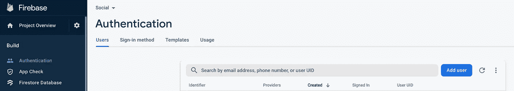
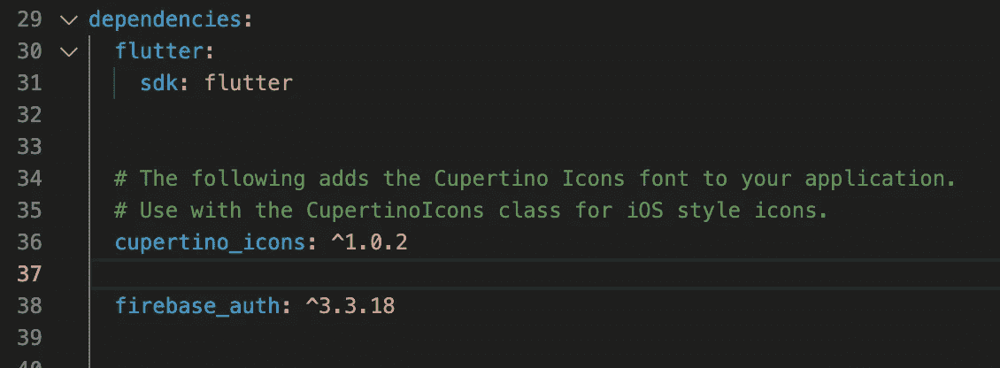
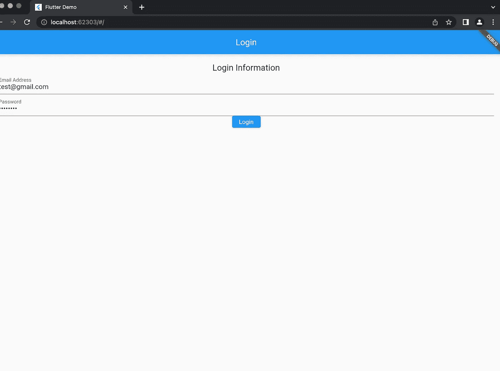
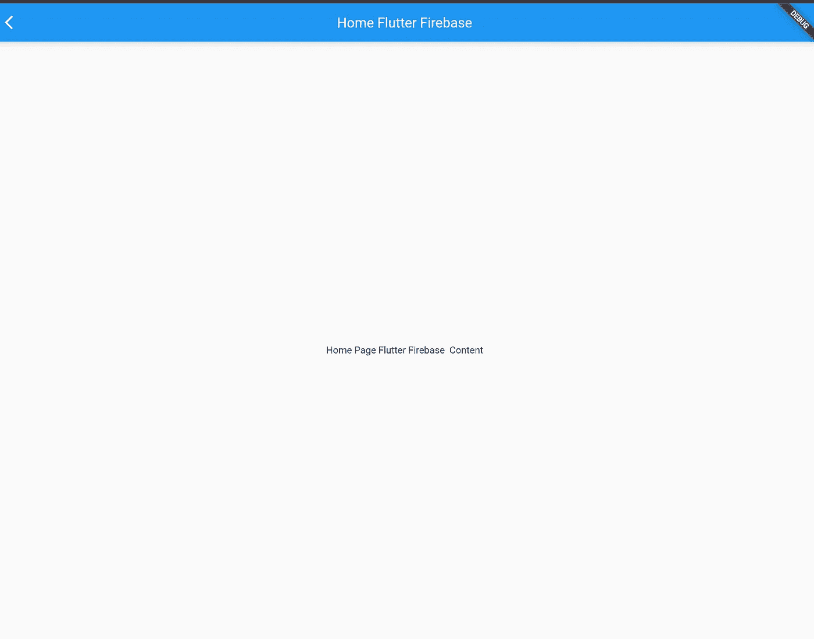

# 使用 Flutter 创建一个基本的登录应用程序

> 原文：<https://levelup.gitconnected.com/creating-a-basic-login-app-using-flutter-2493bba87263>

Flutter 基于 Dart。它允许开发 web、ios、android 和桌面应用程序。我绝不是专业的 flutter 开发者，我只是刚刚开始学习。在本文中，我要做的就是用 Firebase 和 Flutter (firebase_auth，firebase_core 和素材库)创建一个非常基础的登录 app。

首先下载颤振去这里:[https://docs.flutter.dev/get-started/install/](https://docs.flutter.dev/get-started/install/macos)

下载完成后，在您的终端中使用下面的命令创建一个文件夹。

```
flutter create
```

你还需要创建一个 firebase 项目:你可以在这里做:【https://console.firebase.google.com/

一旦创建了 firebase 项目，就可以进行身份验证并创建一些测试用户。



运行这里找到的安装命令，在你的项目文件夹中获得必要的 firebase 依赖项:【https://firebase.google.com/docs/flutter/setup?authuser=0】T4&HL = en&platform = IOs # available-plugins。确保登录到 firebase，以便连接到正确的 firebase 项目。接下来安装 firebase _ auth[https://pub.dev/packages/firebase_auth/install](https://pub.dev/packages/firebase_auth/install)。这应该会将包作为一行添加到您的 pubspec.yaml 文件中。



我们将创建三个文件:main.dart、home.dart 和 login_page.dart。

# 主.镖

在 lib 中应该有一个名为 main.dart 的文件。在这个文件中，我们将初始化我们的应用程序。

```
import 'package:flutter/material.dart';import 'package:firebase_auth/firebase_auth.dart';import 'package:firebase_core/firebase_core.dart';import 'firebase_options.dart'; // the file generated by initializing firebase in your project directoryimport 'login_page.dart'; // we'll be adding this file afterFuture<void> main() async {
await Firebase.initializeApp(options: DefaultFirebaseOptions.currentPlatform,); // connect to firebaserunApp(App());  // run app}// the ui of the appclass App extends StatelessWidget {@overrideWidget build(BuildContext context) {return MaterialApp(title: 'Flutter Demo',theme: ThemeData(primarySwatch: Colors.blue,),home: LoginPage(),);}}
```

# **登录 Page.dart**

下面的登录页面代码将使用一个名为“Form”的小部件。当这个表单被提交(通过按提升的按钮部件)时，将运行一个名为“onPressed”的异步函数。当被触发时，该功能将通过 firebase 验证电子邮件和密码是否正确，然后使用导航器将用户推至主页。

```
import 'package:flutter/material.dart';import 'home.dart';import 'package:firebase_auth/firebase_auth.dart';class LoginPage extends StatefulWidget {@override_LoginPageState createState() => _LoginPageState();}class _LoginPageState extends State<LoginPage>{final _formKey = GlobalKey<FormState>();String? _password='';String? _email='';@overrideWidget build(BuildContext context){return Scaffold(appBar:AppBar(title:Text('Login'),),body: Container(padding: EdgeInsets.all(20.0),child: Form(key: _formKey, // for validating the fieldschild: Column(//set passwordchildren: <Widget>[Text('Login Information',style: TextStyle(fontSize: 20),),TextFormField(onSaved: (value) => _email= value,keyboardType: TextInputType.emailAddress,decoration: InputDecoration(labelText: "Email Address")),TextFormField(onSaved: (value) => _password=value.toString(),obscureText: true,decoration: InputDecoration(labelText: "Password")),ElevatedButton(child: Text("Login"), onPressed: () async{final form = _formKey.currentState;print('form: $_formKey');if(form != null && _email != null && _password != null){form.save();if (form.validate()){try {var result = await FirebaseAuth.instance.signInWithEmailAndPassword(email: _email.toString(), password: _password.toString());Navigator.push(context,MaterialPageRoute(builder: (context) => HomePage()),);}  catch (e) {print("error");}}}}),],),),),);}}
```

# Home.dart

这是一个基本的主页。

```
import 'package:flutter/material.dart';class HomePage extends StatefulWidget {@override_HomePageState createState() => _HomePageState();}class _HomePageState extends State<HomePage> {@overrideWidget build(BuildContext context) {return  Scaffold(appBar: AppBar(title: Text("Home Flutter Firebase"),//actions: <Widget>[LogoutButton()],),body: Center(child: Text('Home Page Flutter Firebase  Content'),),);}}
```

创建完这三个文件后，您可以运行

```
flutter run
```

您应该会看到登录屏幕。输入之前创建的测试帐户，然后登录。



搞定了。