# 创建一个基本的 Rails CRUD 应用程序

> 原文：<https://levelup.gitconnected.com/creating-a-basic-rails-crud-app-8720a53f0158>


保罗·贾维斯摄影(Unsplash)

在本教程中，我们将在本地服务器上运行一个 Ruby on Rails CRUD 应用程序，实现 RESTful 约定。对于本指南，我们想要创建一个课程注册应用程序。让我们从规划我们的模型开始。

作为学生，我们希望能够注册许多课程。但是一个课程也可以有很多学生。我们有一个多对多的关系，这需要一个 joiner 模型。我们称这个加入者为注册模型。对于这个应用程序，我们将保持这三个模型。

学生- < Enrollment > -课程

# 可交付成果

在生成我们的模型和控制器之前，让我们讨论一下这个应用程序的可交付成果或目标。

1.显示数据库中的所有学生。

2.在索引中添加新学生。

3.为每个学生准备一个展示页面。

4.在显示页面中，将显示与学生相关联的课程。

5.在显示页面中，我们能够更新或删除特定的学生。

6.通过创建新注册，使用`form_for`和`collection_select`注册新课程的能力。

7.能够通过删除注册来取消课程。

# 设置

首先，让我们生成一个 rails 应用程序。

```
rails new course_app
```

让我们创建我们的模型和每个模型的控制器。对于`Student`模型，我们将需要`name`和`age`属性。对于`Course`型号，`name`属性。对于`Enrollment`型号，`student_id`和`course_id`属性。

**生成模型**

```
rails g model Student name:string age:integerrails g model Course name:stringrails g model Enrollment student_id:integer course_id:integer
```

**生成控制器**

当生成我们的控制器时，我们不一定需要所有的路线。对于学生控制器，我们需要所有 RESTful 路径。登记控制器将需要一条`new`、`create`和`destroy`路线。索引可能不是必要的，但我们会包括它，以防万一，以及包括它的课程控制器。

```
rails g controller students index new create show edit update destroyrails g controller courses indexrails g controller enrollments index new create destroy
```

使用`rails g controller`也可以创建每条路线的视图。在这种情况下，我们不需要`create`、`update`或`destroy` erb 文件。请随意移除它们。现在让我们迁移和播种我们的数据库。

```
rails db:migraterails db:seed
```

# 路线

`rails g controller`还为应用程序创建路线。但是我们会把它们全部去掉，实施我们自己的路线。我们将需要学生的所有路线，但只需要注册的`new`、`create`和`destroy`路线。

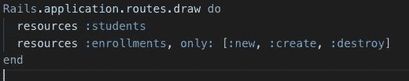

配置-> routes.rb

# 联合

让我们在每个模型中设置关联，并向学生模型添加验证。

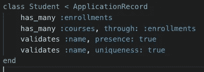

学生模型

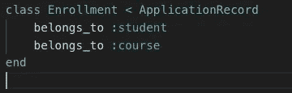

招生模式

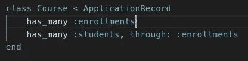

课程模型

# 学生控制器

让我们从建立我们的学生索引页面开始。在我们的学生控制器中，添加以下内容:

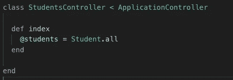

学生控制器

我们将所有学生的集合存储在变量`@students`中，该变量可在学生视图页面`index.html.erb`中访问。

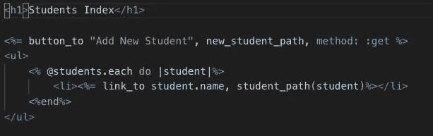

学生索引页面

在学生索引页面中，我们正在访问`@students`变量并遍历它。对于每个 student 实例，我们都创建了一个`link_to`，它将我们导向 student 实例的显示页面。同时，我们加入了一个`button_to`，它有三个参数，按钮的文本，它指向的路径，以及方法的类型。`button_to`将把我们引向学生控制器`new`方法，它将创建一个学生的新实例并呈现新的学生表单。现在，我们没有这些方法或途径。

在我们的学生控制器中，我们将添加`new`和`create`方法。

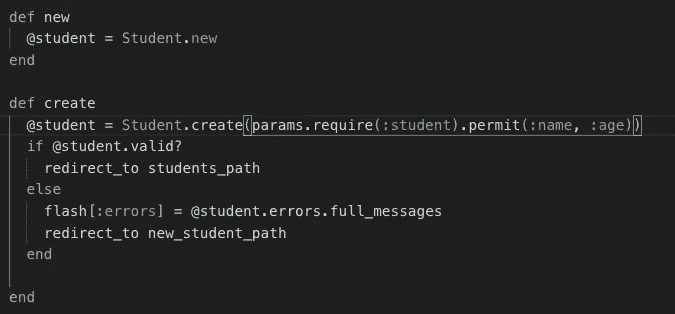

学生控制器

`new`方法将实例化一个学生的实例，并将其存储在一个变量中。学生视图，`new.html.erb`将呈现对该变量的访问。

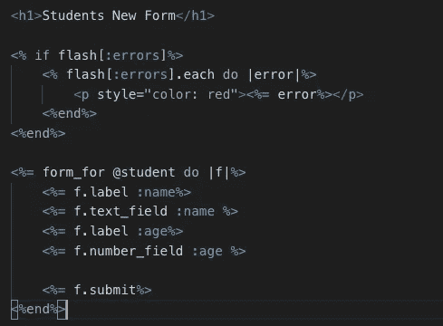

学生新页面

让我们来关注一下`form_for`。它采用从`new`方法创建的变量。提交后，我们将被定向到学生控制器的`create`方法。在这个方法中发生了几个动作。首先，根据表单提供的参数创建学生实例，并存储在一个变量中。我们允许这些字段被接受。

因为我们在学生模型中定义了验证，所以我们可以检查变量是否通过了提供的验证。如果是，我们将被重定向到学生索引页面。否则，我们希望返回到表单。但我们也想传递我们回到形式的原因。我们将利用`flash[:errors]`并将其设置为等于`@student.errors.full_messages`，这是一个未通过验证的数组。当重定向回新页面时，`flash[:errors`将被呈现，如果它们存在的话。

在学生控制器中，我们添加了一个 show 方法，我们需要找到与参数`id`相关联的学生，并将其存储在一个变量中。

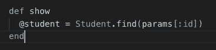

学生管理员

在学生视图的`show.html.erb`中，我们访问同一个变量来提取学生实例的特定信息。同时，我们还为“注册课程”实现了`button_to`，它将链接到新的注册表单，“编辑学生”，它将链接到编辑学生方法，“销毁学生”，它将链接到销毁学生方法。

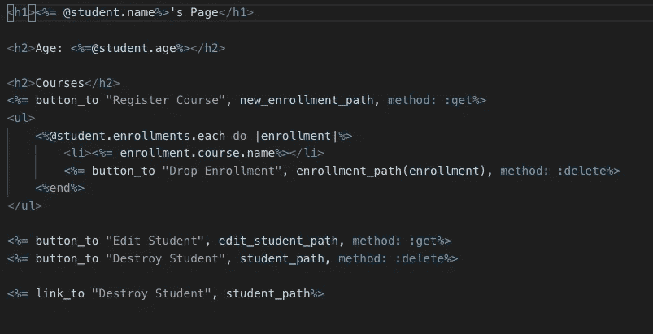

学生展示页面

ActiveRecord 关联也在这里用来显示属于学生的注册和它所属的课程。还创建了删除注册的选项，该选项链接到注册控制器中的销毁注册方法。

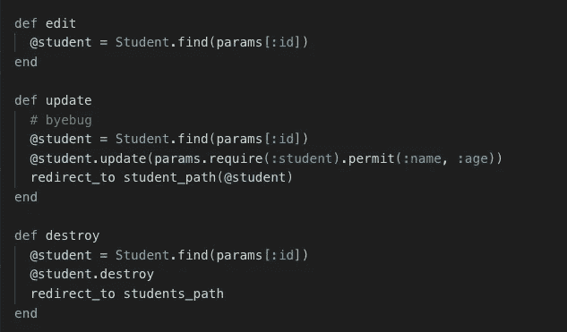

学生管理员

在学生控制器中，我们将创建`edit`、`update`和`destroy`方法。对于这三种方法，我们需要找到与参数 id 相关联的学生。在更新方法中，我们利用 ActiveRecord 方法`update`从表单中获取参数。在`destroy`中，我们利用 ActiveRecord 方法`destroy`从数据库中删除实例。

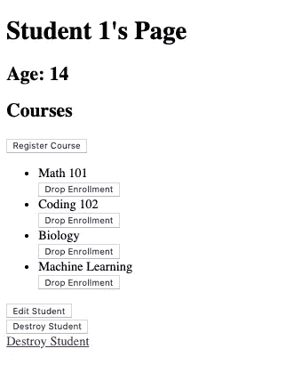

为学生显示页面

目前，这是我们的学生实例的`show`页面看起来的样子。我们仍然需要实现新的注册表单来允许注册。让我们为注册控制器创建必要的方法。

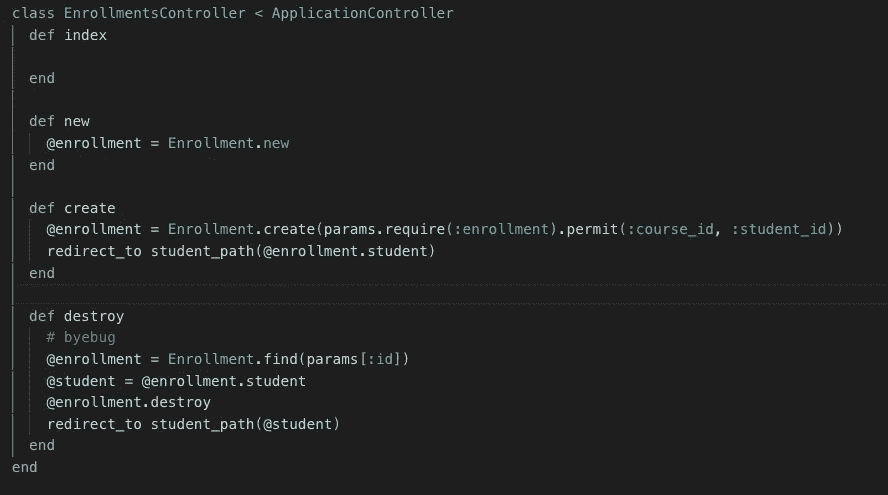

注册控制器

让我们也为注册视图创建显示页面。

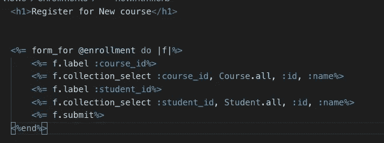

注册新表单

对于`form_for`注册，我们将为`student_id`和`course_id`字段实现`collection_select`。在这种情况下没有实现验证，所以一旦表单被提交，它将总是有效的。注册创建后，我们希望返回到学生所属的注册。

同样，当取消学生的注册或放弃某门课程时，我们希望被重定向回该学生的页面。在销毁注册实例之前，我们将注册的学生存储到一个变量中，并重定向到该变量。

在本指南中，我们不会重点介绍新课程的创建、更新或删除。在很大程度上，我们已经构建了 CRUD 应用程序的核心基础。我们能够通过验证和注册来创建新学生。我们可以通过索引和显示页面来读取学生的信息以及他们的注册情况。我们能够通过验证来更新学生的信息。我们也能够摧毁学生和注册。如果您已经做到了这一步，请随时向本课程应用程序添加更多功能！

关于 Restful 路由指南，请参考 Restular。

 [## 再结晶的

### 编辑描述

www.restular.com](http://www.restular.com/) 

如果你想派生它而不是从头开始，也可以参考我的知识库。

 [## reireynoso/课程-应用程序-rails-讲座

### 学生-课程学生有许多注册，学生有许多课程通过注册课程有许多…

github.com](https://github.com/reireynoso/course-app-rails-lecture) [](https://skilled.dev) [## 编写面试问题

### 一个完整的平台，在这里我会教你找到下一份工作所需的一切，以及…

技术开发](https://skilled.dev)