# 从头开始创建区块链

> 原文：<https://levelup.gitconnected.com/creating-a-blockchain-from-scratch-9a7b123e1f3e>

## 这项突破性技术背后的关键概念，以及您如何自己构建一个

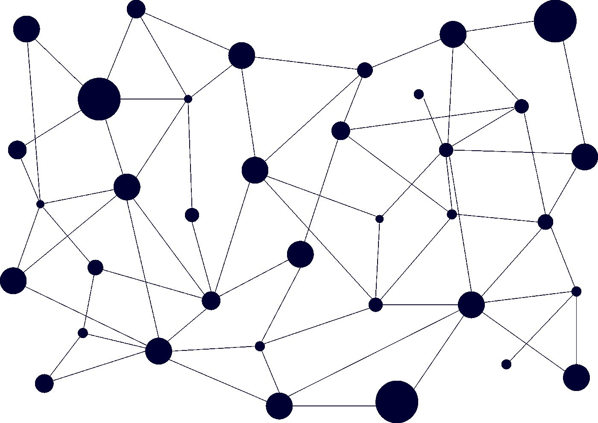

# 什么？

在本文中，我们将分析区块链技术背后的关键概念。我们将一起了解区块链的内部工作原理，并探索如何通过分布式服务器网络公开存储信息。

# 怎么会？

这将通过从头构建一个简单的区块链来完成。我们将介绍创建区块链的基本步骤，我将添加一些代码片段来帮助您理解 Python 编程语言。然而，每一步都将被很好地记录下来，所以你可以用任何你觉得舒服的语言跟随。

本文中使用的源代码可以在:[https://github.com/jzsiggy/blockchain-from-scratch](https://github.com/jzsiggy/blockchain-from-scratch)找到

# 第一章:区块链有什么大不了？

区块链在今天的市场上越来越受欢迎。亚马逊、微软、谷歌和其他大公司已经在设计提供区块链技术的服务。许多人经常将区块链与比特币等加密货币联系在一起，但很多时候，情况并非如此。

现在，你可能会问自己，为什么区块链会得到这么多关注。有什么大不了的？

这就是交易——区块链允许我们创建安全、公开、分散的“数据库”来存储任何类型的信息。在区块链之前，大量数据**需要通过某种形式的中间人或中介来存储和验证。**

就金融数据而言，中介是银行。我们依靠银行来跟踪我们所有的财务数据，我们相信他们不会篡改我们的数据或以任何方式滥用它。这种方法是可行的，但是这些机构掌握了很大的权力。

区块链技术的核心思想是使用密码术和复杂的计算机算法来创建一种安全和透明的方法，以消除这些中介，允许数据被一个巨大的开放服务器网络存储和验证。

让我们开始吧，我们会明白怎么做的！

# 第 2 章:数据是如何存储的？

> 什么是街区？

在我们开始之前，让我快速解释一下**哈希函数**。他们对我们区块链的工作非常非常重要！

哈希函数接收任意长度的字符串作为输入，并返回一个固定长度的字符串，该字符串看起来非常随机，但实际上并非如此。每个字符串都有自己的输出哈希，这总是相同的。

字符串“Hello world”的哈希如下所示:

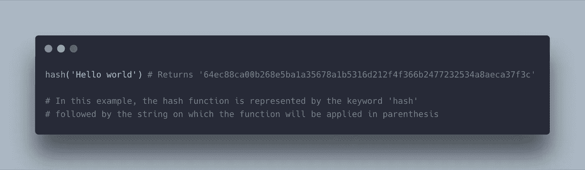

应用于字符串“Hello world”的 SHA256 哈希函数

需要注意的是，即使对输入字符串的微小改变也会完全改变输出。例如:

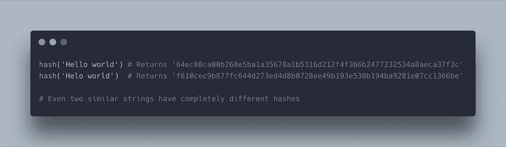

比较相似字符串的哈希值

好吧！现在让我们开始吧！

## 街区里有什么？

区块链中的单个块存储写入其中的数据、前一个块的哈希以及它自己的哈希。

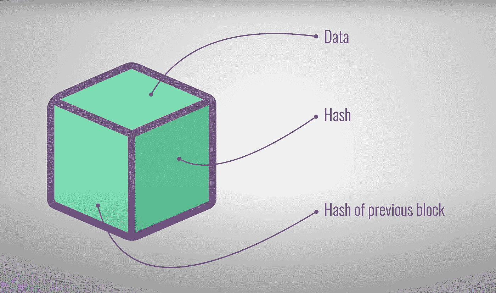

[https://www.youtube.com/watch?v=SSo_EIwHSd4&t = 328s](https://www.youtube.com/watch?v=SSo_EIwHSd4&t=328s)——
简单解释——sav JEE

数据一旦写入数据块，就很难更改，因为写入区块链的每个数据块都会引用其前一个数据块的哈希。这样，即使您只是稍微修改了一个块，它的哈希也会完全改变，因此下一个块也必须改变，因为它必须具有前一个块的哈希，后续块也是如此。如果你修改了区块链的任何一个块，你必须重写整个链。

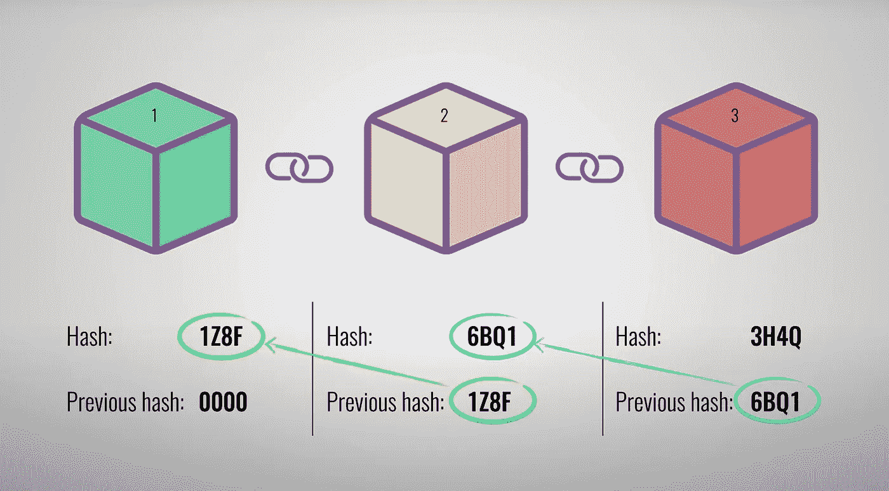

[https://www.youtube.com/watch?v=SSo_EIwHSd4&t = 328s](https://www.youtube.com/watch?v=SSo_EIwHSd4&t=328s)——
简单解释——sav JEE

当我们将这种逻辑转换成代码时，在 Python 中，块的数据结构看起来像这样(直到现在):

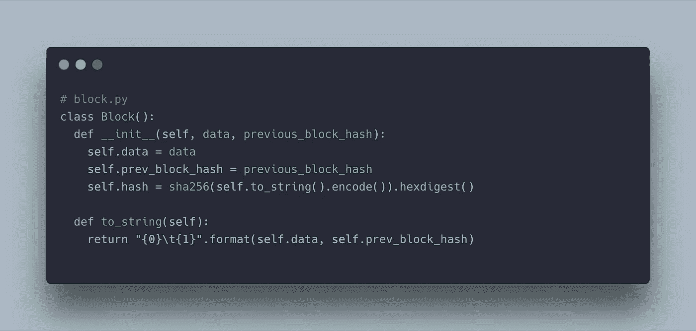

Python3 中一个块的代码片段

在我们的*块*类的构造函数中，我们实例化插入块中的数据，前一个块的散列，我们在我们自己的块上应用散列函数，并将输出保存到散列变量。

让我们也创建一个 *to_string* 方法，该方法返回一个包含数据和前一个块的散列的字符串。

这意味着我们可以通过运行以下命令来创建数据块的数据结构:

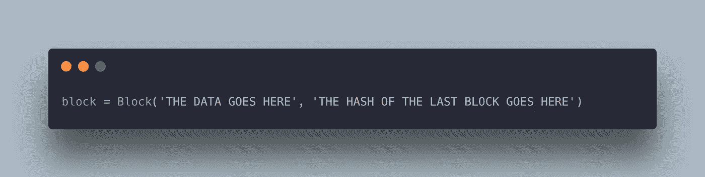

使用 Python3 中的 block 类创建一个块

在我们继续之前，让我指出，每个区块链必须有一个初始块，对吗？没有先前的块。这个块被称为起源块，通常将指向一个空散列作为它的前一个块。

# 第三章:工作证明

> 以及为什么重写区块链如此困难

在上一章中，我们了解到要更改单个数据块中的数据，我们必须从更改数据块的地方重写整个区块链。你可能想知道是什么让重写整个区块链的过程如此困难，因为没有复杂和耗时的操作。

在这一章中，我们将深入探讨一个木块必须遵守的其他一些使木块难以伪造的必要条件。

在我们开始之前，让我们回到我们的散列函数。

这些函数还有一个我还没有提到的重要特征，那就是:**这些函数在反方向**计算是不可行的。

这意味着，虽然计算机从输入字符串生成散列非常简单，但仅仅通过知道输出就很难找到“生成器字符串”。事实上，除了猜测一个字符串，并检查输出散列是否是预期的之外，没有更好的方法来查找输入字符串。平均来说，要找到满足所需散列的输入字符串，需要进行 2 次⁵⁶猜测，即使对计算机来说，这也是一个难以形容的巨大猜测量。

为了防止冒名顶替者修改区块并快速重写整个区块链，要成功伪造区块，其散列必须遵守一个简单的规则:它必须以一定数量的零开始(零的数量可以根据我们希望与创建新区块相关联的难度而改变)。

例如，假设我们定义了一个在区块链中有效的块，它必须以 4 个零开始。现在，每当我们想要向区块链添加一个新块时，我们必须对它应用散列函数，并查看输出散列是否以 4 个零开始。如果不成功，我们必须稍微改变一下我们的区块，然后再试一次。这个过程重复进行，直到该块有效。

这是工作证明背后的基本概念，也是为什么块很难创建的原因。当你停下来想一想，这个规律暗示的是，要创建一个新的区块，需要花费大量的时间、精力和计算能力。

这也意味着，当散列我们的块时，我们必须添加另一个信息:一个每次我们猜测都会改变的数字。这是必要的，以确保输入字符串在每次猜测时都略有不同，所以我们每次都有不同的散列。这个数字被称为随机数。

## 采矿

在我们进入代码之前，让我们检查一下拼凑区块链的最后一个基本理论:块挖掘。

如果你以前读过关于区块链的深入文章，这个术语肯定会出现。

在区块链网络中，粉碎这些计算复杂的算法来创建新块的服务器被称为矿工。很多时候，在大区块链，这些矿工是非常大的仓库，装满了服务器，24/7 不间断地粉碎这些算法，以确保区块链进化。

本章理论到此为止！现在，让我们回到我们的代码，修改我们的*块*类，使它的散列遵循我们的区块链规则，并以一定数量的零开始。

我们将向我们的*块*类添加一个新方法，名为 *calculate_valid_hash* 。在这个方法中，我们将初始化*散列*变量为空字符串，nonce 为 0。当散列没有被 *is_hash_valid* 方法批准时，我们将递增 nonce 并重试。当我们发现一个 nonce 值，当与块的数据散列时得到我们的 *is_hash_valid* 方法的批准，我们将停止循环，并将块的散列设置为我们计算的值。

我们将把这个新方法添加到我们的构造函数中。

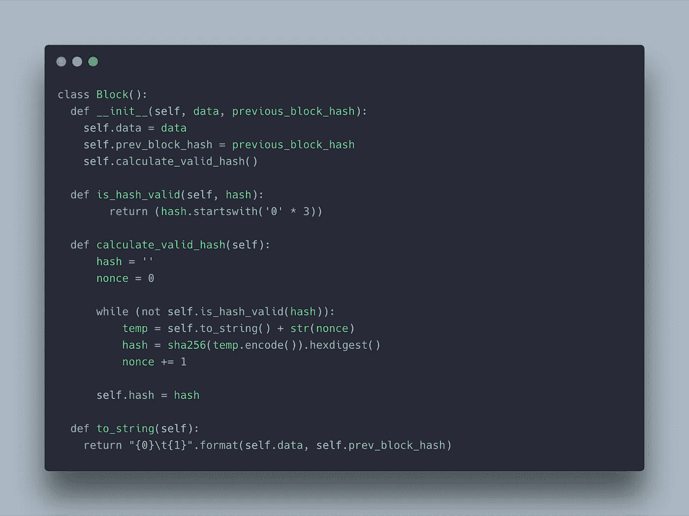

为我们的块计算有效散列

通过这些修改，每当我们实例化一个新的块时，我们将不得不经历生成工作证明的过程来挖掘该块。

现在是时候创建一个新的类别了:区块链。

一旦我们实例化了*区块链*类，我们将把*区块*属性初始化为一个空数组。为此，我们将在构造函数中添加以下代码行。

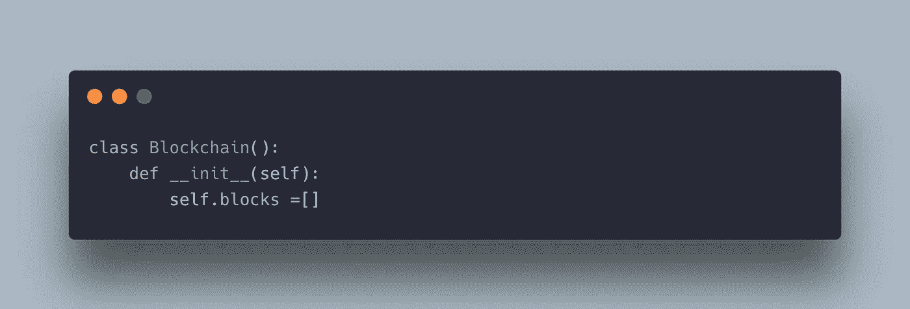

区块链类

现在让我们给区块链类添加一个方法来创建创世纪块！这个方法将在我们的区块链构造函数中被调用。

为了实现这一点，我们必须创建 *set_genesis_block* 方法，并将*数据*变量初始化为‘Genesis’(或任何您喜欢的东西)。我们还将把 *prev_hash* 变量初始化为一个 64 个零的字符串。现在，我们将从该数据中实例化一个块，并将其添加为区块链的第一块。由于我们的*块*类的构造函数中的 *calculate_valid_hash* 方法，我们可以保证这个块将有一个有效的散列。

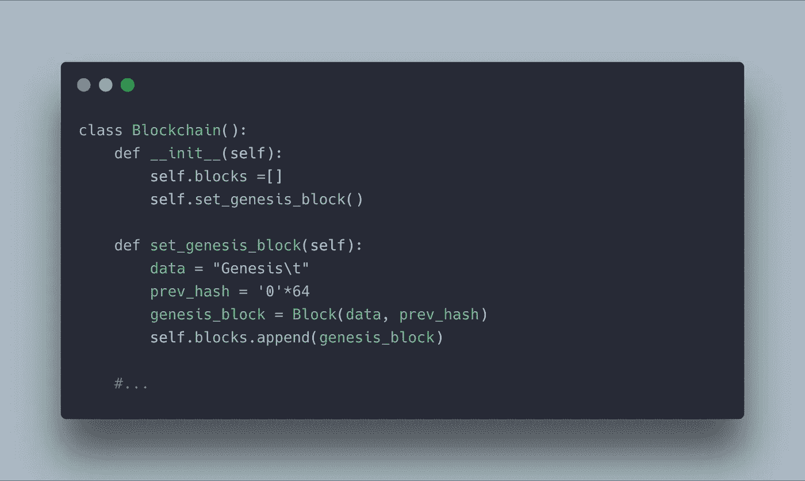

当我们初始化我们的区块链时，创建我们的起源块

最后，为了完成我们的区块链，让我们添加一个方法来为我们的区块链添加一个块。该方法将只接收进入块中的数据。然后，它将获取最后一个块的哈希，并根据之前的哈希和数据创建一个新块。与 Genesis 块一样，由于使用了 *calculate_valid_hash* 方法，我们可以确保新块的散列是有效的。最后，我们将把新挖掘的块添加到我们的*块*数组中。

向我们的区块链添加一个新块

既然我们已经成功创建了整个区块链结构，我们可以这样初始化！

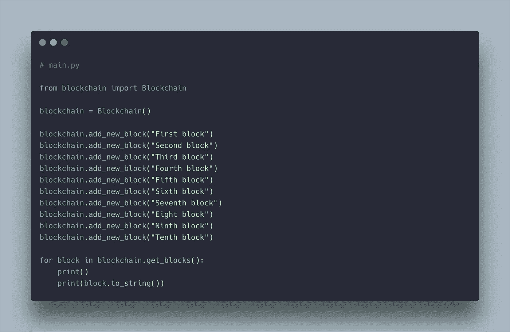

我们的主程序，初始化一个区块链并添加一些块

我在*区块链*类中创建了一个可选方法，名为 *get_blocks* ，它返回一个包含所有区块的列表。这对我们调试、测试和可视化我们的区块链来说可能是有趣的。

当我们在终端或命令提示符下运行这段代码时，我们会得到如下结果:

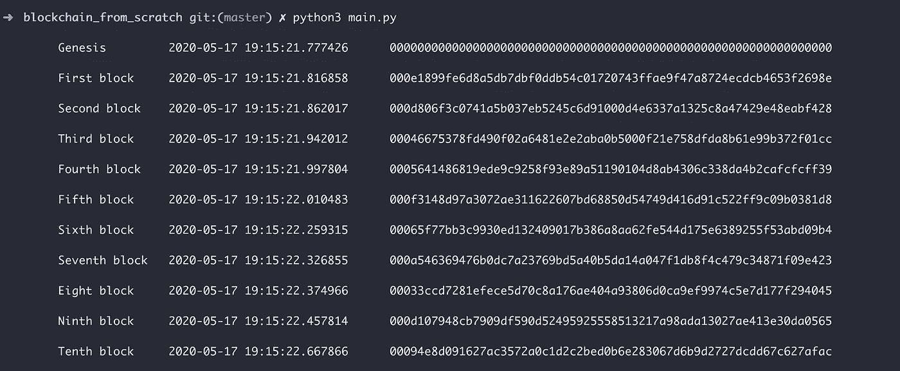

main.py 的输出

如果我们分析区块链中的所有块哈希，我们会发现它们都是以 3 个零开始的！这向我们证明了该块确实是有效的块，并且我们的机器必须做一些工作来挖掘该块。

比特币区块链中的块哈希如下所示:

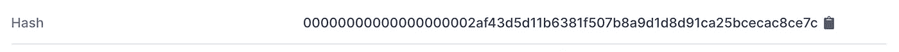

https://www.blockchain.com/btc/blocks 比特币区块链最后开采的区块(2020 年 5 月 17 日)——

我们的*块*类的完整代码现在看起来像这样:

请注意，我在这个块中添加了一个新信息:它是时间戳

我们的*区块链*类的完整代码如下所示:

我们区块链的完整代码

代码到此为止！在下一章中，我将解释我们如何改进这个实现，并让区块链分布在节点网络上！

# 第 4 章:改进我们的实施

我们已经设法从零开始创建了一个完全成熟的区块链，并立即启动和运行，但它仍然不是分散的，由许多节点组成。

将我们的区块链实现转换成一个分散的实现会稍微复杂一点，所以我将把它留到另一篇文章中，但是现在我们可以讨论一些必须考虑的其他因素。

目前，我们的计算机是这个区块链中唯一工作的节点。当我们调用 *add_new_block* 方法时，所有的数据都来自我们的机器，我们的处理器也进行所有的块挖掘。

在分布式区块链中，我们会让特定的节点进行挖掘。这些节点将监听网络中正在广播的新数据或事务，并将继续尝试找到使块有效的随机数值。当一个挖掘器找到这个 nonce 值时，它将向网络广播这个新块。对于网络中的所有其他节点来说，验证该块是否有效是很容易的，因为它们所要做的就是将散列函数应用于具有给定现时的块。如果块以 X 个零开始，则块是有效的。

我们的分布式区块链的一个关键规则是，如果一个节点收到两个冲突的块，并且都有有效的散列，它必须信任历史最长的块。

这意味着，如果我们想要在我们的区块链中插入具有欺诈性信息的块，我们不仅必须在网络挖掘真实块之前挖掘欺诈性块，而且我们必须永远继续挖掘到我们的欺诈性区块链的块。

考虑到这一点，我们可以肯定欺骗区块链的唯一方法是拥有超过一半的网络。只有当你恰好拥有超过一半的网络时，你才有必要的计算能力将一个欺诈块插入链中，并从那里继续链。

在大型可信的区块链，如比特币或以太坊区块链，拥有超过一半的网络几乎是不可能的，所以我们可以保证区块链是安全的。

# 结论

到目前为止，我们已经了解了区块链是如何工作的，以及它们为什么如此重要。我们已经构建了自己的功能性区块链，可以在块中存储数据，并通过工作证明来挖掘块。

这篇文章的代码都可以在:[https://github.com/jzsiggy/blockchain-from-scratch](https://github.com/jzsiggy/blockchain-from-scratch)找到

随意克隆、派生或复制代码。有什么建议也欢迎拉请求！

我希望这篇文章可能对你有所帮助或启发！😁😁😁

# 参考

 [## 学习和构建 Javascript 区块链

### 了解区块链的最好方法就是建造一个

medium.com](https://medium.com/@spenserhuang/learn-build-a-javascript-blockchain-part-1-ca61c285821e)  [## 用 Javascript 编程区块链

### 在前几篇帖子中，我谈到了使用 Swift 在 iOS 中实现区块链。很多人给我发邮件，问我…

medium.com](https://medium.com/digitalcrafts/programming-blockchain-in-javascript-8051cab272da) 

用碳做的代码片段——https://carbon.now.sh/