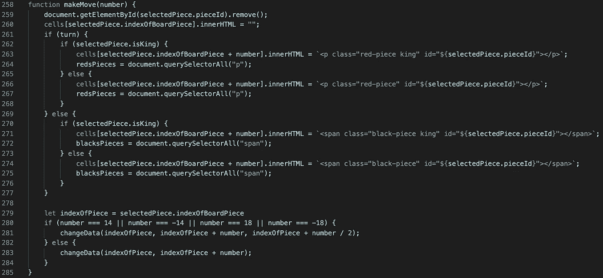

# 用 JavaScript 创建棋盘游戏(跳棋)

> 原文：<https://levelup.gitconnected.com/creating-a-board-game-checkers-with-javascript-ecd562f985c2>

学习 web 开发的最好方法之一是创建一个游戏。有了 javascript 的基本工具，就可以开始了。作为一个初学者，这可能是令人生畏的。很容易陷入“教程地狱”,因为你认为你需要在开始创作之前不断学习。我将通过演示如何创建棋盘游戏跳棋向您证明事实并非如此。

我只涉及 HTML、JavaScript(包括 DOM)和非常少量的 CSS，所以我假设你知道如何使用它们的基础知识。你当然也应该知道如何玩跳棋…

如果你想看到完成的代码，你可以访问 GitHub 库，这里:[https://github.com/RyanBranco/Checkers](https://github.com/RyanBranco/Checkers)

首先是 HTML。

为了给用户画板，我使用了一个`<table>`。使用表格可以很容易地创建棋盘，因为这正是棋盘；一张 8×8 的桌子。在开始和结束标签之间，我们需要 8 个`<tr>`(表格行)。`<tr>`并不实际创建行中的单元格，它只是定义了一个新行供您输入单元格；因此，在您刚刚创建的 8 个`<tr>`中，需要有 8 个`<td>`(表格数据)来为电路板创建实际的单元格。

骨骼应该是这样的:

你看不到网页上显示的任何内容，因为表格中没有数据。这将是下一步。

现在是每个`<td>`应该有的 HTML。

棋盘上有永远不会有棋子的单元格，我给它们一个`class=”noPieceHere”`。这对 javascript 逻辑(稍后介绍)和 CSS(所以它们有不同的颜色)很重要。第一个`<td>`应该有`noPieceHere`类，并且应该在整个棋盘中交替出现(创建棋盘效果)。下面是一行的样子:

现在，这需要为所有其他 7 行复制，记住，这需要交替。这意味着下一个`<tr>`将从没有`noPieceHere`类的`<td>`开始。

现在是单元格的 CSS。

每一个`<td>`都有一个`background-color: #BA7A3A`、`Width`、&、`Height`、`text-align: center`(使每个单元格看起来像一个正方形)。然后`.noPieceHere`覆盖`<td>`到`#F0D2B4`的颜色(这样看起来就像棋盘)。

*单元格可以根据您的意愿进行定制*

一旦完成，你应该有一个空的棋盘！现在让我们用棋子填充棋盘。

在每个没有`class=”noPieceHere”`的`<td>`中，是棋子将要放置的地方。我用空的`
`标记红色的棋子，空的``标记黑色的棋子；这并不是绝对必要的，但我认为一旦我们转向 JavaScript，迭代这些部分会变得更容易。

红色棋子有一个`class=”red-piece”`，黑色棋子有一个`class=”black-piece”`，每一个棋子都应该有其唯一的`id`。

每种颜色在相对的两端有 12 块，中间应该留有 2 排。

以下是两端各有一行的示例:

在 JavaScript 中，一旦棋子到达棋盘的另一端，我们需要给棋子一个`class=”king”`,所以我们需要在 CSS 中定义`.king`,以备 JS 追加。

以下是棋子和国王类的 CSS:

*您可以随心所欲地定制作品*

如果你想让玩家知道轮到谁了，你可以在棋盘下面添加一些 HTML，它会根据轮到谁而改变颜色。

JavaScript 将改变文本颜色，但这里是静态 HTML:

不要忘记给每个`
`添加类，因为我们需要在 JavaScript 中引用这些类，这样我们就可以根据玩家的回合改变样式。

你可以随心所欲地设计它们，但我首先给`.black-turn-text`一种灰色，让它看起来淡出(这样用户就知道游戏在红色回合开始)。

HTML 和 CSS 的最终结果应该如下所示:

不错！HTML 和 CSS 完成了！现在真正有趣的开始了… JavaScript！

JavaScript 逻辑中将有三个主要事件:

1.  当一块被点击时
2.  当单元格被单击时
3.  单击单元格后更改的数据

但是在我们进入逻辑之前，我们需要初始化游戏状态数据，并声明引用 DOM 中项目的变量。让我们跳进来吧！

首先，我们需要在后端创建一个董事会的表示。这可以用一个 64 项的数组来完成(每一项代表一个单元)。

你看到的硬编码的数字是棋盘上棋子的 id，并被放置在棋盘上它们应该在的地方。这很容易让我们的代码“看到”片段在哪里。稍后，我们将操纵这个数组，根据棋子移动的位置进行改变。

接下来，我们需要建立引用事物的变量(在 DOM 和 player 属性中)。

首先通过使用 DOM，我们获取所有的`cells`(第 23 行)，每边的所有棋子(第 24 和 25 行)，每边的回合文本，这样用户就可以看到该轮到谁了(第 26 和 27 行)，然后是`divider`(第 28 行)。如果你没有分隔线，不要担心，我所要做的就是改变`display: none`,让它在显示赢家时消失。

现在我们需要保存用户变量来跟踪游戏状态。

我用`turn`变量来代表当前玩家回合(`true` ===红人回合&= = = =黑人回合【31 线】)。一旦一个玩家有 0 个棋子，对面的玩家就赢了，所以我们需要记录每个玩家的“分数”(第 32 和 33 行)。最后是`playerPieces`变量。这个变量允许我们动态地保存所有当前玩家的棋子。这样做的好处是，我们不必编写两次代码(红色转弯和黑色转弯)。我们将动态地改变什么样的玩家角色被引用，所以我们只需要写一次代码。

如果`playerPieces`变量有点混乱，不要担心，我很快就会看一遍。

现在出现了保存这些片段属性的对象。

当一个棋子被点击时，`selectedPiece` 对象将根据用户点击的棋子的属性动态变化。我们将编写 Javascript 来分析它周围可能的移动，并根据可能的移动更改真/假值。稍后我将展示这是如何实现的。它涉及到之前创建的`board`数组。

当一个棋子被点击时，我们需要获取一些东西:该棋子的具体`id`(第 38 行)，该棋子所在的棋盘棋子的索引(第 39 行)，如果它是一个国王(第 40 行)，以及所有可用的可能移动(第 41-48 行)。

在我们进入游戏的实际功能之前，我将解释我在移动方式上的设计选择。

棋盘上的棋子原本只能往相反的方向走，但是一旦它到达棋盘的另一端，它就变成了“国王”，然后开始了全方位的移动。我发现用一种“向后”的方式来设计棋子的运动需要更少的代码。因此，首先我们将分析棋子可以跳的所有可用方格(不考虑棋子的颜色，或者是否是王)，然后根据玩家的回合限制移动。

如果不这样做，将不得不编写三个看起来几乎相同的函数；一个给红棋子，一个给黑棋子，一个给国王。复制代码不是好的做法，因为它更容易出现错误，更难调试，编写起来乏味，并且有很多不必要的代码。我描述的方法只涉及一个分析周围可用单元格的函数，另一个函数将根据玩家的回合轻松编辑`selectedPiece`属性。如果这有点令人困惑，我将很快向您展示这将如何完成。

现在我们需要给这些部分一个`click`事件监听器。`givePiecesEventListeners()`函数将为这些片段提供一个事件监听器，该监听器将调用函数`getPlayerPieces`。`getPlayerPieces()`是操作我之前展示的`selectedPiece`对象的函数链的开始。

所以在 JavaScript 文件的最底层，调用初始化事件监听器的函数，就像这样:`givePiecesEventListeners()`。

接下来的几个函数起初看起来可能有些混乱，因为它将涉及到我还没有在代码中涉及到的东西。它们重置了代码中尚未改变的特征。但它需要在链中首先完成，因为如果用户单击一个棋子移动，所有东西都将被分析，并且它周围的单元格将根据棋子可以移动的位置得到“`onclick`”。但是，如果用户决定他们不想移动那个棋子呢？他们应该可以选择另一件作品。因此，为了实现这一点，需要在代码中重置某些属性，以便所选的新块能够正确移动。

这是`playerPieces`变量将要被改变的地方。简单来说，`if (turn)`(意为其转红)，设置`playerPieces`变量为`redsPieces`，`else…`(意为其转黑)设置`playerPieces`为`blacksPieces`。然后调用函数`removeCellonclick()`。然后一旦`removeCellonclick()`完成，运行`resetBorders()`。

先来盖`removeCellonclick()`。

这个函数遍历棋盘上的所有单元格(第 81 行)。然后删除`onclick`属性(第 82 行)。

稍后我将向您展示为什么单元格的`onclick`需要是属性，但是现在您需要知道的是，这是因为我们需要动态地添加和删除它们。

现在让我们来看看之前调用的`resetBorders()`。

稍后我们会给选中的棋子加一个绿色的边框(表示该棋子被选中移动)，但是如果用户选择了不同的棋子，旧的棋子需要重置回默认值。因此，该函数循环通过所有的`playerPieces`(这是之前设置的)并将改变片段以具有一条`border = “ 1px solid white”`线(89)。一旦完成，调用`resetSelectedPieceProperties()`，然后调用`getSelectedPiece()`。

首先让我们来看看`resetSelectedPieceProperties()`是做什么的。

这将重置`selectedPiece`对象的所有属性，恢复正常。这需要在每次单元格单击时发生，因为我们不知道前一个选定部分的属性是什么。由于单元格是基于`selectedPiece`条件得到`onclick`的，所以每次点击一个棋子都需要重置，否则单元格将会有不正确的`onclick`属性。

现在转到`getSelectedPiece()`。

我们需要找到棋子在棋盘上的位置。这就是`getSelectedPiece()`开始发挥作用的时候。

当一块被点击时，它会给你一个`event`。我们可以通过输入`event.target.id`来获取片段的`id`。`event.target.id`返回一个`id`的字符串，我们希望它是一个数字，这样当我们将它与`board`数组相关联时，JavaScript 可以正确地读取它。所以通过包围`parseInt()`(第 112 行)，我们可以把字符串变成一个数字。我们还需要找到棋子在棋盘上的位置。这就是`findPiece`功能发挥作用的地方。

`findPiece()`接受一个参数，即片段的 id。一旦我们保存了片段的`parseInt()`版本(第 18 行)，我们就将它传递给 javascript 方法`indexOf`(第 19 行)并`return`它。这将为您提供所选棋子的准确索引位置。

函数链上的下一个是`isPieceKing()`。

`isPieceKing()`函数应该是不言自明的，它确定所选的棋子是否为王。

通过在选中的 HTML 元素(第 119 行)上使用`.classList.contains(“king”)`,我们可以确定它是否是一个国王。轻松点。稍后你会看到这首曲子是如何被评为国王级的。

然后调用`getAvailableSpaces()`

`getAvailableSpaces()`分析一个棋子在不跳转到另一个棋子的情况下可以形成的周围单元格(下一个函数将覆盖跳转空间)。

如果计算单元格，棋子可以移动+/-7 个单元格或+/-9 个单元格(正或负，取决于棋子是红色还是黑色)。让我们看一下第一个`if`语句，因为一旦理解了其中一个，就理解了其余的(第 129-131 行)。

如果`selectedPiece.indexOfBoardPiece + 7 === null`(表示该位置可用)和同一单元格没有`noPieceHere`(第 130 行)的类别，则该棋子可以移动！所以我们在`selectedPiece = true`行(131)设置了这个属性。

第 130 行很重要，因为边上有 7 或 9 个空格，是棋盘另一端的单元格，显然我们不能跳到那里，但幸运的是这些单元格有一个`noPieceHere`类。所以我们需要确保我们没有跳到那里的选择。第 130 行阻止了这一点。

现在我们来看看`checkAvailableJumpSpaces()`。

`checkAvailableJumpSpace()`做与`checkAvailableSpaces()`相同的事情，除了…你猜对了…跳棋子。

功能差不多，区别是+/-14 或者+/-18(加减取决于棋子是红还是黑)。`if`语句中的额外条件是，如果被跳转的位置是`>= 12`，意味着棋子是黑色的(因为黑色棋子的`id`大于或等于 12)，红色棋子的`id`小于 12。

不幸的是，这个函数需要为每一面(红色和黑色)复制代码。这是因为我们必须指定片段`id`的方式。可能有一种方法可以消除重复的代码，但我不确定如何去做。因此，如果有人能找到消除重复代码的方法，请在下面的评论中发表。

确保在这个函数之后我们调用下一个函数，也就是`checkPieceConditions()`。我不在图中展示，但这是绝对必要的，因为我们需要延续链条。

现在我们已经分析了棋子所有可能的移动，我们需要根据回合来限制移动。

既然一个国王有完全的移动能力，不管他在哪边，我们都不需要操纵任何属性。所以我们可以继续下一个函数，也就是`givePieceBorder()`(第 199 行)。

如果不是国王，我们需要移除红色棋子的所有“负”移动属性，并移除黑色棋子的正常移动属性。我们就是这样限制运动的。

然后…我们进入下一个功能，`givePieceBorder()`。

为了使作品看起来被选中，我们需要给它一个绿色的亮点。所以…如果任何`selectedPiece`运动属性为真，我们改变`document.getElementById(selectedPiece.pieceId).style.border = “3px solid green”`。然后进入下一个功能`giveCellsClick()`(第 221 行)。

如果这些都不是真的，意味着棋子没有可能的移动，什么都不做(`return;`)

现在我们需要给单元格一个`onclick`属性，基于`selectedPiece`可能的移动。

因此，如果`selectedPiece.[movement property]`为真，则给该单元格赋予一个`onclick`属性`makeMove()`。

`makeMove()`将接受棋子将要移动的数字或位置的参数。如果棋子要移动七格(`selectedPiece.seventhSpace`)，给单元格一个`makeMove(7)`的`onclick`，所有可能的移动都会这样做。

这就是为什么我们需要给单元格一个`onclick`属性而不是`event listener`属性的原因:如果我们给单元格一个事件监听器并传递一个参数，函数将立即运行，因为从技术上来说它是被调用的。使用匿名函数是不可能的，因为它需要被删除，并且您不能删除匿名事件侦听器。

当你点击一个片段时，这是函数链的结尾，所以我们不需要自动调用更多的函数。下一个函数(`makeMove()`)是当一个单元格被选中后被点击时调用的函数。

该是做大量繁重工作的函数的时候了！这有点复杂，但请试着和我一起分享。

首先我们需要移除前端的部分，我们可以很容易地用`.remove()`(第 259 行)来完成，并将单元格的`.innerHTML`改为空字符串(第 260 行)。有了这两者的结合，细胞看起来就像什么都没有过。

现在来说一下`if…else`的说法。`if (turn)`(第 261 行)，然后……`if (selectedPiece.isKing)`我们想为这个片段创建一个新的 HTML 元素，在被点击的新单元格中有一个 king 类(第 263 行)。然后将 redPieces 变量重置为`querySelectorAll(“p”)`(第 264 行)；这非常重要，因为如果没有这样做，刚刚创建的新片段将不会保存在 JavaScript 内存中。所以当你在下一轮点击新的部分时，什么也不会发生，因为 JavaScript 不会给它一个事件监听器。所以一定要把这一行加进去。

为第 265 行的`else`语句复制这段代码，但是不包含 king 类。

上面的代码可以复制用于外部的`else`语句(第 269 行)，但是将所有关于红色块的内容都改为黑色块，并且不要忘记将`“p”`改为`“span”`(第 272 行& 275)。

现在我将`selectedPiece.indexOfBoardPiece`保存到一个变量中(第 279 行)。我不确定为什么，但是你不能把对象属性直接传递给函数的参数，所以这需要保存为一个变量。

`if`该数字是一个跳跃移动(第 280 行)，将调用的下一个函数将第三个参数作为被跳跃的棋子的位置(这是必需的，因为我们将从棋盘上移除被跳跃的棋子)。`else`用两个指定的参数调用下一个函数，即旧点和新点。

下一个功能，我们将更改后端的所有数据，以反映前端的电路板。

在这里，我们将在后端操纵一切。如果有必要的话，也可以给这个作品一个国王的级别。

首先我们将选定棋子的原始位置改为`null`(第 289 行)，因为该棋子已不存在；然后改变新的工件位置，使其等于被移动的工件的`id`(第 290 行)。

第 291 行的`if`语句说:如果它的红色变成了`selectedPiece.pieceId < 12`，并且它的新位置是`>= 51` (≥ 51 是棋盘上的最后一行)，那么给这个棋子一个类别`“king”`。然后做相反的黑色转弯(第 294-296 行)。

现在，如果 removePiece 参数存在(第 297 行)，将`board`数组上移除的部分更改为`null`。现在，如果它变成红色(第 299 行)，让棋子在前端消失，并从黑色(第 301 行)移除一个分数。如果轮到黑人，反之亦然。

所有这些完成后，调用 3 个函数:`resetSelectedPieceProperties()`、`removeCellonclick()`和`removeEventListeners()`。前两个我们已经写好了，所以我就不赘述了，但是它们需要被调用，这样所有的数据才能在下一轮被重置(这就是为什么我们没有在这两个函数中调用任何其他新的函数:这样它们就可以被重用)。

现在是`removeEventListeners()`的时候了。

别担心…我们快完成了。

如果是 reds turn(第 315 行)，循环所有的`redsPieces`并删除`click`事件监听器，然后在`else`语句中对`blacksPieces`做同样的操作。

然后调用`checkForWin()` 功能。

如果任何一个分数为 0，则将反回合文本更改为`.style.display = “none”`，并将获胜的玩家更改为“红色获胜！”。

只要玩家知道他们赢了，你就可以随心所欲地发挥创造力。

几个旁注:如果你没有分割器，不要担心，你在第 331 和 338 行看到的循环，是因为我有多个`[player]TurnText`(一个用于移动设备，一个用于桌面设备)，所以如果你只有一个`[player]TurnText`，循环是不必要的。

现在最后一个功能`changePlayer()`！

如果它变成红色，将`turn`变量更改为 false，然后将`blackTurnText`的颜色更改为黑色，将`redTurnText`的颜色更改为浅灰色(反之，如果 turn 为 false，则表示它变成黑色)。

循环的相同逻辑适用于前面的函数。所以如果你只有一个`[player]TurnText`，循环就没必要了。

最后，调用从头开始的函数:`givePiecesEventListeners()`，重新开始整个循环。

第 365 行是 JavaScript 文件的最后一行。这需要在全局级别被调用，所以一旦页面被加载，这个循环就开始了(我在最初回顾这个函数时是如何解释的)。

# 🎉恭喜你！你现在有一个工作跳棋棋盘游戏！🎉

如果你想得到我的代码，你可以在这里找到:[https://github.com/RyanBranco/Checkers](https://github.com/RyanBranco/Checkers)

现在，您应该已经了解了如何利用 JavaScript(甚至大多数编程语言)工具。我鼓励你自己创造一些东西，因为那是最好的学习方式！现在你没有借口了。