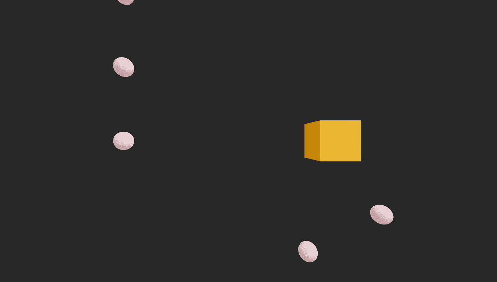

# 用 React-Three 创建一个浏览器游戏

> 原文：<https://levelup.gitconnected.com/creating-a-browser-game-with-react-three-3813c9f3664b>

我一直很喜欢用 three.js 构建的很酷的东西，从外观整洁的网站到很酷的动画，甚至是成熟的浏览器游戏！你所能构建的唯一限制是你的想象力(以及你用普通 js 编码的意愿)。我也一直很欣赏 React 应用程序的简单和整洁，以及以 html 风格定义和使用自己的组件的能力。在 React Three 之前，没有很好的方法将这两者融合在一起(中间没有一些 hacky js 胶水)。现在我们有能力创建一个完整的 three.js 场景，只需要几个 React 组件！



今天，我们将制作一个小的浏览器游戏，类似于吃豆人，玩家是黄色的方块，将会走来走去吃掉粉红色的小球。

这是我将从头到尾引用的完整 github 回购的链接。[https://github.com/mattmacf98/react-xr-game](https://github.com/mattmacf98/react-xr-game)

## 设置

首先，让我们创建一个样板 react 项目并安装依赖项(它们非常小，只有三个和一个允许 react 与三个进行对话的库)。

```
npm install three @react-three/fiber
```

我们还应该创建我们的 CSS，使我们的三个画布占据整个屏幕。

最后，我们将更新我们的 index.js，不使用默认的严格模式(这使得所有东西在我们的开发环境中渲染两次，并导致 balls 成对加载)。

## 网格

在我们的 **App.js** 文件的顶部，我们将为玩家和小球创建两个组件。

我们可以通过给它一些道具来创建一个网格，比如位置、旋转、缩放等等……(更多信息见 https://docs.pmnd.rs/react-three-fiber/api/objects[的文档)。然后我们给出一个网格子组件来确定所用的材料和几何图形。我还使用了一个 ref 对象，这样我就可以在我的 js 中与网格进行交互。](https://docs.pmnd.rs/react-three-fiber/api/objects)

## 应用程序组件

现在，在同一个 **App.js** 文件中，我们将像这样添加我们的应用程序组件

1.  我们为将要更新的球创建一个 **ref** ，为内部游戏时钟、玩家网格以及组件是否已安装创建 **state** 。
2.  然后我们设置我们的**使用效果。**我只想启动球生成一次，这样它就没有依赖关系了，它只在组件生命周期开始时被触发。播放器监听器需要等待组件被安装(以及播放器被实例化)。一旦被装载，我不想创建更多的侦听器，所以我将把 setUpListeners()函数包装在 if 中，以便只在我们没有被装载时触发。我们想检查球或球员更新时是否会发生碰撞，所以我将它们都设置为依赖关系。并且游戏时钟仅仅等待一秒钟并更新(这又将再次触发该效果，因为时间是其依赖性)。
3.  **generateBalls()** 启动了一个函数，每 5 秒钟它将在 x-y 坐标中随机添加一个球(我添加了一个 nonce 生成，这样这些球的组件键将是唯一的)。
4.  **SetUpListeners()** 监听用户在 w、a、s、d 键上的输入，并相应地移动播放器网格。
5.  CheckIfCollide() 是一个非常简单的碰撞检测算法，它只是在所有的球上循环，看看球员的 X-Y 是否等于球的 X-Y，如果是，它将移除那个球。
6.  我们**在一个< Canvas >标签中返回**我们所有的 three.js 组件。我们有灯光，我们的球员，以及当前在我们的 balls ref 中的所有球(请注意我之前调用的关键道具)

这就是它的全部，你已经拥有了一个内置在 React 中的很酷的小浏览器游戏的雏形！你可以在这里做更多的事情，比如允许屏幕随着用户移动，这样他们就可以探索更多的区域，或者你可以创建一些分数跟踪器，并提供影响你的球员外观的电源。你甚至可以建立一个服务器，把游戏放到网上，让人们在多人模式下玩。唯一的限制实际上是您的想象力(以及您不得不花费时间对没有按照您期望的方式更新状态变量的 React 大喊大叫)。


# 分级编码

感谢您成为我们社区的一员！在你离开之前:

*   👏为故事鼓掌，跟着作者走👉
*   📰查看[升级编码出版物](https://levelup.gitconnected.com/)中的更多内容
*   🔔关注我们:[Twitter](https://twitter.com/gitconnected)|[LinkedIn](https://www.linkedin.com/company/gitconnected)|[时事通讯](https://newsletter.levelup.dev)
*   🚀👉 [**软件工程师的顶级工作**](https://jobs.levelup.dev/)