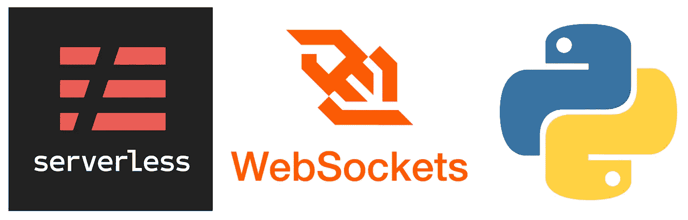
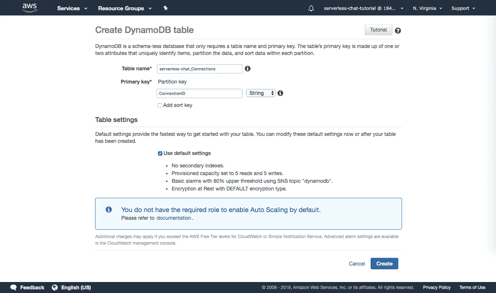

# 使用无服务器、WebSockets 和 Python 创建聊天应用程序:教程

> 原文：<https://levelup.gitconnected.com/creating-a-chat-app-with-serverless-websockets-and-python-a-tutorial-54cbc432e4f>



临近 2018 年底，亚马逊在 API 网关中发布了对 [WebSockets 的支持，最近，无服务器框架](https://aws.amazon.com/blogs/compute/announcing-websocket-apis-in-amazon-api-gateway/)[也紧随其后](https://serverless.com/blog/api-gateway-websockets-support/)。有了这两种工具直接支持的 WebSockets，创建一个实时、双向的应用程序比以往任何时候都更容易。

在撰写本文时，有一些关于使用 WebSockets 和无服务器的教程，但是没有一个教程使用 Python 作为主要语言，或者从头到尾完整地描述了构建无服务器 WebSocket 应用程序:本文试图填补这个空白。

在本教程中，我们将构建一个规范的“聊天”应用程序，它在 AWS Lambda 和 API Gateway 的基础上使用[无服务器框架](https://serverless.com/)作为后端，以及一个简单的 Django 客户端。另外，我们将使用 [django-uniauth](https://github.com/lgoodridge/django-uniauth/) 来认证用户，并使用 [JSON Web Tokens (JWT)](https://jwt.io/) 来保护我们的请求。

# **步骤 1:创建一个 AWS 用户**

我们要做的第一件事是创建一个 AWS 用户来管理应用程序。您也可以使用您已经创建的应用程序，但是为每个应用程序设置单独的用户对于安全性(和组织)来说稍微好一点。

登录 [IAM 管理控制台](https://console.aws.amazon.com/iam/home)，进入用户，点击“添加用户”。给它一个用户名，并确保在继续之前检查“编程访问”。


接下来，选择“直接附加现有策略”，并授予用户“AdministratorAccess”。


为了简单起见，我们使用这个策略，但是对于实际的应用程序，您应该准确地选择您需要的权限。

如果您愿意，可以为用户添加标签，否则，继续添加，直到最终创建用户。


下载凭证 CSV 文件并将其存储在安全的地方，或者至少记下访问密钥和秘密密钥。


现在在`~/.aws/credentials`中为其添加条目

```
[serverless-chat-tutorial]
aws_access_key_id = <YOUR_ACCESS_KEY>
aws_secret_access_key = <YOUR_SECRET_KEY>
```

# 步骤 2:安装+配置无服务器

与所有 Python 项目一样，使用一个虚拟环境来隔离我们的依赖关系是一个好主意。为应用程序创建目录:

```
mkdir serverless-chat-tutorial
cd serverless-chat-tutorial
```

然后创建并激活虚拟环境:

```
virtualenv -p python3 venv
. venv/bin/activate
```

现在，让我们安装无服务器:

```
sudo npm install -g serverless
```

并导出必要的环境变量:

```
export AWS_PROFILE=serverless-chat-tutorial
export AWS_REGION=us-east-1
```

我喜欢设置我的虚拟环境，通过将这些行添加到`venv/bin/activate`脚本中，在环境被激活时导出它们。

# 步骤 3:编写一个无服务器 Ping 函数

让我们通过编写一个简单的“ping”函数来尝试一下无服务器框架，这个函数只是向调用者返回一个字符串。

首先，为后端创建一个文件夹:

```
mkdir backend
cd backend
```

然后，让 Serverless 为我们创建一些样板代码:

```
serverless create --template aws-python3 --name serverless-chat
```

这个命令为名为“无服务器聊天”的服务创建一个模板`handler.py`和`serverless.yml`。它还在当前目录中创建一个`.gitignore`(如果您愿意，可以删除它)。

忽略注释，初始的`serverless.yml`文件将如下所示:

这个文件负责配置 Serverless 将如何部署您的服务，包括您的 AWS Lambda 函数，以及最终您的服务需要的任何资源。

`handler.py`文件将如下所示:

正如您所料，这个文件实际上会保存已部署的 AWS Lambda 函数的代码。如果您愿意，您可以将这些方法拆分成单独的文件，但是为了简单起见，本教程将把所有内容都放在`handler.py`中。

这些模板文件一起构成了一个简单的 Hello World 函数，可以立即部署。我们开始吧！

```
serverless deploy
```

如果一切顺利，您将看到如下所示的输出:

```
Serverless: Packaging service...
Serverless: Excluding development dependencies...
Serverless: Creating Stack...
Serverless: Checking Stack create progress...
.....
Serverless: Stack create finished...
Serverless: Uploading CloudFormation file to S3...
Serverless: Uploading artifacts...
Serverless: Uploading service serverless-chat.zip file to S3 (307 B)...
Serverless: Validating template...
Serverless: Updating Stack...
Serverless: Checking Stack update progress...
................
Serverless: Stack update finished...
Service Information
service: serverless-chat
stage: dev
region: us-east-1
stack: serverless-chat-dev
resources: 5
api keys:
  None
endpoints:
  None
functions:
  hello: serverless-chat-dev-hello
layers:
  None
```

您可以使用以下命令调用您的函数:

```
serverless invoke -f hello
```

它应该会返回如下内容:

```
{
    "statusCode": 200,
    "body": "{\"message\": \"Go Serverless v1.0! Your function executed successfully!\", \"input\": {}}"
}
```

太好了，它还活着！但是现在，调用这个函数的唯一方法是通过命令行:如果我们要构建一个 API，它需要通过一个公共 URL 来访问。我们不是想要一个“ping”功能吗？让我们改变这一点。

在`handler.py`中，将“hello”函数名改为“ping”，并将正文改为简单回显“PONG！”：

在`serverless.yml`中，将“hello”函数更新为“ping ”,并使用新的处理函数。另外，添加一个事件，在请求`/ping` URL 路径时触发该函数:

现在重新部署:

```
serverless deploy
```

在部署输出的末尾，您应该会看到服务公开的公共端点的列表。它将类似于以下内容:

```
...
endpoints:
  GET - https://**********.execute-api.us-east-1.amazonaws.com/dev/ping
...
```

您可以用浏览器访问这个 URL，或者通过`curl`或任何其他您喜欢的命令行工具来测试它。(测试时使用您自己的端点 URL)

```
curl "https://**********.execute-api.us-east-1.amazonaws.com/dev/ping"PONG!
```

成功！

# 步骤 4:添加和查看日志

我们最终需要调试我们的 API。使用无服务器基础设施使这变得有点棘手，因为没有服务器可以登录和测试，但使用 [AWS CloudWatch](https://aws.amazon.com/cloudwatch/) 仍然是可行的。

Lambda 函数中的任何 [print 语句或 Logger 方法](https://docs.aws.amazon.com/lambda/latest/dg/python-logging.html)都会在 AWS CloudWatch 中生成一个日志条目。默认情况下，使用 Logger 方法将为我们提供时间戳和可过滤的日志级别，因此我们将在本教程中使用它们。

返回到`handler.py`，添加代码以导入`logging`模块，创建一个记录器，并在`ping`函数中使用它。

重新部署后端，然后调用 ping 函数。

```
serverless deploy...curl "<YOUR_PING_ENDPOINT>"
```

现在，[登录 CloudWatch](https://console.aws.amazon.com/cloudwatch/home) ，进入日志。您应该看到已经为 AWS Lambda ping 函数创建了一个新的日志组。


单击该日志组，然后单击最新的日志流，您应该会看到最近一次调用该函数时生成的日志，包括您的新“Ping requested”条目。


在 AWS Lambda / Serverless 上调试更复杂的函数时，这将是您最好的资产之一。

# 步骤 5:添加数据库+ Python 依赖项

我们正准备开始编写我们的 WebSocket API，但是首先，我们需要一个数据库。在本教程中，我们将使用 [DynamoDB](https://aws.amazon.com/dynamodb/) ，这是一个易于设置的 NoSQL 数据库。

我们需要一个表来跟踪我们的 WebSocket 连接 id，另一个表来存储在聊天室中发送的消息。让我们首先创建连接表。

[登录 DynamoDB](https://console.aws.amazon.com/dynamodb/home) ，点击“创建表格”。为该表命名，并输入“ConnectionID”作为分区键。



连接表加载完成后，再次单击“创建表”。给它命名，这一次，输入“Room”作为分区键，输入“Index”作为数字排序键。


创造它。如果您希望仔细检查您的主键列，请在完成后单击 Items 选项卡。


现在它是空的，但是您可以返回到此选项卡，在输入项目时查看表中的项目。

现在，我们需要设置我们的后端代码，以便能够与数据库进行交互。在 Python 中，你通过`[boto](http://boto.cloudhackers.com/en/latest/)` [模块](http://boto.cloudhackers.com/en/latest/)与亚马逊服务进行交互。亚马逊 Lambda 实际上已经在它的服务器上默认安装了`boto`，但是在这篇文章发表的时候，预装的版本已经过时了，并且缺少我们需要的关键特性，所以我们无论如何都需要指定我们自己的。

首先，打开`serverless.yml`，并添加一个`iamRoleStatement`以允许 DynamoDB 操作(如果您在不同的地区，请更改“us-east-1”)。

```
provider:
    name: aws
    runtime: python3.7
    iamRoleStatements:
        - Effect: Allow
          Action:
              - "dynamodb:PutItem"
              - "dynamodb:GetItem"
              - "dynamodb:UpdateItem"
              - "dynamodb:DeleteItem"
              - "dynamodb:BatchGetItem"
              - "dynamodb:BatchWriteItem"
              - "dynamodb:Scan"
              - "dynamodb:Query"
          Resource:
              - "arn:aws:dynamodb:us-east-1:*:*"
```

为了指定我们的 python 依赖项，我们将使用一个名为“[server less-python-requirements](https://www.npmjs.com/package/serverless-python-requirements)”的插件，它将读取根部署目录中的一个`requirements.txt`文件，并在将处理函数推送到 AWS Lambda 之前为我们安装它们。整洁！

首先，通过运行以下命令在本地安装插件:

```
serverless plugin install -n serverless-python-requirements
```

注意，这也将在当前目录中创建`package.json`、`package-lock.json`和一个`node_modules`文件夹。

接下来，将以下几行添加到`serverless.yml`(前两行可能已经被上面的命令添加了):

```
plugins:
    - serverless-python-requirementscustom:
    pythonRequirements:
        dockerizePip: true
        noDeploy: []
```

前两行告诉 serverless 使用 python-requirements 插件，剩下的几行是我们如何配置它的。

我们需要`dockerizePip`,因为 Amazon Lambda 处理程序运行一个我们目前可能没有开发的特定版本的 Linux。因此，所有依赖项在被推送到 AWS 之前都被安装在 Docker 实例中。(注意，这需要你下载并安装 [Docker](https://www.docker.com/get-started) ，如果你还没有的话)。

第`noDeploy`行告诉 Amazon Lambda 使用我们指定的任何软件包版本，如果它们碰巧已经安装了的话。更新后的`serverless.yml`文件应该如下所示:

最后，安装`boto3`和`botocore` python 包:

```
pip install boto3 botocore
```

并创建一个`requirements.txt`文件，将它们列为依赖项:

```
pip freeze > requirements.txt
```

此时，我的`requirements.txt`看起来是这样的(你可能有不同的版本号):

```
boto3==1.9.130
botocore==1.12.130
... (Less important packages) ...
```

我的后端目录如下所示:

```
.
├── .gitignore
├── .serverless/
├── handler.py
├── node_modules/
├── package-lock.json
├── package.json
├── requirements.txt
└── serverless.yml
```

我们现在应该能够在 Python 处理程序中读取和更新数据库了。让我们修改 ping 方法来证明它。

导入`boto3`并在文件顶部创建一个 Dynamo DB 资源，然后编写一些代码来访问 Messages 表并向其中添加一个条目。你可能会发现 boto3 文档很有帮助。

更新后的`handler.py`应该有点像这样:

请注意，我已经为数据库中的项目添加了一些额外的键:

*   时间戳:跟踪消息的创建时间
*   用户名:创建消息的人的用户名
*   内容:消息中的实际文本

现在重新部署并调用 ping 函数:

```
serverless deploy...curl "<YOUR_PING_ENDPOINT>"
```

如果您访问 DynamoDB，然后转到 Messages 表并单击 Items 选项卡，您应该会看到新创建的消息。


如果没有，请按照步骤 4 中的描述访问 CloudWatch，以帮助您调试出了什么问题。

# 步骤 6:编写 WebSocket 处理程序

我们终于找到好东西了！设置完成后，是时候编写核心 WebSocket 处理程序了。

我们的 API 将支持四个函数:`connectionManager`用于处理与 WebSocket 的连接和断开，`sendMessage`用于向聊天室发送消息，`getRecentMessages`用于检索最近的聊天消息(在第一次连接时使用)，以及`defaultMessage`用于优雅地处理 API 不支持的请求。

打开`handler.py`，为连接管理器创建一个函数:

Amazon Lambda [通过事件参数传递事件数据](https://docs.aws.amazon.com/lambda/latest/dg/python-programming-model-handler-types.html)，我们可以用它来访问`connectionId`。我们还可以访问`eventType`，它告诉我们用户是连接还是断开 WebSocket。

接下来，编写代码，在连接时将`connectionId`添加到连接表中，在断开时将其移除。

最后，函数应该在退出时返回一个响应字典，就像我们的 ping 函数一样。我们需要做很多这样的工作，所以我创建了一个助手函数来帮我打包。

接下来，让我们创建发送消息的处理程序。我们需要做的第一件事是解析来自客户端的消息数据。客户端需要提供消息的内容，现在还需要提供发送消息的人的用户名。

在更新 WebSocket 侦听器之前，我们应该将新消息存储在数据库中。我们项目中的一个`Message`项有`Username`、`Content`、`Room`、`Index`和`Timestamp`字段。`Username`和`Content`是客户提供给我们的。现在，每个人都将发布到同一个`Room`，所以我们可以将其设置为某个常量字符串(如果我们想要支持私人聊天，客户端也将发送`Room`来发布到)。我们将通过查询数据库中的最后一个`Message`来手动计算`Index`，并将其索引递增 1。最后，我们可以使用 Python 的`time`模块轻松计算出`Timestamp`。

最后，消息应该发送给连接到 WebSocket 的所有侦听器。首先，我们查询 Connections 表中的所有连接 id，然后我们将消息(去掉所有不必要的数据)发送给每个连接。为了实际发送消息，我们可以使用`[boto3](https://boto3.amazonaws.com/v1/documentation/api/latest/reference/services/apigatewaymanagementapi.html#ApiGatewayManagementApi.Client.post_to_connection)` [的 API 网关管理 API](https://boto3.amazonaws.com/v1/documentation/api/latest/reference/services/apigatewaymanagementapi.html#ApiGatewayManagementApi.Client.post_to_connection) 中的`post_to_connection`方法。

现在，让我们编写获取 10 条最新消息的处理程序。为此，我们以反向索引顺序查询前 10 项，这是通过设置`Limit=10`和`ScanIndexForward=False`实现的。然而，这给了我们按时间倒序排列的原始的`Message`项，所以在发送给客户机之前，我们颠倒了列表，去掉了项，只包含了`username`和`content`。

最后，我们将编写默认的消息处理程序，它只是记录事件并返回 400 状态代码。我还将数据库测试从 ping 函数处理程序中取出，并更新它以使用`_get_response`助手函数。

写完所有的处理函数后，我们只需要为无服务器配置它们。打开`serverless.yml`并将下列行添加到`provider`:

```
provider:
    ...
    websocketApiName: serverless-chat-api
    websocketApiRouteSelectionExpression: $request.body.action
```

第一行由 API Gateway 在设置 WebSocket 端点时内部使用。第二个指定使用数据字典中的哪个键来确定“路线”，这决定了要运行的 API 函数(稍后将详细介绍)。

我们还需要给予无服务器权限来管理 WebSocket 连接:

```
provider:
    ...
    iamRoleStatements:
        - Effect: Allow
          Action:
              - "execute-api:ManageConnections"
          Resource:
              - "arn:aws:execute-api:*:*:**/@connections/*"
        ...
```

最后，我们需要将我们的函数处理程序链接到 WebSocket 路由，如下所示:

```
functions:
    ...
    defaultMessage:
        handler: handler.default_message
        events:
            - websocket:
                route: $default
    ...
```

注意，`$connect`、`$disconnect`和`$default`是特殊的路由，如果您想要各自的内置 WebSocket 事件，需要在前面加上“$”。没有其他路由需要“$”。

最终的`serverless.yml`文件应该是这样的:

WebSockets API 终于准备好了。重新部署:

```
serverless deploy
```

并重新检查输出的端点。您应该会看到在您的 ping 函数下出现了一个新的:

```
...
endpoints:
  GET - <YOUR_PING_ENDPOINT>
  wss://**********.execute-api.us-east-1.amazonaws.com/dev
...
```

新的端点是您的 WebSocket 端点。你可以用任何你想要的工具来测试它。一个简单的选项是 [WebSocket cat](https://github.com/websockets/wscat) ，您可以使用以下命令安装它:

```
npm install -g wscat
```

安装后，连接到您的 WebSocket 端点:

```
wscat -c <YOUR_WEBSOCKET_ENDPOINT>
```

然后发送请求，使用“action”作为路由值:

```
{"action": "sendMessage", "username": "test-websocket-user", "content": "Testing the Websocket API."}
```

和以前一样，如果出现任何问题，您可以使用 CloudWatch 和 DynamoDB 控制台来帮助您进行调试。

# 步骤 7:编写客户端

随着后端功能的完善，我们现在可以编写一个简单的客户端来与之交互。本教程将使用 [Django](https://www.djangoproject.com/) ，一个流行的 Python web 框架。

(注意:本教程的重点是无服务器和 WebSockets，而不是构建客户端，因此我将假设对 Django 有一些熟悉，并略读任何与 WebSocket 无关的组件。)

首先，安装 Django:

```
pip install Django
```

然后进入包含`backend`目录的目录，并开始一个新的 Django 项目。

```
django-admin startproject project
mv project client
```

然后在项目中创建新的“聊天”应用程序。

```
cd client
python manage.py startapp chat
```

我的存储库现在看起来像这样:

```
.
├── backend/
├── client/
    ├── chat/
        ├── __init__.py
        ├── admin.py
        ├── app.py
        ├── migrations/
        ├── models.py
        ├── tests.py
        └── views.py
    ├── manage.py
    └── project/
        ├── __init__.py
        ├── settings.py
        ├── urls.py
        └── wsgi.py
└── venv/
```

在`client`目录中，进行以下编辑:

在`project/settings.py`中，将“聊天”添加到`INSTALLED_APPS`设置中。

```
INSTALLED_APPS = [
    ...
    'chat',
]
```

在`project/urls.py`中，在空路径中包含聊天应用程序 URL。

进入聊天应用目录。

```
cd chat
```

创建一个`templates`目录，并在其中创建一个`chat`目录。

```
mkdir templates
mkdir templates/chat
```

在新的`templates/chat`目录中，为应用程序创建一个`index.html`文件。

在聊天应用目录中，创建一个`static`目录，并在其中创建一个`chat`目录。

```
mkdir static
mkdir static/chat
```

在新的`static/chat`目录中，创建一个`style.css`文件来设计索引页面。

现在我们只需要创建并路由一个视图来显示新模板。回到聊天应用目录，将以下内容添加到`views.py`:

最后，创建一个名为`urls.py`的文件，并将索引视图路由到空路径。

移回到`client`目录，应用任何初始迁移，并启动 Django 服务器。

```
cd ..
python manage.py migrate
python manage.py runserver
```

在浏览器中访问`localhost:8000`，您应该会看到索引页面。


当然，它实际上没有连接到任何东西，底部的 Post 按钮目前没有任何作用。是时候弥补了。

从聊天应用程序目录，在`static/chat`目录中创建一个名为`custom.js`的新文件。这个文件将包含我们的客户端 WebSocket 交互代码。

首先创建一个函数来设置 WebSocket，并初始化一个 Socket 变量。Javascript 有一个[内置的 WebSocket api](https://developer.mozilla.org/en-US/docs/Web/API/WebSocket) ，但是我喜欢将这个[重新连接 WebSocket 库](https://github.com/joewalnes/reconnecting-websocket)用于不想关闭 WebSocket 连接的页面。

现在，我们定义在某些 WebSocket 事件上调用的回调函数。例如，当 WebSocket 最初打开时，将调用`socket.onopen`处的函数。

对于我们的`onopen`回调函数，我们想要调用`getRecentMessages` API 函数，以最初填充消息列表。我们的 API 的路由关键字是“action”，所以我们创建一个字典设置“action”为“getRecentMessages”，用 JSON 序列化它，然后在 socket 上发送它。

每当客户端在 WebSocket 上接收数据时，就会调用`socket.onmessage`回调。对于我们的应用程序，我们只想反序列化数据，然后在消息列表中显示新消息。

包含一些额外的逻辑来显示“您”,而不是当前用户发布的消息的用户名。由于用户还没有用户名(因为没有任何东西可以登录)，我们使用一个随机生成的数字来制作一个假用户名。

最后，编写一个发布新消息的方法。我们只需要获取输入字段中的文本，然后在 socket 上发送它，以“sendMessage”作为“动作”，我们生成的用户名作为“用户名”，文本作为“内容”。

最后返回到`templates/chat`目录下的`index.html`。链接新的`custom.js`脚本，在页面加载时设置 WebSocket 连接，并在按下 post 按钮或`<Enter>`时发布新消息。

现在，回到`client`目录，并重启服务器。

```
cd ..
python manage.py runserver
```

在浏览器窗口中重新加载`localhost:8000`。您应该可以看到最初加载的数据库中的前 10 条消息，现在也应该可以发布消息了。

更有趣的是，尝试一次打开多个浏览器窗口到`localhost:8000`。所有客户端都应该在新消息发布时进行更新，并且它们应该能够相互通信。


# 步骤 8:保护应用程序

至此，大部分功能已经编写完成，但是没有持久的身份感，恶意用户可以通过修改 Javascript 伪装成任何人。真正的应用程序几乎肯定需要身份验证机制，并且不能依赖客户端代码(如 Javascript)向后端提供信息，因为它不可信。

因此，为了让应用程序更加真实，我们将添加登录和注册视图(利用内置于`[django-uniauth](https://github.com/lgoodridge/django-uniauth)`的视图)，并用 JWT 保护对后端 API 的调用。基于令牌的认证是目前保护 WebSocket APIs 最流行的方式，而 JWT 本身就是一个流行且简单的基于令牌的认证方案，这使它成为一个合适的选择。

首先安装`django-uniauth`。

```
pip install django-uniauth
```

然后，在`project/settings.py`中将“uniauth”添加到`INSTALLED_APPS`。

```
INSTALLED_APPS = [
    ...
    'uniauth',
]
```

将`AUTHENTICATION_BACKENDS`设置为适当的后端。(如果该设置不存在，您可能需要创建它)。

```
AUTHENTICATION_BACKENDS = [
    'uniauth.backends.UsernameOrLinkedEmailBackend',
]
```

并添加以下设置:

第一行设置当用户试图在没有登录的情况下访问受`login_required` decorator 保护的视图时被重定向到哪个 URL。第二行设置手动登录时重定向到哪个 URL。第三个选项从登录页面中删除了 CAS 登录选项，因为我们没有任何 CAS 服务器可以登录。

第四行告诉 Django 将所有发出的电子邮件打印到控制台。使用电子邮件进行电子邮件验证之类的事情，所以这是一种简单的方法，仍然可以在本地获得该功能，而无需设置实际的 SMTP 后端。最后一行将这些电子邮件中的“发件人”地址设置为适当的名称。

接下来，在`project/urls.py`中包含包的 URL。

用提供的`login_required`装饰器保护`chat/views.py`中的索引视图。

最后，返回到`client`目录，应用任何新的迁移，并重启服务器。

```
python manage.py migrate
python manage.py runserver
```

在浏览器中访问`localhost:8000`后，您应该会看到`django-uniauth`登录页面。


创建一个帐户，方法是点击“创建一个帐户”并完成注册过程(检查运行服务器的控制台窗口以获得电子邮件验证链接！)，或者通过 Django 的`createsuperuser`命令。

```
python manage.py createsuperuser
```

无论哪种方式，一旦创建了一个帐户，登录，你应该会回到索引页面。

既然我们已经有了正确的用户认证，让我们设置 JWT。在本教程中，我们将使用 [PyJWT 库](https://pyjwt.readthedocs.io/en/latest/)。首先，安装它。

```
pip install pyjwt
```

然后移动到您的`backend`目录，并将其添加到您的`requirements.txt`中。添加的行应该如下所示:

```
PyJWT==*.*.*
```

您将在`pip install`命令输出的末尾看到版本号。或者，您可以运行`pip freeze`来查看所有已安装的包，然后将以“PyJWT”开头的行复制到`requirements.txt`中。

接下来，打开`handler.py`，修改连接处理程序以读取作为 URL 参数传递的令牌，并尝试使用您选择的字符串对其进行解码(在本例中，我使用的是“FAKE_SECRET”)。这个字符串将是后端 API 和客户端应用程序之间的共享秘密，JWT 使用它来编码/解码令牌。因此，如果 JWT 能够成功解码令牌(它将作为`decode`方法的一部分自动验证签名)，我们就知道它是由我们的客户端应用程序创建的。

如果没有提供令牌，或者令牌无法解码，连接应该会立即失败。

我们还将在`send_message`函数中使用 JWT 来确保用户不能假冒他们的用户名。编辑`send_message`,要求`token`作为数据字段，而不是`username`,然后验证令牌，如果成功的话，从有效负载中提取`username`(我们将很快设置客户端遵守这一点)。如果令牌验证失败，则提前终止函数。

然后，重新部署后端 API。

```
serverless deploy
```

回到`client`目录，转到你的聊天应用目录，打开`views.py`。修改索引视图，使用有效负载中包含的用户名和您选择的秘密字符串作为秘密对令牌进行编码，并将令牌作为视图上下文的一部分进行传递。

接下来，打开`static/chat/custom.js`，移除随机生成的用户名。修改`setupWebSocket`以接受一个`username`和`token`作为参数，并在连接到 WebSocket 时将令牌作为 URL 参数传递。修改`postMessage`以接受一个`token`参数，并将其作为消息字典的一部分，而不是`username`。

然后打开`templates/chat/index.html`并修改事件处理程序来传递适当的参数。

现在重新启动客户端服务器，检查最终产品！

```
python manage.py runserver
```

它应该在功能上等同于上次运行应用程序，但现在发送消息的用户名将与登录用户的用户名相匹配。


# 就是这样！

现在，您已经从头开始构建了一个无服务器的 WebSocket 应用程序，并且希望在这个过程中学到了一些东西。

你可以在 [this Github repo](https://github.com/lgoodridge/serverless-chat) 找到本教程中使用的代码。欢迎在评论中留下任何反馈！

[](https://gitconnected.com/learn/python) [## 学习 Python -最佳 Python 教程(2019) | gitconnected

### 50 大 Python 教程-免费学习 Python。课程由开发人员提交并投票，使您能够…

gitconnected.com](https://gitconnected.com/learn/python)