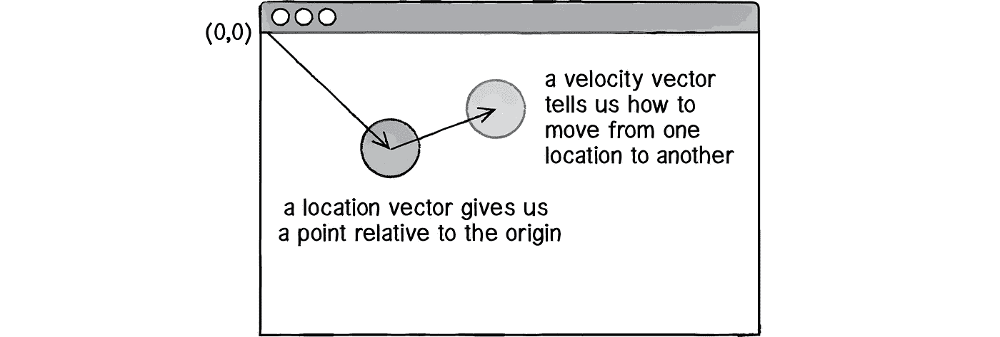
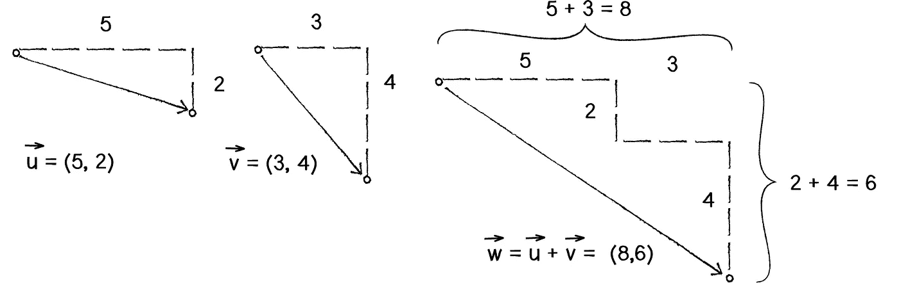
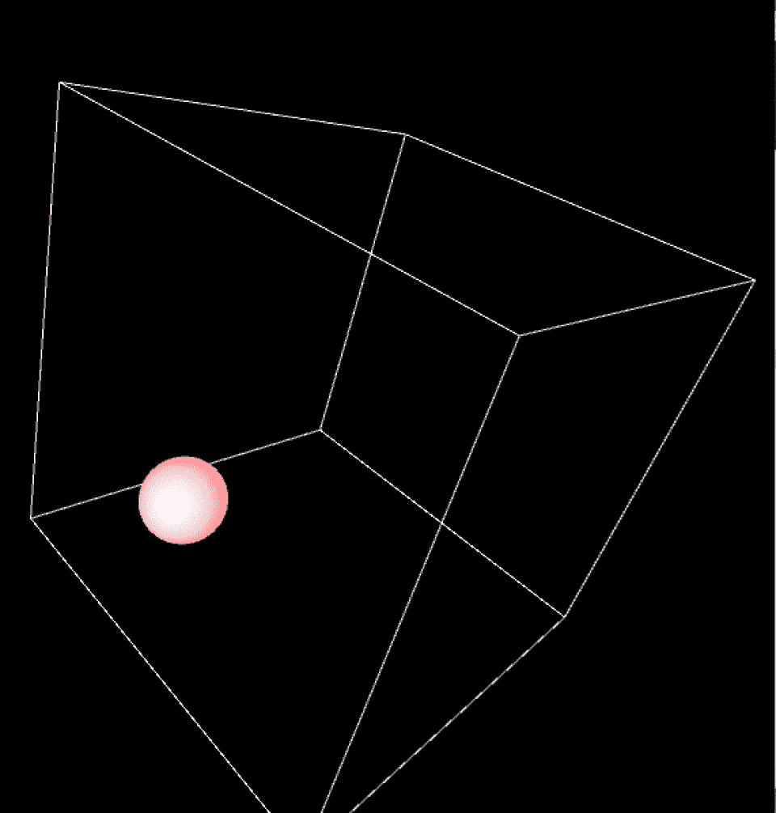

# 使用矢量物理创建碰撞物体

> 原文：<https://levelup.gitconnected.com/creating-a-colliding-object-with-vector-physics-b784bed91505>

在本文中，我们将使用基于 Java 的处理库创建一个基于矢量物理的简单碰撞器。

**注意**:本文假设你已经掌握了 Java 语法和面向对象编程的基本知识。加工库及其文档均可在 [**此处**](https://processing.org/) 获得。

# 向量

在我们开始之前，我们必须了解什么是向量以及它是如何工作的。一个矢量有两个属性:一个**方向**和一个**大小**，可以通过画一个从 A 点到 b 点的箭头来说明。

你可能已经猜到了，方向是由箭头指向的地方来表示的。箭头的长度称为它的大小。

例如，如果我们有一个长度为 5 个单位的 45 度角的顺时针箭头，我们说它的方向是东北方向，大小为 5。每个向量使用 x 和 y 坐标定义其位置，在 3D 空间中，我们还有深度元素:z 轴。

> 通过矢量，我们可以编程并模拟**运动**。

对象在屏幕上的位置是从原点(0，0)到其在物理或虚拟空间中的实际位置的向量。速度是另一个向量，告诉对象如何在特定方向上从一个点移动到另一个点，例如“向右移动 3 个单位，向上移动 5 个单位”(3，-5)。



位置和速度向量。参见**中的**代码的性质。

运动的算法很简单**把位置和速度矢量**加在一起！

在处理过程中，我们有 **PVector** 数据结构，它有两个浮点属性:x 和 y。还有可选的 z 属性用于 3D 模拟。本质上，它只是存储两个或三个坐标值的一种便捷方式。

```
**class** PVector { **float** x;
 **float** y; PVector(**float** x, **float** y) {
  **this**.x = x;
  **this**.y = y;
 }}
```

让我们想象一下，在屏幕上的(2，5)处有一个物体。我们想以 3 个单位的速度向右移动。我们可以简单地这样写。

```
**PVector** location = **new** **PVector**(2, 5);
**PVector** velocity = **new** **PVector**(3, 0);location.**add**(velocity); // new location is (5, 5)
```

矢量加法只是将两个矢量的 x 坐标相加，并对 y 坐标进行同样的操作。



向量加法的一个例子。参见**代码的本质**。

# 检测碰撞

现在你知道了什么是矢量，运动是如何工作的，我们可以看看如何检测碰撞。毕竟，这篇文章的重点是创建一个碰撞物体。

默认情况下，一个物体不知道它是否碰撞到了什么东西——即使它触及了我们屏幕的边界。让我们想象一下，我们想把我们的窗口变成一个对撞机。我们如何做到这一点？

到目前为止，我们知道我们可以使用位置向量来跟踪物体在屏幕上的位置。屏幕上的任何像素都有一个位置向量。因为从技术上来说，组成窗口的每个像素都是一个对象！

例如，如果我们想要获得大小为 640×360 的窗口右下角的位置向量，我们可以将其表示为( *640，360* )。在一个简单的矩形空间中，我们有四种可能发生碰撞的情况。

1.  我们对象的 x 坐标小于我们窗口的起点。对象在 **( *x < 0* ， *y* )** 。
2.  我们对象的 y 坐标小于我们窗口的起点。物体在 **( *x，y < 0* )** 。
3.  我们对象的 x 坐标大于我们窗口的宽度。对象在 ***(x > 640，y)*** 。
4.  我们对象的 y 坐标大于我们窗口的高度。物体在 ***(x，y > 360)*** 。

> 在处理过程中，我们可以分别使用全局变量**宽度**和**高度**来访问屏幕的宽度和高度。

在我们看如何用代码编写之前，我们需要定义当对象检测到碰撞时发生了什么。为简单起见，我们将模拟一个简单的弹跳球，而不计算真实世界的因素，如重力、摩擦力和加速度。

因此，我们可以说，在碰撞时，物体将以均匀的方式弹回。为了实现这一点，我们需要通过将速度向量上相应的轴乘以-1 来反转球的运动方向。

```
**void** detectCollisions() { **if** (**location**.x < 0 || **location**.x > **width**) {
  velocity.x = velocity.x * -1; 
 *// ball now moves in opposite horizontal direction* } **if** (**location**.y < 0 || **location**.y > **height**) {
  velocity.y = velocity.y * -1;
  *// ball now moves in opposite vertical direction* }}
```

现在我们已经对向量有了一个概述，并对如何模拟碰撞有了一个想法，我们准备创建真实的东西。

# 创建模拟

让我们来看看我们想要在这个程序中创建的两个主要组件:一个碰撞器和一个移动的物体。

我们希望这比我们迄今为止的想法更酷一点，所以我们将在 3D 空间中工作。对于我们的碰撞器，我们将使用一个立方体，我们的对象将是一个球体。

加工有两个主要的内置方法，**设置**和**绘制。**在 *setup* 方法中，我们通常初始化我们想要使用的变量。在我们模拟的生命周期中，它将只被调用一次。另一方面， *draw* 方法在每一帧都会被调用，因为它会重新绘制整个场景。位置和速度的变化必须发生在*抽屉*内。

## 步骤 1:创建碰撞器类

首先，我们将把碰撞器放在 3D 工作空间的中间。

```
**class** Box {
  **private** **float** _size;

  Box(**float** size) {
    _size = size;
  }

  **float** getRadius() {
    **return** _size / 2;
  }

  **void** drawBox() {
    **translate**(width/2, height/2, _size);
    **rotateY**(QUARTER_PI);

    **noFill**();
    **stroke**(255);

    **box**(_size);
  }
}
```

正如我们在上面的代码片段中看到的，这里发生了很多事情。盒子有一个名为 size 的属性，用来定义它有多大。它还有一个 *getRadius* getter 方法，我们将在碰撞检测中用到它。

这个类的主要方法是 drawBox。因为我们想把它放在屏幕的中间，所以我们将 x 轴设为宽度的一半，y 轴设为高度的一半。

之后，我们旋转 45°，引用全局变量 *QUARTER_PI，*在 y 轴上强调 3D 效果。这完全是可选的，可以省略。最后，我们用白色(255)轮廓和构造函数中指定的大小绘制一个透明框。

## **第二步:创建移动物体**

“感动”这个词应该足够告诉你了。矢量在这里开始混合。这个类还将处理我们之前看到的冲突检测功能。

```
**class** Ball {
  **private** **float** _size;
  **private** **PVector** _location;

  Ball(**float** size) {
    _size = size;
    _location = **new** **PVector**();
  }

  **void** move(**PVector** velocity, **float** colliderSize) {
    _location.**add**(velocity); **if** (**checkBounce**(_location.x, colliderSize)) {
      velocity.x = velocity.x * -1;
    }

    **if** (**checkBounce**(_location.y, colliderSize)) {
      velocity.y = velocity.y * -1;
    }

    **if** (**checkBounce**(_location.z, colliderSize)) {
      velocity.z = velocity.z * -1;
    }
  }

  **void** drawBall() {
    **translate**(_location.x, _location.y, _location.z);

    **fill**(255);
    **noStroke**(); **sphere**(_size);
  }

  **private** **boolean** checkBounce(**float** coord, **float** colliderSize) {
    **return** 
     coord > colliderSize - _size || 
     coord < _size - colliderSize;
  }
}
```

我们的移动对象有两个属性:大小和位置向量。就像我们的对撞机一样，它需要给自己上色，还要移动。

move 方法对我们来说很熟悉，因为它包含了我们已经探索过的理解运动和碰撞的逻辑。请注意，我们这次也在 z 轴上检查碰撞，因为我们是在 3D 中。

然而，在这种情况下，碰撞边界是盒子的面，而不是窗口的尺寸。这里我们还需要记住两个要点，让事情变得简单。

1.  移动对象是从屏幕中间开始的*。*
2.  碰撞区域是一个立方体，因此我们可以假设所有轴的半径都相同。这是所示代码中的*碰撞器大小*。

因此，碰撞条件是:

*   球的 x/y/z 坐标是 ***小于*** 盒子的半径减去球的大小。
*   球的 x/y/z 坐标是 ***大于*** 盒子的半径减去球的大小。

## 第三步:把所有东西放在一起

现在我们来看看将所有东西联系在一起的代码。

```
**Box** box;
**Ball** ball;**PVector** velocity;**void** **setup**() {
  **size**(600, 600, P3D); box = **new** **Box**(200);
  ball = **new** **Ball**(20);

  velocity = **new** **PVector**(10, 5, 2);
}**void** **draw**() {
  **background**(0); **lights**();
  **ambientLight**(255, 0, 0); box.**drawBox**(); ball.**move**(velocity, box.**getRadius**());
  ball.**drawBall**();
}
```

我们首先用一个 3D 空间来声明屏幕的大小，并初始化我们的碰撞器和移动物体。此外，我们设置一个起始速度矢量。

在每一帧渲染中，我们重新绘制背景和灯光。接下来，我们绘制碰撞器，通过将速度向量添加到球的位置来更新球的位置，并基于碰撞器的半径检查碰撞。最后，我们在球的当前位置绘制球。

最终结果应该类似于下面的模拟。



## ***参考文献***

*代码的本质，丹尼尔·希夫曼*