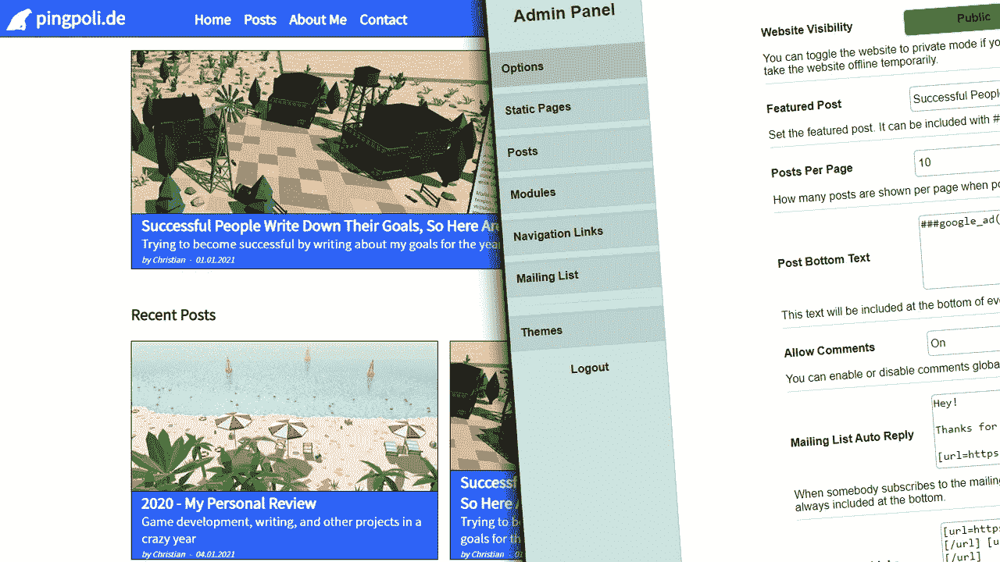
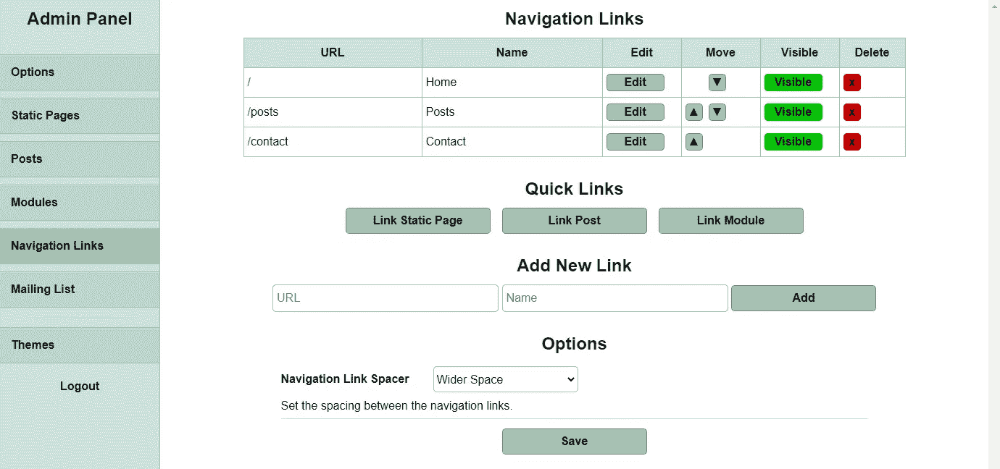
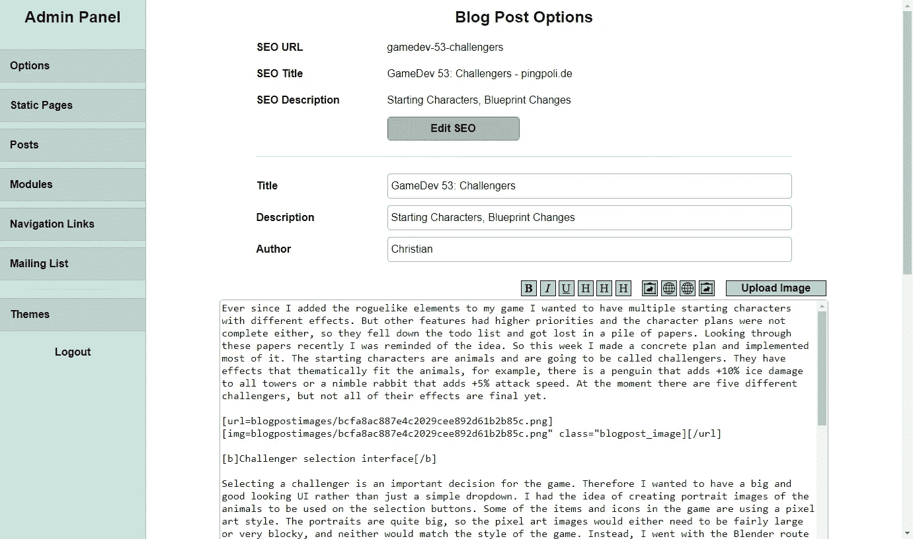
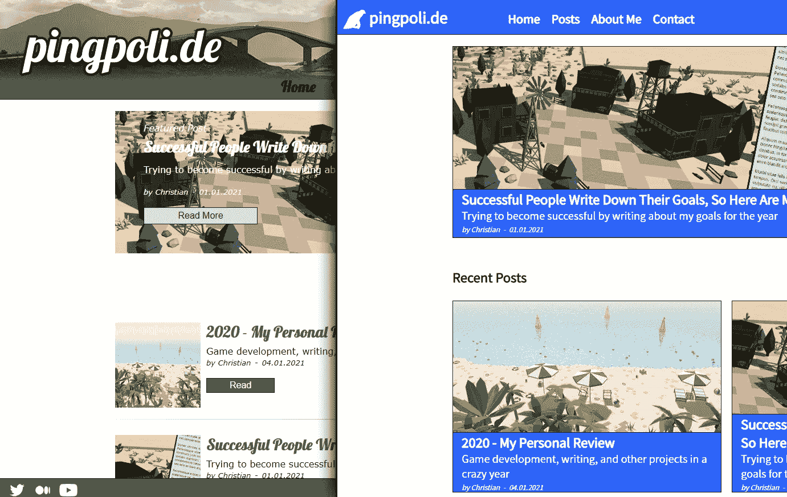

# 从头开始创建内容管理系统

> 原文：<https://levelup.gitconnected.com/creating-a-content-management-system-from-scratch-dafe7d4b8dce>

## 一个完整的故事，关于为什么我决定建立一个 CMS，结构，搜索引擎优化，管理面板，主题，等等



我的新内容管理系统。

这些年来，[我的网站](https://pingpoli.de/)已经越来越过时，失去了许多重要的功能，包括最基本的搜索引擎优化功能。虽然我最近写了很多东西，但总体来说，我在网站上发布的内容更少了，因为它不再符合我的要求。

因此，我决定让我的网站现代化。我没有在旧代码中添加新功能，而是大部分从零开始。有一段时间，我一直在考虑创建自己的内容管理系统，现在看来这是一个接受挑战的好机会。

在这个故事中，我想回顾一下我选择创建自己的 CMS 的原因，并谈谈一些设计决策和实现细节。

# 动机

当我创建我的网站的前一个版本时，我主要想用一些东西填充主域，所以我建立了一个简单的博客网站。它有一个静态的设计，但已经可以在管理面板中创建和编辑博客文章。当时我对 SEO 了解不多，但这并不重要，因为我没有用我的网站做任何重要的事情。

几个月后，当我开始对独立游戏开发变得更加认真时，我认为定期写关于我的进展的博客是一个好主意。我每周写一篇文章，但是没人看。然而，当我开始涉足其他话题，并在社交媒体上变得更加活跃时，我的网站显然需要一些 SEO 功能。

# 搜索引擎优化

我决定从头开始开发一个内容管理系统的主要原因是 URL。旧版本使用 GET 变量进行导航。它们工作得很好，实现起来简单高效。然而，它们并没有针对搜索引擎进行优化。

搜索引擎更喜欢[简短的、人类可读的、包含关键词的 URL](/seo-friendly-urls-2f7c503d3fb2)。所以我从旧风格`[*https://pingpoli.de?s=blogpost&bpid=60*](https://pingpoli.de?s=blogpost&bpid=60)`切换到更专业的外观和搜索引擎友好的变体`[*https://pingpoli.de/gamedev-52-viking-map*](https://pingpoli.de/gamedev-52-viking-map)`。

旧版本完全缺乏的另一个特性是 SEO meta 标签。该网站有一个单一的标题，每个页面都保持不变，根本没有描述标签。

因为更改 URL 和添加对 SEO 标题和描述的支持需要对代码进行更大的结构性修改，所以从头开始开发一切并从一开始就引入更好的结构似乎更容易。

# 主要结构

从根本上来说，每个网站都是页面的集合。因此，我也从一个通用的页面概念开始，它被分成了更专门化的子页面。一个页面控制着一些设置，这些设置对于每种类型的页面都是相同的。这包括标题、SEO 描述以及页面当前是否公开。每个页面还有一个 URL，作为数据库中的索引，因此索引文件可以根据 URL 获取正确的页面。

虽然有些设置对每个页面都很重要，但是只有一种类型的页面可以处理所有事情是不可行的。因此，我添加了三种类型的子页面:静态页面、文章和模块。

静态页面是最基本的。它们只包含静态内容。大部分是文本和图像。它们创建一次，不会经常改变。

帖子是你可以想象的博客帖子。它们也大多包含静态内容，并且在最初创建后不会真正改变。然而，它们还有一些额外的参数:标题、描述/副标题、作者、出版日期、大小缩略图和标签。也可以在帖子下面启用用户评论。

第三种也是最复杂的页面类型是模块。它们以类似于 WordPress 插件的方式用于所有不仅仅是静态内容的东西。比如我网站上的联系表单，多页的帖子列表都是模块。

与静态页面和帖子不同，模块需要一些 PHP 代码才能正常工作，因此它们必须在外部编写，然后才能安装在网站上。为了允许动态定制，模块还具有两个可以在管理面板中编辑的文本字段，文本包含在模块本身的上方和下方。例如，在联系页面上，只有表单元素是模块，而上面的文本和下面的广告是通过自定义文本包含的，因此它们可以很容易地更改。

当我在寻找一种动态加载不同模块的方法时，我发现了一个我以前不知道的非常好的 PHP 特性。可以从变量名实例化一个类，如下所示:

```
<?php
$className = “Test”;
$obj = new $className;
?>
```

这意味着可以从数据库加载模块名并动态调用其代码。这也意味着我可以开发另一个模块，上传它，它将在没有任何其他源代码更改的情况下工作。

# 管理面板

在实现了内容管理系统的初始结构之后，我把很多精力放在了管理面板上。事实上，我花在设计和实现管理面板上的时间可能比其他任务加起来还要多。我希望能够从管理面板中控制网站上的一切，而不必使用 PHPMyAdmin 这样的工具来调整数据库变量。

# 导航链接

动态添加页面的能力意味着我还需要能够定制网站导航区域中的链接。管理面板中的导航链接区域非常漂亮。我为所有三种类型的页面添加了快速链接按钮，这使得添加新的导航链接变得非常快速和容易。还可以链接到外部页面，动态显示或隐藏链接，改变它们的顺序，以及删除它们。



导航链接在管理面板中，图片由作者提供。

# 编者ˌ编辑

编辑器是我不太满意的地方之一。它有最重要的风格元素的 BB 码，可以嵌入图像、列表或 YouTube 视频。我使用 BB 码已经很多年了，我可以有效地使用它们。不过相比于 Medium editor 这种现代化的动态编辑器，感觉有点过时了。我可能会考虑在不久的将来为我的网站实现一个更好的编辑器。



管理面板中的编辑器，作者图片。

# 其他选项

除了页面选项，还有一堆整个网站的设置。首先，我添加了一个按钮来切换整个网站的可见性。当您想要执行维护或集成更新时，您可以使用按钮将网站设置为一段时间的私有。管理员还可以选择覆盖所有隐藏的页面，这样你就可以在公开之前预览页面。

因为网站的每个主题都将有一个底部文本和一个显示社交媒体链接的区域，所以我还为它们添加了可编辑的文本字段。最后，还有一些选项可以让我的定制网络分析工具 [Magpie](https://medium.com/swlh/creating-my-own-web-analytics-tool-dca5a1c720e3) 和 Google AdSense 在网站上添加广告。

# 邮寄名单

当你看到大作家、内容创作者和网站时，他们中的许多人都有一个邮件列表。当我发表新的博客文章时，甚至我的旧网站也有电子邮件通知系统。

因此，在我的新网站上包含一个邮件列表似乎也是明智的。我能够从旧代码中获取大部分基本功能，并添加了一些新的管理特性。旧版本没有办法写真正的时事通讯，它只能在新的博客文章发表时自动生成电子邮件。对于新版本，我希望能够写一个更加个性化的时事通讯，而不是一个通用的“*嘿！一个新的帖子已经发布*消息。

我知道其他人也在使用 ConvertKit 这样的公司作为他们的邮件列表，甚至对小账户也是免费的。但一如既往，我更喜欢创建一个定制的解决方案，更好地融入我的网站。

# 特殊命令

新内容管理系统中我最喜欢的功能之一是特殊命令。它们是一种将内容动态插入文本的方式。比方说，你写了一篇新的博文，你想引用另一篇博文。你可以使用一个普通的链接，但这并不引人注目。使用我的特殊命令，可以插入一个小的或大的文章预览，包括文章的图片、标题和副标题。尤其是图片更容易被点击，所以它不仅看起来更好，而且还增加了有人点击引用帖子的机会。

我编写了一个简单的解析器来处理特殊的命令。这种模式总是*# # #命令###* 并且有一些被接受的命令。如前所述，你可以给其他帖子添加预览，但也有一些命令可以将订阅表单插入我的邮件列表、Google AdSense 广告或 PayPal 捐赠按钮。

到目前为止，特殊的命令处理发生在核心 CMS 类中，添加新命令需要更改该类。然而，我也知道如何给特殊命令添加动态扩展。与模块类似，您可以添加一个带有新的特殊命令的文件，该命令可以在任何地方使用。一旦我遇到一个我想添加的新的特殊命令，我将实现这个新系统，使它更加有用。

# 主题

最初，我只想添加内容管理功能，并通过一些微小的设计更改将它们集成到网站的现有设计中。然而，我意识到添加类似 WordPress 的主题并不需要很多额外的工作，所以我继续做了。

网站的设计完全控制在主题文件中。它们主要由 HTML 和 CSS 组成，只需要最少的 PHP 代码就可以在正确的位置插入内容。这意味着设计者可以创建一个设计，而不必担心代码。功能和设计基本上是分离的，这对可升级性和维护性有很大好处。

除了将旧的网站设计转换成一个主题，并为新版本创建另一个主题之外，我还没有测试过任何其他设计。我肯定有一些疯狂的设计在目前的系统下是不可能的，但是当我发现一些不可行的东西时，我总是可以添加更多的功能。



左边的旧网站设计和右边的新设计，现在都是主题，可以通过一个按钮切换，图片由作者决定。

# 社交媒体元标签

包含图片的推文和其他社交媒体帖子更有可能被喜欢和点击。几年前，大型社交媒体平台推出了特殊的 HTML 元标签，告诉解析器如何解释链接页面上的内容。当你或其他人在社交媒体上发布你的网站的链接，并且它有社交媒体标签时，帖子会自动格式化，包括图像、标题和描述。它看起来更好，更专业，也增加了点击的可能性，同时可以方便快捷地添加到网站上，所以没有理由不包括这些元标签。

# 使用

不幸的是，我的内容管理系统的用例非常有限。现在，我只在我的个人网站上使用它，在不久的将来，我看不出有多少机会在其他项目上使用它。

我在 2021 年的[目标之一是成为自由职业者。比方说，我找到一个客户，他希望开发一个网站。不幸的是，在客户的项目中使用我的 CMS 是没有意义的。如果将来另一个开发者在那个网站工作，他们不会知道如何使用我的 CMS，互联网上也不会有任何教程，他们也不会知道如何开发模块或主题。](https://pingpoli.medium.com/successful-people-write-down-their-goals-so-here-are-mine-for-2021-4ec8ba482749)

虽然我对我的 CMS 的结果非常满意，但我知道它并不完美。当然还有一些错误，它可能会使用一些额外的功能。只要我是唯一一个使用它的人，我就可以在任何需要的时候修复错误和添加功能。然而，当它在其他服务器上运行时，在任何地方维护它都是一项额外的工作。

这意味着它可能只会用于我的网站，如果朋友和家人想用的话，也可能会用。对于自由职业者的工作来说，坚持使用 WordPress 和其他流行的 CMS 可能更有意义，虽然没有那么有趣，但却广为人知并被广泛使用。

# 结论

实现自己的 CMS 值得吗？和几乎所有其他事情一样，答案是“视情况而定”。纯粹从经济角度考虑，不值得。使用 WordPress 或另一个现有的 CMS 更快，有更好的支持和更多的教程，是众所周知的，并在业界广泛使用。

然而，我仍然相信创建一个内容管理系统是很棒的。首先，使用自己的系统总是更好。您将更有动力使用它并实现附加功能。您也确切地知道它是如何工作的，因此您可以快速地解决问题并自己修复它们。最后，这是一个很好的挑战，你可以从中学到很多。它几乎涵盖了 web 开发的每个方面，从功能强大的动态管理面板上的数据库后端到设计良好的前端。

我很高兴我实现了自己的 CMS，我对它的结果很满意。它不仅比我的旧网站更好，有更多的功能，而且通过使用模块，它还使未来的更新更容易，当我对当前的设计感到厌倦时，我可以轻松地创建一个新的主题，并通过单击一个按钮来更改它。

*原载于*[*https://ping poli . de*](https://pingpoli.de/creating-a-cms)*。*