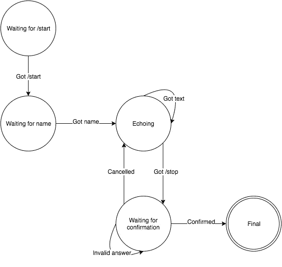

# 在 Node.js 中创建对话电报机器人

> 原文：<https://levelup.gitconnected.com/creating-a-conversational-telegram-bot-in-node-js-with-a-finite-state-machine-and-async-await-ca44f03874f9>

## 使用有限状态机和 async/await 创建一个带有节点的对话机器人


Telegram 是一款免费的多平台消息应用。他们经常发布具有有趣特性的新版本，其中最大的一个是他们的机器人平台。我最近在开发几个机器人的过程中得到了一些乐趣，我想到了一个基于有限状态机的基于对话的机器人的解决方案，该解决方案利用了 ECMAScript 即将推出的 async/await，我认为它很不错，也很有趣，值得分享。我将通过从头创建一个新的机器人来解释它。

# 介绍

Telegram 的 bot API 是无状态的。关于之前的对话，您获得的唯一数据是用户正在回复的消息的 ID(如果有的话)。最初，这意味着机器人只能轻松地响应单个命令，而不能进行更自然的对话来完成复杂的任务。

我们将构建一个简单的回声机器人，但具有一些对话特征。当机器人收到`/start`命令时，它会询问用户的名字。之后，它将开始回显，提到它回显的用户的名字。收到`/stop`命令后，它会要求确认。如果用户说是，那么机器人将停止回显，如果用户说不是，它将返回回显，如果用户说了其他任何事情，它将要求澄清。

我发现 Node.js 适合作为构建机器人的平台——通过 Telegram 的 API 进行的所有操作都是异步的，大多数时候我最终依赖 IO 来实现机器人的特定功能。Node.js 使得构建可以同时响应多个对话而不会阻塞的机器人变得更加容易。

你可以在这里看到所有的代码。如果你想尝试，你必须注册一个机器人，并在一个`.env`文件中设置它的密钥。请参阅自述文件中的确切说明。

# 第一次提交

第一次提交并没有真正针对这个主题，所以我将简单介绍一下我们将使用的工具和库。也许唯一稍微相关的是添加 babel，我们最终需要它来传输异步函数，但是我们需要为此做更多的配置。因此，如果您对该基本设置不感兴趣，请随意跳到下一部分。

查看 package.json 文件，我们的开发依赖项中有 eslint，还有 babel-eslint，eslint 需要它来很好地处理我们的异步函数。我还使用 nodemon 在开发过程中自动重新加载我的文件。运行时依赖项包括 babel 和 babel-register，以方便地传输我们的代码，babel 为 ES2015 预设的以及 dotenv，以从. env 文件加载 bot 的令牌。

index.js 文件只是使用 dotenv 从。env，启动 babel-register 并初始化 bot(此时它只是登录到控制台并退出)。

其余的是各种工具的配置文件。eslintrc for ESLint，。巴别塔的巴别塔。用 NVM 和指定节点的版本。编写代码时保持一致的风格。

# 反照现象

下一步是让机器人实际做一些事情。在深入研究代码之前，我们必须在平台中实际创建机器人。为此，请与[@机器人父亲](http://twitter.com/BotFather)交谈并按照步骤操作。归结起来就是给你的机器人一个名字。之后，您将获得一个令牌，机器人将在查询 Telegram 的 API 时使用它来标识自己。把它放在安全的地方，让我们开始做一些基本的功能。

首先，有一段时间我一直在手工编写与 Telegram 的 API 的交互，使用 request 或 got 来发出请求。在 NPM 有很多已经实现的解决方案，所以这次我选择了 node-telegram-bot-api。它实现了大部分 API 功能，并且很好地处理了回复。所以让我们安装它:

```
npm i node-telegram-bot-api --save
```

现在让我们更新我们的`Bot`类——它将使用由`node-telegram-bot-api`导出的类的一个实例作为客户端来与 Telegram 的 API 交互:

```
import TelegramBotClient from 'node-telegram-bot-api'

export default class Bot {
  constructor(token) {
    this.client = new TelegramBotClient(token, { polling: true })
  }

  start() {
    this.client.on('message', message => {
      console.log('Got a message', message)
    })
  }
} 
```

注意，我们需要向客户端传递两个参数——这个令牌非常简单，它是我们从 [@BotFather](http://twitter.com/BotFather) 那里得到的令牌。options 对象正在设置客户端以轮询更新。你的机器人有两种方法从电报获取信息。第一个是使用 webhook。您可以配置平台，将消息推送到您拥有的某个端点，并从那里读取消息。这是一个干净的解决方案，但同时也意味着更多的配置。例如，端点必须可以通过 HTTPS 访问。自签名证书可以工作，但是配置它仍然比使用轮询更麻烦。

轮询方法(实际上是长轮询)请求 Telegram 获取更新。如果没有，Telegram 的服务器会一直等待，直到有一个或超时。这样，在新的更新到来后，Telegram 会立即解决未决的请求，您的机器人几乎会立即得到它。

那么，我们如何将机器人的令牌发送给客户端呢？这就是 dotenv 的用武之地。我们不希望令牌是硬编码的，任何人都可以访问代码。所以我们将把令牌放在一个. env 文件中，比如

```
BOT_TOKEN=123456789:abcdefghijklmnoprqstuvwxyz
```

因为我们已经在我们的`index.js`文件中调用了`dotenv.load()`，所以我们在`process.env`中可以得到`.env`上的所有内容。所以我们将更新`index.js`来将这个令牌传递给我们的`Bot`实例:

到目前为止，我们的机器人记录它收到的每条消息。让我们再走一步，让它无论收到什么都有回音。使用`node-telegram-bot-api`非常简单，我们只需要告诉它我们想要发送什么消息(我们得到的确切文本)和哪个聊天(我们得到它的那个):

```
-    console.log('Got a message', message)
+    this.client.on('message', message => {
+      this.client.sendMessage(message.chat.id, message.text)
+    }) 
```

就是这样！在这一点上，我们有一个机器人，无论我们向它发送什么，它都会回应。让我们继续利用`async` / `await`进行一个非常简单的对话。

# 异步/等待

现在我们想让我们的机器人停止回应。当机器人收到消息说*停止*时，它只会说它停止了回应。为此，我们希望强制用户回复机器人的每个回应。你可以在第三次提交中看到所有的代码。

这可以不等待回复就完成——如果用户发送了“停止”消息，就让机器人发送“停止”消息。实际上*不会阻止*做任何事情，但最终结果是一样的。现在让我们等待用户的回复，然后我们将在下一步看到一个真正需要回复的例子。

我们将使用 send messages API 中的`ForceReply`选项让 Telegram 自动向用户显示 UI，以回复机器人的最后一条消息。我们发送回显的代码将如下所示:

```
this.client.sendMessage(message.chat.id, `echo: ${text}`, {
  reply_markup: JSON.stringify({ force_reply: true }),
})
```

注意，我们必须以字符串的形式传递选项，因此我们将使用`JSON.stringify`来实现这一点。

`sendMessage`返回一个承诺，该承诺在发送的消息通过后得到解决，其中包含一些有趣的信息，即可以用来等待回复的 id。`node-telegram-bot-api`有一个名为`onReplyToMessage`的方法，该方法将在消息到达时执行回调，该消息是对特定消息 id 的回复。所以让我们把这两个放在一起处理我们用户的第一个回复:

```
this.client
  .sendMessage(message.chat.id, `echo: ${text}`, {
    reply_markup: JSON.stringify({ force_reply: true }),
  })
  .then(reply => console.log(reply))
```

很好。那么我们实际上想对回复做什么呢？嗯，如果`reply.text === 'stop'`，我们要停止回响，否则我们要再次回响。并等待另一个回复。基本上和我们刚才做的一样。让我们把它提取到一个方法中:

```
respondTo(message) {
  if (message.text === 'stop') {
    this.client.sendMessage(message.chat.id, 'Stopping')
  } else {
    this.respondToMessage(message)
  }
}

respondToMessage(message) {
  this.client
    .sendMessage(message.chat.id, `echo: ${text}`, {
      reply_markup: JSON.stringify({ force_reply: true }),
    })
    .then(sentMessage => {
      this.client.onReplyToMessage(
        sentMessage.chat.id,
        sentMessage.message_id,
        reply => {
          if (reply.text === 'stop') {
            this.client.sendMessage(message.chat.id, 'Stopping')
          } else {
            this.respondToMessage(reply)
          }
        }
      )
    })
} 
```

这应该能行，对吧？嗯，是的。但是代码(也许可以说)比同步代码更难阅读。当算法基本上是一个`while`循环时，我们有一些嵌套。那么，如果代码看起来更像这样会怎么样呢:

```
respondTo(message) {
  let text = message.text

  while (text !== 'stop') {
    let sentMessage = this.client.sendMessage(
      message.chat.id,
      `echo: ${text}`,
      { reply_markup: JSON.stringify({ force_reply: true }) }
    )
    let reply = this.client.onReplyToMessage(
      sentMessage.chat.id,
      sentMessage.message_id
    )
    text = reply.text
  }

  this.client.sendMessage(message.chat.id, 'Stopping')
} 
```

提示:它可以，也将会。这就是异步和等待的用武之地。Async Functions 提案旨在简化编写上述异步代码的过程。它利用了生成器和承诺的力量——实际上可以认为是两者之上的语法糖——使得编写与承诺交互的代码变得非常简单。

第一个关键字 async 用在函数声明中，以表明它们是异步的。实际上，这意味着他们会兑现承诺。在我们的例子中，我们只需要将 respondTo 声明为 async respondTo。

await 只能在异步函数中使用。它将接受随后的承诺，并停止执行，直到它解决。将这两者放在一起，大致意味着以下两个片段是等效的:

```
function syncFunction() {
  return someAsyncOperation()
    .then(result => result + 1)
    .catch(err => console.error(err))
}

async function asyncFunction() {
  try {
    let result = await someAsyncOperation()
    return result + 1
  } catch (err) {
    console.error(err)
  }
} 
```

回到我们的代码，我们需要采取的第一步是配置 Babel 来支持异步功能。因为它们还不是规范的一部分，所以默认情况下它们不受支持。所以首先，我们想安装`babel-plugin-transform-async-to-generator`和`babel-polyfill`:

```
npm i babel-plugin-transform-async-to-generator babel-polyfill --save
```

一旦完成，我们需要在我们的`index.js`文件中要求`babel-register`之前添加`require('babel-polyfill')`，并在我们的`.babelrc`文件中配置 Babel 使用异步转换插件:

```
{
  "presets": ["es2015"],
  "plugins": ["transform-async-to-generator"]
}
```

现在我们可以在机器人代码中使用异步函数了。我们可以直接将`await`与`this.client.sendMessage`一起使用，因为正如我们之前看到的，它返回一个承诺。`this.client.onReplyToMessage`稍微复杂一点——它不返回一个承诺，而是执行一个回调，当回复到达时，回调作为最后一个参数接收。我们必须把它变成一个承诺，但幸运的是这一点也不难:

```
let reply = await new Promise(resolve =>
  this.client.onReplyToMessage(
    sentMessage.chat.id,
    sentMessage.message_id,
    resolve
  )
)
```

我不会深入承诺创建的细节，因为那里有很好的帖子，但它的要点是，我们正在创建一个新的承诺，当`this.client.onReplyToMessage`执行其回调时，该承诺将被解析，它解析的值是传递给该回调的参数。所以如果我们把所有的东西放在一起，我们最终会得到这样的结果:

```
async respondTo(message) {
  let text = (text = message.text)

  while (text !== 'stop') {
    let sentMessage = await this.client.sendMessage(
      message.chat.id,
      `echo: ${text}`,
      { reply_markup: JSON.stringify({ force_reply: true }) }
    )
    let reply = await new Promise(resolve =>
      this.client.onReplyToMessage(
        sentMessage.chat.id,
        sentMessage.message_id,
        resolve
      )
    )
    text = reply.text
  }

  this.client.sendMessage(message.chat.id, 'Stopping')
}
```

注意，我们将`respondTo`标记为`async`，然后在`while`循环体中使用了两个`await`。就是这样！代码读起来当然容易多了，几乎就像是同步的一样。如果我们不必“承诺”对`this.client.onReplyToMessage`的呼叫，这可能会更好，但这肯定比没有`async` / `await`的版本更容易理解。

我们必须做的另一个改变是——虽然用户回复将在`this.client.onReplyToMessage`中得到回调，但它们也是常规消息，所以它们也会在我们对`this.client.on('message')`的回调中显示。因此，我们必须更新回调，以便只考虑不是回复的消息。回复将已经被循环捕获。

```
start() {
  this.client.on('message', message => {
    if (!message.reply_to_message) {
      this.respondTo(message)
    }
  })
}
```

完成这些之后，是时候以状态机的形式建模更复杂的行为了。

# 有限状态机

让我们记住我们期望机器人的最终功能。它应该在`/start`上询问我们的名字。然后，它应该开始回应我们发送给它的任何东西，直到我们说`/stop`。当我们发送命令时，它应该要求我们确认。如果我们说“是”，执行就应该结束。如果我们说“不”，它应该回到呼应。如果我们说什么，它应该要求澄清。

可能有几种方法来模拟这种行为。我可以肯定的是，我希望避免在每个回复中检查一堆标志和复杂的条件，因为编写它们的痛苦比不上维护它们的痛苦。因此，创建它的心理模型的一个可能的方法是将机器人想象成几种状态中的一种，并且能够在它们之间转换:



我学习有限状态机已经有一段时间了，所以我不打算假装我记得足够清楚来解释它。我会为他们参考永远值得信赖的维基百科文章，但是如果你想要一个快速的解释，这就足够了。

有限状态机(从现在开始称为 FSM)是一种由状态以及状态之间的转换组成的模型。机器总是处于这些状态中的一种，直到一个事件发生，使它改变到另一种状态。这些状态中的一些可以被认为是最终的或终结的。

毫不奇怪，这个模型非常符合上面的机器人图。机器人将处于几种状态中的一种，这些状态主要代表它在等待什么——`/start`命令、名称、要回应的文本等等。我们的工作是根据机器的当前状态和我们从 Telegram 的 API 得到的消息来确定相应的事件。

同样，您可以检查[对应的提交](https://github.com/julioolvr/telegram-bot-example/commit/ffb568314ad5f8f531828246495f0cc1852e0e2c)来查看更改。

# 定义状态机

让我们从安装一个处理 FSM 内部的库开始。我会选`[javascript-state-machine](https://www.npmjs.com/package/javascript-state-machine)`，但很可能还有很多其他的。

```
npm i javascript-state-machine --save
```

现在让我们使用这个库来编写 FSM。因为 FSM 的一个实例跟踪它的当前状态，所以我们希望每个会话有一个实例。所以我们将从定义一个创建机器的函数开始:

```
import StateMachine from 'javascript-state-machine'function createFsm() {
  return StateMachine.create({
    initial: 'waitingstart',
    final: 'final',
    events: [
      { name: 'gotstart', from: 'waitingstart', to: 'waitingname' },
      { name: 'gotname', from: 'waitingname', to: 'echoing' },
      { name: 'gottext', from: 'echoing', to: 'echoing' },
      { name: 'gotstop', from: 'echoing', to: 'confirm' },
      { name: 'confirmed', from: 'confirm', to: 'final' },
      { name: 'cancelled', from: 'confirm', to: 'echoing' },
      { name: 'invalid', from: 'confirm', to: 'confirm' },
    ],
  })
}
```

如果您看一下每个事件，它们代表了图中定义的转换。这些状态没有明确列出，但是您会在转换中看到它们。我们可以使用`respondTo`中的函数为对话获取一个新的 FSM。此外，现在我们有了一个更好的方法来检查对话是否已经结束——我们可以使用状态机的方法`isFinished`来检查最终状态。让我们更新代码:

```
async respondTo(message) {
  let fsm = createFsm()
  let lastReply = message while (!fsm.isFinished()) {
    let text = lastReply.text
    let event = eventFromStateAndMessageText(fsm.current, text) if (!event || fsm.cannot(event)) {
      this.client.sendMessage(
        message.chat.id,
        "I wasn't expecting that, try /start"
      )
      break
    } fsm[event](lastReply) let sentMessage = await lastMessage
    lastReply = await new Promise(resolve =>
      this.client.onReplyToMessage(
        sentMessage.chat.id,
        sentMessage.message_id,
        resolve
      )
    )
  }
}
```

除了使用`fsm.isFinished()`作为我们的`while`条件，我们还使用了`fsm.cannot(event)`。这意味着，一旦我们弄清楚什么事件对应于接收到的消息，我们就可以检查机器是否可以实际应用该转换。否则，这意味着用户发送了我们没有预料到的东西。这不一定适用于这种情况，因为我们在决定应该触发哪个事件时已经考虑了当前状态，但是在更复杂的情况下这很有用。

注意，我们有一个还没有定义的`lastMessage`变量。让我们暂时把它放在那里，我们会回头再看它，但基本上它保存了机器人发送的最后一条消息，所以我们可以等待它的回复。

还要注意，我们调用`fsm[event](lastReply)`来实现 FSM 转换状态。对于我们为其定义的每个事件，FSM 都有一个方法来触发这样的事件。我们可以向该方法传递任意参数，稍后我们将在回调中使用这些参数。

现在让我们转到那个`eventFromStateAndMessageText`函数。我们将传递当前的机器状态和上一次用户回复的文本，并期望收到一个包含事件的字符串。我们考虑事件为`undefined`的情况，因为在给定当前状态的情况下，我们得到的消息可能没有有效的事件。该函数中的逻辑类似于“如果我在等待/start 命令，并且我得到了/start 文本，则事件为‘got start’，”如果我在等待名称，则我收到的任何文本都会生成‘got name’事件”等等:

```
function eventFromStateAndMessageText(state, text) {
  switch (state) {
    case 'waitingstart':
      return text === '/start' && 'gotstart'
      break
    case 'waitingname':
      return 'gotname'
      break
    case 'echoing':
      return text === '/stop' ? 'gotstop' : 'gottext'
      break
    case 'confirm':
      if (text === 'yes') {
        return 'confirmed'
      } else if (text === 'no') {
        return 'cancelled'
      } else {
        return 'invalid'
      }
  }
}
```

# 定义机器的行为

现在到最后一部分:我们实际上在哪里回复用户？嗯，FSM 为我们提供了几个回调函数，特别是当机器进入和离开一个状态时，以及在执行一个事件之前和之后。每个都有自己的用例，但我们认为我们的机器人在这里我相信使用事件回调是有意义的——在我得到/开始后，我想问名字。有了名字之后，我想开始附和，诸如此类。

我们想把这些回调附加到`respondTo`内部的机器上，因为我们需要它们的一些上下文——我们想要我们响应的聊天 id，我们想要访问电报客户端，以便能够发送回消息。因此，在`while`循环之前，我们将定义所有的回调:

```
let name
let lastMessagefsm.ongotstart = () => {
  lastMessage = this.client.sendMessage(
    message.chat.id,
    "Let's begin! What's your name?",
    {
      reply_markup: JSON.stringify({ force_reply: true }),
    }
  )
}fsm.ongotname = (event, from, to, message) => {
  name = message.text
  lastMessage = this.client.sendMessage(
    message.chat.id,
    `Got it ${name}, I'll begin echoing your replies until you respond with /stop`,
    { reply_markup: JSON.stringify({ force_reply: true }) }
  )
}fsm.ongottext = (event, from, to, message) => {
  lastMessage = this.client.sendMessage(
    message.chat.id,
    `Echoing for ${name}: ${message.text}`,
    {
      reply_markup: JSON.stringify({ force_reply: true }),
    }
  )
}/*...*/
```

为了简洁起见，我省略了一些回调，但是它们都非常相似。我相信，这就是将机器人建模为 FSM 如此有用的原因。一旦应用了转换，我们就可以将转换(我收到了这条消息，我正在等待这件事情)与实际行为分开。我们的`oncancelled`回调知道我们在回显并得到一个/stop 命令，然后这个命令被取消了。它所要做的就是发回适当的信息。甚至不转换到另一个状态 FSM 会处理它。

我们定义了两个新的变量，在回调之外的不同消息中我们将需要这两个变量— `name`，其中我们将存储用户为当前对话提供的名称，以及之前看到的`lastMessage`，这样我们就可以等待它被发送，并在需要时期待回复。

仅此而已！看看 [Github](https://github.com/shivapendem/conversation_telegram_bot.git) 上完成的代码。当然，还可以对机器人做更多的事情。例如，停止那些`this.client.sendMessage`调用，也许创建一个定制的类来包装 FSM 并保持所需的上下文(特别是，`javascript-state-machine`有一个`target`选项来扩展另一个类的现有实例并将其转换成 FSM)。但是我认为，在目前的状态下，它已经显示了将机器人建模为 FSM 是多么有用，以及使用`async` / `await`的代码是多么干净和可读。

如果你觉得这篇文章是有帮助的，如果你能给下面的地址提示乙醚，将不胜感激。谢谢大家！

```
0xe8312ec868303fc3f14DeA8C63A1013608038801
```

更多信息请打我的电报 id [@chigovera](https://t.me/chigovera) 联系我。