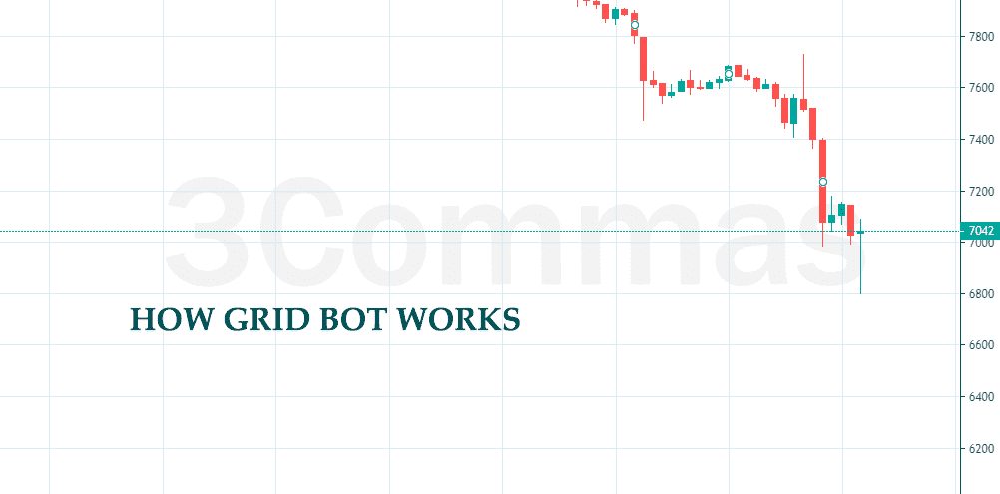

# 创建一个有趣和盈利的加密交易机器人

> 原文：<https://levelup.gitconnected.com/creating-a-crypto-trading-bot-for-fun-and-profit-fbf8d74de8c6>


在 [Unsplash](https://unsplash.com?utm_source=medium&utm_medium=referral) 上由 [Austin Distel](https://unsplash.com/@austindistel?utm_source=medium&utm_medium=referral) 拍摄的照片

几个月前，我开始了加密交易，因为一件不愉快的事情让我失业了两个月。往好的方面想，我想这可能是我最终学习密码和交易的机会，因为“有趣又有利可图”。我开始观看 youtube 视频和阅读博客文章，学习密码和交易的基础知识。以下是我的主要资源:

1.  [CoinBureau](https://www.youtube.com/c/CoinBureau) 是 youtube 的一个频道，提供高质量的加密相关内容。
2.  [AltCoin Daily](https://www.youtube.com/channel/UCbLhGKVY-bJPcawebgtNfbw) 是另一个 youtube 频道，它提供加密市场周围发生的所有事情的每日更新。
3.  币安学院就像一个博客，在这里你可以找到关于加密和交易的内容。

过了一段时间，我开始根据盖伊的视频与 BTC、瑞士联邦理工学院、阿达和马蒂奇手动交易。我没花多少时间就意识到交易是一份全职工作，如果我不想错过机会，我需要盯着很多屏幕来监控价格。虽然这是一个令人愉快的爱好，但我不想改变我的职业，成为一名交易员。

在这些 youtube 视频中，这个[一个](https://www.youtube.com/watch?v=9Hv0BQwYlPw)引起了我的注意，让我萌生了开发交易机器人的想法。会有多难，对吧？我的第一次尝试从各方面来看都是一场灾难。它的性能很差，利润很低，非常复杂，而且很难进行回溯测试。使用了 9 个[马](https://academy.binance.com/en/articles/moving-averages-explained)和 24MA 杂交([死亡和黄金杂交](https://academy.binance.com/en/articles/golden-cross-and-death-cross-explained))的[技术分析](https://academy.binance.com/en/articles/what-is-technical-analysis)。这太糟糕了，以至于我几乎放弃了这个想法，直到我了解了本文所讨论的网格机器人。

# 放弃

在我们进入实际内容之前，我有一个免责声明。**我不是财务顾问**，本文中的任何内容都不应被视为财务建议。永远**做你自己的调查** (DYOI)并且只投资你有可能失去的东西。

不要忘记，代码中的一个小错误可能会让你损失一大笔钱。我是吃了苦头才知道的！

最好有交易概念和术语的基本知识，如[烛台](https://academy.binance.com/en/articles/a-beginners-guide-to-candlestick-charts)，订单，头寸，[牛市，熊市和横盘](https://academy.binance.com/en/articles/what-is-a-bull-market)，[做空和做多](https://www.thebalance.com/long-and-short-trading-term-definitions-1031122)，以及[技术分析](https://academy.binance.com/en/articles/what-is-technical-analysis)。如果没有，币安学院是一个很好的起点。然而，不知道这些不会成为这篇文章的障碍。

阅读本文时要记住的最后一件事是:为了简单起见(并且尽可能简短)，许多代码已经被删除，剩下的代码是伪代码来解释这个概念。

# 网格机器人

说到平台，有许多提供有限的自由交易机器人，例如 [3commas](https://3commas.io/) 、 [Pionex](https://www.pionex.com/en-US/) 和 [KuCoin](https://www.kucoin.com/) 。看了盖伊的视频后，我决定试一试，从 3 个 Commas 开始。这些概念似乎非常简单，易于实现。那么为什么不试一试呢？

## **回溯测试**

当你开发一个机器人时，你会想在投资之前测试它。在交易领域，这被称为回溯测试。回溯测试是向机器人提供历史数据，并检查其执行情况。

这是为你的机器人做设计决策时要记住的最重要的概念之一。您必须确保实现提供了一种执行回溯测试的简单方法。依赖注入、纯函数和确定性。你的机器人应该总是为相同的输入返回相同的结果，而且不应该依赖于时间！

## 交换

您的机器人需要连接到一个 API，以获取最新价格，并发出买入或卖出订单。你必须弄清楚你想和哪家交易所合作。它应该为您提供符合您需求的良好文档和灵活的 API。

我用的是[币安](https://www.binance.com/en)！然而，我的代码没有一个与它紧密相关。所以在任何时候，我都可以通过重构`Exchange`类来切换到另一个交换。币安提供了一个记录良好的 API 和测试网络来开始。没必要提盖伊的这个视频。

交换类伪代码

`Exchange`类实现了三个方法:

1.  `getBalance`会返还账户余额。
2.  `createOrder`将创建一个【市场】订单。它应该在创建订单之前检查余额，以防止订单失败。
3.  `getAllPrices`获取所有对的最后价格。

关于您决定使用的交换，您可能需要添加更多的方法。

## 网格机器人如何工作

网格机器人将一系列价格分成买卖订单。网格机器人通常在启动时在每条网格线上创建买卖订单。然而，我更喜欢在买盘或卖盘出现后执行和下单。

**Pair 或 Symbol:** Pair 是你买卖的东西，例如 BTC/USDT。符号或符号对由两种资产或标记组成。第一部分被称为`baseAsset` (BTC)，第二部分被称为`quoteAsset` (USDT)。当你买一对时，你通过给予`quoteAsset`来获得`baseAsset`。而当你卖出时，你通过卖出`baseAsset`获得`quoteAsset`。为了简单起见，我只选择带有`USDT`的配对作为它们的`quoteAsset`。

配置网格机器人从选择低频带(`minPrice`)和高频带开始。这些值是通过查看以前的市场价格来选择的。例如，3Commas 使用[过去 7 天的最高价和最低价，有 3%的偏移](https://help.3commas.io/en/articles/4111562-grid-bots-an-introduction-to-ai-grid-bots)。当您选择 AI 策略时，Pionex 使用[过去 7 天的回溯测试](https://www.pionex.com/blog/pionex-grid-bot/)来设置配置。

下一个参数叫做`gridCount`。`gridCount`是最低价和最高价之间的分割数。随着 T3 越来越大，交易越来越多，利润越来越少(T4 越来越小)，反之亦然。`gridWidth`是两个连续的`gridLine`之间的差值。在头寸数量和每个头寸的利润金额之间存在权衡。例如，如果我们考虑 BTC，在过去的 7 天里，58281 的低波段和 69344 的高波段似乎是合理的。如果我们将这个范围分成 24 个网格，我们将得到 481 的`gridWidth`。也就是说，如果你买入，价格上涨了 481 USDT，那么你获利 8。如果我们将这个区间除以 12，那么价格必须上涨 962 USDT 才能平仓，然而利润会更高`tradeAmount x 962`。

配置的最后一部分是创建`gridLine` s。可以使用`minPrice`、`gridWidth`和`gridCount`创建它们。生成网格线后，最接近当前价格的线将被停用。这上面的所有线将是`SELL`，下面的线将是`BUY`。

如果价格向下移动并穿过一条`BUY`线，一个买入指令将被执行，该线将被停用，该线以上的所有线将变为有效并`SELL`。另一方面，如果价格上涨并穿过`SELL`线，将执行卖出指令，该线将被停用，该线以下的所有线将变为`BUY`并激活。

查看这张由 3Commas 制作的 GIF 图片，它详细阐述了网格机器人的每一步。



网格机器人如何工作

下面是网格机器人的伪代码。

`decide`方法将检查`lastPrice`中的每一条活动线的买入或卖出情况。为了找到最好的买入点，你想从最低价开始向上移动，而对于卖出点，你想从最高价开始向下移动。

这种方法还应该考虑到价格是否高于上限或低于下限。在这些情况下，大多数网格机器人将被停用，直到价格回到范围内或用户干预并改变配置，例如 [3commas](https://help.3commas.io/en/articles/4111562-grid-bots-an-introduction-to-ai-grid-bots) 。 [Pionex Infinity grid bot](https://www.pionex.com/blog/pionex-infinity-grid-bot/) 另一方面，如果价格高于网格，它会在顶部添加新的网格线(增加上限),但如果价格低于网格，它仍会停用。

你可以自己决定在这些情况下你希望你的机器人如何表现，但是要确保你已经彻底地回测了这些决定。

## 管理机器人

现在我们有了一个网格机器人，我们需要一个引擎来管理我们的实例。我们不想只为一个符号运行这个。这是开发你自己的机器人的好处。使用免费版本的网格交易平台，你可以运行的网格机器人的数量是有限的。

but runner 引擎的伪代码

当你启动一个机器人时，引擎将从数据库获取机器人的数据，创建一个实例并调用`bot.start`方法。它还将每隔一段时间(这段代码中为 1 分钟)调用`bot.execute`方法，从 exchange 获取最后的价格。为了停止一个机器人，引擎将调用`bot.stop`，给机器人一个机会保存它的状态并优雅地停止。

## **回测网格机器人**

回溯测试引擎将获取测试机器人所需的历史数据，并通过配置来启动机器人。然后它会对所有的 bot 运行`bot.execute`，返回这个组合的最终利润。

我所说的组合是指您选择来运行回溯测试的资产组，例如`BTC,ETH,ADA,LTC,MATIC,...`。你还应该知道，即使这些机器人被调用的顺序也会影响收益——除非你有无限量的`quoteAsset`。我们稍后会详细讨论这一点。

回溯测试引擎

我们还需要模拟`Exchange`类进行回溯测试。我们实现网格机器人的方式将允许我们注入这个类作为依赖(IoC)。

用于回溯测试的模拟交换类

添加了一个`setBalance`方法来设置您帐户的初始余额。`createOrder`方法应该通过检查余额来检查买卖订单是否有效，如果有效，它应该更新余额。`getAllPrices`方法应该返回回溯测试中所有配对的历史数据。

当你完成了足够的回溯测试后，就该在测试网络上测试你的机器人了，看看命令是否被正确执行。通常，几周的时间足以验证它是否如预期的那样工作。

# 寻找最佳配对

当你在一个真实的网络上运行你的机器人时，你可能会注意到，过了一会儿，它们不再进行任何交易，因为你的账户已经用完了`baseAsset`。当你所有的投资组合都跟随同一个看涨或看跌市场时，就会发生这种情况。例如，假设你有 1000 USDT 作为你的 T4，你每笔交易花了 200 USDT。在这种情况下，由引擎执行的前 5 个机器人将花费所有资产，其余机器人将无法创建购买订单。如果这些对中的一些会向相反的方向移动，那就太好了。因此，当一些机器人出售时，其他机器人就会购买，反之亦然。

如果你有大量的`baseAsset`，那么给自己省点时间，就此打住。文章的剩余部分处理这个问题。

因此，这是一个百万美元的问题:*如何选择最佳的组合对，以确保最大的利润？*

## 贪婪算法

使用贪婪算法，我们必须计算不同长度的所有对的所有可能组合。长度是参与交易的对数。如果有 200 双鞋，那么 40 双鞋的组合可能比所有这些鞋一起使用利润更高。因此，我们必须考虑所有可能的长度以及每个长度内所有可能的阶数。

你可能会想，有了现在的电脑，这应该不会花太多时间。嗯，你错了！

在[数学](https://en.wikipedia.org/wiki/Combination)中，当[顺序关系到](https://www.mathsisfun.com/combinatorics/combinations-permutations.html)时，有`n!/(n-r)!`组合从`n`项中挑选`r`项。正如我之前解释的，当我们限制了`quoteAsset`时`BTC,ADA,…`的利润与`ADA,BTC,…`不同。假设我们有 20 对鞋，我们想找出最小长度为 10 的最佳组合:


20 个项目中长度为 10 到 20 的组合总数

我不会计算这个数字，只是给你一个估计，让我们只考虑这个序列中的最后一个数字，`20!`。如果我们有一台能够在一秒钟内运行 1000000 次回溯测试的机器(这是非常值得怀疑的)，那么计算所有这些组合将需要 77146 年！

```
2,432,902,008,176,640,000 / (1000000*60*60*24*365) = 77,146
```

回测单个组合意味着在每个区间用最后的价格为每个机器人调用`bot.execute`方法。假设我们有 16 个机器人的组合，在过去的两个月里，我们以 1 分钟为间隔进行回测，这意味着`60*24*60*16=1,382,400` `decide`在单个组合上运行。无需提及获取历史数据、配置机器人、数据库和 I/O 操作的网络延迟。我的 Macbook Pro (16GB 内存、M1 芯片和固态硬盘)每秒最多能进行 20 次回溯测试！

在写这篇文章的时候，币安有 1778 双。因为我只使用 USDT 鞋，所以剩下 356 双。通过对`gridWidth`、`minPrice`进行过滤，并计算平均网格利润，我设法将这个数字减少到 189。你算算吧！

## 遗传算法

尽管贪婪算法保证了最佳组合，但它不适用于这个用例。在这些情况下，我们通常使用[遗传算法](https://en.wikipedia.org/wiki/Genetic_algorithm)，它在合理的时间内提供足够好的(如果不是最好的)解决方案。

**注意:**你可能注意到在我代码的不同地方使用了`token` (asset)而不是`pair`或`symbol`。由于我使用 USDT 作为所有对的报价资产，因此很容易将令牌转换为对，反之亦然。如果您计划使用其他报价资产，请记住这一点。

**建模**

为了给染色体建模，我使用了一个字符串数组(`genes`)来表示染色体对。`genes[i]`可能包含一个令牌或一个空字符串。为了简化交叉和变异操作，所有染色体的长度都是相同的。这就是为什么有些`genes`包含空单元格的原因。

**健身**

通过对染色体中的所有标记按照它们的顺序运行回溯测试，可以简单地计算适应度。和利润是一样的。

**初始人口**

通过将一个令牌或一个空字符串随机推入一个`genes`数组来生成单个染色体。当染色体产生时，它应该被精炼。细化一条染色体保证所有记号都是唯一的，记号的数量大于一个名为`minGeneSize`的可配置值。

下面是`Chromosome`类的伪代码。

染色体类别的伪代码

**交叉和变异**

交叉会把两个亲本一分为二，然后通过交叉合并产生两个后代([单点交叉](https://en.wikipedia.org/wiki/Crossover_(genetic_algorithm)))。第一个子代具有第一个父代的前半部分和第二个父代的后半部分。第二个子代具有第二个父代的前半部分和第一个父代的后半部分。这些子代必须被验证，因为它们可能是空的，有重复的对，或者它们可能已经存在。

在杂交(创造下一代)之后，我们必须使这些染色体中的一些发生突变。变异将阻止算法收敛于局部最优解。这种变异会将两个随机指数互相交换。`discovery.mutate`方法将从群体中选择`mutationRate*populationSize`染色体，并对每条染色体调用`mutate`方法。

**选择**

计算适应度后，结合上一代和新一代产生新的种群。然后，这个群体将被细化(删除重复)和排序的基础上，他们的适应度(利润)。该列表的顶部`populationSize`将被选择用于下一次迭代。

下面是实现这个算法的`Discovery`类的伪代码。

在两个月(2021 年 9 月和 10 月)的历史数据上运行该算法，3 分钟间隔，189 对，20 次迭代，群体规模为 200，突变率为 0.1，初始余额为 2000 USDT，用了 82 分钟完成，并找到了以下 3503 USDT 利润的组合。不错吧？

```
POLY,NU,WAVES,ATA,WTC,XTZ,XRP,VIDT,SOL,AXS,POLS,CTSI,MASK,FTM,CLV,GTC,STRAX,ALPACA,SUSHI,NKN,ILV,QNT,ALGO,GALA
```

虽然可能有更好的组合，但考虑到花在这上面的时间，我会说两个月 175%的利润，相当不错了。请记住，这是一个回溯测试的结果，未来的市场可能会不一样。密码市场非常不稳定。

不要犹豫，分享你的想法，观点，并在评论区提出讨论。如果你能让我知道内容中的任何错误，我会非常感激，这样我可以为下一个阅读它的人改进它。

如果你打算从这些服务中的任何一个开始，这里有我推荐的对我们双方都有利的交易和佣金:[币安](https://accounts.binance.com/en/register?ref=E12U8350)、 [3Commas](https://3commas.io/?c=tc535014) 、 [Pionex](https://www.pionex.com/en-US/sign/ref/3oESTrGO) 和 [KuCoin](https://www.kucoin.com/ucenter/signup?rcode=rJTXNBS) 。

愿利润与你同在；)