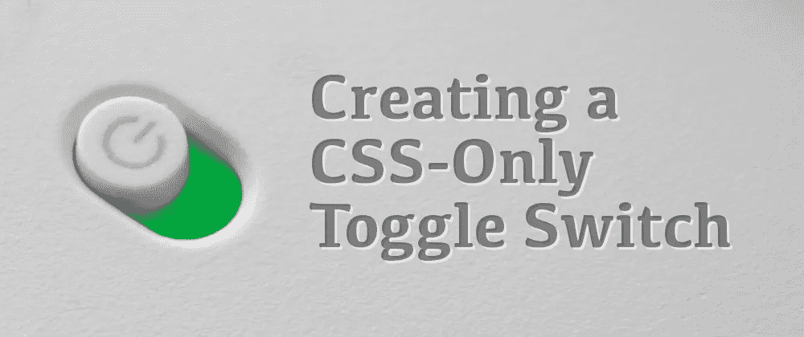
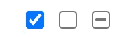
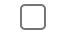
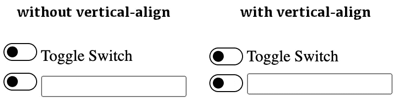
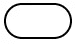
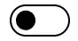
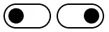

# 创建仅 CSS 切换开关

> 原文：<https://levelup.gitconnected.com/creating-a-css-only-toggle-switch-f62f64301284>



## 如何用 HTML 和 CSS(没有 JavaScript)创建一个功能强大且可访问的 switch 组件

网上有很多文章讲述如何只用 HTML 和 CSS 创建一个开关，而不用任何 JavaScript。这个会有什么不同？它会给现有的文章增加什么价值？为什么*我*会写？

很多关于这个话题的文章都是“过时的”或者实现了老派的解决方案(甚至是最近发表的！)此外，大多数人忽略了 web 开发的基本部分，例如 web 可访问性或可用性。最后，我想超越“是什么”或“怎么做”，而专注于“为什么”同时保持中立和现实的语气:我喜欢 CSS，但不想听起来像一个认为 CSS 是万能的粉丝。

希望我能实现这些目标，你会喜欢这篇文章。或者至少你觉得它很有见地。

# 复选框与开关

当使用 CSS 创建切换开关时，复选框似乎是显而易见的选择，我不会对此进行争论:它有一个状态，浏览器处理逻辑，我们所需要的只是设计复选框的样式(或者它的标签，稍后将详细介绍)。)

虽然所有这些陈述都是正确的，但必须强调一个关键点:**交换机不是复选框**。如果他们是一样的，我们甚至不会有这样的文章！复选框和切换开关看起来不同，行为不同，并且具有不同的值。

## 状态的数量和类型

开关有两种可能的状态:开和关。激活时为“开”，未激活时为“关”。同时，**复选框有三种状态:选中、未选中、不确定**。从 HTML 的角度来看，我们倾向于忘记不确定状态，因为它更直观，我们需要 JavaScript 来动态设置它。



玩家 3 进入游戏。

先验地，这个第三状态不会影响我们的实现。尽管如此，在文档中指定**开发人员不能通过代码**将复选框设置为这种不确定的状态还是有意义的。不幸的是，如果不添加 JavaScript，就没有办法强制执行这个要求，这可能会破坏交换机的工作方式。因此，在文档和说明中添加注释是我们唯一的选择。

## 副作用行动

复选框和开关之间最显著的区别是后者应该在被激活或停用时执行一个动作。因此，举例来说，如果我们使用组件来定义一些设置，改变它的状态将触发应用程序或网站的直接变化。

我们必须记住，开关的全名是“拨动开关”或“拨动按钮”，这使得它更明显地是一个按钮，并且在与它交互时会有副作用。

如果这个开关是一个 JavaScript 组件，我们可以在没有与值更改相关联的回调函数时显示错误消息，或者防止不确定的状态。它可能并不完美，但总会有所收获。作为一个静态组件，我们必须提供良好的实践指南和文档，并相信开发人员的良好判断。

# HTML 代码

大多数在线教程选择结合两个标签来生成一个开关。一个 HTML 结构，看起来像这样的变体:

```
<input type="checkbox" class="switch" id="my-switch" /><label for="my-switch">Label text</label>
```

然后，输入被隐藏，标签的伪元素帮助绘制拨动开关及其两种状态。简单，但容易出错和出现问题:

*   **这是一个刚性结构**:交换元素的顺序最终会打破开关。此外，即使是可视化中最微小的变化(例如，从左到右移动拨动开关)也需要 CSS 中的额外变化。
*   **它往往是不可访问的**:很多事情都可能出错，产生一个不可访问的组件(这在大多数教程中都会发生)。两个主要的问题是:以一种不能通过键盘访问的方式隐藏复选框，以及不能正确处理焦点。

但是这个实现并不都是坏的！**输入+标签方法有一个很大的好处:它有一个标签**。根据[web aim 100 万报告](https://webaim.org/projects/million/)，缺少表单标签是当今困扰网站的最常见的网页可访问性问题之一。所有输入都应该有一个可访问的名称，这个实现强迫用户有一个名称，这很“好”

我们要做一些更简单的事情:

```
<input type="checkbox" role="switch" />
```

注意，我没有添加 label 标签，但这并不意味着我们不需要它。正如上面几段提到的，所有的输入都必须有一个可访问的名称。不同之处在于，在我们的例子中，这不是一个要求。这给了我们非常需要的灵活性，允许我们以不同的方式构建 HTML 代码，而不需要任何 CSS 更改:

```
<!-- label before the input -->
<label for="ms1">My switch</label>
<input type="checkbox" role="switch" id="ms1" /><!-- label after the input -->
<input type="checkbox" role="switch" id="ms2" />
<label for="ms2">My switch</label><!-- label wrapping the input -->
<!-- Warning: some ATs may have trouble reading this -->
<label>
  <input type="checkbox" role="switch" />
  <span>My switch</span>
</label>
```

> **作者注**:为了简单起见，我将继续这篇文章，专门关注将生成拨动开关的输入。标签很重要，必须添加到我们的代码中，但是它的样式与复选框的样式无关，所以本文不讨论它。

我们通过使用`role="switch"`来实现三个不同的目标:

*   我们提供了复选框和拨动开关之间的区别:在这一点上，人类可能无法区分它们(如果没有样式，它们看起来都像复选框)，但我们已经在语义上改变了组件，机器将检测到差异，这为接下来的两者让路。
*   辅助技术(AT)将复选框识别为一个开关:这很重要，因为它们不仅会在到达我们的组件时通知一个切换开关，而且它们还会将值读取为“开”和“关”，而不是“选中”和“未选中”。
*   我们提供了一个选择机制:现在我们可以区分复选框和切换开关，我们也可以在 CSS 中不同地选择它们！我们可以为复选框(`input[type="checkbox"]`)和开关(`input[role="switch"]`)提供不同的样式。下一节将详细介绍这一点。

就是这样——一个 HTML 元素。一个复选框变成了开关。之后，当我们将组件放在页面上时，我们会添加一个标签，但这将取决于我们的条件:因为我们想要并且这是正确的事情，而不是因为我们必须这样做。

选择这个选项的另一个原因:**复选框本身有很多功能，我们可以通过使用这个方法来保留这些功能**，但是如果我们选择输入+标签的解决方案，我们将会失去这些功能。这是该实现中大多数问题的根本原因:

*   **复选框获得焦点；标签没有**。因此，输入的隐藏必须是可访问的，让复选框在使用键盘导航时获得焦点。否则 ATs 无法正常公布结构。
*   **复选框得到概述；标签没有**。如果您使用双标签解决方案，您将需要考虑输入的焦点，并相应地突出显示相关的标题。CSS 中类似于`input:focus + label`的东西来提供特定的焦点样式。乱，乱。
*   **复选框得到打印；背景不**(默认)。这个问题可能无关紧要，但请听我说完。人们仍然从网上打印，他们打印表格。但不幸的是，定制组件最常见的错误之一是它们不能正确打印。在单选按钮、复选框或拨动开关的情况下，这是一个大问题。

通过保持组件的简单，我们将对它有更多的控制，同时利用浏览器直接提供的所有特性。此外，标签上不需要“杂乱”的样式，这意味着样式更加灵活。我们的下一步将是这个，因为直到现在，我们的拨动开关看起来仍然像一个复选框。



到目前为止，我们的开关只是另一个复选框

# CSS 代码

按照 HTML 的方式，我们的切换开关看起来仍然像一个复选框。但这种情况不会很快出现。而这一切都要感谢`[appearance](https://developer.mozilla.org/en-US/docs/Web/CSS/appearance)`。利用这个属性，我们可以控制本地 UI 控件的可视化(和外观)，比如输入、文本区域、按钮等。

特别是，我们将复选框的外观设置为`none`。这样，它将不再看起来像一个复选框，我们将能够自由地设计它的样式。

但在此之前，让我们先来看一些极其重要的东西:选择器。我们添加了一个角色属性，它有一个“checkbox”类型，所以我们可以有一个带有两个属性的选择器:

```
input[type="checkbox"][role="switch"] {
  /* this will select the checkboxes with switch role */
}
```

但是这个规则有一个问题:属性选择器和一个类具有相同的特殊性权重，所以使用两个属性选择器的权重要高于一个类。我们希望为使用我们组件的人提供样式灵活性(总是在一定的范围内);**强迫他们使用** `**!important**` **o 三重类来对拨动开关进行样式化不应该被认为是合理的**。

有两种方法可以避免这种不便:使用`[:is()](https://developer.mozilla.org/en-US/docs/Web/CSS/:is)`或`[:where()](https://developer.mozilla.org/en-US/docs/Web/CSS/:where)`伪类，最好使用`:where()`，因为它没有任何特异性。因此，我们的选择器将“只有一个标签”,并允许通过向元素添加一个类来轻松定制:

```
input:where([type="checkbox"][role="switch"]) {
   /* styles */
}
```

不幸的是，[对](https://caniuse.com/mdn-css_selectors_where) `[:where()](https://caniuse.com/mdn-css_selectors_where)` [伪类的支持没有扩展](https://caniuse.com/mdn-css_selectors_where)(尤其是在移动浏览器上)，我们可能要考虑避免它，即使这会给以后的开发者带来不便。我将继续使用`:where()`作为本文的一部分，因为我相信它应该是前进的方向。

拨动开关的初始样式是:

```
input:where([type="checkbox"][role="switch"]) {
  -webkit-appearance: none;
  -moz-appearance: none;
  appearance: none;
  position: relative;
  font-size: inherit;
  width: 2em;
  height: 1em;
  box-sizing: content-box;
  border: 1px solid;
  border-radius: 1em;
  vertical-align: text-bottom;
  margin: auto;
  color: inherit;
}
```

让我们一点一点地分析属性:

```
 -webkit-appearance: none;
  -moz-appearance: none;
  appearance: none;
```

有了这些属性，我们正在重置外观。正如我上面所说的，这将隐藏复选框的主要功能，并给我们更多的样式自由。我添加了供应商前缀，因为尽管外观属性现在得到了很好的支持，但在不久前还不是这样(尤其是在移动设备上)。因此，拥有供应商前缀将确保这一关键部分的成功。

但是使用`appearance: none`最大的好处是，**即使复选框看起来不再像复选框，浏览器仍然会处理复选框拥有**的主要交互:焦点、轮廓、选中状态等。，这对于可访问性来说非常好。输入+标签的方法丢失了这些需要开发人员手动编码的特性，或者丢失了，造成了可访问性的麻烦。

```
 position: relative;
```

这个属性更多的是为了后期设置舞台。我们将使用一个伪元素来指示开关是关还是开，并基于该值将其放置在父元素中。这就是我们需要`position: relative`的原因。我们可以不使用伪元素，而是使用背景来显示状态，但是我们想涵盖人们在创建自定义 UI 控件时忽略的一个典型情况:打印。如果我们用放射状背景指定状态，打印机将忽略它，除非用户检查一些设置。我们将使用伪元素来避免给用户带来不便。

```
 font-size: inherit;
  width: 2em;
  height: 1em;
```

接下来，我们将宽度设置为元素高度的两倍，以获得拨动开关的特征形状。你可能已经注意到单位是 em，而不是 pixels 或 rem。em 单元有助于使拨动开关反应灵敏，因此它可以适应周围文本的大小(这就是为什么我们设置了`font-size: inherit`)。)如果字体很大，我们的组件看起来会很奇怪，但是切换开关看起来很小。使用 em 解决了这个问题，如下图所示:


切换开关以及不同的文本大小

```
 box-sizing: content-box;
  border: 1px solid;
  border-radius: 1em;
```

这些属性创建了拨动开关的外部形状。这三行代码中有一些令人兴奋的东西:框大小的值是“content-box”，这是默认值。为什么？因为许多开发人员倾向于在他们的 CSS 中添加总括语句`* { box-sizing: border-box; }`，这将导致我们的切换开关的可视化出现问题。因此，为了安全起见，我们将它放回 content-box(即使它可能不是必需的)。

边框半径设置为 em，而边框宽度以像素为单位，这是另一个奇怪的选择。如果我们使用 em，浏览器可能会根据字体大小将值四舍五入到小于 1，这可能会导致没有边框的切换，这将违反可访问性(因为 UI 控件的开始和结束位置并不明显。)

此外，您可能已经注意到边框没有颜色。默认情况下，边框颜色将与文本颜色相同，所以我们现在可以将它留空——几行后会详细介绍。

```
 vertical-align: text-bottom;
```

这处房产是我一厢情愿的选择。如果不指定垂直对齐，切换开关将根据旁边的内容进行不同的对齐。这可能会导致不一致和难看的结果(见下文)。)设置“text-bottom”的垂直对齐方式会让事情看起来更好，但是我们的实现并不需要这样做——更多的是个人选择。



```
 margin: auto;
  color: inherit;
```

这两个属性重置了浏览器之间不同的一些样式。有时，复选框有一个空白，我们想删除切换。我们想设置父对象的颜色，所以如果文本的颜色改变，切换按钮也会改变。同样，这些都是自以为是的选择，但是好的一面是我们创建选择器的方式，它们可以很快被用户超越。

使用 CSS 代码，我们得到了拨动开关的框架，但是没有指示它是开还是关。我们将使用`::before`伪元素来完成这项工作。



它现在看起来更像一个拨动开关，但缺少了一些东西

我们可以做得更多。例如，当 UI 控件处于活动状态时，大多数浏览器都有不同的样式。我最初有一个短代码，当开关处于活动状态时，它会使开关褪色:

```
input:where([type="checkbox"][role="switch"]):active {
  opacity: 0.6;
}
```

不幸的是，原生行为在不同浏览器之间不一致:Chrome 将淡化控件，Firefox 将使其变暗，Safari 将应用更暗的背景。我们可以尝试模仿它，但是这将是一个痛苦的过程(并且针对浏览器通常不是一个好主意)，并且它可能产生“意想不到的”行为。我们想避免给用户带来任何困惑。不仅仅是因为可访问性的原因，也是因为一般的可用性。所以我最终删除了这段代码。但是不要让这阻止你在你的实现上做类似的事情(特别是如果它是设计系统的一部分，并且跨组件的行为是相似的。)

## `::before`伪元素

我们使用这个伪元素来生成指示开(右边)或关(左边)状态的圆。在这篇文章中，我不会进入动画的领域或者让它看起来更漂亮。我们希望切换开关是功能性的和可访问的，同时将其限制在 HTML 和 CSS 中。我会把创造性的部分留给开发者和设计师。

下面的代码样式化了`::before`伪元素:

```
input:where([type="checkbox"][role="switch"])::before {
  content: "";
  position: absolute;
  top: 50%;
  left: 0;
  transform: translate(0, -50%);
  box-sizing: border-box;
  width: 0.7em;
  height: 0.7em;
  margin: 0 0.15em;
  border: 1px solid;
  border-radius: 50%;
  background: currentcolor;
}
```

让我们看看在前面的代码中使用这些属性的目的和原因。

```
 content: "";
```

没有内容的伪元素是不可见的，所以拥有空内容是我们最起码要做的。我们可以更进一步，当复选框未被选中时，让内容“关闭”,当它被选中时，让内容“打开”。但是这需要更多的样式，并且可能会破坏可访问性(小的、剪辑的或不可读的文本),而没有提供多少回报。所以，就让它这样吧。

```
 position: absolute;
  top: 50%;
  left: 0;
  transform: translate(0, -50%);
```

所有这些属性“只是”将伪元素放在初始位置(未选中)。因为父节点有一个`position:relative`，所以这个`position:absolute`将在父节点中。它将垂直居中并位于左侧。

```
 box-sizing: border-box;
  width: 0.7em;
  height: 0.7em;
  margin: 0 0.15em;
```

与我们在父元素中添加“content-box”的框大小相同，我们需要为伪元素指定“border-box”的值。我们希望元素的宽度包括内容的宽度、填充(无)和边框。

我本可以使用`aspect-ratio: 1;`,但是选择不使用，因为尽管我是该属性的忠实粉丝，移动浏览器并不广泛支持它，在这种情况下，获得高度(它将与宽度相同)并不是一个大问题或复杂的计算。)

这些值以 em 为单位，以匹配父项的大小。而且它们也不是“幻数”:宽度为 0.7，横向边距为 0.15。因此该元素将占用 1em，正好是 toggle 开关容器大小的一半。对于检查过的样式，我们只需要将伪元素 1em 平移或放置到右边。

```
background: currentColor;
```

背景将与文本颜色相同。再次强调，个人选择对于拨动开关来说是不必要的。我发现这样更容易看到按钮。我们不需要它，但我更喜欢这样。

```
 border: 1px solid;
  border-radius: 50%;
```

边框同样没有颜色，因此它将默认使用文本颜色。你可能会问，“如果我们已经设置了背景，为什么还需要边框？”首先，很棒的问题。第二，出于无障碍的原因。打印时或在高对比度模式下，浏览器会删除背景；通过添加边框，我们确保伪元素在这些情况下可见，从而使每个人都可以访问该组件。



拨动开关几乎完成了。

我们不能忘记检查状态！如果拨动开关打开，伪元素将移动到另一侧:

```
input:where([type="checkbox"][role="switch"]):checked::before {
  left: 1em;
}
```



拨动开关现在可以显示开和关状态。

这样，我们的拨动开关代码就结束了。拨动开关的完整 CSS 代码如下:

```
input:where([type="checkbox"][role="switch"]) {
  -webkit-appearance: none;
  -moz-appearance: none;
  appearance: none;
  position: relative;
  font-size: inherit;
  width: 2em;
  height: 1em;
  box-sizing: content-box;
  border: 1px solid;
  border-radius: 1em;
  vertical-align: text-bottom;
  margin: auto;
  color: inherit;
}input:where([type="checkbox"][role="switch"])::before {
  content: "";
  position: absolute;
  top: 50%;
  left: 0;
  transform: translate(0, -50%);
  box-sizing: border-box;
  width: 0.7em;
  height: 0.7em;
  margin: 0 0.15em;
  border: 1px solid;
  border-radius: 50%;
  background: currentcolor;
}input:where([type="checkbox"][role="switch"]):checked::before {
  left: 1em;
}
```

在这里，您可以看到这个 UI 控件的运行演示:

这看起来很简单，但这是目标之一。现在它可以很容易地定制，并使其更加动态和美丽。由于沿途的代码选择，结构代码不应该影响开发人员添加的样式代码。试试看。

# 结论

我们已经在文章的不同部分加入了易访问性评论。尽管如此，我觉得有必要添加最后一个(但并非最不重要的)关于可访问性(以及其他主题)的说明。

虽然只使用 HTML 和 CSS 创建切换开关是可能的，但有些东西对于这两种语言来说仍然遥不可及，需要一点 JavaScript。这将是顶部的樱桃，是什么把这个组件从好变得伟大。例如，最好有一个在开关打开或关闭时更新的`aria-checked`属性(它看起来像现代的屏幕阅读器正确地宣布了开关状态，但我们永远不知道用户将使用什么)。)

另外，**这个实现运行在一个“荣誉系统”上**正如前面提到的，开关有两种状态，而复选框有三种状态。当开关改变状态时，没有任何措施可以防止开发人员手动将复选框值更改为不确定或不执行操作。我们必须相信开发人员会做正确的事情——不幸的是，这很少发生——否则，他们可能会破坏可访问性。

许多实现问题的解决方案:**使用 JavaScript** 。面对现实吧，HTML 和 CSS 功能强大，但对某些东西来说是受限语言。一个[渐进增强](https://developer.mozilla.org/en-US/docs/Glossary/Progressive_Enhancement)的方法可以很好的利用上面描述的 HTML+CSS 和最小限度的 JS 来补充它。不需要臃肿的 HTML、CSS 或 JavaScript。**让浏览器为您完成这项工作！**

拨动开关看起来有点光秃秃的，但这是设计。您可以向伪元素添加动画和酷图。把它变成你自己的！当你这样做的时候，不要忘记在评论中分享它！我喜欢看人们制作的演示。