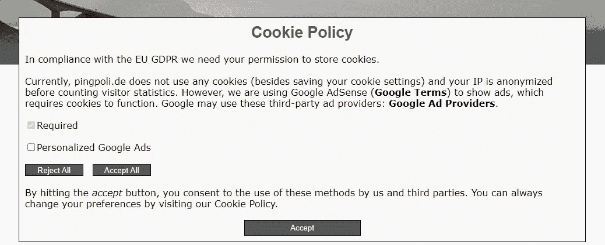

# 创建自定义 Cookie 同意弹出窗口

> 原文：<https://levelup.gitconnected.com/creating-a-custom-cookie-consent-popup-69d0c0c6485a>

## 在我的网站上遵守 GDPR 和 CCPA

总是被饼干困扰，照片由[克里斯蒂娜·布兰科](https://unsplash.com/@starvingartistfoodphotography?utm_source=medium&utm_medium=referral)在 [Unsplash](https://unsplash.com?utm_source=medium&utm_medium=referral) 上拍摄

随着欧盟 GDPR 或加利福尼亚州 CCPA 的出台，全球越来越多的地区正在引入更严格的数据保护法规。正如您肯定注意到的，大多数网站会在您第一次访问时显示横幅或弹出窗口，要求您同意他们的 cookie 和数据政策，这是这些新法规的要求。为了不那么违法，我想是时候为我的个人博客网站创建一个自定义的 cookie 同意弹出窗口了。

# GDPR

通用数据保护条例( [GDPR](https://en.wikipedia.org/wiki/General_Data_Protection_Regulation) )是一项欧盟条例，旨在提供处理个人个人数据的指导方针。GDPR 于 2016 年通过，并于 2018 年开始实施，它迫使数据控制者披露任何数据收集以及数据是否与第三方共享。它已经成为其他数据保护法律的典范，如加州消费者隐私法( [CCPA](https://en.wikipedia.org/wiki/California_Consumer_Privacy_Act) )。

## 它适用于谁？

GDPR 不仅适用于企业，也适用于任何其他拥有网站或处理个人数据的实体或个人。这意味着我的个人博客[网站](https://pingpoli.de)也需要遵守。我的网站不使用任何 cookies，我使用我自己的[网络分析工具](https://medium.com/swlh/creating-my-own-web-analytics-tool-dca5a1c720e3)来统计访客，我在设计时考虑到了隐私，因此按照 GDPR 的要求，IP 是匿名的。然而，我不能向自己出售广告，所以我使用谷歌广告，它需要 cookies 才能发挥作用。因此，我需要获得用户的同意来存储这些 cookies 并链接到 Google 条款。此外，我添加了一个广告个性化选项，只有当用户选择时才打开。

# Cookie 同意弹出菜单

您可以在互联网上找到许多 cookie 同意解决方案，从非常简单的到企业级的都有。然而，使用一个复杂的第三方 cookie 许可管理器来收集用户数据本身，在最小化收集的个人数据量时，似乎有点落后。我喜欢创建自己的解决方案，所以我知道他们在做什么，收集了多少数据。在这种情况下，它不收集任何数据，它只创建一个 cookie 来保存设置，因此弹出窗口只需要显示一次。

我的自定义 cookie 同意弹出，由作者图像。

## 履行

cookie 同意弹出窗口的基本思想非常简单。检查用户是否已经同意:如果没有，显示弹出窗口，否则，获取用户的 cookie 设置并执行它们。除了设置一个 cookie 来保存 cookie 设置，我的网站不使用任何 cookie，我使用的唯一第三方工具是 Google AdSense，所以我只需要一个选项，但很容易添加更多的复选框来添加我将来可能会使用的其他工具和 cookie。

主 cookie 同意弹出功能，完整代码见[这里](https://gist.github.com/pingpoli/789f9c0e7226d5ffb10e6faf112a70d1)。

## 使用

使用我的 cookie 许可管理器非常简单。它只需要调用一个函数，这个函数要么显示弹出窗口，要么根据用户的 cookie 设置设置一些变量。这应该在任何其他需要同意的代码之前完成。

如前所述，我使用的唯一第三方工具是 Google AdSense，用户可以选择观看个性化广告。根据用户在 cookie 偏好中的选择，我们需要告诉 Google 加载哪种类型的广告。因为`CCM_showPersonalizedAds`默认设置为`false`，如果用户还没有表示同意，他只会看到正常的广告。

在拖延了两年之后，我终于在我的个人网站上添加了一个 cookie 同意弹出窗口。为了遵守欧盟 GDPR 法案，每个网站都需要向用户披露收集了哪些数据，并获得存储 cookies 的许可。虽然所有的法律问题都非常复杂和难以理解，但从技术角度来看，创建一个 cookie 同意弹出窗口是非常容易的。无论你是大企业还是私人，你都应该或者说必须在你的网站上添加一个。

*免责声明:我不是律师，虽然我相信我正在尽我所能遵循 GDPR，但我不能提供任何法律建议。这是关于 cookie 同意弹出的技术实现。如果您使用我的准则，请确保根据您的情况进行调整，并在必要时咨询律师。*