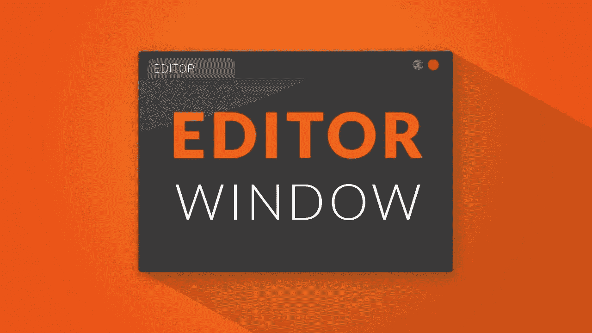
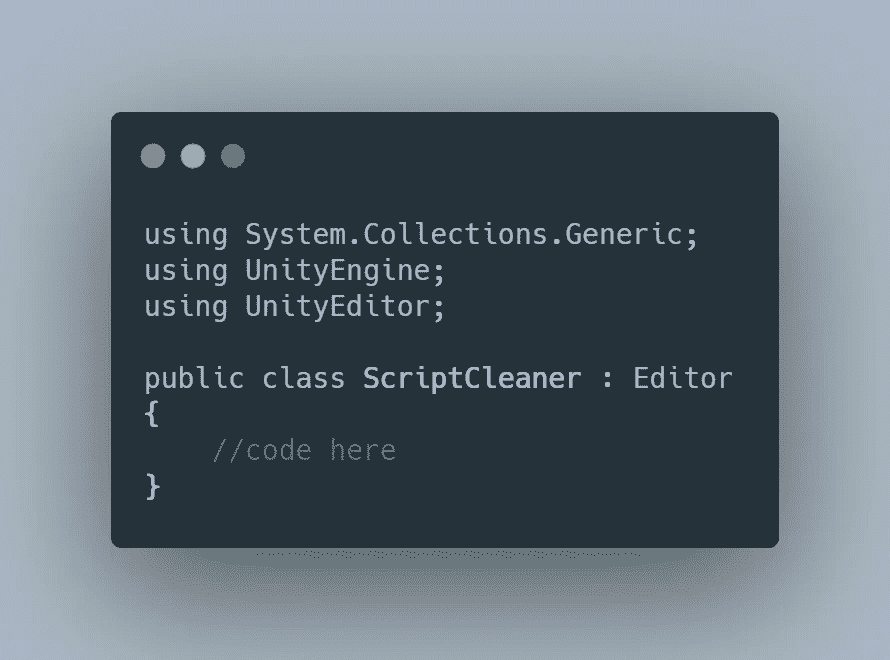
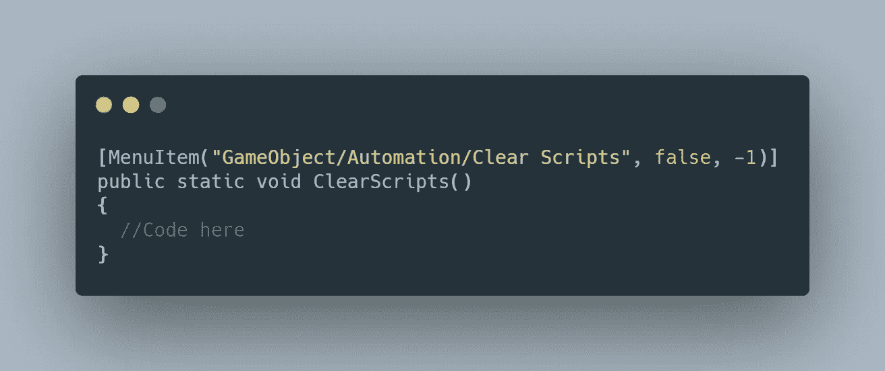
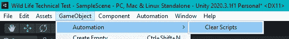
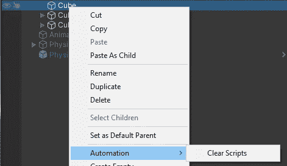
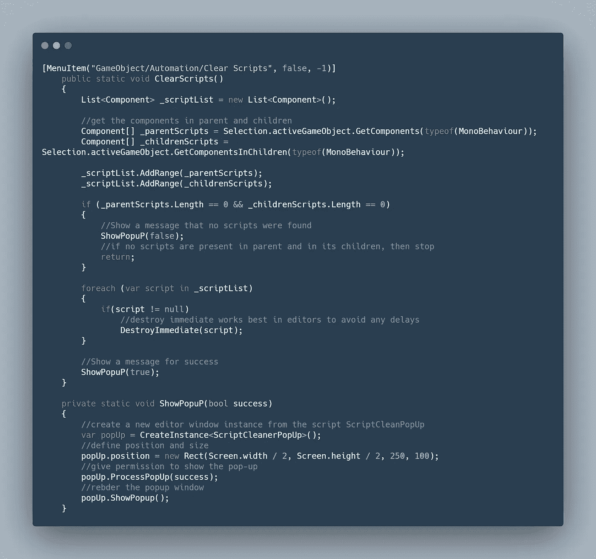
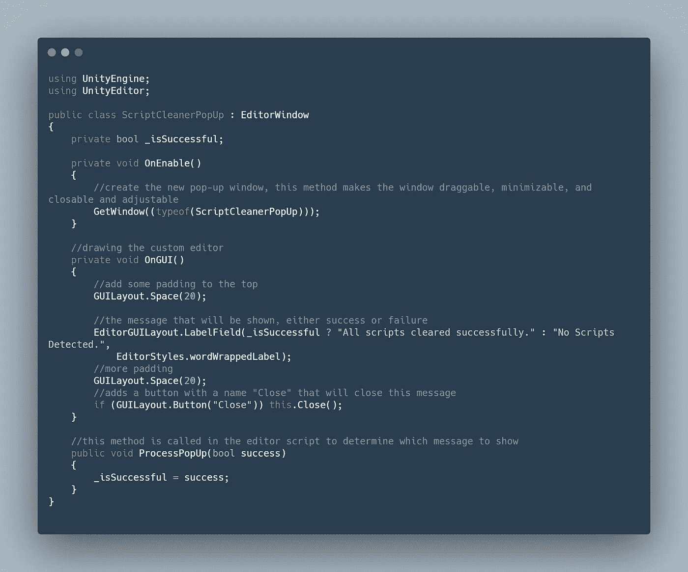
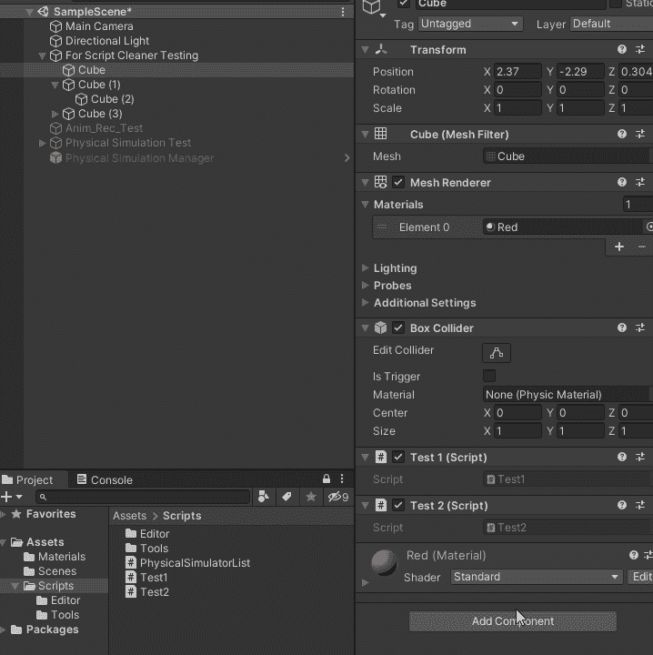

# 在 Unity 中创建自定义编辑器/菜单项

> 原文：<https://levelup.gitconnected.com/creating-a-custom-editor-menu-item-in-unity-483ec5ea15c4>

今天我想谈谈一些不同的东西，一些大多数 Unity 开发者不知道他们能做的或者认为太复杂而不能做的东西。我是后者，我知道你可以在 Unity 中创建自定义编辑器窗口，但我从未在我的项目中看到它们的用途，我有点害怕在 Unity 中打开编辑器窗口的大门。

当我有机会为 WildLife Studio 完成三项任务时，这一切都改变了，这需要我创建一些自定义编辑器窗口。

> 那么什么是自定义编辑器、菜单项和编辑器窗口呢？你是如何创造它们的？它们是用来做什么的？

自定义编辑器是您创建的新窗口，其行为类似于 unity 的任何默认窗口。根据 [Unity Docs](https://docs.unity3d.com/Manual/editor-EditorWindows.html) : *的说法，“这些行为就像检查员、场景或任何其他内置的一样。这是为你的游戏添加一个用户界面到一个子系统的好方法。”*

创建自定义编辑器时，您应该始终遵循以下三个步骤:

1.  创建一个继承自编辑器或编辑器窗口类的 C#脚本，**并且该脚本必须放在一个名为“Editor”**的文件夹中，否则这一切都将不起作用。
2.  使用代码触发自定义编辑器窗口的打开。
3.  为您的工具实现 GUI 代码(UI 元素)。

自定义编辑器有很多用途，例如你可以创建一个编辑器，允许你立即创建一个带有特定组件的游戏对象，或者你可以在自定义编辑器窗口中跟踪你有多少物品。自定义编辑器窗口的使用受到您想象力的限制。

让我们看一个现实生活中的例子。

> O **目的**:需要一个定制的编辑器来允许设计者从分配给他们的游戏对象中删除 C#脚本，而不会破坏游戏对象。

让我们遵循这三个步骤。

A.在资产中创建一个文件夹，并将其命名为“ *Editor* ”。在这个文件夹中创建一个 C#脚本，命名为" *ScriptCleaner* "，移除 *Monobehaviour* 继承并添加" Editor "来代替。还要确保添加名称空间“ *UnityEditor* ”。

B.代码:

所以我们想在 Unity 的顶栏中添加一个菜单项，并且在右键单击层级中的游戏对象时添加它，这样我们就可以执行我们想要的方法。我们可以通过添加一个属性来做到这一点，就像添加一个可脚本化的对象一样。

字符串“GameObject”将直接在其下添加方法到顶部菜单 GameObject，并创建一个名为 Automation 的子文件夹。bool false 将确保菜单项在您需要的任何时候都可用，int“-1”是该子菜单的优先级，当右键单击层级中的游戏对象时，该子菜单将允许该项出现。

清除顶部菜单栏中的脚本方法和子菜单。

清除脚本方法和层次结构中的子菜单。

完成删除脚本任务的代码非常简单。获取父 gameObject 和其子 game object 中的所有 MonoBehaviour 组件，如果有，删除它们。

C.至于实现 GUI 代码的第三步，在这个例子中，它是在执行这个方法之后显示的一个新的编辑器窗口。代码驻留在一个独立的 C#脚本中，该脚本继承自 EditorWindow 类，而不仅仅是 Editor 类。(但也必须放在编辑器文件夹中)。

这两个脚本是编辑器脚本，因此您不必将它们放在场景中的任何实例上。

下面是他们的行动== >

脚本清理编辑器

这只是您可以使用定制编辑器做的事情的皮毛。但无论你是独立开发者，还是 Unity 的软件工程师，定制编辑器都值得你花时间。你应该花时间去学习它们，并将它们应用到你的项目中。