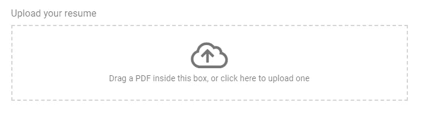

# 为您的 Vuetify 表单创建自定义输入组件

> 原文：<https://levelup.gitconnected.com/creating-a-custom-input-component-for-your-vuetify-form-2306ecfa8e78>

在 Vuetify 中创建表单确实很容易，但是有时您需要的某个特定输入会丢失——比如拖放文件上传、所见即所得或选择出生日期。您可以使用另一个框架中的一些东西或者自己构建，但是基本的 Vuetify 规则不起作用，或者您的输入没有被重置，而其他的都可以。



我用 vuetify 做的一个上传输入的例子

# VInput 组件

Vuetify 有一个创建输入的组件，当使用这个组件并把你在组件(属性)中不使用的所有属性添加到输入中时，它基本上起作用。除了 VForm 组件——用于捆绑多个输入，以便可以验证或重置整个表单——只使用作为输入的子组件。最好的方法是只扩展 VInput 并手动包含您想要支持的特性。

也许在未来，有一个更好的方法来做到这一点，但现在我发现这是最好的解决方案

# 代码

首先扩展您正在创建的输入组件中的 VInput:

```
import VInput from 'vuetify/lib/components/VInput/VInput.js';export default {
 name: 'YourComponent',
 extends: VInput,
```

然后你可以添加你喜欢的功能。对于标签，您可以使用:

```
<v-label>{{***label***}}</v-label>
```

为了让规则生效，您可以使用 VMessages 并解析其中的`errorBucket` prop/attr

```
<VMessages :value="errorBucket" color="error"/>
```

# 道具和属性

当创建一个组件时，你不需要为你想要支持的所有东西制作一个道具，除非有时候这个会派上用场！当您创建一个基本上使用另一个虚拟化输入的输入时，您只需要添加一些功能，比如创建一个使用多个虚拟选择的出生日期选择器。你只需要一个标签，所以你可以像我上面解释的那样自己创建，并使用一个道具。这样，您可以将所有属性附加到正在使用的输入中。


例如，在上面的图片中，我创建了一个有 3 个选择的日期选择器。我希望能够传递所有的道具，如`dark`、`load`或`readonly`，而不必单独传递给每个选择。

你可以通过添加`v-bind="$attrs"`将所有属性添加到每个选择中，然后所有属性(不是道具)都被传递。现在你可以添加`label`作为道具，这样你就可以在 3 个选项上创建你自己的标签。这样，标签就不会传递给单个选择。

# 链接到我的代码

为了这篇文章，我在 github 上创建了一些要点。第一个日期是通过使用 dayJS 选择的，但是您可以使用任何日期。

和文件上传: