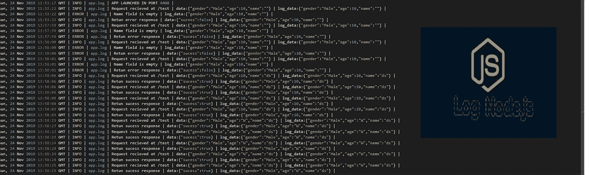
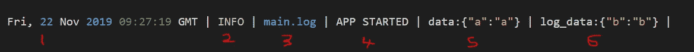
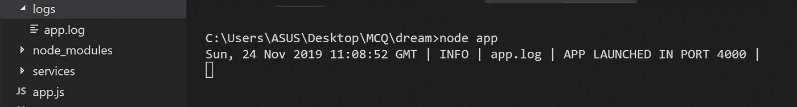
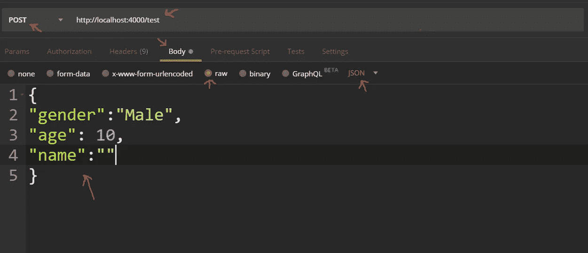
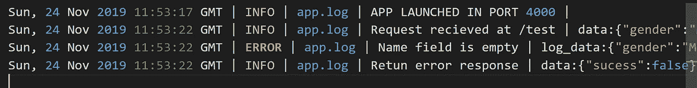

# 使用 Winston 为 Node.js 应用程序创建自定义记录器

> 原文：<https://levelup.gitconnected.com/creating-a-custom-logger-for-node-js-application-using-winston-3925007c9659>



本文将带您为 Node.js 应用程序创建一个定制的日志记录器。

当我在做我的一个个人项目时，我有一个关于在生产环境中如何跟踪应用程序的错误和事件流的问题。当我研究这个的时候，我遇到了单词 **logs** ，下面是一个简单的定义。

> **日志文件**是存储与应用程序处理过程中发生的事件相关的记录的文件。日志文件中的单个记录被称为**日志**。

在对什么是日志有了基本的概念之后，我又想出了三个问题，这促使我写了这篇博客。以下是我给他们找到的问题和答案。

我们什么时候使用日志？
根据应用程序及其用途，开发人员可以采用多种方法进行日志记录。以下是最常见的方法

1.  仅在出现错误或意外行为时记录日志
2.  仅在调试模式下记录日志
3.  事件发生时记录日志

选择这些方法中的一种或组合或任何其他方法是由开发者做出的决定。在这篇博客中，由于我正在创建一个 RESTful API(假设有大量用户在使用它)，我决定使用第三种方法，记录所有发生的重要事件。

我们记录什么？
这个问题的答案是取决于应用本身。例如，如果我们正在创建一个将被许多用户调用的 REST API，那么包含时间、事件和请求的主体或参数将是一个好主意。这可用于区分特定用户的日志。

如果用户遇到错误并联系开发人员来解决问题，开发人员将只需要用户 id(假设用户 id 是在请求正文中发送的)和/或发出请求的时间，就可以跟踪出了什么问题。

在下面的实现中，我使用了下面的日志格式:



main.log 文件中的日志摘录(图 2)

1- UTC 日期和时间
2-日志的类型(例如:信息、调试、错误)
3-日志所属的文件
4-发生的事件
5-事件的附加数据
6。日志数据(用于区分或分组针对特定请求发生的事件的数据)

如何为一个节点应用程序实现一个日志记录器？
有许多 npm 模块用于日志记录。其中，三个被广泛使用:摩根，班扬和温斯顿。在这些 npm 模块中，我决定使用 Winston，因为它更容易构建如图 ***图 2*** 所示的自定义日志。

按照下面的说明为您的节点应用程序实现一个自定义记录器。如果已经创建了节点项目，可以跳过第一条指令。

如果你想从我的 Git 库 [**下载下面部分的代码，点击这里**](https://github.com/amjadnzr/Custom-Logger)

> **注意:本文假设您已经安装了 Node、VS 代码，并为 npm 配置了一个路径。**

## **1。创建一个节点项目**

创建一个新文件夹(我将其命名为`App`)。在 VS 代码中打开文件夹，然后在终端中键入下面的命令。

```
npm init
```

填写要求的详细信息，或按 Enter **跳过。**当你完成这个过程后，一个名为 **package.json** 的 JSON 文件会出现在你的文件夹中。

## 2.**安装所需模块**

因为我们使用 Winston 作为 npm 模块来构建定制日志记录器，所以我们必须安装该模块。为此，请在终端中键入以下命令

```
npm i winston
```

此外，我们将使用 express 来构建 API 端点和主体解析器中间件，以访问发送到端点的请求主体。键入下面的命令来安装 express 和 body-parser。

```
npm i express body-parser
```

## 3.**创建自定义记录器类**

创建一个名为`services`的文件夹，在服务文件夹中创建一个名为`logger_service.js`的文件，复制粘贴下面的代码。

```
const winston = require('winston')dateFormat = () => { return new Date(Date.now()).toUTCString()}class LoggerService { constructor(route) { this.log_data = null this.route = route const logger = winston.createLogger({ transports: [ new winston.transports.Console(), new winston.transports.File({ filename: `./logs/${route}.log` }) ], format: winston.format.printf((info) => { let message = `${dateFormat()} | ${info.level.toUpperCase()} | ${route}.log | ${info.message} | ` message = info.obj ? message + `data:${JSON.stringify(info.obj)} | ` : message message = this.log_data ? message + `log_data:${JSON.stringify(this.log_data)} | ` : message return message }) }); this.logger = logger}setLogData(log_data) { this.log_data = log_data}async info(message) { this.logger.log('info', message);}async info(message, obj) { this.logger.log('info', message, { obj })}async debug(message) { this.logger.log('debug', message);}async debug(message, obj) { this.logger.log('debug', message, { obj })}async error(message) { this.logger.log('error', message);}async error(message, obj) { this.logger.log('error', message, { obj })}}module.exports = LoggerService
```

如果您希望更改日志消息，您可以简单地编辑`winston.createLogger()`方法中对象的格式属性的返回语句。如果你想完全改变日志的格式，你可以参考[温斯顿文档](https://www.npmjs.com/package/winston)。

## 4.**创建/测试 POST API 端点以测试记录器**

在主文件夹中创建一个名为 app.js 的文件，并复制粘贴以下代码

```
const express = require('express')const app = express()const Logger = require('./services/logger_service')const bodyParser = require('body-parser')const logger = new Logger('app')app.use(bodyParser.urlencoded({ extended: false}))app.use(bodyParser.json())app.post('/test', (req, res) => { const body = req.body let error = {} // Adding body of the request as log data logger.setLogData(body) logger.info("Request recieved at /test", req.body) // We are expecting name,age and gender in the body of the request if (body.name == null || body.name == "") { logger.error("Name field is empty") error["name"] = "name field is empty" } if (body.age == null || body.age == "") { logger.error("Age field is empty") error["age"] = "age field is empty" } if (body.gender == null || body.gender == "") { logger.error("Gender field is empty") error["gender"] = "gender field is empty" } if (Object.keys(error).length != 0) {    logger.error("Retun error response", { "sucess":false }) res.send("Error")}else{ logger.info("Retun sucess response", { "sucess": true }) res.send("No Error")}})app.listen(4000, () => { logger.info("APP LAUNCHED IN PORT 4000")})
```

上面的代码部分是一个基本的验证端点，它接受下面的 JSON 并检查是否有任何值为空或 null，并根据它返回“Error”或“No Error”。

```
{
  “gender”:”Male”,
  “age”: 10,
  “name”:”Andy”
}
```

## 5.**运行节点应用程序并测试创建的/test 端点**

在您的终端中键入以下命令

```
node app
```

当服务器启动时，您将在终端中看到一个日志，并且您还应该在 **logs** 文件夹中看到一个文件`app.log`(终端中的日志存储在 app.log 文件中)。



vs 代码终端和文件夹结构(图 3)

现在，您必须使用测试工具来测试端点(我已经使用了 Postman)。在你的请求正文中使用下面的 JSON。name 属性保持为空，以获得错误响应，并尝试通过日志来解决问题。

```
{
  “gender”:”Male”,
  “age”: 10,
  “name”:””
}
```

根据下图设置邮递员请求。



邮递员中的请求部分(图 4)

如 ***图 4*** 所示设置后，发送请求，检查响应是否包含错误信息。

现在，您必须跟踪日志文件来找到确切的错误。



app.log 文件的摘录(图 5)

如果您遵循了上面给出的所有说明，您将会看到类似于图 5 中的 ***的输出。*** 图 5 中的第三条日志是错误日志。因此，我们设法通过日志找出错误。

在 Postman 中更改请求体 JSON 的值，并测试是否记录了预期的日志。

就这样
干杯！！！