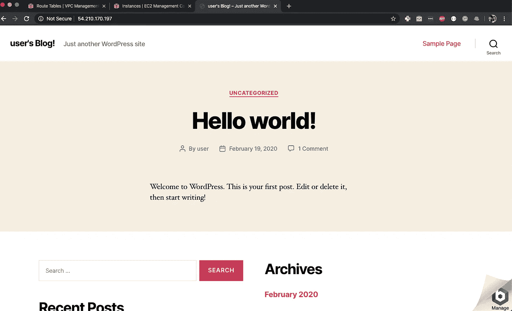
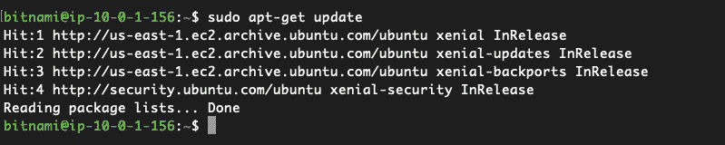
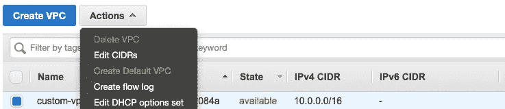

# 在 AWS 中创建自定义 VPC

> 原文：<https://levelup.gitconnected.com/creating-a-custom-vpc-in-aws-b4ea7bf4a71>

亚马逊 VPC 标志

大家好，在上一篇文章中，我们讨论了不同的 VPC 术语。这可能让您对 AWS 中的 VPC 有了一个高层次的了解。

在本文中，我们将创建一个带有公共子网和私有子网的自定义 VPC。每个子网内部都有一个 EC2 实例(安装了 WordPress)。

公共子网中的实例可以通过互联网访问，而私有子网中的实例则不能。下面是我们将要构建的架构。

VPC 建筑

# 创建自定义 VPC

登录您的 AWS 控制台，选择您想要创建 VPC 的地区(在本例中，我使用的是北弗吉尼亚州),然后选择 VPC。

现在，点击左边栏中的**你的 VPCs** ，然后点击**创建 VPC。**

创建 VPC 页面

为您的 VPC 和 IPv4 CIDR 块命名。如果您愿意，也可以提供 IPv6 CIDR 数据块，但在本例中，我将使用默认选择。

您可以强制在此 VPC 中启动的 EC2 实例的租用。如果您选择**专用**，那么您的所有实例都将在专用租赁实例上启动(成本更高)。如果选择**默认**选项，那么实例将使用启动时选择的租用选项。

点击**创建**按钮**创建您的自定义 VPC！**

你的 VPCs

现在，您可以看到您的自定义 VPC 以及默认的 VPC。

创建新的 VPC 时，默认情况下会创建网络访问控制列表(NACL)和主路由表。

# 创建子网

现在我们已经创建了我们的自定义 VPC，让我们通过从左侧栏中选择**子网**选项卡并单击**创建子网**按钮来创建我们的公共和私有子网。

创建公共子网

让我们首先创建公共子网。您可以给它一个容易识别的友好名称，然后为该子网选择自定义 VPC 和 IPv4 CIDR 块。这里，我选择 **10.0.1.0/24** 作为 CIDR 块。

您还可以选择要在其中创建该子网的 AZ，因为子网总是映射到一个 AZ。

完成后，单击**创建**按钮创建子网。

创建专用子网

以类似的方式，您现在可以创建一个专用子网。

您的子网

默认情况下，子网的**自动分配公共 IP** 设置为禁用。让我们为我们的公共子网启用它，方法是选择它并单击顶部的**操作**下拉菜单，然后选择**修改自动分配 IP 设置。**

子网选项

现在，选择复选框并点击**保存**按钮。

子网自动分配公共 IP 设置

# 创建互联网网关

如果没有连接 internet 网关，在该 VPC 中创建的任何实例都无法通过 internet 访问。

要创建互联网网关，请进入左侧栏的**互联网网关**选项卡，点击顶部的**创建** **互联网网关**。为您的互联网网关命名，然后点击**保存**按钮。

互联网网关

您可以看到网关是分离的。您需要将互联网网关与您的自定义 VPC 连接起来。您可以选择它，点击顶部的**操作**下拉菜单，然后选择**连接到 VPC。**

然后选择您的定制 VPC 并点击**连接**按钮。

连接互联网网关

# 创建路由表

出于安全原因，建议保留主路由表不变。因此，我们将为我们的自定义 VPC 创建一个新的路由表，并允许通过它访问我们的公共子网。

让我们从左侧栏进入**路由表**选项卡，点击顶部的**创建路由表**按钮。

为您的路由表命名，选择自定义 VPC 并点击**保存**按钮。

创建路由表页面

## 将子网与路由表相关联

默认情况下，所有子网都与主路由表相关联。让我们通过选择公共子网并导航到底部的**子网关联**选项卡，将其与自定义路由表相关联。

点击**编辑子网关联**，选择公共子网，点击**保存**按钮。

## 创建允许 internet 访问的路由

现在，为了允许 internet 访问我们的公共子网，我们需要为我们的自定义路由表创建一条新路由。

选择自定义路由表并导航至底部的**路线**选项卡。点击**编辑路由**按钮，添加一条目的地为 **0.0.0.0/0** 的新路由，即互联网，目标为连接的互联网网关。

编辑自定义路由表的路由

保存路由，现在您的公共子网可以访问互联网了。

# 启动实例

是时候启动我们的实例了。转到 EC2 仪表板，点击**启动实例。**

WordPress AMI

从 AWS Marketplace 中选择经 Bitnami 认证的 WordPress 和 automatic，并选择一个实例类型。我在这里选择 t2.micro，因为它在免费层中可用。

配置公共实例

在下一步中，选择自定义 VPC 作为网络，选择公共子网作为子网。现在，在子网正下方的字段中，您可以看到字段**自动分配公共 IP** ，其值设置为子网设置。

因为在我们的子网中，我们启用了该选项，所以这里的默认选项是 **Enable。**

现在，添加一些存储空间并给你的实例命名(我给的是 **public-instance** )。

## 创建安全组

现在创建一个安全组，将端口 22、80 和 443 向互联网开放。我正在打开端口 22，因为我们要从我们的公共实例 SSH 到我们的私有实例，但是为了更好的安全性，SSH 应该只对您的特定 IP 开放。

创建安全组

点击**查看并启动**，通过创建一个密钥对来启动实例。

现在，要创建私有实例，选择相同的 AMI 和实例类型。只是这次选择**私有子网**来启动实例。

配置私有实例

您可以看到，对于专用子网，默认情况下**自动分配公共 IP** 是禁用的。

现在，添加一些存储，为实例命名，选择用于公共实例的相同安全组，并使用相同的密钥启动实例。

一旦两个实例都在运行，您可以看到只有公共实例有一个 **IPv4 公共 IP。**

EC2 实例

如果你在浏览器中打开这个 IP，你会看到你的新博客！

公共实例上的 WordPress 博客

因为你的私有实例没有公开的 IP 地址，所以你不能从浏览器上看到它的博客。

# SSH 到实例

现在是 SSH 到您的实例的时候了，但是由于您的私有实例没有公共 IP 地址，您将无法直接从您的系统 SSH 到它。

所以让我们首先将 SSH 放入公共实例。

SSH 到公共实例

要确认您的实例可以访问互联网，您可以运行`sudo apt-get update`并查看它是否工作。

更新公共实例

现在，我们在公共子网内，我们应该能够 SSH 到我们的私有子网，因为默认情况下，VPC 内的实例可以相互通信。

对于 SSH，我们需要私钥，因此创建一个`.pem`文件，并将下载的 PEM 文件的内容复制到其中。您可以通过键入以下命令来创建新文件

*   `vi private.pem`开启维姆
*   按`i`进入 VIM 的插入模式
*   使用 Mac 上的`Command + V`和 Linux 上的`Ctrl + Shift + V`复制您下载的 PEM 文件内容并粘贴到终端中
*   按 Escape 键退出插入模式，键入`:wq`保存文件并退出
*   现在，键入`chmod 600 private.pem`来限制文件的权限

SSH 到私有实例

要 SSH 到私有实例，请键入以下命令

`ssh ubuntu@<private-IP-of-private-instance> -i private.pem`

选择一个实例后，可以在**描述**页签中找到该实例的私有 IP。在我的例子中，私有实例的私有 IP 是`10.0.3.171`

私有子网的私有 IP

现在我们在我们私人实例的终端。为了确认我们的私有实例不能访问互联网，让我们运行相同的命令`sudo apt-get update`

无法更新专用子网(无法访问互联网)

您会注意到它要么超时，要么显示一些错误。

# 私有子网的应用

现在，您已经看到了私有子网，让我们看看您为什么要使用它

1.  **数据库** —最常见的用例之一是将数据库托管在私有子网中，而将 web 服务器托管在公共子网中。通过这种方式，您可以限制对数据库的互联网访问，从而提供额外的安全保障。
2.  **应用服务器** —假设您有处理逻辑并与数据库交互的应用服务器。现在，您的 web 服务器可以将作业传递给专用子网中的应用程序服务器。

# 对私有实例的出站 Internet 访问

您的私有实例可能需要出站 internet 访问，以保持系统最新。您可以通过创建 NAT 网关来做到这一点。它们只允许对您的私有实例进行出站 internet 访问，而阻止对这些实例的所有入站 internet 访问。

# 包裹

现在，您已经学习了如何创建带有公共子网和私有子网的自定义 VPC，是时候结束整个设置了。

1.  终止您的 EC2 实例
2.  一旦您的实例被终止，转到您的 VPC 仪表板，选择您的自定义 VPC，点击顶部的**操作**按钮，并选择**删除 VPC** 选项。

删除自定义 VPC

再次点击**删除 VPC** ，它将删除你的 VPC 及其所有资源。

删除 VPC 确认

我希望你从这篇文章中学到了一些东西，如果你有疑问或反馈，请在下面评论！

非常感谢你阅读这篇文章。如果你喜欢它，请给它一些掌声，让更多的人从中受益！