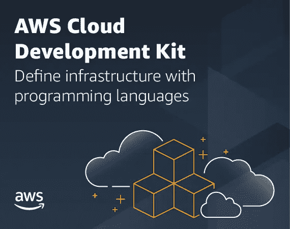
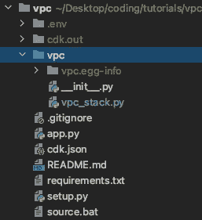
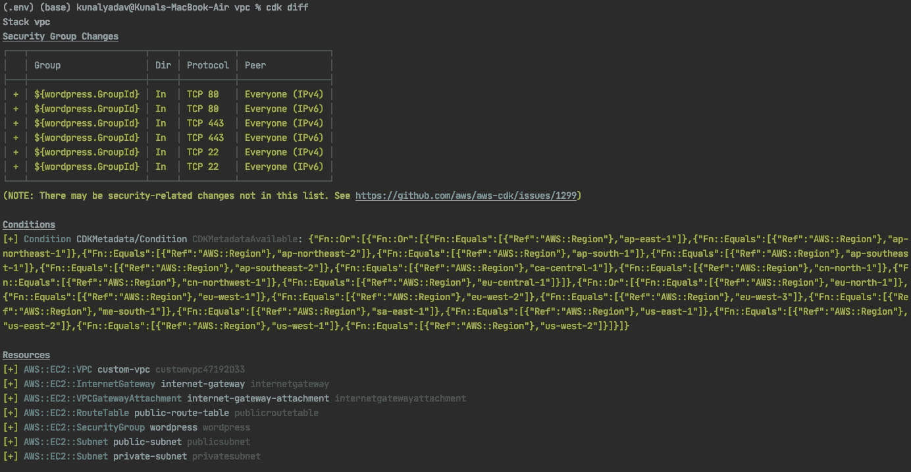
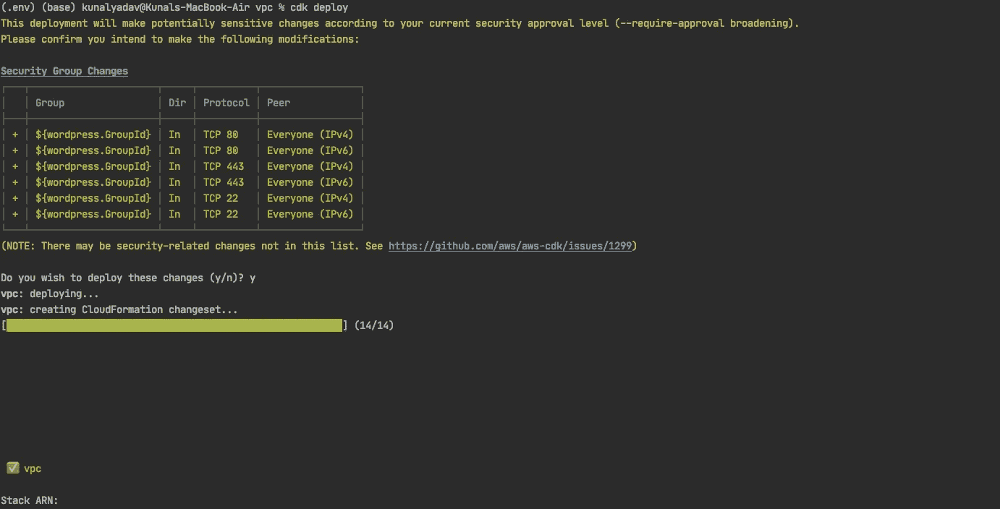
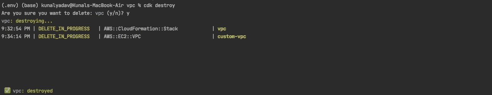

# 使用 AWS CDK 创建自定义 VPC

> 原文：<https://levelup.gitconnected.com/creating-a-custom-vpc-with-aws-cdk-52f8788cb2d5>



AWS CDK 标志。信用——aws.amazon.com

AWS CDK 或云开发工具包允许您使用流行的语言(如 Java、Python、JavaScript、TypeScript 和 C#)以编程方式创建和管理 AWS 资源。

这一概念也被称为 **IaC(基础设施即代码)，即**将您的基础设施作为代码来管理，以促进自动化并最大限度地减少手动错误。

你可以把 CDK 看作是创建云形成模板的一个替代方案。

## **为什么 CDK 上空有云形成？**

1.  有了 Cloudformation，您就有了一个 JSON 或 YAML 文件，您可以在其中定义资源的完整配置。该文件可能会很快变得过大而无法有效管理。
    有了 CDK，你可以像任何应用程序一样，用多个文件和结构来管理你的资源。
2.  您可以利用编程语言的特性，如循环、库、if-else 构造，来编写更少的代码，做更多的工作。干的原则(不要重复自己)。
3.  更容易在团队中工作，并在 ide 中获得代码完成支持。
4.  用面向对象的风格写代码，而不是 JSON 或 YAML。
5.  在同一个 CDK 项目中，您可以保留脚本来创建非 AWS 资源，如 RabbitMQ、Redis 等。因此，您可以编写脚本来管理整个基础架构以及 AWS 资源。

在幕后，CDK 从代码中生成了一个 Cloudformation 模板，并使用该模板在 AWS 中启动资源。只是省去了我们直接创建的麻烦。这样，您可以验证将要创建的基础结构。

在本文中，我们将使用以下资源创建一个自定义 VPC—

*   一个 VPC
*   两个子网—一个公共子网和一个私有子网
*   两个 EC2 实例—每个子网一个
*   一个 NACL(网络访问控制列表)—我们将使用创建 VPC 时自动创建的默认列表。
*   一个自定义路由表
*   一个安全组

# 先决条件

要开始使用 CDK，请确保您已经—

1.  AWS 帐户
2.  [安装 CDK CLI，配置访问键](https://docs.aws.amazon.com/cdk/latest/guide/getting_started.html)
3.  在北弗吉尼亚地区生成了名为 **us-east-1-key** 的 EC2 密钥对。此密钥将用于启动实例。

**注意—本文中创建的所有资源都包含在 AWS 免费层中，因此，如果您的免费层处于活动状态，并且您在完成教程后删除了这些资源，您将不会被收费。**

# 创建新的 CDK 项目

```
mkdir vpc
cd vpccdk init app --language python# create new virtual environment
python3 -m venv .env# for Mac/Linux
source .env/bin/activate# for Windows
.env\Scripts\activate.bat# install required dependencies
pip install -r requirements.txt
pip install aws_cdk.aws_ec2# to add the newly installed dependency to requirements file
pip freeze > requirements.txt
```

上述命令执行以下操作—

1.  用 **python** 语言的 **app** 模板创建一个新的 CDK 项目。
2.  创建一个新的虚拟环境并切换到它。
3.  安装创建 AWS 资源所需的依赖项。
4.  将新安装的依赖项添加到需求文件中。

运行上述命令后，您的项目结构应该如下所示



项目结构

与 CDK 合作有多种方式。我更喜欢使用 CDK 的 Cloudformation 构造来创建资源和配置文件，以存储我的资源的配置。

为什么要使用 Cloudformation 构造？因为它们为您提供了对资源配置的更多控制(至少目前是这样，但随着 CDK 的更新，这种情况可能会改变)。

# 存储资源配置

我们将把资源的配置存储在内部 **vpc** 目录中的一个名为`config.py`的文件中。

CDK 资源配置

上述配置包含以下信息—

1.  VPC、互联网网关、路由表、子网、实例、密钥对、安全组和区域等实体名称。
2.  自定义路由表的路由。我们的自定义路由表中只有一条允许流量通过互联网网关的路由。
3.  安全组配置。我们允许从互联网到 SSH (22)、HTTP (80)和 HTTPS (443)的入站访问。
4.  子网配置。我们在 AZ `us-east-1a`启动公共子网，在 AZ `us-east-1b`启动私有子网
5.  实例配置。我们在每个子网中启动一个 EC2 实例。
6.  对于这个例子，我使用位于北弗吉尼亚地区的 Bitnami WordPress AMI。

# 创建资源

是时候编写代码来从上面的配置中创建资源了。我们将在`vpc_stack.py` 文件中编写创建资源的代码。

使用配置创建资源的代码

在上面嵌入的文件中，您可以看到使用我们的配置定义了不同的方法来创建不同类型的资源。

为了创建资源，将调用`__init__`方法。注意在`__init__`方法中调用其他方法的顺序。这个顺序很重要，因为必须先创建 VPC，然后才能在其中创建资源。同样，在子网内创建实例之前，必须先创建子网。

这只是众多创造 CDK 资源的方法之一，你可以选择其他最适合你的方法。

您可以查看 [CDK 文档](https://docs.aws.amazon.com/cdk/api/latest/)来确定使用哪个类来创建哪个资源。

# 部署项目

CDK CLI 提供了一些工具，可以帮助您调试、部署和销毁 CDK 资源。

## cdk synth

这个命令创建一个对应于你的 CDK 代码的云形成模板。在调试代码时，它会非常方便。

## cdk 差异

如果您部署了当前代码，此命令将向您展示基础架构的当前状态与新状态之间的差异。在部署之前，请始终运行该命令！



cdk diff 的输出(底部调整)

## cdk 部署

该命令用于从您的代码生成 Cloudformation 模板，并部署 Cloudformation 堆栈来创建资源。



cdk deploy 的输出(在底部修剪)

## cdk 销毁

正如您已经猜到的，这个命令用于销毁您的 Cloudformation 堆栈中的所有资源。

要更新您的基础架构，请使用`cdk deploy`命令。

**注意——完成本教程后，不要忘记运行该命令。**



cdk 销毁命令的输出

现在，您可以通过控制台在 AWS 帐户中验证资源的创建。

你可以在 [Github](https://github.com/abkunal/custom-vpc-cdk) 上查看这个项目。

[](https://github.com/abkunal/custom-vpc-cdk) [## abkunal/custom-vpc-cdk

### 这是一个在 Python 中创建自定义 VPC 的 cdk 项目。cdk.json 文件告诉 CDK 工具包如何执行你的应用程序…

github.com](https://github.com/abkunal/custom-vpc-cdk) 

## **参考文献**

1.  [你的第一个 AWS CDK 应用](https://docs.aws.amazon.com/cdk/latest/guide/hello_world.html)
2.  [CDK 文件](https://docs.aws.amazon.com/cdk/api/latest/)

我希望你从这篇文章中学到了一些东西，如果你有疑问或反馈，请在下面评论！

非常感谢你阅读这篇文章。如果你喜欢它，请给它一些掌声，让更多的人从中受益！