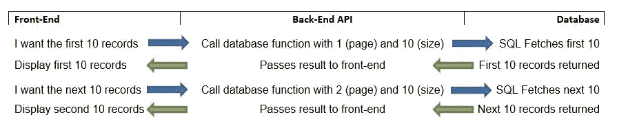
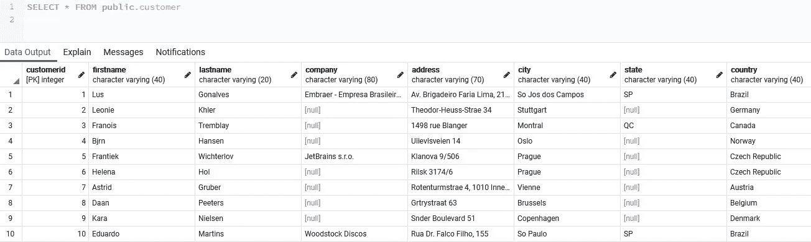
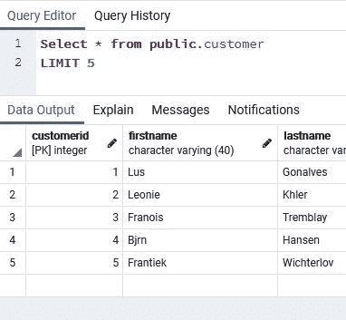

# 在 PostgreSQL 中创建数据分页函数

> 原文：<https://levelup.gitconnected.com/creating-a-data-pagination-function-in-postgresql-2a032084af54>

## 数据库提示

使用 LIMIT、OFFSET 和 FETCH NEXT 运算符。


安妮·斯普拉特在 [Unsplash](https://unsplash.com?utm_source=medium&utm_medium=referral) 上的照片

处理大量数据时的一个常见需求是如何在合理的时间内获取数据并显示出来。

这个问题的解决方案是分页。分页可以在前端和/或后端完成。

***注意*** *:这种技术在 PostgreSQL 和 MySQL 中效果很好。对于微软 SQL Server 参见* [*本文*](/how-to-create-a-server-side-data-pagination-function-in-sql-server-d5e7876aff28) *。*

# 页码

> *分页*，也称为*分页*，是将一个文档分成离散页面的过程，……服务器端*分页*适用于大型*数据集*，提供更快的初始页面加载。

-维基百科

> 服务器端分页更常见。当需要访问的记录非常少时，可以使用客户端分页，在这种情况下，可以返回所有记录，客户端可以使用 [JavaScript](https://en.wikipedia.org/wiki/JavaScript) 或 [CSS](https://en.wikipedia.org/wiki/CSS) 来查看单独的页面。

-维基百科

> 分页的目的是在查询的帮助下将一个结果集分成多个独立的页面。

# 我们将做什么

在本文中，我们将编写一个 PostgreSQL 函数，在前端使用它想要的*页面*和每页想要的*记录数 i* t 调用 API 之后，可以从后端 API 调用该函数。



记录流程

## 分页是如何实现的

通过使用**偏移量**、**限制**和可选的**获取下一个**操作符，在 PostgreSQL 中实现分页。

> LIMIT 和 OFFSET 允许您只检索由查询的其余部分生成的一部分行

[PostgreSQL 文档](https://www.postgresql.org/docs/9.1/queries-limit.html)

# 本文的假设

我将假设您可以访问 [PostgreSQL](https://www.postgresql.org/) 和一个工具，如 [pgAdmin](https://www.pgadmin.org/) 来编写查询。

您可以使用自己的数据，或者使用下面的脚本创建一个表格并插入一些数据。

1.  创建一个名为 **mycompany** 的数据库。
2.  运行该命令创建一个**客户**表

```
CREATE TABLE customer
(
    CustomerId INT NOT NULL,
    FirstName VARCHAR(40) NOT NULL,
    LastName VARCHAR(20) NOT NULL,
    Company VARCHAR(80),
    Address VARCHAR(70),
    City VARCHAR(40),
    State VARCHAR(40),
    Country VARCHAR(40),
    PostalCode VARCHAR(10),
    Phone VARCHAR(24),
    Fax VARCHAR(24),
    Email VARCHAR(60) NOT NULL,
    SupportRepId INT,
    CONSTRAINT PK_Customer PRIMARY KEY  (CustomerId)
);
```

3.包含数据的 **Insert Into** 语句很长，位于文章末尾。向下滚动并运行这些命令来插入客户。

4.验证您是否有客户(应该有 59 个。)



客户快照

# 使用限制和偏移

*   LIMIT 告诉查询您想要多少条记录。
*   OFFSET 告诉查询从哪里开始。

## 限制

> 使用 LIMIT 时，使用 ORDER BY 子句将结果行约束为唯一的顺序非常重要。否则，您将获得查询行的不可预测的子集。您可能会问第十到第二十行，但是第十到第二十行的顺序是什么？除非指定了 ORDER BY，否则排序是未知的。

1.  要获得前 5 条记录，请在查询窗口中键入以下内容。

```
Select * from public.customer
Order By customerid
LIMIT 5;
```



限制 5 个客户

2.尝试用其他数字来限制。

## 抵消

1.  要获取带有偏移量的前 5 条记录，请在查询窗口中键入以下内容。我们明确地告诉查询从头开始。你将得到与上一个例子相同的结果。

```
Select * from public.customer
Order By customerid
LIMIT 5
OFFSET 0;
```

请注意，偏移是基于 0 的。所以我们不是从 1 开始。这个以后会很重要。

2.要获得 6–10 个客户，请键入以下内容。

```
Select * from public.customer
Order By customerid
LIMIT 5
OFFSET 5;
```

注意使用 OFFSET 来告诉查询从哪里开始。同样，它是基于 0 的，所以我们使用 5 而不是 6。

3.客户 11-15 可以通过。

```
Select * from public.customer
Order By customerid
LIMIT 5
OFFSET 10;
```

> 所以我们正在分页的路上！
> 
> 但是等等！还有更多

# 让这更直观

这是一个好的开始，但如果我们从前端开发人员的角度来考虑，这并不直观。它们必须传递起始值 0 和所需的记录数 5。然后记住他们离开的地方并请求，5 和 5；然后是 10 和 5 等等。

对于前端开发人员来说，更直观的方法是说他们想要第**页的第** 1 和第 5 条记录。然后是**页的** 2 和 5 等记录。

## 步骤 1——观察

对于第一步，让我们只是玩抵消的数字(是的，我说的数字。)

1.  在下面的脚本中，偏移量将为 0。我们将获得前 5 个记录。

```
Select * from public.customer
Order By customerid
LIMIT 5
OFFSET (**1** - 1) * 5;
```

2.在这个例子中，我们得到了第**页** 2，包含 5 条记录。

```
Select * from public.customer
Order By customerid
LIMIT 5
OFFSET (**2** - 1) * 5;
```

偏移量是(2–1) * 5 或(1)* 5 或 5。从记录 5 开始(从 0 开始。)

3.在这个例子中，我们得到第 3 页的**，包含 5 条记录的**。

```
Select * from public.customer
Order By customerid
LIMIT 5
OFFSET (**3** - 1) * 5;
```

偏移量是(3–1)* 5 或(2) * 5 或 10。

> 注意什么在改变。如果我们将偏移量的第一个数字设为变量(当然 LIMIT 也可以是变量)，我们将指定第 1 页、第 2 页、第 3 页等等。

## 步骤 2 —功能

我们将编写接受两个参数的函数。一个用于页码(计算偏移量)，一个用于页面大小(限制。)

1.  写出下面的函数。

```
CREATE OR REPLACE FUNCTION udf_GetRowsByPageNumberAndSize(
 PageNumber INTEGER = NULL,
 PageSize INTEGER = NULL
 )
 RETURNS SETOF public.customer AS
 $BODY$
 BEGIN
  RETURN QUERY
   SELECT *
   FROM public.customer
   ORDER BY customerid
   LIMIT PageSize
   OFFSET ((PageNumber-1) * PageSize);
END;
$BODY$
LANGUAGE plpgsql;
```

*   **页码**是所需页面的参数。
*   **PageSize** 是每页所需记录数的参数。
*   我们使用 **SETOF** 返回所有列。我们可以指定列的子集。
*   **限制**是页面大小
*   **偏移**如前所述计算，但使用参数变量 PageNumber 和 PageSize。

2.执行查询以创建函数。

3.使用下面的代码运行函数，得到第 1、2 和 3 页，每一页包含 5 行。

```
Select * from udf_GetRowsByPageNumberAndSize(1,5)Select * from udf_GetRowsByPageNumberAndSize(2,5)Select * from udf_GetRowsByPageNumberAndSize(3,5)
```

## 步骤 4——改善我们的功能

我们可以用两种方法来改善我们的功能。首先，我们可以在名为 PageOffset 的变量中进行偏移量计算。

```
CREATE OR REPLACE FUNCTION udf_GetRowsByPageNumberAndSize(
 PageNumber INTEGER = NULL,
 PageSize INTEGER = NULL
 )
 RETURNS SETOF public.customer AS
 $BODY$
 **DECLARE
  PageOffset INTEGER :=0;**
 BEGIN

 ** PageOffset := ((PageNumber-1) * PageSize);**

  RETURN QUERY
   SELECT *
   FROM public.customer
   ORDER BY customerid
   LIMIT PageSize
   OFFSET **PageOffset**;
END;
$BODY$
LANGUAGE plpgsql;
```

## 获取下一个

改进函数的第二种方法是使用可读性更好的 FETCH NEXT 操作符。这允许我们获取特定数量的行。它取代了极限，但在功能上与极限没有什么不同。

```
CREATE OR REPLACE FUNCTION udf_GetRowsByPageNumberAndSize(
 PageNumber INTEGER = NULL,
 PageSize INTEGER = NULL
 )
 RETURNS SETOF public.customer AS
 $BODY$
 DECLARE
  PageOffset INTEGER :=0;
 BEGIN

  PageOffset := ((PageNumber-1) * PageSize);

  RETURN QUERY
   SELECT *
   FROM public.customer
   ORDER BY customerid
   OFFSET PageOffset;
 **  FETCH NEXT PageSize ROWS ONLY;**
END;
$BODY$
LANGUAGE plpgsql;
```

现在你知道了！一个很好的数据库分页功能。

# 结论

在本文中，我们开发了两种后端分页方法中的一种。我们没有提到的后端技术没有什么不同。它只是简单地包括传递查询，使用 LIMIT、OFFSET 或 FETCH NEXT(或者如果使用一个 [ORM](https://en.wikipedia.org/wiki/Object%E2%80%93relational_mapping) 命令，如 [sequelize](https://sequelize.org/) 命令，则使用这些命令的变体);以及在 HTTP GET 中从 API 到数据库的值，而不是在数据库中构建函数。

显然，我们的函数可以扩展为包含额外的参数，比如表名，或者在 WHERE 子句中查询的值。

*应注意，极限/偏移方法最好用于静态数据。如果表中有活动插入或删除的数据，偏移量可能不准确。其他选项的一个很好的资源就是* [*这里的*](https://www.citusdata.com/blog/2016/03/30/five-ways-to-paginate/) *。*

此外，尽管每个用例都不相同，但是如果只有几千条或更少的记录，可以考虑使用前端分页，而在获取数万条记录时，可以考虑使用服务器端分页。

我鼓励你扩展这个功能和实验。

[关于该方法的相关信息](https://use-the-index-luke.com/no-offset)

**感谢您的阅读和编码！**

*想看就看，加入 Medium 帮我继续写*

[](https://bobtomlin-70659.medium.com/membership) [## 通过我的推荐链接加入灵媒——重力井(罗伯·汤姆林)

### 作为一个媒体会员，你的会员费的一部分会给你阅读的作家，你可以完全接触到每一个故事…

bobtomlin-70659.medium.com](https://bobtomlin-70659.medium.com/membership) [](/how-to-query-a-json-array-of-objects-as-a-recordset-in-postgresql-a81acec9fbc5) [## 如何在 PostgreSQL 中将 JSONB 对象数组作为记录集进行查询

### 使用 jsonb_to_recordset()函数将对象数组转换为行

levelup.gitconnected.com](/how-to-query-a-json-array-of-objects-as-a-recordset-in-postgresql-a81acec9fbc5) [](/working-with-a-jsonb-array-of-objects-in-postgresql-d2b7e7f4db87) [## 在 PostgreSQL 中使用 JSONB 对象数组

### 从数组中获取、添加和移除 JSON 对象

levelup.gitconnected.com](/working-with-a-jsonb-array-of-objects-in-postgresql-d2b7e7f4db87) [](/working-with-the-array-data-type-in-postgresql-1e6fecdb51fe) [## 在 PostgreSQL 中使用数组数据类型

### 创建、获取、修改、添加和删除数组中的数据

levelup.gitconnected.com](/working-with-the-array-data-type-in-postgresql-1e6fecdb51fe) 

# 客户表的数据。

```
INSERT INTO Customer (CustomerId, FirstName, LastName, Company, Address, City, State, Country, PostalCode, Phone, Fax, Email, SupportRepId) VALUES (1, N'Lus', N'Gonalves', N'Embraer - Empresa Brasileira de Aeronutica S.A.', N'Av. Brigadeiro Faria Lima, 2170', N'So Jos dos Campos', N'SP', N'Brazil', N'12227-000', N'+55 (12) 3923-5555', N'+55 (12) 3923-5566', [N'luisg@embraer.com.br](mailto:N'luisg@embraer.com.br)', 3);
INSERT INTO Customer (CustomerId, FirstName, LastName, Address, City, Country, PostalCode, Phone, Email, SupportRepId) VALUES (2, N'Leonie', N'Khler', N'Theodor-Heuss-Strae 34', N'Stuttgart', N'Germany', N'70174', N'+49 0711 2842222', [N'leonekohler@surfeu.de](mailto:N'leonekohler@surfeu.de)', 5);
INSERT INTO Customer (CustomerId, FirstName, LastName, Address, City, State, Country, PostalCode, Phone, Email, SupportRepId) VALUES (3, N'Franois', N'Tremblay', N'1498 rue Blanger', N'Montral', N'QC', N'Canada', N'H2G 1A7', N'+1 (514) 721-4711', [N'ftremblay@gmail.com](mailto:N'ftremblay@gmail.com)', 3);
INSERT INTO Customer (CustomerId, FirstName, LastName, Address, City, Country, PostalCode, Phone, Email, SupportRepId) VALUES (4, N'Bjrn', N'Hansen', N'Ullevlsveien 14', N'Oslo', N'Norway', N'0171', N'+47 22 44 22 22', [N'bjorn.hansen@yahoo.no](mailto:N'bjorn.hansen@yahoo.no)', 4);
INSERT INTO Customer (CustomerId, FirstName, LastName, Company, Address, City, Country, PostalCode, Phone, Fax, Email, SupportRepId) VALUES (5, N'Frantiek', N'Wichterlov', N'JetBrains s.r.o.', N'Klanova 9/506', N'Prague', N'Czech Republic', N'14700', N'+420 2 4172 5555', N'+420 2 4172 5555', [N'frantisekw@jetbrains.com](mailto:N'frantisekw@jetbrains.com)', 4);
INSERT INTO Customer (CustomerId, FirstName, LastName, Address, City, Country, PostalCode, Phone, Email, SupportRepId) VALUES (6, N'Helena', N'Hol', N'Rilsk 3174/6', N'Prague', N'Czech Republic', N'14300', N'+420 2 4177 0449', [N'hholy@gmail.com](mailto:N'hholy@gmail.com)', 5);
INSERT INTO Customer (CustomerId, FirstName, LastName, Address, City, Country, PostalCode, Phone, Email, SupportRepId) VALUES (7, N'Astrid', N'Gruber', N'Rotenturmstrae 4, 1010 Innere Stadt', N'Vienne', N'Austria', N'1010', N'+43 01 5134505', [N'astrid.gruber@apple.at](mailto:N'astrid.gruber@apple.at)', 5);
INSERT INTO Customer (CustomerId, FirstName, LastName, Address, City, Country, PostalCode, Phone, Email, SupportRepId) VALUES (8, N'Daan', N'Peeters', N'Grtrystraat 63', N'Brussels', N'Belgium', N'1000', N'+32 02 219 03 03', [N'daan_peeters@apple.be](mailto:N'daan_peeters@apple.be)', 4);
INSERT INTO Customer (CustomerId, FirstName, LastName, Address, City, Country, PostalCode, Phone, Email, SupportRepId) VALUES (9, N'Kara', N'Nielsen', N'Snder Boulevard 51', N'Copenhagen', N'Denmark', N'1720', N'+453 3331 9991', [N'kara.nielsen@jubii.dk](mailto:N'kara.nielsen@jubii.dk)', 4);
INSERT INTO Customer (CustomerId, FirstName, LastName, Company, Address, City, State, Country, PostalCode, Phone, Fax, Email, SupportRepId) VALUES (10, N'Eduardo', N'Martins', N'Woodstock Discos', N'Rua Dr. Falco Filho, 155', N'So Paulo', N'SP', N'Brazil', N'01007-010', N'+55 (11) 3033-5446', N'+55 (11) 3033-4564', [N'eduardo@woodstock.com.br](mailto:N'eduardo@woodstock.com.br)', 4);
INSERT INTO Customer (CustomerId, FirstName, LastName, Company, Address, City, State, Country, PostalCode, Phone, Fax, Email, SupportRepId) VALUES (11, N'Alexandre', N'Rocha', N'Banco do Brasil S.A.', N'Av. Paulista, 2022', N'So Paulo', N'SP', N'Brazil', N'01310-200', N'+55 (11) 3055-3278', N'+55 (11) 3055-8131', [N'alero@uol.com.br](mailto:N'alero@uol.com.br)', 5);
INSERT INTO Customer (CustomerId, FirstName, LastName, Company, Address, City, State, Country, PostalCode, Phone, Fax, Email, SupportRepId) VALUES (12, N'Roberto', N'Almeida', N'Riotur', N'Praa Pio X, 119', N'Rio de Janeiro', N'RJ', N'Brazil', N'20040-020', N'+55 (21) 2271-7000', N'+55 (21) 2271-7070', [N'roberto.almeida@riotur.gov.br](mailto:N'roberto.almeida@riotur.gov.br)', 3);
INSERT INTO Customer (CustomerId, FirstName, LastName, Address, City, State, Country, PostalCode, Phone, Fax, Email, SupportRepId) VALUES (13, N'Fernanda', N'Ramos', N'Qe 7 Bloco G', N'Braslia', N'DF', N'Brazil', N'71020-677', N'+55 (61) 3363-5547', N'+55 (61) 3363-7855', [N'fernadaramos4@uol.com.br](mailto:N'fernadaramos4@uol.com.br)', 4);
INSERT INTO Customer (CustomerId, FirstName, LastName, Company, Address, City, State, Country, PostalCode, Phone, Fax, Email, SupportRepId) VALUES (14, N'Mark', N'Philips', N'Telus', N'8210 111 ST NW', N'Edmonton', N'AB', N'Canada', N'T6G 2C7', N'+1 (780) 434-4554', N'+1 (780) 434-5565', [N'mphilips12@shaw.ca](mailto:N'mphilips12@shaw.ca)', 5);
INSERT INTO Customer (CustomerId, FirstName, LastName, Company, Address, City, State, Country, PostalCode, Phone, Fax, Email, SupportRepId) VALUES (15, N'Jennifer', N'Peterson', N'Rogers Canada', N'700 W Pender Street', N'Vancouver', N'BC', N'Canada', N'V6C 1G8', N'+1 (604) 688-2255', N'+1 (604) 688-8756', [N'jenniferp@rogers.ca](mailto:N'jenniferp@rogers.ca)', 3);
INSERT INTO Customer (CustomerId, FirstName, LastName, Company, Address, City, State, Country, PostalCode, Phone, Fax, Email, SupportRepId) VALUES (16, N'Frank', N'Harris', N'Google Inc.', N'1600 Amphitheatre Parkway', N'Mountain View', N'CA', N'USA', N'94043-1351', N'+1 (650) 253-0000', N'+1 (650) 253-0000', [N'fharris@google.com](mailto:N'fharris@google.com)', 4);
INSERT INTO Customer (CustomerId, FirstName, LastName, Company, Address, City, State, Country, PostalCode, Phone, Fax, Email, SupportRepId) VALUES (17, N'Jack', N'Smith', N'Microsoft Corporation', N'1 Microsoft Way', N'Redmond', N'WA', N'USA', N'98052-8300', N'+1 (425) 882-8080', N'+1 (425) 882-8081', [N'jacksmith@microsoft.com](mailto:N'jacksmith@microsoft.com)', 5);
INSERT INTO Customer (CustomerId, FirstName, LastName, Address, City, State, Country, PostalCode, Phone, Fax, Email, SupportRepId) VALUES (18, N'Michelle', N'Brooks', N'627 Broadway', N'New York', N'NY', N'USA', N'10012-2612', N'+1 (212) 221-3546', N'+1 (212) 221-4679', [N'michelleb@aol.com](mailto:N'michelleb@aol.com)', 3);
INSERT INTO Customer (CustomerId, FirstName, LastName, Company, Address, City, State, Country, PostalCode, Phone, Fax, Email, SupportRepId) VALUES (19, N'Tim', N'Goyer', N'Apple Inc.', N'1 Infinite Loop', N'Cupertino', N'CA', N'USA', N'95014', N'+1 (408) 996-1010', N'+1 (408) 996-1011', [N'tgoyer@apple.com](mailto:N'tgoyer@apple.com)', 3);
INSERT INTO Customer (CustomerId, FirstName, LastName, Address, City, State, Country, PostalCode, Phone, Email, SupportRepId) VALUES (20, N'Dan', N'Miller', N'541 Del Medio Avenue', N'Mountain View', N'CA', N'USA', N'94040-111', N'+1 (650) 644-3358', [N'dmiller@comcast.com](mailto:N'dmiller@comcast.com)', 4);
INSERT INTO Customer (CustomerId, FirstName, LastName, Address, City, State, Country, PostalCode, Phone, Email, SupportRepId) VALUES (21, N'Kathy', N'Chase', N'801 W 4th Street', N'Reno', N'NV', N'USA', N'89503', N'+1 (775) 223-7665', [N'kachase@hotmail.com](mailto:N'kachase@hotmail.com)', 5);
INSERT INTO Customer (CustomerId, FirstName, LastName, Address, City, State, Country, PostalCode, Phone, Email, SupportRepId) VALUES (22, N'Heather', N'Leacock', N'120 S Orange Ave', N'Orlando', N'FL', N'USA', N'32801', N'+1 (407) 999-7788', [N'hleacock@gmail.com](mailto:N'hleacock@gmail.com)', 4);
INSERT INTO Customer (CustomerId, FirstName, LastName, Address, City, State, Country, PostalCode, Phone, Email, SupportRepId) VALUES (23, N'John', N'Gordon', N'69 Salem Street', N'Boston', N'MA', N'USA', N'2113', N'+1 (617) 522-1333', [N'johngordon22@yahoo.com](mailto:N'johngordon22@yahoo.com)', 4);
INSERT INTO Customer (CustomerId, FirstName, LastName, Address, City, State, Country, PostalCode, Phone, Email, SupportRepId) VALUES (24, N'Frank', N'Ralston', N'162 E Superior Street', N'Chicago', N'IL', N'USA', N'60611', N'+1 (312) 332-3232', [N'fralston@gmail.com](mailto:N'fralston@gmail.com)', 3);
INSERT INTO Customer (CustomerId, FirstName, LastName, Address, City, State, Country, PostalCode, Phone, Email, SupportRepId) VALUES (25, N'Victor', N'Stevens', N'319 N. Frances Street', N'Madison', N'WI', N'USA', N'53703', N'+1 (608) 257-0597', [N'vstevens@yahoo.com](mailto:N'vstevens@yahoo.com)', 5);
INSERT INTO Customer (CustomerId, FirstName, LastName, Address, City, State, Country, PostalCode, Phone, Email, SupportRepId) VALUES (26, N'Richard', N'Cunningham', N'2211 W Berry Street', N'Fort Worth', N'TX', N'USA', N'76110', N'+1 (817) 924-7272', [N'ricunningham@hotmail.com](mailto:N'ricunningham@hotmail.com)', 4);
INSERT INTO Customer (CustomerId, FirstName, LastName, Address, City, State, Country, PostalCode, Phone, Email, SupportRepId) VALUES (27, N'Patrick', N'Gray', N'1033 N Park Ave', N'Tucson', N'AZ', N'USA', N'85719', N'+1 (520) 622-4200', [N'patrick.gray@aol.com](mailto:N'patrick.gray@aol.com)', 4);
INSERT INTO Customer (CustomerId, FirstName, LastName, Address, City, State, Country, PostalCode, Phone, Email, SupportRepId) VALUES (28, N'Julia', N'Barnett', N'302 S 700 E', N'Salt Lake City', N'UT', N'USA', N'84102', N'+1 (801) 531-7272', [N'jubarnett@gmail.com](mailto:N'jubarnett@gmail.com)', 5);
INSERT INTO Customer (CustomerId, FirstName, LastName, Address, City, State, Country, PostalCode, Phone, Email, SupportRepId) VALUES (29, N'Robert', N'Brown', N'796 Dundas Street West', N'Toronto', N'ON', N'Canada', N'M6J 1V1', N'+1 (416) 363-8888', [N'robbrown@shaw.ca](mailto:N'robbrown@shaw.ca)', 3);
INSERT INTO Customer (CustomerId, FirstName, LastName, Address, City, State, Country, PostalCode, Phone, Email, SupportRepId) VALUES (30, N'Edward', N'Francis', N'230 Elgin Street', N'Ottawa', N'ON', N'Canada', N'K2P 1L7', N'+1 (613) 234-3322', [N'edfrancis@yachoo.ca](mailto:N'edfrancis@yachoo.ca)', 3);
INSERT INTO Customer (CustomerId, FirstName, LastName, Address, City, State, Country, PostalCode, Phone, Email, SupportRepId) VALUES (31, N'Martha', N'Silk', N'194A Chain Lake Drive', N'Halifax', N'NS', N'Canada', N'B3S 1C5', N'+1 (902) 450-0450', [N'marthasilk@gmail.com](mailto:N'marthasilk@gmail.com)', 5);
INSERT INTO Customer (CustomerId, FirstName, LastName, Address, City, State, Country, PostalCode, Phone, Email, SupportRepId) VALUES (32, N'Aaron', N'Mitchell', N'696 Osborne Street', N'Winnipeg', N'MB', N'Canada', N'R3L 2B9', N'+1 (204) 452-6452', [N'aaronmitchell@yahoo.ca](mailto:N'aaronmitchell@yahoo.ca)', 4);
INSERT INTO Customer (CustomerId, FirstName, LastName, Address, City, State, Country, PostalCode, Phone, Email, SupportRepId) VALUES (33, N'Ellie', N'Sullivan', N'5112 48 Street', N'Yellowknife', N'NT', N'Canada', N'X1A 1N6', N'+1 (867) 920-2233', [N'ellie.sullivan@shaw.ca](mailto:N'ellie.sullivan@shaw.ca)', 3);
INSERT INTO Customer (CustomerId, FirstName, LastName, Address, City, Country, Phone, Email, SupportRepId) VALUES (34, N'Joo', N'Fernandes', N'Rua da Assuno 53', N'Lisbon', N'Portugal', N'+351 (213) 466-111', [N'jfernandes@yahoo.pt](mailto:N'jfernandes@yahoo.pt)', 4);
INSERT INTO Customer (CustomerId, FirstName, LastName, Address, City, Country, Phone, Email, SupportRepId) VALUES (35, N'Madalena', N'Sampaio', N'Rua dos Campees Europeus de Viena, 4350', N'Porto', N'Portugal', N'+351 (225) 022-448', [N'masampaio@sapo.pt](mailto:N'masampaio@sapo.pt)', 4);
INSERT INTO Customer (CustomerId, FirstName, LastName, Address, City, Country, PostalCode, Phone, Email, SupportRepId) VALUES (36, N'Hannah', N'Schneider', N'Tauentzienstrae 8', N'Berlin', N'Germany', N'10789', N'+49 030 26550280', [N'hannah.schneider@yahoo.de](mailto:N'hannah.schneider@yahoo.de)', 5);
INSERT INTO Customer (CustomerId, FirstName, LastName, Address, City, Country, PostalCode, Phone, Email, SupportRepId) VALUES (37, N'Fynn', N'Zimmermann', N'Berger Strae 10', N'Frankfurt', N'Germany', N'60316', N'+49 069 40598889', [N'fzimmermann@yahoo.de](mailto:N'fzimmermann@yahoo.de)', 3);
INSERT INTO Customer (CustomerId, FirstName, LastName, Address, City, Country, PostalCode, Phone, Email, SupportRepId) VALUES (38, N'Niklas', N'Schrder', N'Barbarossastrae 19', N'Berlin', N'Germany', N'10779', N'+49 030 2141444', [N'nschroder@surfeu.de](mailto:N'nschroder@surfeu.de)', 3);
INSERT INTO Customer (CustomerId, FirstName, LastName, Address, City, Country, PostalCode, Phone, Email, SupportRepId) VALUES (39, N'Camille', N'Bernard', N'4, Rue Milton', N'Paris', N'France', N'75009', N'+33 01 49 70 65 65', [N'camille.bernard@yahoo.fr](mailto:N'camille.bernard@yahoo.fr)', 4);
INSERT INTO Customer (CustomerId, FirstName, LastName, Address, City, Country, PostalCode, Phone, Email, SupportRepId) VALUES (40, N'Dominique', N'Lefebvre', N'8, Rue Hanovre', N'Paris', N'France', N'75002', N'+33 01 47 42 71 71', [N'dominiquelefebvre@gmail.com](mailto:N'dominiquelefebvre@gmail.com)', 4);
INSERT INTO Customer (CustomerId, FirstName, LastName, Address, City, Country, PostalCode, Phone, Email, SupportRepId) VALUES (41, N'Marc', N'Dubois', N'11, Place Bellecour', N'Lyon', N'France', N'69002', N'+33 04 78 30 30 30', [N'marc.dubois@hotmail.com](mailto:N'marc.dubois@hotmail.com)', 5);
INSERT INTO Customer (CustomerId, FirstName, LastName, Address, City, Country, PostalCode, Phone, Email, SupportRepId) VALUES (42, N'Wyatt', N'Girard', N'9, Place Louis Barthou', N'Bordeaux', N'France', N'33000', N'+33 05 56 96 96 96', [N'wyatt.girard@yahoo.fr](mailto:N'wyatt.girard@yahoo.fr)', 3);
INSERT INTO Customer (CustomerId, FirstName, LastName, Address, City, Country, PostalCode, Phone, Email, SupportRepId) VALUES (43, N'Isabelle', N'Mercier', N'68, Rue Jouvence', N'Dijon', N'France', N'21000', N'+33 03 80 73 66 99', [N'isabelle_mercier@apple.fr](mailto:N'isabelle_mercier@apple.fr)', 3);
INSERT INTO Customer (CustomerId, FirstName, LastName, Address, City, Country, PostalCode, Phone, Email, SupportRepId) VALUES (44, N'Terhi', N'Hmlinen', N'Porthaninkatu 9', N'Helsinki', N'Finland', N'00530', N'+358 09 870 2000', [N'terhi.hamalainen@apple.fi](mailto:N'terhi.hamalainen@apple.fi)', 3);
INSERT INTO Customer (CustomerId, FirstName, LastName, Address, City, Country, PostalCode, Email, SupportRepId) VALUES (45, N'Ladislav', N'Kovcs', N'Erzsbet krt. 58.', N'Budapest', N'Hungary', N'H-1073', [N'ladislav_kovacs@apple.hu](mailto:N'ladislav_kovacs@apple.hu)', 3);
INSERT INTO Customer (CustomerId, FirstName, LastName, Address, City, State, Country, Phone, Email, SupportRepId) VALUES (46, N'Hugh', N'O''Reilly', N'3 Chatham Street', N'Dublin', N'Dublin', N'Ireland', N'+353 01 6792424', [N'hughoreilly@apple.ie](mailto:N'hughoreilly@apple.ie)', 3);
INSERT INTO Customer (CustomerId, FirstName, LastName, Address, City, State, Country, PostalCode, Phone, Email, SupportRepId) VALUES (47, N'Lucas', N'Mancini', N'Via Degli Scipioni, 43', N'Rome', N'RM', N'Italy', N'00192', N'+39 06 39733434', [N'lucas.mancini@yahoo.it](mailto:N'lucas.mancini@yahoo.it)', 5);
INSERT INTO Customer (CustomerId, FirstName, LastName, Address, City, State, Country, PostalCode, Phone, Email, SupportRepId) VALUES (48, N'Johannes', N'Van der Berg', N'Lijnbaansgracht 120bg', N'Amsterdam', N'VV', N'Netherlands', N'1016', N'+31 020 6223130', [N'johavanderberg@yahoo.nl](mailto:N'johavanderberg@yahoo.nl)', 5);
INSERT INTO Customer (CustomerId, FirstName, LastName, Address, City, Country, PostalCode, Phone, Email, SupportRepId) VALUES (49, N'Stanislaw', N'Wjcik', N'Ordynacka 10', N'Warsaw', N'Poland', N'00-358', N'+48 22 828 37 39', [N'stanislaw.wjcik@wp.pl](mailto:N'stanislaw.wjcik@wp.pl)', 4);
INSERT INTO Customer (CustomerId, FirstName, LastName, Address, City, Country, PostalCode, Phone, Email, SupportRepId) VALUES (50, N'Enrique', N'Muoz', N'C/ San Bernardo 85', N'Madrid', N'Spain', N'28015', N'+34 914 454 454', [N'enrique_munoz@yahoo.es](mailto:N'enrique_munoz@yahoo.es)', 5);
INSERT INTO Customer (CustomerId, FirstName, LastName, Address, City, Country, PostalCode, Phone, Email, SupportRepId) VALUES (51, N'Joakim', N'Johansson', N'Celsiusg. 9', N'Stockholm', N'Sweden', N'11230', N'+46 08-651 52 52', [N'joakim.johansson@yahoo.se](mailto:N'joakim.johansson@yahoo.se)', 5);
INSERT INTO Customer (CustomerId, FirstName, LastName, Address, City, Country, PostalCode, Phone, Email, SupportRepId) VALUES (52, N'Emma', N'Jones', N'202 Hoxton Street', N'London', N'United Kingdom', N'N1 5LH', N'+44 020 7707 0707', [N'emma_jones@hotmail.com](mailto:N'emma_jones@hotmail.com)', 3);
INSERT INTO Customer (CustomerId, FirstName, LastName, Address, City, Country, PostalCode, Phone, Email, SupportRepId) VALUES (53, N'Phil', N'Hughes', N'113 Lupus St', N'London', N'United Kingdom', N'SW1V 3EN', N'+44 020 7976 5722', [N'phil.hughes@gmail.com](mailto:N'phil.hughes@gmail.com)', 3);
INSERT INTO Customer (CustomerId, FirstName, LastName, Address, City, Country, PostalCode, Phone, Email, SupportRepId) VALUES (54, N'Steve', N'Murray', N'110 Raeburn Pl', N'Edinburgh ', N'United Kingdom', N'EH4 1HH', N'+44 0131 315 3300', [N'steve.murray@yahoo.uk](mailto:N'steve.murray@yahoo.uk)', 5);
INSERT INTO Customer (CustomerId, FirstName, LastName, Address, City, State, Country, PostalCode, Phone, Email, SupportRepId) VALUES (55, N'Mark', N'Taylor', N'421 Bourke Street', N'Sidney', N'NSW', N'Australia', N'2010', N'+61 (02) 9332 3633', [N'mark.taylor@yahoo.au](mailto:N'mark.taylor@yahoo.au)', 4);
INSERT INTO Customer (CustomerId, FirstName, LastName, Address, City, Country, PostalCode, Phone, Email, SupportRepId) VALUES (56, N'Diego', N'Gutirrez', N'307 Macacha Gemes', N'Buenos Aires', N'Argentina', N'1106', N'+54 (0)11 4311 4333', [N'diego.gutierrez@yahoo.ar](mailto:N'diego.gutierrez@yahoo.ar)', 4);
INSERT INTO Customer (CustomerId, FirstName, LastName, Address, City, Country, Phone, Email, SupportRepId) VALUES (57, N'Luis', N'Rojas', N'Calle Lira, 198', N'Santiago', N'Chile', N'+56 (0)2 635 4444', [N'luisrojas@yahoo.cl](mailto:N'luisrojas@yahoo.cl)', 5);
INSERT INTO Customer (CustomerId, FirstName, LastName, Address, City, Country, PostalCode, Phone, Email, SupportRepId) VALUES (58, N'Manoj', N'Pareek', N'12,Community Centre', N'Delhi', N'India', N'110017', N'+91 0124 39883988', [N'manoj.pareek@rediff.com](mailto:N'manoj.pareek@rediff.com)', 3);
INSERT INTO Customer (CustomerId, FirstName, LastName, Address, City, Country, PostalCode, Phone, Email, SupportRepId) VALUES (59, N'Puja', N'Srivastava', N'3,Raj Bhavan Road', N'Bangalore', N'India', N'560001', N'+91 080 22289999', [N'puja_srivastava@yahoo.in](mailto:N'puja_srivastava@yahoo.in)', 3);
```