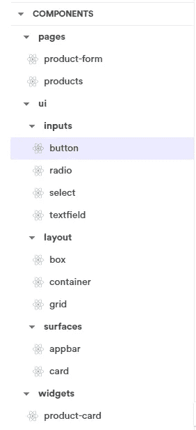

# 使用带 Bit 的 React 材质 UI 创建设计系统

> 原文：<https://levelup.gitconnected.com/creating-a-design-system-using-react-material-ui-498e2e9d3480>

## **使用材料 UI 库构建定制设计系统**

现代设计系统非常依赖丰富的 UI 组件库。它们促进了代码的可重用性，实现了设计的一致性(在应用内部和跨应用),并加速了整体开发。

这篇文章分享了我如何使用 React Material UI 和 [Bit 开源](https://github.com/teambit/bit)平台来创建一个专注于高治理一致性的定制设计系统。

您可以通过访问[位集合 URL](https://bit.dev/enlear/react-material-design/) 预览每个[独立组件](https://blog.bitsrc.io/independent-components-the-webs-new-building-blocks-59c893ef0f65)。

设计系统概述:[https://bit.dev/enlear/react-material-design/](https://bit.dev/enlear/react-material-design/)

在这里，设计系统中的每个组件都是单独创作、版本化和共享的，而不是作为单个整体库的一部分，这创造了无数的好处，例如；

*   仅导入应用程序中使用的组件。
*   允许组织中的任何开发人员对每个组件做出贡献。
*   更好的 DX(开发者体验)作为一等公民使用组件。

# 使用 React 材质 UI

众所周知[**React Material UI**](https://material-ui.com/)提供了一系列随时可用的 UI 组件。但是，请考虑一个场景，您想要添加一个 React 按钮组件，并且您知道它支持不同的属性。您可以拥有带圆角边缘的按钮、带标签的按钮、带图标的按钮，甚至是处于禁用状态的按钮。

React 材质 UI 中不同的按钮变体

# 一致性重于灵活性？

尽管允许定制是 UI 库的主要目标之一，但是如果我们向开发人员公开这种灵活性，它可能会对用户界面的一致性产生负面影响。

但是我们可以选择限制这种行为。一种方法是在 React Material UI 组件之上构建一个抽象，只公开一组给定的属性。

> 这就是我所说的包装组件。

遵循这种方法显然会带来对每个 UI 组件属性和动作的控制。

# 设计系统的高级目标

此外，有几个目标，我想满足与设计系统。

*   **定义良好的结构** —所有组件、文档和最佳实践都在一个地方，开发人员可以在一个定义良好的结构中遵循。
*   **限制行话** —从 React Material UI 中为设计系统选择组件子集。
*   **定制组件的 API** —选择我自己的 API 来改变、限制或扩展 MUI 组件。

# 构建模块是什么？

对于设计系统，我开发了以下类别来在不同的级别对 UI 组件进行分组。

*   **UI/输入** —基本 UI 组件作为基础元素。
*   **布局** —抽象布局组件，如网格、盒子、容器。
*   **表面** —用作有意义容器的组件。
*   **Widgets** —业务组件。
*   **页面** —重新组装网页的组件组合。

那么你可能会奇怪我为什么选择这样分组。

对于低阶组件，如 UI/输入、布局和表面，我遵循了与 React 材质 UI 库中相同的结构。

对于高阶组件，我已经凭空引入了小部件和页面。🙂

## 从用户界面/输入开始

起初，我在选择设计系统的基本构建模块时遇到了困难。我决定从 React Material UI 中选择一个组件子集**包装**它们来创建按钮、单选、选择和文本字段作为基础。这些组件你可以在 UI/Inputs 下找到，如下所示。

bit.dev 设计系统中的按钮组件

> 例如，我不希望开发人员自发地决定按钮的外观或行为，从而破坏一致性。

虽然按钮的功能有限，但我们可以逐渐添加更多的功能，因为它是应用程序中唯一可以重用的按钮。此外，它还减少了 React 材质 UI 与高阶组件的耦合。

## 高阶组件

然后，逐渐定义了高阶分量。以下示例显示了产品页面组件的外观。

bit.dev 中的产品页面组件组合

bit.dev 中的产品页面代码示例

此外，为了理解它的依赖关系，让我们看一下 products 页面的完整依赖关系图。

产品页面组件的依赖关系图

正如你所看到的，设计系统显然重用了它的基础构件，这是一个很好的迹象，表明它正在工作。

# 主题支持

通常，主题应用于基本的 UI 组件。使用 React 材质 UI，每个组件都继承了默认主题。因此，如果我们可以覆盖它，我们可以实现自定义主题。

> 这正是主题提供者全局覆盖应该做的。

下面是我们可以通过创建自定义主题提供程序来覆盖的一些属性。

React 材质 UI 中的主题覆盖

例如，假设我在自定义主题提供程序中覆盖了 palette 对象的“primary”属性。因此，它直接重写设计系统中按钮组件的颜色。

覆盖 React 材质 UI 中的主调色板

# 结论

我认为设计系统应该成为规范，以弥合设计师和开发人员之间的差距，建立前端开发的一致性。

> 但在目前的设计体系中，我还是很怀疑是否要包装 React Material UI 组件，这有好有坏。如果你有不同的意见，请在下面的评论中提出来。

**一些最后的提示，**

*   React Material UI 允许开发人员设计他们自己的定制设计系统。总是使用这种自由，并尝试用 React 主题化支持来实现简单的、可重用的组件。 [React Material UI 文档](https://material-ui.com/getting-started/usage/)总是一个很好的参考资源。
*   为你的项目结构建立你自己的术语。
*   您可以使用带有全局覆盖的主题来定制组件，以实现一致性和可重用性。
*   使用 [bit.dev](https://bit.dev/) 将有助于在多个开发团队中可视化和共享你的设计系统。

感谢您的阅读！！🙂