# 在 Unity 中创建一个分散注意力的系统

> 原文：<https://levelup.gitconnected.com/creating-a-distraction-system-in-unity-38c9dd6c3f07>

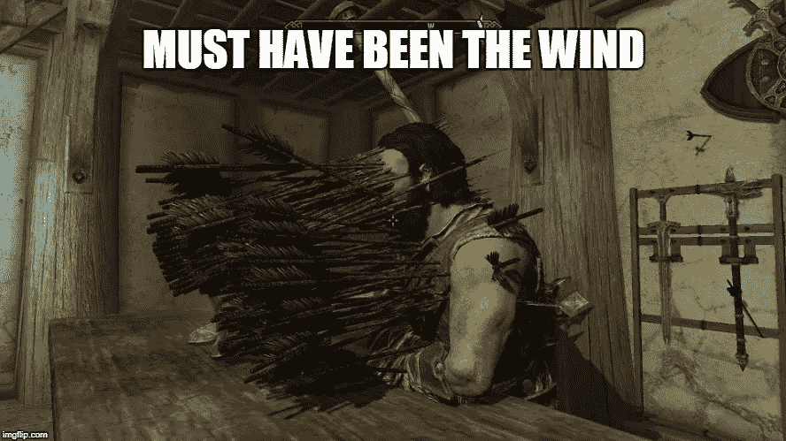

我们需要为玩家创造一种方法来分散守卫的注意力。为了通过他们，我们可以让我们的玩家扔一枚硬币，并将守卫的**navmeshemagent 组件**重定向到它那里。

在我们的**更新方法**中，我们可以运行一个名为 **ClickToThrow** 的方法，这将检测鼠标右键**是否被按下。如果是这样，我们可以启动一个**协程**来运行投掷硬币的序列。我们也只希望玩家有一个硬币，所以我们可以创建一个 bool。**

在**协程中，**很像我们的**左键移动**，我们要用一个**光线投射**来检测鼠标在哪里，以便有一个位置**实例化**我们的硬币。

在我们**实例化**硬币之前，我们可以设置一个**动画触发器**来将状态切换到我们的**投掷动画。**这可以从**任何状态**进入，然后根据**行走杆**将返回到适当的状态。

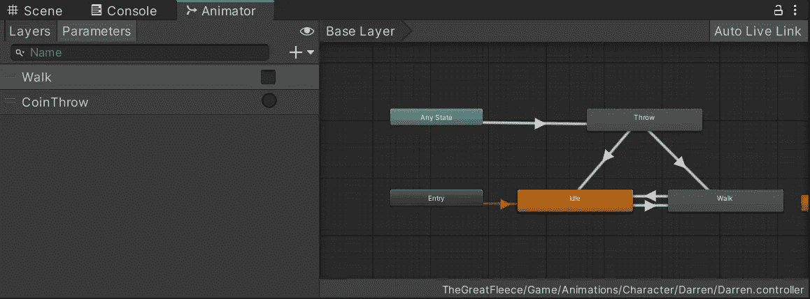

然后我们想要得到这个**动画剪辑**的长度，并在**实例化**我们的硬币预置之前，用它作为**等待秒的时间变量。**

此外，我还为 **NavMeshAgent** 设置了在投掷动画出现时停止的 bool，这可以防止在行走动画不出现时任何不必要的移动到目的地。

对于**音效**，我使用的是 **Wwise** ，所以我需要**发布**这个 **Wwise 事件，**并且对于这个声音，我希望它与硬币被扔向的位置相关联，因此我**在硬币上发布**它。

最后，我需要让守卫知道硬币的事。

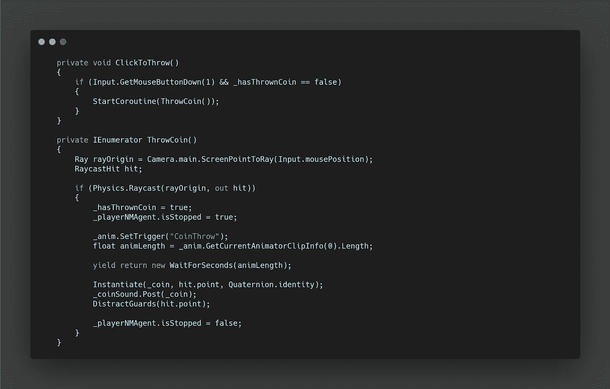

为了分散守卫的注意力，我们可以创建一个**数组**来存储所有带有适当标签的游戏对象。然后，使用一个 **foreach 循环**我们可以访问每个守卫的 **AI 脚本，**并调用一个函数，传入硬币的位置。

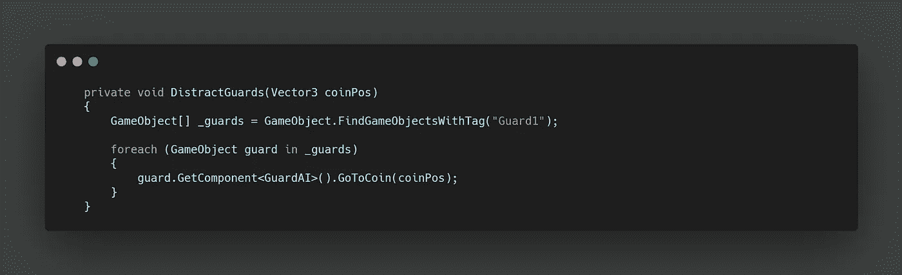

在我们的 **GuardAI 脚本中，**我们的**公共方法**接收硬币位置，将其存储在本地私有变量中，并将 alerted bool 设置为 true。

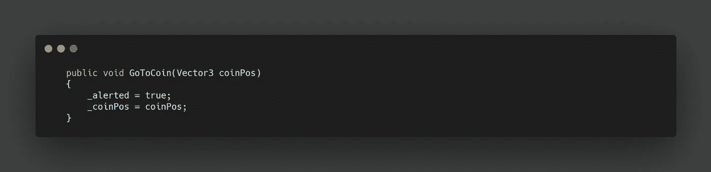

从这里，我们可以调整我们现有的航点系统。首先，我们需要将现有的 **WayPointMovement 方法**放在一个用于检查报警 bool 的 **if 语句**中。

如果警报为真，我们可以改为**将目的地**设置为硬币位置。然后，在运行我们的 **IdleTime 协程**之前，我们可以检查我们离目的地的距离。

在我们的**协程**中，我们可以再次将所有内容存储在一个 **if 语句中，**因为我们想增加守卫查看硬币时的**等待秒时间**。从这里，我们返回警告 bool 为假，并继续获得下一个航路点。

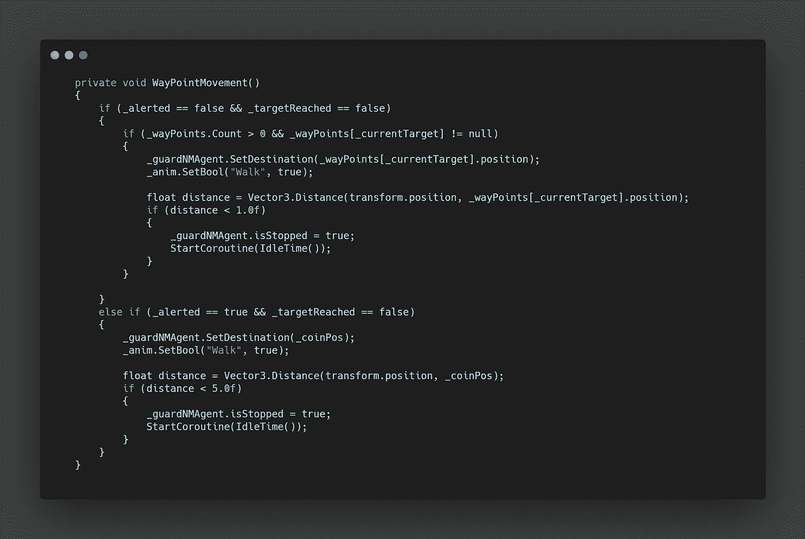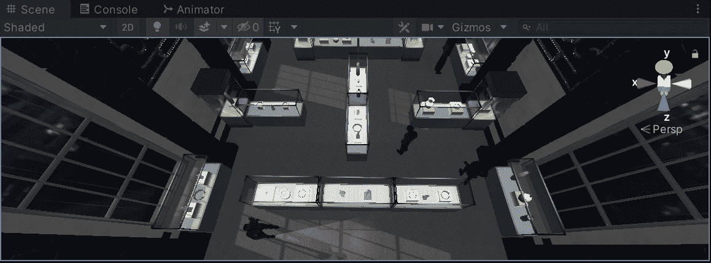

在守卫分心的情况下，我们可能应该让**用户**知道他们实际上可以扔硬币。幸运的是，我们有一个画外音来告诉达伦该做什么。我们可以设置另一个 box collider 触发器来运行模块化的**画外音脚本。**

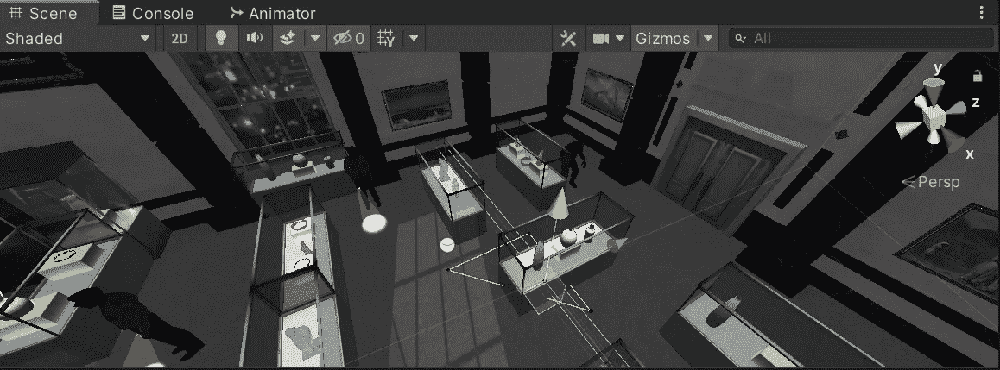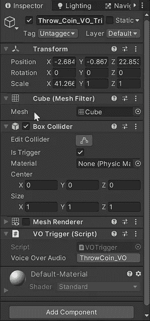

在我们的**脚本**中，我们简单地创建了一个 **Wwise 事件**的句柄，然后当玩家进入触发器时**将它发布到主摄像头上**。

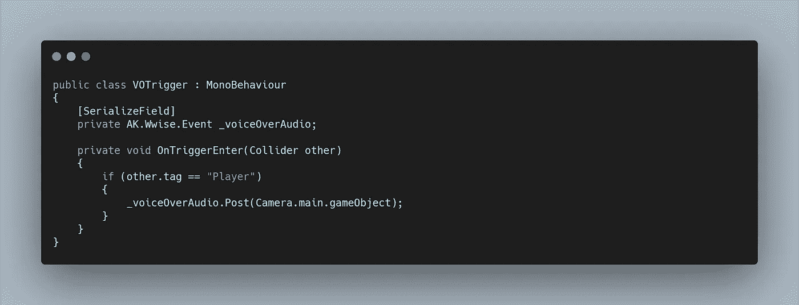

最后，我们想让音频更加身临其境。实际上，我们可能每次都能获得相同的音效，因为我们不能一个接一个地投掷多个硬币。

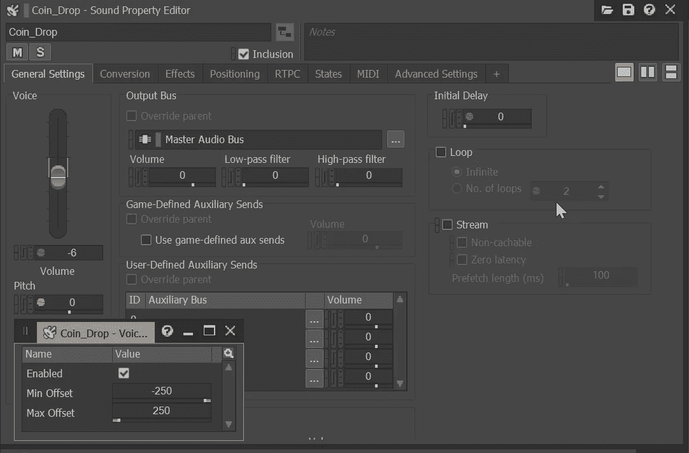

无论哪种方式，我都使用了 **Wwise** 不仅随机化了音高，还为硬币弹跳创建了不同的平移路径。

为此，我们可以访问**定位选项卡**并创建**自动化。然后我们可以创建随机选择的多条路径进行平移。这在第一人称中非常明显，但即使在我们的游戏中，它也创造了一些不错的变化。**

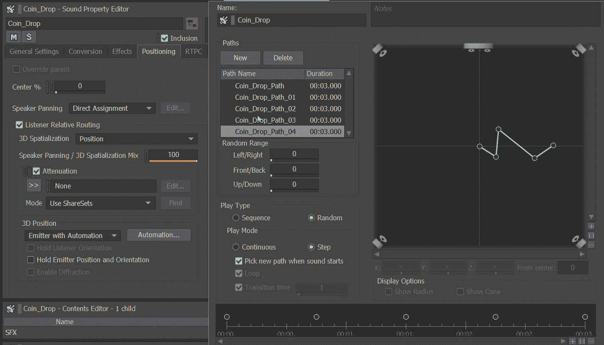