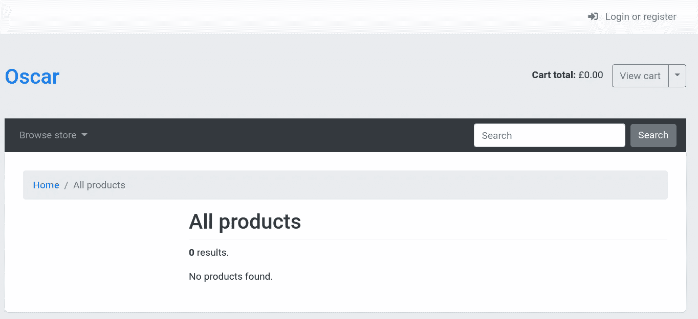
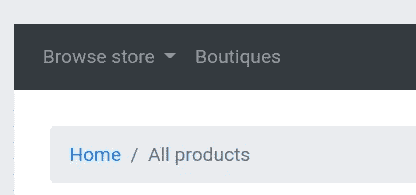
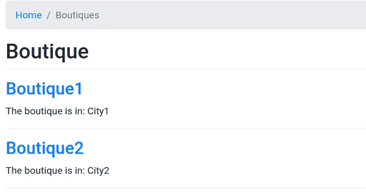
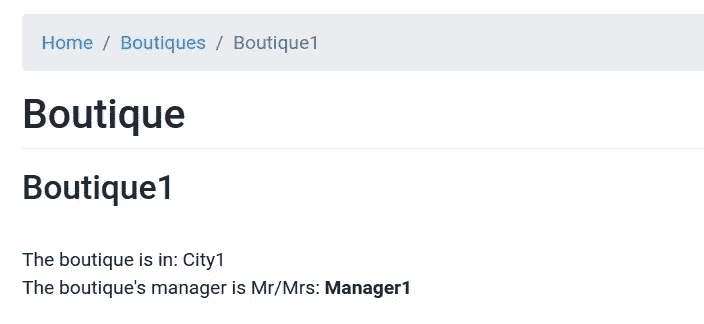

# 用 Dashboard 创建 Django-Oscar 应用程序(第 1 部分)

> 原文：<https://levelup.gitconnected.com/creating-a-django-oscar-app-with-dashboard-part-1-893edb82b461>

在本教程中，您将学习如何创建一个新的 Django 应用程序，并将其集成到 *Oscar* 电子商务框架中。特别是，我们将创建一个新的名为`boutique`的 Django 示例应用程序，并将其集成到 Oscar 的默认前端和仪表板中。

# 做好准备(姜戈-奥斯卡)

首先，有必要创建一个虚拟的工作环境。我使用 *pipenv* 作为虚拟环境，因为它简单易用。创建一个名为`/myoscarapp`的目录，进入并运行以下命令:

```
$ pipenv shell
```

然后使用 pip 安装 *django-oscar* ;

```
$ pip install django-oscar[sorl-thumbnail]
```

现在使用下面的命令创建一个全新的 Dango 项目，为了方便起见，将创建的目录重命名为`src`:

```
$ django-admin startproject myoscarproject
$ mv myoscarproject src
```

接下来，按照 Oscar 的[对应文档](https://django-oscar.readthedocs.io/en/stable/internals/getting_started.html#django-settings)中的描述配置 Django `settings.py`和`urls.py`。运行`makemigrations`和`migrate`:

```
$ python manage.py makemigrations
$ python manage.py migrate
```

测试网站:

```
python manage.py runserver
```

现在应该可以看到以下屏幕:



# 为 Django-Oscar 创建“精品”应用程序

使用以下命令照常创建新应用程序:

```
python manage.py startapp boutique
```

像往常一样，创建应用程序后，需要在`settings.py`中的`INSTALLED_APPS`中注册应用程序，如下所示:

```
INSTALLED_APPS = [
        ...
        'boutique.apps.BoutiqueConfig',
    ]
```

同样，你的`urls.py`应该是这样的:

```
from django.apps import apps
from django.urls import include, path
from django.contrib import adminurlpatterns = [
    path('i18n/', include('django.conf.urls.i18n')),
    path('admin/', admin.site.urls),
    #path('dashboard/boutique/', apps.get_app_config('boutique_dashboard').urls),
    path('boutique/', apps.get_app_config('boutique').urls),
    path('', include(apps.get_app_config('oscar').urls[0])),
]
```

在上面的代码中，带有`boutique_dashboard` URL 配置的行被暂时注释掉，将在 Oscar 的 dashboard 应用分叉时打开。

# “精品”应用程序的模型

创建以下模型，该模型将代表具有三个字段的单个**精品店**。

```
from django.db import modelsclass Boutique(models.Model):
    name = models.CharField(max_length=255, blank=True, null=True)
    manager = models.CharField(max_length=150, blank=True, null=True)
    city = models.CharField(max_length=150, blank=True, null=True)class Meta:
        app_label = 'boutique'
```

# “精品”应用的应用配置

虽然通常 Django 应用程序的配置类在`apps.py`中继承了 Django 的默认`django.apps.AppConfig`类，但 Oscar 应用程序必须继承`oscar.core.application.OscarConfig`类。你的`apps.py`应该是这样的:

```
from oscar.core.application import OscarConfig
from django.urls import path, re_path
from oscar.core.loading import get_classclass BoutiqueConfig(OscarConfig):
    name = 'boutique'
    namespace = 'boutique'def ready(self):
        super().ready()
        self.boutique_list_view = get_class(
            'boutique.views', 'BoutiqueListView')
        self.boutique_detail_view = get_class(
            'boutique.views', 'BoutiqueDetailView')def get_urls(self):
        urls = super().get_urls()
        urls += [
            path('', self.boutique_list_view.as_view(), name='index'),
            re_path(r'^view/(?P<pk>\d+)/$',
                    self.boutique_detail_view.as_view(), name='details'),
        ]
        return self.post_process_urls(urls)
```

开发您自己的应用程序时，可以选择使用`get_class`和`get_model`，但在覆盖 Oscar 应用程序时，必须使用。然而，我更喜欢在所有情况下使用 Oscar 的方法，因为我以前在使用`import`语句导入模块时遇到过各种错误。

# “精品”应用程序的管理员

这一步是可选的，Oscar 的仪表板足以添加、修改和删除数据库中的`Boutique`元素。然而，为了进行早期测试，让我们在 Django 的 admin 中注册我们的模型。将以下代码添加到应用程序目录中的`admin.py`。

```
from django.contrib import admin
from oscar.core.loading import get_modelBoutique = get_model('boutique', 'Boutique')class BoutiqueAdmin(admin.ModelAdmin):
    passadmin.site.register(Boutique, BoutiqueAdmin)
```

现在模型已经在 Django 的 admin 中注册了，继续添加一些测试项目。

> *要访问 Django 的管理员，你需要使用命令* `*python manage.py createsuperuser*`创建一个超级用户

# “精品”应用的视图

视图的实现没有什么特别的，它将上下文传递到首页。下面是一个基于 Django 通用的基于类的视图的工作`views.py`。

```
from django.views import generic
from oscar.core.loading import get_modelBoutique = get_model('boutique', 'Boutique')class BoutiqueListView(generic.ListView):
    model = Boutique
    template_name = 'boutique/boutique_list.html'
    context_object_name = 'boutique_list'class BoutiqueDetailView(generic.DetailView):
    model = Boutique
    template_name = 'boutique/boutique_details.html'
    context_object_name = 'boutique'
```

# “精品”视图的前端模板

首先，让我们通过添加一个 URL 到我们的`BoutiqueListView`来覆盖 Oscar 的导航模板。首先，在`/src/templates`目录中创建一个名为`oscar`的目录。任何具有相同相对路径的模板文件 Oscar 的来自源代码的模板将被 Oscar 覆盖，并成为更高优先级的模板。因为 Oscar 是以一种非常智能和可定制的方式开发的，所以向原始 Oscar 模板导航添加一个元素是非常容易的。来自 Oscar 的源代码的原始模板 HTML 文件可以在`/templates/oscar/partials/nav_primary.html`中找到。因此，我们需要创建一个包含以下代码的文件`oscar/partials/nav_primary.html`:

```


{{ block.super }}
<li class="nav-item dropdown">
    <a class="nav-link" href="#" role="button">
    
    </a>
</li>

```

在上面的代码中，我们首先扩展了原始 Oscar 的模板。然后，我们通过向 Oscar 的默认前端导航添加新元素来覆盖块`nav_items`。重新启动服务器后，应该会出现以下界面:



# 精品店列表模板

之前我们创建了一个视图`BoutiqueListView`，它负责将包含一系列`Boutique`实例的上下文传递给模板`boutique/boutique_list.html`。因此，我们首先创建一个 HTML 文件`/src/templates/boutique/boutique_list.html`。注意，这个模板文件没有放在目录`/src/templates/oscar`下。这是因为我们没有覆盖 Oscar 的模板，而只是创建了一个新的自定义模板。但是，在我们的例子中，它扩展了默认的 Oscar 布局模板，如下所示:

```


 | {{ block.super }}

    <nav aria-label="breadcrumb">
        <ol class="breadcrumb">
            <li class="breadcrumb-item">
                <a href="{{ homepage_url }}"></a>
            </li>
            <li class="breadcrumb-item active" aria-current="page"></li>
        </ol>
    </nav>

    

    
        <p></p>
    
        
        <p>
          <h2><a href="">{{ boutique.name }}</a></h2>
          The boutique is in: {{ boutique.city }}
        </p> <hr/>
        
    

```

结果应该是这样的:



# 精品店详情模板

现在我们有了一个包含精品店元素列表的页面，让我们添加一个页面，用户可以在其中查看任何给定精品店的详细信息。与清单模板类似，让我们用下面的代码创建一个新的 HTML 文件`/src/templates/boutique/boutique_details.html`:

```


 | {{ block.super }}

    <nav aria-label="breadcrumb">
        <ol class="breadcrumb">
            <li class="breadcrumb-item">
                <a href="{{ homepage_url }}"></a>
            </li>
            <li class="breadcrumb-item" aria-current="page">
              <a href=""></a>
            </li>
            <li class="breadcrumb-item active" aria-current="page">{{ boutique.name }}</li>
        </ol>
    </nav>

    

    <p>
      <h2>{{ boutique.name }}</h2> <br>
      The boutique is in: {{ boutique.city }} <br>
      The boutique's manager is Mr/Mrs: <strong>{{ boutique.manager }} </strong>
    </p>

```

结果应该是这样的:



此时，应用程序的模型、配置和前端模板都准备好了。在下一个教程中，我们将为`boutique`应用程序开发一个 Oscar 仪表板。

*原载于 2021 年 3 月 16 日*[*【https://mmtechslv.com】*](https://www.mmtechslv.com/tutorials/django-oscar-new-app-part-1/)*。*