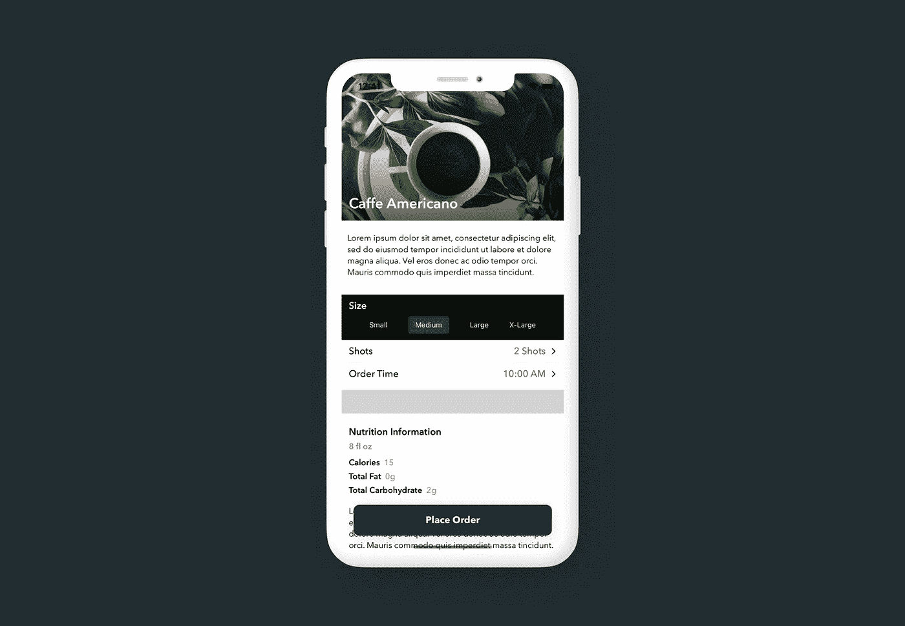
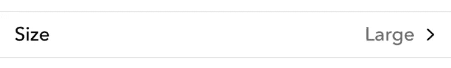
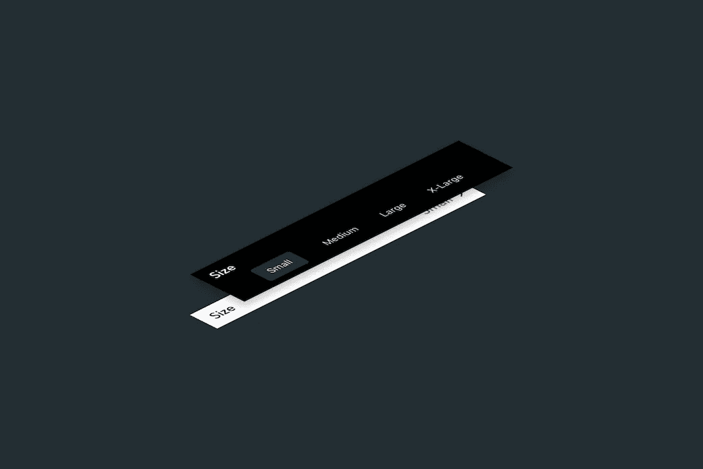

# 在 SwiftUI 中创建下拉选择器

> 原文：<https://levelup.gitconnected.com/creating-a-dropdown-picker-1067c509b327>

## 让-马克·布里安内

SwiftUI 中的默认选择器不会给你留下太多的机会进行样式化或定制。今天，我将创建一个自定义下拉选择器，您可以在下一个 iOS 项目中使用它。



DropdownPicker 展开的屏幕截图

> 如果你觉得这个教程有帮助，请考虑使用这个[链接](https://trailingclosure.com/signup/?utm_source=trailing_closure&utm_medium=blog_post&utm_campaign=custom_tabbar)订阅，如果你没有在[TrailingClosure.com](https://trailingclosure.com/?utm_source=trailing_closure&utm_medium=blog_post&utm_campaign=custom_tabbar)上阅读这篇文章，请有空来看看我们！

## 正在创建`DropdownPicker`

首先创建一个名为`DropdownPicker`的新 SwiftUI 视图。像内置的 iOS picker 一样，我们需要跟踪一些事情。首先是提货人的`title`，用户可以选择的可用`options`，最后是用户当前的`selection`。`selection`变量将是一个绑定，这样父视图可以跟踪用户的选择。

```
struct DropdownPicker: View {

    var title: String
    @Binding var selection: Int
    var options: [String]

}
```

下一步是开始构建视图的`body`。下图是`DropdownPicker`关闭后的样子。



关闭时的 DropdownPicker

```
var body: some View {
    HStack {
        Text(title)
        Spacer()
        Text(options[selection])
            .foregroundColor(Color.black.opacity(0.6))
        Image(systemName: "chevron.right")
            .resizable()
            .aspectRatio(contentMode: .fit)
            .frame(width: 10, height: 10)
    }
    .font(Font.custom("Avenir Next", size: 16).weight(.medium))
    .padding(.horizontal, 12)
    .padding(.vertical, 8)
    .background(Color.white)
}
```

在这里，我们将`title`和当前选择的拾取器放在`HStack`中。我已经添加了一些样式来美化这一行，比如定制字体、添加填充，以及在后缘放置一个 v 形符号来表示我们的行是可选的。

## 添加下拉选项

下一步是构建视图，向用户显示可供选择的选项。对于`DropdownPicker`，我们将使用`ZStack`覆盖选项，并使用名为`showOptions`的`@State`变量动态显示它们。



DropdownPicker 视图层次结构

首先在`DropdownPicker`结构中声明名为`showOptions`的新状态变量。

```
struct DropdownPicker: View {

    var title: String
    @Binding var selection: Int
    var options: [String]

    @State private var showOptions: Bool = false

    // Body below...
    // ...
}
```

然后用一个`ZStack`把`body`里面的东西都包起来。

```
var body: some View {
    ZStack {
        HStack {
            Text(title)
            Spacer()
            Text(options[selection])
                //.foregroundColor(Color(red: 2/255, green: 99/255, blue: 195/255))
                .foregroundColor(Color.black.opacity(0.6))
            Image(systemName: "chevron.right")
                .resizable()
                .aspectRatio(contentMode: .fit)
                .frame(width: 10, height: 10)
        }
        .font(Font.custom("Avenir Next", size: 16).weight(.medium))
        .padding(.horizontal, 12)
        .padding(.vertical, 8)
        .background(Color.white)

        // Dropdown options here...
    }
}
```

接下来，我们将添加下拉菜单的代码。因为我们想要动态显示选项，所以我们将使用`showOptions`作为`if`语句的条件。

```
var body: some View {
    ZStack {
        // ...
        // View code for closed row above

    	// Dropdown view code
    	if showOptions {

    	}
    }
}
```

然后添加标题和选项的`VStack`...

```
var body: some View {
    ZStack {
        // ...
        // View code for closed row above

    	// Dropdown view code
    	if showOptions {
            VStack(alignment: .leading, spacing: 4) {
                Text(title)
                    .font(Font.custom("Avenir Next", size: 16).weight(.semibold))
                    .foregroundColor(.white)
                HStack {
                    // options here
                }
                .padding(.vertical, 2)
                .transition(AnyTransition.move(edge: .top).combined(with: .opacity))
            }
    	}
    }
}
```

最后，我们可以用`options`数组构建出`HStack`。我的代码下面是我在模型中使用的所有样式。请随意定制您喜欢的，并与它一起玩。

```
var body: some View {
    ZStack {
        // ...
        // View code for closed row above

    	// Dropdown view code
    	if showOptions {
            VStack(alignment: .leading, spacing: 4) {
                Text(title)
                    .font(Font.custom("Avenir Next", size: 16).weight(.semibold))
                    .foregroundColor(.white)
                HStack {
                    Spacer()
                    ForEach(options.indices, id: \.self) { i in
                        if i == selection {
                            Text(options[i])
                                .font(.system(size: 12))
                                .padding(.vertical, 8)
                                .padding(.horizontal, 12)
                                .background(Color.white.opacity(0.2))
                                .cornerRadius(4)
                        } else {
                            Text(options[i])
                                .font(.system(size: 12))
                        }
                        Spacer()

                    }
                }
                .padding(.vertical, 2)
                .transition(AnyTransition.move(edge: .top).combined(with: .opacity))
            }
    	}
    }
}
```

## 添加点击手势

我们的`DropdownPicker`只缺少一样东西。我们实际上还没有给它向用户显示下拉选项的能力。现在如果你点击这一行，什么也不会发生。最后一部分是向静态行和下拉列表中的选项添加点击手势。这是`DropdownPicker`的最终视图代码。

```
import SwiftUI

struct DropdownPicker: View {

    var title: String
    @Binding var selection: Int
    var options: [String]

    @State private var showOptions: Bool = false

    var body: some View {
        ZStack {
            // Static row which shows user's current selection
            HStack {
                Text(title)
                Spacer()
                Text(options[selection])
                    .foregroundColor(Color.black.opacity(0.6))
                Image(systemName: "chevron.right")
                    .resizable()
                    .aspectRatio(contentMode: .fit)
                    .frame(width: 10, height: 10)
            }
            .font(Font.custom("Avenir Next", size: 16).weight(.medium))
            .padding(.horizontal, 12)
            .padding(.vertical, 8)
            .background(Color.white)
            .onTapGesture {
                // show the dropdown options
                withAnimation(Animation.spring().speed(2)) {
                    showOptions = true
                }
            }

            // Drop down options
            if showOptions {
                VStack(alignment: .leading, spacing: 4) {
                    Text(title)
                        .font(Font.custom("Avenir Next", size: 16).weight(.semibold))
                        .foregroundColor(.white)
                    HStack {
                        Spacer()
                        ForEach(options.indices, id: \.self) { i in
                            if i == selection {
                                Text(options[i])
                                    .font(.system(size: 12))
                                    .padding(.vertical, 8)
                                    .padding(.horizontal, 12)
                                    .background(Color.white.opacity(0.2))
                                    .cornerRadius(4)
                                    .onTapGesture {
                                        // hide dropdown options - user selection didn't change
                                        withAnimation(Animation.spring().speed(2)) {
                                            showOptions = false
                                        }
                                    }
                            } else {
                                Text(options[i])
                                    .font(.system(size: 12))
                                    .onTapGesture {
                                        // update user selection and close options dropdown
                                        withAnimation(Animation.spring().speed(2)) {
                                            selection = i
                                            showOptions = false
                                        }
                                    }
                            }
                            Spacer()
                        }
                    }
                    .padding(.vertical, 2)
                    .transition(AnyTransition.move(edge: .top).combined(with: .opacity))

                }
                .padding(.horizontal, 12)
                .padding(.vertical, 8)
                .background(Color.black)
                .foregroundColor(.white)
                .transition(.opacity)

            }

        }
    }
}
```

## 示例使用

```
DropdownPicker(title: "Size", selection: $selection, options: ["Small", "Medium", "Large", "X-Large"])
```

## 喜欢这个教程？

## 让我们看看你做了什么！

给我们发照片！给我们一个链接！任何事！在推特 [@TrailingClosure](https://twitter.com/TrailingClosure) 、Instagram 上找到我们，或者发邮件到 howdy@TrailingClosure.com联系我们。

由[布里吉特·托姆](https://unsplash.com/@brigittetohm?utm_source=unsplash&utm_medium=referral&utm_content=creditCopyText)在 [Unsplash](/s/photos/coffee?utm_source=unsplash&utm_medium=referral&utm_content=creditCopyText) 上拍摄的 SwiftUI 模型中的咖啡照片