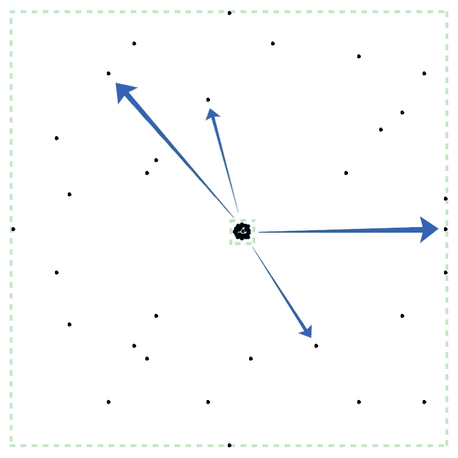

# 用 CSS 创建烟火效果

> 原文：<https://levelup.gitconnected.com/creating-a-firework-effect-with-css-63181bedf841>


## CSS 和一个 HTML 元素的简单效果

上周我用 CSS 创建了一个烟火效果。它相对简单(每个烟花只需要一个 HTML 元素)并且可定制(它使用 CSS 定制属性来定制颜色、大小、位置……)

下面是效果的演示([见全屏](https://codepen.io/alvaromontoro/full/MWrMEgW)):

> 在我继续之前，让我添加一些免责声明:首先，下面的代码是原始代码的简化版本，查看上面的演示以获得完整的可定制代码(但它可能有点复杂)。第二，开发 demo 很有趣，但从代码角度来看，这可能不是最有效的方法。

# 它是如何工作的

想法是将一个**小元素和绝对大小的背景放在不同的相对位置**(例如，使用百分比)。这里绝对和相对的使用是必不可少的。拥有绝对大小的背景意味着它们的大小不会随着容器的大小而改变，但是它们的位置是相对的，所以当容器被调整大小时它会改变(或者给人以改变的印象)。

这些点之间的相对距离始终是相同的。但是随着容器的增长，它们之间的绝对距离也会扩大——类似于真正的烟花的工作方式。



粒子如何工作的简图

看右边箭头所指的圆圈。它的位置是 100%水平，50%垂直。容器很小的时候也是这样，但是随着容器的增长，它看起来会变得很大。然而，它仍然处于与之前相同的相对位置:100%水平，50%垂直。

# 代码

在(简短地)描述了事情将如何工作之后，让我们来看看代码吧！学习的一个很好的方法就是去做。请随意按照步骤进行(您将需要自己添加一些东西，这将使您的烟花更加独特。)

## 超文本标记语言

如上所述，HTML 部分很简单:我们只需要每个烟花一个元素:

```
<div class="firework"></div>
```

我将它设为`<div>`，但它也可以是任何其他元素。如果我们想让它更容易理解，我们可以添加一个“img”的`role`来表明它是一个图像，以及一个带有简短描述的`aria-label`:“一个烟花的动画卡通”但我们可以说，它是不需要的，因为它更表象化，已经是空的。所以，现在让我们保持简单。

## 半铸钢ˌ钢性铸铁(Cast Semi-Steel)

我们首先为我们的 firework 定义基本的样式:一个简单的块容器绝对定位在屏幕上:

```
.firework {
  position: absolute;
  top: 50%;
  left: 50%;
  transform: translate(-50%, -50%);
  width: 0.5vmin;
  aspect-ratio: 1;
  background:
      /* background intentionally blank */
    ;
  background-size: 0.5vmin 0.5vmin;
  background-repeat: no-repeat;
}
```

让我们一点一点地看看属性和值:

*   `position: absolute;`:元素将在屏幕上移动。在不影响其他元素的情况下，拥有一个绝对位置是最理想的。
*   默认情况下，烟花会在绝对中心。我们可以在以后改变它(如果你已经深入研究了代码，你会看到这些从烟火到烟火的变化。)
*   `transform: translate(-50%, -50%);`:这个很重要。通过水平和垂直平移元素-50%,它将在所有方向上增长(而不是向底部右侧增长)。)当我们改变它的大小时。
*   `width: 0.5vmin; aspect-ratio: 1;`:元素将是一个微小的正方形。我使用了 vmin 单元，所以它的响应速度很快，但是你也可以使用 px、rem 或者你喜欢的 CSS 单元。
*   `background-size: 0.5vmin 0.5vmin;`:这也很重要。我们设置了一个固定的背景尺寸，所以一旦我们定义了渐变(见下文)，它们将总是有相同的尺寸，与容器有多大无关。
*   `background-repeat: no-repeat;`:我们不希望渐变重复。否则，我们会有太多，它不会看起来很好。

对于背景，我们将添加一些径向渐变，如下图所示:

```
radial-gradient(circle, yellow 0.5vmin, #0000 0) 50% 0%
```

> 注意:因为`background-size`是方形的，所以我们的演示并不需要关键词`circle`。我添加它以防我有不同大小的背景。

这个渐变将在烟花元素的中心(50%)顶部(0%)放置一个大小为 0.5vmin 的圆。现在，我们将在不同的位置编码许多其他渐变。只要确保你把它们分布在整个容器中。不要一边是空的，一边是满的。试着均等地加入所有的象限(记住当容器膨胀时，一个“侧面的”烟花看起来会很奇怪。)我一共加了 30 个背景(每个象限 7 个)。作为一个建议，如果可以的话，避免弯角。它们是“离群值”,当动画处于活动状态时，它们看起来只是“咩”。

说到动画，我们来定义一下动画吧！它将分为两个部分:烟花飞向天空(压缩)和烟花爆炸。

```
[@keyframes](http://twitter.com/keyframes) firework {
  0% { 
    transform: translate(-50%, 60vh);
    width: 0.5vmin;
    opacity: 1;
  }
  50% { 
    width: 0.5vmin;
    opacity: 1;
  }
  100% { 
    width: 45vmin; 
    opacity: 0; 
  }
}
```

它首先将烟花元素移到屏幕底部之外(`translate(-50%, 60vh)`)，并保持其较小(`width: 0.5vmin`)和可见(`opacity: 1`)。元素中指定的转换是`translate(-50%, -50%)`。因此，动画会将元素从底部转换到其原始位置(100%)。

在动画进行到一半时，我们保持元素小且可见，从那时起，它将扩展到其最终大小(`45vmin`)并与背景融合(通过设置`0`的`opacity`)。

```
.firework {
  animation: firework 2s infinite;
  ...
}
```

最后，我将相同的样式应用于烟花的`::before`和`::after`伪元素，然后对它们做了一些小的修改(旋转、缩放、使用 3D 旋转，你可以选择)，所以我有了三倍的粒子数量(并且在“不同的位置”)，而不必添加任何更多的背景或元素:

```
.firework,
.firework::before,
.firework::after {
  content: "";
  ...
}.firework::before {
  transform: translate(-50%, -50%) rotate(25deg) !important; 
}.firework::after {
  transform: translate(-50%, -50%) rotate(-37deg) !important;
}
```

`rotate()`的角度对于`::before`和`::after`都是随机的。`!important`是覆盖动画中的一个所必需的。然而，没有它的效果可能看起来也很酷。请随意尝试和实验。

## 结果呢

按照这些步骤，我们有一行 HTML 和 50-60 行 CSS(取决于径向渐变的数量)。结果将如下所示:

比上面显示的要简单，但是代码也相当简单。是时候个性化它，让它成为你自己的了！

# 结论

最后，为了使事情更容易编辑(但有点复杂)，我用一些自定义属性替换了一些值。CSS 变量使我可以更容易地包含其他 fireworks，只需最少的代码更改。我没有将这部分添加到本文中，因为我想保持简单，但是您可以在本文开头的演示代码中看到这些变量。

我希望你喜欢这篇文章。如果您开发了自己的版本或对以上版本进行了更改，请分享。我会喜欢检查它和探索代码:)

文章图片由 [Erwan Hesry 在 Unsplash](https://unsplash.com/photos/WPTHZkA-M4I) 上。