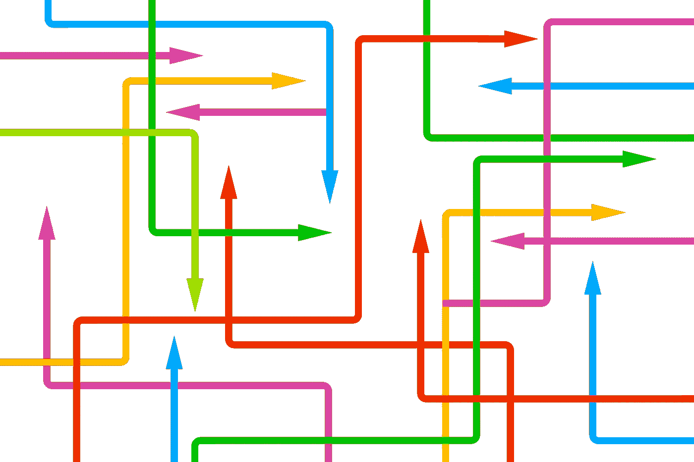

# 用 Project Reactor 的 Group By 方法创建通量通量

> 原文：<https://levelup.gitconnected.com/creating-a-flux-of-fluxes-with-project-reactors-group-by-method-37200bfc2a>

## 什么通量？



图片由 [Gerd Altmann](https://pixabay.com/users/geralt-9301/?utm_source=link-attribution&utm_medium=referral&utm_campaign=image&utm_content=1577983) 来自 [Pixabay](https://pixabay.com/?utm_source=link-attribution&utm_medium=referral&utm_campaign=image&utm_content=1577983)

在我的上一篇文章[了解 Reactive Java](/understanding-reactive-java-e8aaee9a204b) 中，我创建了一个 Reactive Java 强大功能的简单演示。我创建的微型应用程序代表了一组微服务，它们根据类型处理二手车的诱导。输入是一个简单的采购订单类型，它产生了`Car`、`Motorcycle`和`Truck`类型供进一步处理。

反应式 Java 的思想是创建一个处理链，允许系统调度非阻塞任务，并将阻塞任务分成输入和输出任务。这个链使得我们做一件事然后做另一件事的代码看起来更有命令性，并且我们确信链中的每一项都是顺序处理的。

但是在这个简单的例子中，我们的处理是非常线性的，我们对每个项目只有一个链，即使每个项目可能需要不同的逻辑，如果我们可以通过某种类型来区分项目的话。在我们的原始代码中，我们有一个工厂和一些映射，根据原始采购订单中的字符串类型给出不同的结果。所以我们有了这个代码:

```
static final Map<String, String> outQueue = Map.of(
            "Car", CAR_QUEUE_NAME,
            "Truck", TRUCK_QUEUE_NAME,
            "Motorcycle", MOTORCYCLE_QUEUE_NAME);
static final Map<String, Function<Vehicle, Optional<String>>>
   vehicleWriter = Map.of(
            "Car", (s) -> writeCarJson((Vehicle.Car)s),
            "Truck", (s) -> writeTruckJson((Vehicle.Truck)s),
            "Motorcycle", (s) ->
                    writeMotorcycleJson((Vehicle.Motorcycle)s));
```

和这个工厂类型:

```
Factory<String, Vehicle, PurchaseOrder> factory = new Factory<>();
factory.add("Car", (po) -> new Vehicle.Car(po));        factory.add("Truck", (po) -> new Vehicle.Truck(po));        factory.add("Motorcycle", (po) -> new Vehicle.Motorcycle(po));
```

有很多地方我们需要修改，增加另一种类型。如果我们能够将水流分流成几股不同的水流，然后再将它们汇合成一股，那就太好了。这是我们最初的流程:

```
sender.sendWithPublishConfirms(receiver
    .consumeAutoAck(PO_QUEUE_NAME)
    .map(d -> readJson(new String(d.getBody())))
    .filter(PurchaseOrder::isValid)
    .doOnNext(po -> log("recevied po " + po))
    .doOnDiscard(PurchaseOrder.class, 
                    po -> log("Discarded invalid PO " + po))
    .flatMap(po -> writePoJson(po).map(j ->
        reactiveCollection
            .upsert(po.getId(), j)
            .map(result -> po))
          .orElse(Mono.just(po)))
    .map(gf -> factory.build(gf.getType(), gf))
    .timeout(Duration.ofSeconds(10))
    .doFinally((s) -> {
      log("Consumer in finally for signal " + s);         
      receiver.close();
      sender.close();
      cluster.disconnect();
    })
    .map(v -> new OutboundMessage("", 
            outQueue.get(v.getPo().getType()), 
            vehicleWriter
              .get(v.getPo().getType())
              .apply(v)
              .orElse("")
              .getBytes()))
    )
    .subscribe();
```

如您所见，我们正在使用采购订单的`getType`方法来更改处理。这是一个相对简单的例子。想象一个更完整的例子，让多个流独立执行。

该功能通过`Flux.groupBy(Function<T, K> getkey)`方法实现。它将一个接受类型并返回一个键的`Function`作为参数。返回值是一个`Flux<GroupedFlux<K,T>>`。`GroupedFlux`就是简单的`Flux`，但是它有一个额外的方法`key()`，该方法将返回创建它时使用的键。

所以现在你基本上有了通量。外部的通量代表不同的类型，内部的`Flux`是由那个特定类型组成的`Flux`。内部的流动必须向下游排出，否则事情可能会悬而未决。最好的方法是将上游通量分解成相对较少的类型。在我们的情况下，我们有三种类型，我不会想象我们会增加很多，所以我们应该很好。

现在你如何处理不同流量的内部通量呢？首先，我们需要一种方法来判断什么流与什么类型相匹配。为此，我绘制了一张地图:

```
Map<String, Function<GroupedFlux<String, PurchaseOrder>,
    Publisher<OutboundMessageResult>>> publisherMap = Map.of(
            "Car", (o) -> getCarPublisher(sender, o),
            "Truck", (o) -> getTruckPublisher(sender, o),
            "Motorcycle", (o) -> getMotorcyclePublisher(sender, o)
);
```

这个映射将返回一个为每种类型提供流程的方法。输出类型是`OutboundMessageResult`，随着处理的进行，它将与其余的流合并。

查看`getCarPublisher`方法，我们可以看到它需要一个 RabbitMQ `sender`,一个购买订单处理它并返回发送到下一个消息队列的结果:

```
private static Flux<OutboundMessageResult> 
       getCarPublisher(Sender sender, 
                      GroupedFlux<String, PurchaseOrder> input) {
   return sender.sendWithPublishConfirms(input
     .map(po -> new Vehicle.Car(po))
     .doOnNext(car -> log("sending car " + car))
     .map(v -> {
        try {
          return Optional.of(objectMapper
                            .writerFor(Vehicle.Car.class)
                            .writeValueAsString(v));
        } catch (JsonProcessingException ex) {
          return Optional.<String>empty();
        }
      })
      .filter(o -> o.isPresent())
      .map(o -> o.get())
      .doOnDiscard(String.class, 
                    s -> log("Discarded invalid Car"))
      .map(s -> new OutboundMessage("", 
                    CAR_QUEUE_NAME, 
                    s.getBytes())));
}
```

现在所有专门处理`Car`类型的逻辑都包含在一个方法中。我们为每个其他类型创建相同的方法。

现在开始执行每个流程，我们可以获取`Flux.groupBy`的输出并用`Flux.flatMap`链接它:

```
.groupBy(po -> po.getType())
.flatMap((v) -> publisherMap.get(v.key()).apply(v))
.subscribe();
```

这将基于类型分割`Flux`，对于每个类型，它将调用`publisherMap.get`方法并在采购订单上应用该函数。`getCarPublisher`和类似的函数将只被调用一次，因为该类型出现在上游通量中，并且内部通量将被附加到包含在其中的流中。`Flux.flatMap`将重新组合所有单独的通量，最后，`Flux.subscribe`将开始滚球。

这是一个简单的例子，所以这种重构看起来有些多余，但是很容易想象一个更复杂的例子，同样的基本模式也适用。同样，这是一个使用 Project Reactor 提供的反应式一元方法来消除 switch 或 if/else 链并简化整体代码流的示例。所有的代码都在我的 GitHub 页面上。

[](https://github.com/rkamradt/usedvehicles/tree/v0.2) [## rkamradt/二手车辆

### 在 GitHub 上创建一个帐户，为 rkamradt/usedvehicles 的开发做出贡献。

github.com](https://github.com/rkamradt/usedvehicles/tree/v0.2) 

提到的其他文章

[](/understanding-reactive-java-e8aaee9a204b) [## 理解反应式 Java

### 因为你的线程阻碍了我的表现。

levelup.gitconnected.com](/understanding-reactive-java-e8aaee9a204b)