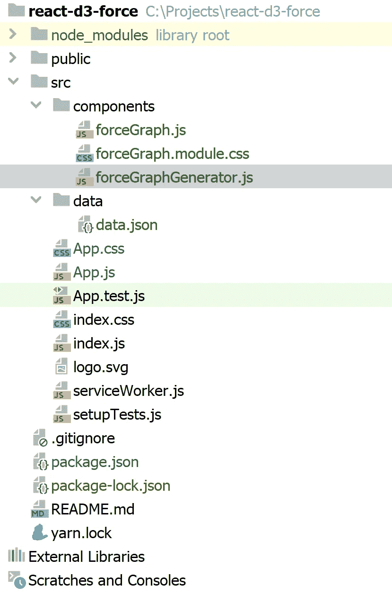
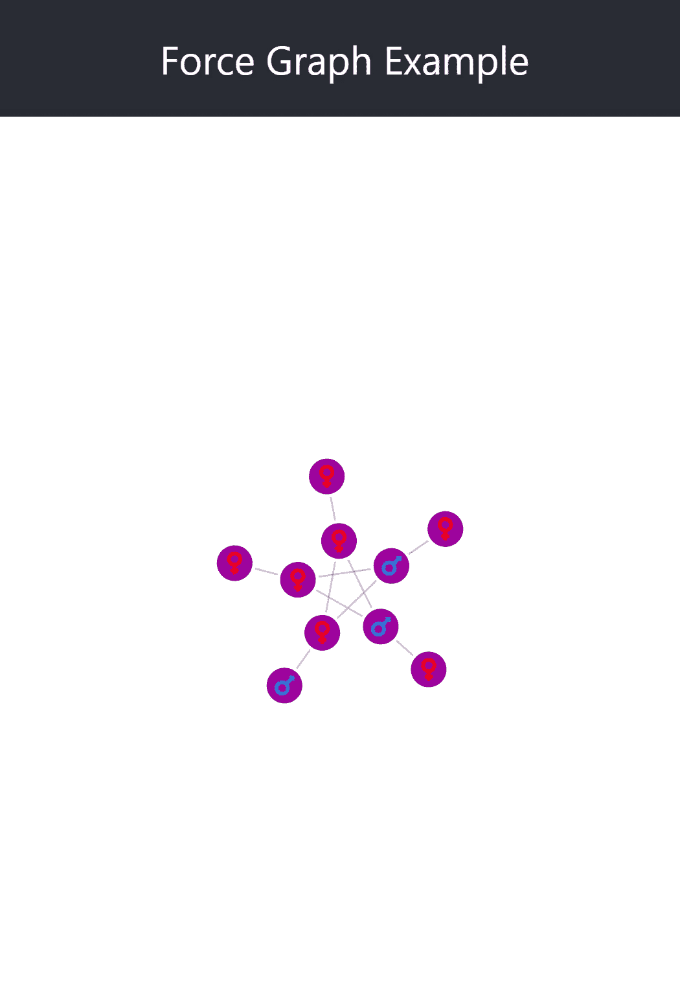

# 使用 React 和 D3 创建力图

> 原文：<https://levelup.gitconnected.com/creating-a-force-graph-using-react-and-d3-6579bcd9628c>

我参与了一个有趣的项目，其中包括构建各种图形可视化。我们构建的应用程序使用 **React** 作为视图引擎，使用 **D3** 库进行数据可视化。在这篇文章中，我将向你展示如何使用 **D3** 创建一个力图来可视化你的数据中的连接。

## 创建示例应用程序

我们将从使用**create-React-app**bootstraper 创建一个新的 React 应用程序开始。如果您的机器上安装了 **Node.js** ，只需运行以下命令:

```
npx create-react-app react-d3-force
```

该命令将生成一个新的 **React** 项目。项目创建完成后，进入 app 文件夹，使用以下命令向其中添加 **D3** 和 **Font Awesome** 库:

```
npm i d3 @fortawesome/fontawesome-free
```

现在我们需要的所有库都在项目中了，是时候前进并创建项目结构了:



项目结构

这里需要注意一些事情:

*   在**组件**文件夹下，我们有两个组件: **forceGraph** 和 **forceGraphGenerator** 。 **ForceGraph** 组件将是生成的力图的容器，而 **ForceGraphGenerator** 将使用 **D3** 生成图。
*   在**数据**文件夹下，我们会找到一个带有图形数据的 **JSON** 文件。当然，这些数据应该从服务器中检索，但是为了简化示例，我在项目中使用它。

## 构建力图容器

force graph 容器将包含图形，并负责数据操作或业务逻辑功能。为了项目的简单性，我们创建了一个对 div 的引用，它将包装生成图，仅此而已。

以下是 **ForceGraph** 组件容器的代码:

这里发生的唯一有趣的事情是使用了一个 **React ref** 来引用容器元素。另一件事是**销毁**函数，我们将从 **runForceGraph** ，中获得，如果组件从 DOM 中移除，它将处理清理。

## 构建力图生成器

力图形生成器将是一个负责生成图形的功能。下面是获取包含 div、链接和节点数据以及生成节点工具提示的函数的声明:

现在让我们来实现它。

第一行代码将复制数据并获得容器的**宽度**和**高度**:

然后，我们将添加一些辅助函数:

这 3 个函数将检索给定节点的颜色、图标和 CSS 类。最后一个函数将添加拖动力图节点的选项，作为其模拟的一部分。

在前一部分之后，我们将生成处理节点工具提示生成的代码:

**addTooltip** 和 **removeTooltip** 是显示/隐藏工具提示及其相关内容的辅助函数。

现在一切就绪，我们将添加 **D3** 代码来生成图形:

该代码创建力模拟并向其添加节点和链接。它还负责为每个节点添加图标(这就是为什么我们添加了**字体和颜色)。**

当图表准备就绪时，我们将添加几个事件处理程序来处理当 tick 发生或需要显示工具提示时将要发生的事情:

最后但同样重要的是，我们将返回图形容器将要使用的销毁函数:

整个函数源代码:

在这里你可以找到力图 CSS 模块:

示例中使用的数据

我们加载的 **data.json** 文件:

应用程序实现

**应用**组件将运行整个图形。下面是它的源代码:

现在一切就绪，你可以运行应用程序，看看你的花式力图。



力图

## 摘要

在这篇文章中，我展示了如何使用 **React** 和 **D3** 库创建一个力图组件。你可以在这里找到图形代码。