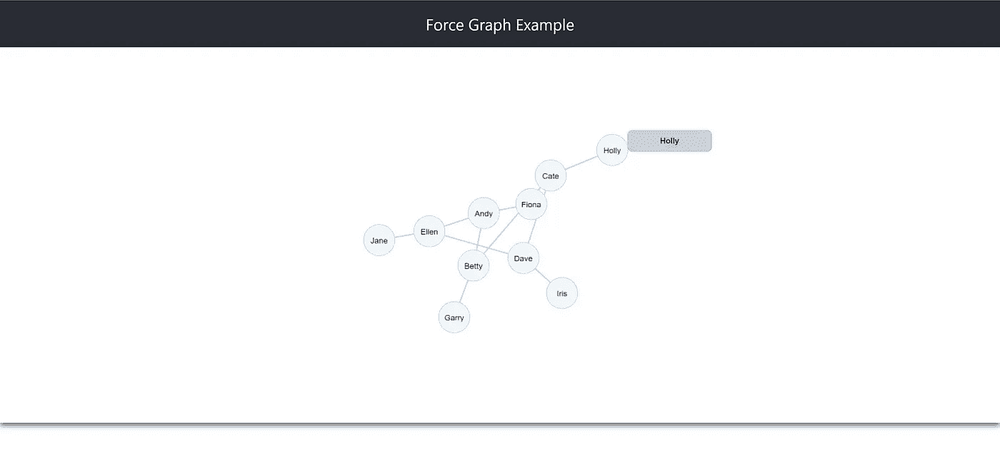

# 使用 React、D3 和 PixiJS 创建力图

> 原文：<https://levelup.gitconnected.com/creating-a-force-graph-using-react-d3-and-pixijs-95616051aba>

几个月前，我发表了一篇关于如何使用 React 和 D3 创建力图的文章。但是如果力图数据源巨大呢？你还会使用 D3 吗，或者有其他的解决方案吗？
在这篇文章中，我将解释如何结合 D3 和 PixiJS 来创建几乎相同的力图，但以不同的方式，这将使你能够支持更大的数据源。

在我们创建的应用程序中，我们面临着一个非常棘手的性能问题。虽然 D3 帮助我们创建了需要在屏幕上显示的相关力图，但我们使用的数据源变得非常大。当使用 D3 时，下面的图形表示是使用 SVG 创建的，这意味着当数据源变大时，SVG 元素的数量也会增加。屏幕上的 SVG 元素越多，应用程序的性能就越差。

那么，如何才能解决问题呢？如果我们可以将 D3 SVG 表示转换成 canvas 表示会怎么样。那会有帮助吗？
在我们的应用中，这很有帮助。

## 输入 PixiJS

PixiJS 是一个灵活的 2D WebGL 渲染器库，它工作在 HTML5 canvas 元素之上。

*注意——我不会在这篇文章中谈论 PixiJS 的基础知识，我鼓励你去它的* [*网站*](https://www.pixijs.com/) *做进一步的阅读。*

总的来说，我所做的是一方面使用 D3 力图模拟来保持力图模拟，我让 PixiJS 处理画布元素上的所有渲染。

## 创建示例应用程序

我将对我在“[使用 React 和 D3](/creating-a-force-graph-using-react-and-d3-6579bcd9628c) 创建力图”帖子中创建的应用进行一点重构。这意味着，如果你还没有阅读它，那么在你继续阅读这篇文章之前，先去阅读它。

首先你需要安装 PixiJS 库。在命令行中运行以下代码来安装 PixiJS 和 PixiJS Viewport，这将帮助我们支持诸如放大和缩小之类的操作:

```
**npm i** **pixi.js pixi-viewport**
```

安装完库之后，我们就可以开始了。

我将使用我在上一篇文章中创建的相同的 **ForceGraph** 组件容器，但是这次我将使用 **runForceGraphPixi** 函数，而不是 **runForceGraph** 。runForceGraphPixi 将负责创建和运行新的力图。

## 构建力图生成器

力图形生成器将是一个负责生成图形的功能。下面是获取包含 div、链接和节点数据以及生成节点工具提示的函数的声明:

你可以看到我导入了 D3 和 PixiJS，并且使用了我在上一篇文章的 **runForceGraph** 中使用的相同签名。现在让我们实现函数。

第一行代码将复制数据并获得容器的**宽度**和**高度**:

我还添加了一个变量，稍后我将使用它来控制节点的拖放，并清除容器中先前生成的 HTML 内容。

然后，让我们添加几个辅助函数:

助手函数将帮助我们添加工具提示，支持节点的着色，并创建拖放功能。

现在，我们添加将创建节点及其链接的代码，并将模拟力图:

注意我加了两个 **Pixi。应用**和 **d3 .力模拟**。PixiJS 应用程序将根据 D3 公开的力模拟负责图形渲染。

当图表准备就绪时，我们将添加几个事件处理程序来处理 tick 发生时将要发生的事情:

在 tick 事件中，我们清理所有链接，然后再次在画布上重新绘制它们。

最后但同样重要的是，我们将返回图形容器在卸载图形时使用的销毁函数:

整个函数源代码:

现在一切就绪，你可以运行应用程序，看看你的花式力图。



生成的力图

# 摘要

在这篇文章中，我展示了如何使用 **React、D3** 和 **PixiJS** 库创建一个力图组件。你可以在这里找到图形代码。