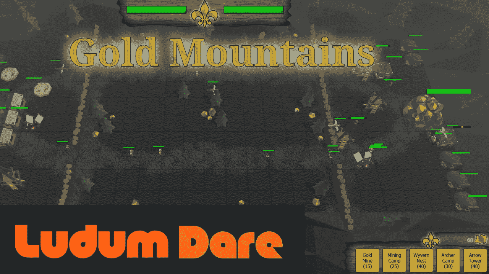
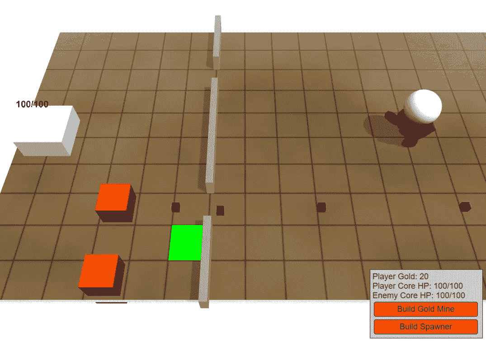
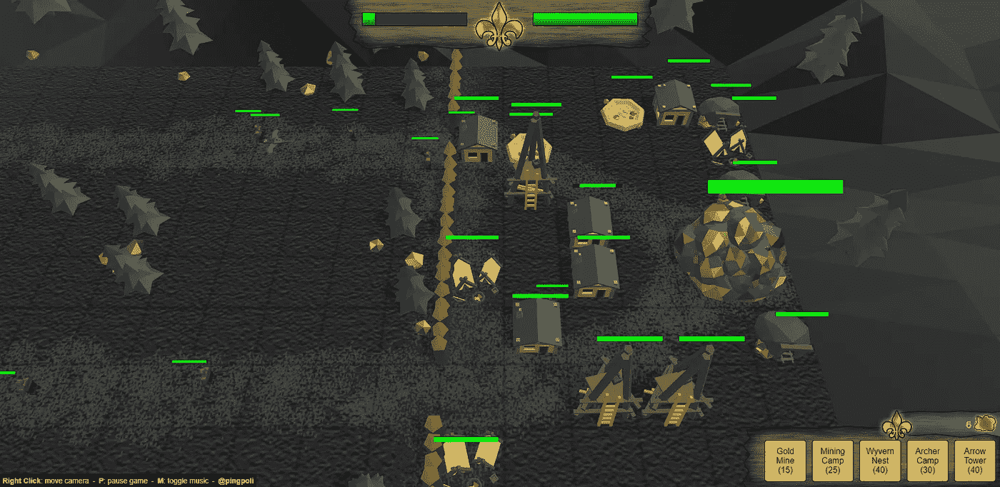
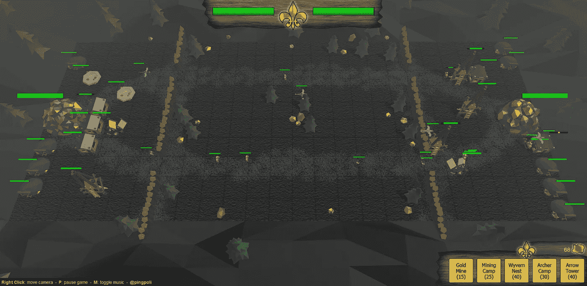

# 在 48 小时内创造一个游戏——Ludum Dare 48 剖析

> 原文：<https://levelup.gitconnected.com/creating-a-game-in-48-hours-ludum-dare-48-post-mortem-d2ba80caa32e>

## 回顾我的 Ludum Dare 48 词条的开发过程

“金山”，一个我在 48 小时内为 Ludum Dare game jam 从零开始创作的游戏，图片由作者提供。

上周末，第 48 届 [Ludum Dare](https://ldjam.com/) 举行。Ludum Dare 是一个[游戏关卡](https://betterprogramming.pub/10-game-jam-strategies-92c88c81f834)，你有 48 个小时完全从零开始创建一个游戏。这包括所有的程序，每一个艺术资产，每一个音效，音乐，一切。

活动一开始就公布一个主题，但一般都是松散的主题，所以可以提交的游戏范围很广。这一次的主题是“越来越深”。

# **技术**

对于过去的 Ludum Dare 活动，我要么使用我的 C++/OpenGL 引擎，要么使用 HTML5/JavaScript，这两种引擎对于游戏堵塞都非常有效。然而，在过去的几周里，我一直在使用 JavaScript WebGL 引擎 [Babylon.js](https://www.babylonjs.com/) 。所以对于这个版本，我想用 Babylon.js 做一个游戏，测试它对于游戏卡顿的可行性。

在最近的事件中，我更喜欢 JavaScript 游戏而不是 C++，因为基于浏览器的游戏更容易被其他人玩和评判。他们不需要下载和安装任何东西，他们可以在任何操作系统上工作。因此，拥有用 Babylon.js 创建 3D WebGL 游戏的选项将对未来的活动大有裨益。

# **主题**

本次 Ludum Dare 的主题是“越来越深”。当我看到公告时，我并不太兴奋。我最初的想法都是 2D 游戏，在屏幕上往下走意味着更深入一些，但这次我想做一个 3D 游戏。所以我坐在那里头脑风暴了一会儿，但我无法提出一个伟大的概念。

然而，当我思考游戏机制的时候，有一个想法一直在我脑海中浮现。一个游戏的灵感来自城堡战斗，一个旧的魔兽争霸 3 自定义地图，其中你有两个队，每个队有一个城堡，你建立了产卵器，发送小怪攻击敌人的城堡。

所以最后，我决定按照这个想法做一个采矿主题的类似战斗的城堡游戏。两个玩家都有一大堆黄金要保卫，同时还要努力挖掘对手的黄金。就像在城堡战斗中一样，你可以建造能产生爪牙的建筑，爪牙会互相攻击，摧毁建筑，并开采敌人的黄金。除了产卵建筑，我还增加了一个金矿，它提供了一个基本收入和一个炮塔，可以作为额外的核心防御。

# **实施**

一旦我对游戏如何运行有了一个粗略的想法，我就开始实现。在一个游戏中，第一步总是用核心机制创建一个基本的原型。在这种情况下，我从建筑施工开始。当玩家选择一个建筑，然后点击地平面时，我必须计算出点击的坐标，并将其转换为瓷砖位置，然后在瓷砖上放置一个建筑。即使普通的 JavaScript 没有类继承，我还是创建了一个 building 超类，它处理每种类型的建筑物共享的函数。然后，我为每种建筑类型添加了子类，这些子类有一个超类对象和其他特定于建筑的功能。

之后我从事实体产卵和移动的工作，这是最耗时的编程任务。我想在玩家区域周围建有带门的墙来标明他们的领地。然而，这意味着我必须想出一种方法，使实体走过大门，而不用实现一个完全成熟的寻路算法。我最终得到了一个相当硬编码的解决方案，工作起来还不错。但是它有一些问题。当一个实体看到它的对手时，它的对手会超越行走，所以他们有时仍然可以穿墙而过，这有点可惜。

然后我研究了战斗系统。这些实体可以互相攻击，攻击敌人的建筑，当然还有金块。因为有一堆不同的情况，特别是在我添加了只能攻击某些其他单位的飞行和远程单位之后，实体行为代码最终有点混乱，但我认为它足够令人信服地工作，不会对游戏性产生负面影响。

第三个主要的游戏编程任务是扮演对手的人工智能。在一场比赛中创造一个 AI 总是有风险的，因为即使你有很多时间，这也是一项非常困难的任务，这意味着你可能无法在有限的时间内创造出一个好的 AI。然而，随着一些欺骗，人工智能最终好到足以模仿一个糟糕的人类玩家。当你真正尝试的时候，你总能战胜它。

*早期开发进度，只是一些代表建筑和实体的盒子，图片由作者提供。*

# **图形**

我想在 game jam 中尝试 Babylon.js 的原因之一是能够创建基于 web 的 3D 游戏。我可以用我的 C++/OpenGL 引擎创建 3D 游戏，但我的 WebGL 代码有点过时，缺乏功能，所以目前它对 3D 游戏不是很好。

我选择了一个低多边形，大部分是无纹理的游戏外观，这几乎是你在单人 48 小时游戏堵塞中唯一的选择。我已经在 Blender 中做了很多低多边形建模，所以我可以很快地创建简单的低多边形模型。然而，纹理化需要更多的时间，所以对每个模型进行纹理化是不可行的。唯一的纹理在地板上，否则它会是一个又大又平的单色平面，所以我给了它一些纹理细节。为游戏制作实体动画会很棒，我认为这是可能的，但我决定不这样做，把时间留给其他功能。实体足够小，所以它们缺少动画不会太明显。

看一看黄金堆和带有一些建筑和实体的底座，图片由作者提供。

# **音乐**

我对游戏堵塞的音乐策略非常简单。我不知道如何作曲，所以我只是使用一个随机的音乐生成器，这甚至在 Compo 规则中也是允许的。对于最近的事件，我一直使用[沃尔夫拉姆音](https://tones.wolfram.com/)。它有各种不同的音乐风格，你通常可以在几分钟内创建一个像样的声音轨道。它的最大持续时间为 30 秒，但人们只玩了几分钟的游戏果酱入口，所以它不会变得太重复。

# **音效**

类似于音乐，我不擅长创造音效。我没有设备，没有软件，也没有很多经验。然而，仅仅是对着麦克风发出奇怪的声音或者一起击打随机的物体，对于游戏卡壳来说效果出奇的好。我开始用剪刀敲击杯子来制造金矿的声音，结果很棒。建筑结构和拆除的声音也不算太差。但后来我不得不为垂死的实体制作声音效果，我花了几分钟对着我的麦克风发出奇怪的呻吟，它们一分钟比一分钟更奇怪。最后，我决定接受我的死亡声音的尴尬，也用我的嘴战胜了叮当声。

# **UI**

基于网络的游戏的一大优势是能够在用户界面中使用普通的 HTML 元素。我不必学习错综复杂的 Babylon.js UI 元素，只需使用 HTML 和 CSS 为游戏创建一些基本的 UI 元素。我选择了木质外观，这是我最喜欢的视频游戏界面风格之一。很容易在 Photoshop 中创建一个木材纹理，并添加一些锯齿边缘。起初，我也想为建筑按钮制作自定义纹理，但是它们用纯金的颜色看起来很不错，所以我就用了。

*游戏的缩小视图，显示双方玩家的基地，图片由作者提供。*

# **教程**

我在玩其他 Ludum Dare 条目时一直欣赏的一个功能是一个很好的游戏内教程。我从游戏启动时的说明场景开始，简要解释了游戏的目标，这已经足够提交了。然而，我在快结束的时候还剩下一些时间，所以我添加了一个带有小弹出窗口的分步指南，告诉玩家要构建什么。当有人第一次玩这个游戏时，当他们评判这个游戏时，这将是一个非常有用的功能。

# **平衡**

平衡是我的 Ludum Dare 游戏的最大弱点。当我试图在比赛快结束时平衡不同的建筑、实体和人工智能时，我无法让它们非常平衡。我还在开发过程的后期增加了一个新的建筑升级功能，这使得平衡性更加糟糕。

即使你有很多时间，平衡游戏也是一项非常困难的任务，甚至像英雄联盟这样的大型游戏每隔几周就会发布新的平衡补丁。接近一个好的平衡的唯一方法是通过试错，这是你不能在一个固定的期限内完成的事情，过了这个期限你就不能再改变游戏了。

这也是一些已经玩过这个游戏的人对我的主要批评。他们普遍喜欢这个游戏，但提到它不是很平衡。

总的来说，我对我的 Ludum Dare 开发过程很满意。我不认为我的游戏很符合主题，但我认为玩起来很有趣，这对我来说比符合主题更重要。平衡问题使它很容易获胜，有时会变成雪球效应，但观看许多实体战斗也很有趣。像矿工和弓箭手模型，特别是死亡的声音，有些事情变得有点怪异和可怕。但是，嘿，幽默是一个投票类别，所以也许我有机会。

至于 Babylon.js:效果相当不错。我没有遇到任何大的问题，也不需要经常阅读文档。这是为一个游戏卡壳创建基于浏览器的 3D 游戏的一个伟大而简单的方法。唯一的缺点就是性能。当屏幕上的实体稍微多一点，游戏就变得滞后了。可能有一些优化可以提高帧速率，但我认为即使是天真的使用也不应该在只有 100 个左右的移动实体时就开始滞后。

如果你想尝试游戏，可以在这里进行:【pingpoli.de/ld48/

我还拍摄了整个开发过程，并把它变成了延时摄影:

我的 Ludum Dare 游戏的整个开发过程的延时，作者视频。

*最初发布于*[*https://ping poli . de*](https://pingpoli.de/ld48-post-mortem)*。*