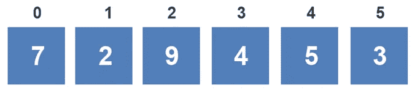
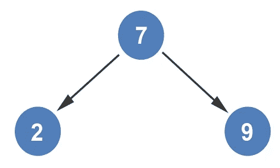
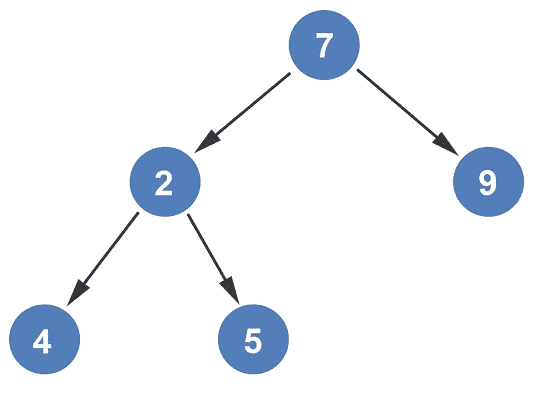
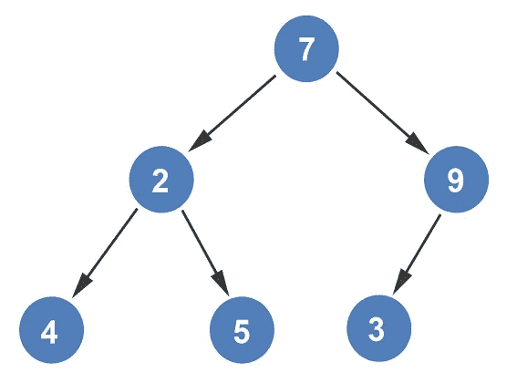

# 从数组创建堆

> 原文：<https://levelup.gitconnected.com/creating-a-heap-from-an-array-75830508b034>

堆表示有序的二叉树。可以从一维数组构建堆。在这个一维数组中:

*   *n* 表示父节点的索引( *n = 1，2，3，…* )
*   *2n* 代表左子的索引
*   *2n + 1* 代表右孩子的索引

如果我们有下面的数组，我们可以按照上面概述的规则从它构造一个堆。

因为有 6 个元素，所以堆将有 6 个节点。虽然数组的索引从 0 开始，但在对堆中的元素进行编号时，第一个元素从 1 开始。我们将按照公式来构造堆。根节点位于 *n = 1* ，在本例中为 7。

*7* 的子节点位于 *2n* 和 *2n+1* 。由于根节点在 *n = 1* ，所以左边的子节点位于*21 = 2*，右边的子节点位于
*(21)+1 = 3*。左边的孩子是 *2* 右边的孩子是 *9* 。

堆是从左向右构建的。下一个要添加的元素是 *2* 的左右子元素。值为 *2* 的节点位于 *n = 2* 。左子位于*22 = 4*，右子位于*(22)+1 = 5*。左边的孩子是 *4* ，右边的孩子是 *5* 。

需要添加的最后一个元素在编号 *9* 下；这将是编号 *9* 的左侧子节点。编号 *9* 位于节点 *3* 处。节点 *3* 的左子节点位于*2n = 23 = 6*。在 *n = 6* 处的值为 *3* 。堆是从数组构造的。

*如果你喜欢你所读的，我的书，* [*算法说明性介绍*](https://www.amazon.com/Illustrative-Introduction-Algorithms-Dino-Cajic-ebook-dp-B07WG48NV7/dp/B07WG48NV7/ref=mt_kindle?_encoding=UTF8&me=&qid=1586643862) *，涵盖了这种数据结构和更多内容。*

迪诺·卡伊奇目前是 [LSBio(寿命生物科学公司)](https://www.lsbio.com/)、[绝对抗体](https://absoluteantibody.com/)、 [Kerafast](https://www.kerafast.com/) 、[珠穆朗玛生物](https://everestbiotech.com/)、[北欧 MUbio](https://www.nordicmubio.com/) 和 [Exalpha](https://www.exalpha.com/) 的 IT 负责人。他还担任我的自动系统的首席执行官。他有十多年的软件工程经验。他拥有计算机科学学士学位，辅修生物学。他的背景包括创建企业级电子商务应用程序、执行基于研究的软件开发，以及通过写作促进知识的传播。

你可以在 [LinkedIn](https://www.linkedin.com/in/dinocajic/) 上联系他，在 [Instagram](https://instagram.com/think.dino) 上关注他，或者[订阅他的媒体出版物](https://dinocajic.medium.com/subscribe)。

[*阅读迪诺·卡吉克(以及媒体上成千上万其他作家)的每一个故事。你的会员费直接支持迪诺·卡吉克和你阅读的其他作家。你也可以在媒体上看到所有的故事。*](https://dinocajic.medium.com/membership)