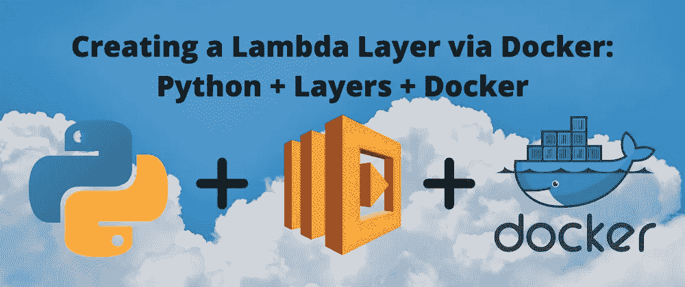

# 通过 Docker 创建 Lambda 层:Python + Layers + Docker

> 原文：<https://levelup.gitconnected.com/creating-a-lambda-layer-via-docker-python-layers-docker-e4e318717822>



# 序言

如果你读过[Deploying to AWS Lambda:Python+Layers+cloud watch](/deploying-to-aws-lambda-python-layers-cloudwatch-31c4119d3a69)，我们在 RHEL8 EC2 实例上创建了我们的 Lambda Layer zip。请注意，我们这样做是因为我们需要在 Linux 操作系统上安装软件包，而不是我所在的 Mac OS。如果您使用 Linux，您可能不需要使用 Docker 或 EC2 实例，只需在本地安装和压缩即可。在本文的剩余部分，我们将假设您没有使用 Linux 操作系统。因此，如果您不想启动 EC2 实例，另一种创建 zip 的方法是通过 Docker。

对于这篇文章来说，一些关于 Docker、Bash 和 Python 的基础知识是一个先决条件，但是也许你仍然能够跟上。

# 步骤 0:安装 Docker

我将在 Mac OS 上继续这个教程，但是我认为即使你不在 Mac OS 上，这篇文章仍然应该给你指出正确的方向。

继续在你的机器上安装 Docker 。

# 步骤 1:创建 Dockerfile

一旦您能够验证您已经正确安装了它，选择您本地机器上的任何目录来创建我们的包。例如，在我的 Macbook 上，我将在`/Users/Nakul/Documents/Docker`中创建图层。现在，在这个目录中，我们将创建一个 Dockerfile——为此，只需用`vi Dockerfile`创建一个名为 docker file 的文件。

在这个 Dockerfile 文件中，我们将输入以下内容:

```
FROM amazonlinux:2.0.20200602.0RUN yum update -yRUN yum install -y \python3-pip \zip \RUN yum -y clean allRUN python3.7 -m pip install --upgrade pip
```

保存文件。

我们不想也不需要在这个 docker 文件中做太多。FROM 命令简单地指定了我们想要从 Docker hub 下载哪个映像，我们只想要任何 Linux 发行版，所以我选择了 Amazon Linux(你也可以选择 Debian，等等)。你看到的标签来自 Docker hub 上的亚马逊官方 Linux 页面。

现在，一旦我们完成了这些，我们想要确保一旦我们构建并运行了这个映像，我们就可以安装我们的 Python 库，所以我们需要运行几个命令。您在上面看到的命令类似于您可能在 EC2 实例上运行的命令。

参见本文末尾的参考资料，了解 YUM 和 YUM 命令。

# 步骤 2:构建并运行 Docker 映像

现在，在该目录中，键入

```
docker build -t amzlinuxpy37 .
```

然后按回车键。这将从我们刚刚编写的 Dockerfile 文件构建图像(并且还将*标记*为 amzlinuxpy37)。

现在，要运行 Docker 映像，在同一个目录(`/Docker`)中，键入

```
docker run -it amzlinuxpy37 bash
```

我们在这里所做的是运行一个基于我们通过目录中的 docker 文件构建的映像的容器。`-it`是为了标记我们想要立即打开一个交互式 shell——所以您会看到命令提示符显示`bash-4.2#`或类似的内容。

你可以运行一个`ls`来看看我们有什么目录，但是我们不会去打扰他们。我在容器的 home ( `/`)目录中做了一个名为`layer_dir`的目录。我建议你也这样做，这样你就不会被顶层目录中的所有子目录分散注意力。

接下来，只需用一个`cd layer_dir`命令输入该目录。

# 步骤 3:安装 Python 模块

现在，这里是我们构建包含所有模块的包的地方。由于除了创建 Lambda 层之外，我们不会将该容器用于任何其他用途，因此并不强制使用虚拟环境(但是请注意，在大多数情况下，这样做是一种最佳实践，可以保持项目依赖性的隔离和完整)。

考虑到这一点，我们应该停下来，想想我们为什么会在这个容器里。我们希望安装 Python 模块并将其压缩，这样我们就可以将压缩文件作为 Lambda 层上传。

如果你[读过我的 Lambda Layers 帖子](/deploying-to-aws-lambda-python-layers-cloudwatch-31c4119d3a69)或者仔细阅读过 [AWS 文档](https://docs.aws.amazon.com/lambda/latest/dg/configuration-layers.html#configuration-layers-path)，你会注意到为了让 AWS 理解我们的包，模块必须要么安装在`python/*module installed here*`要么安装在`python/lib/python3.x/site-packages/*module installed here*`中。

这里最快的(但不是唯一的)方法是用`mkdir python`创建一个 python 目录。

所以现在我们在容器上的目录结构应该是这样的:`/layer_dir/python`。

我们可以留在`layer_dir`中，用下面的命令将一个包直接安装到`python`子目录中:

```
pip3 install requests -t /layer_dir/python
```

如果您导航到`python`文件夹，您应该看到`requests`和安装的相关模块。现在回到`layer_dir`，让我们继续并压缩`python`目录(当然，如果你有更多要安装的，继续，这只是一个简单的教程)。

运行以下命令:

```
zip -r docker_layer.zip .
```

`docker_layer.zip`参数可以更改为任何东西，它只是 zip 的名称。`.`将压缩我们所在目录中的所有内容。因为我们在`layer_dir`中，其中唯一的项目是`python`子目录，这就是将要压缩的内容(所以当你上传 zip 文件时，顶层目录是 **python** )。

如果你在`layer_dir,`中`ls`，你会看到 zip 文件和`python`子目录在同一层。您也可以用路径修改`docker_layer.zip`,但是我们不关心 zip 位于哪里，只要我们有它就行。

好的，那么我们如何把这个压缩文件放到我们的本地机器上以便上传呢？

# 步骤 4:将 Zip 从容器复制到本地机器

**打开另一个终端窗口**，导航到你的 Dockerfile 所在的目录(对于我:`Users/Nakul/Documents/Docker`)。

在这里，我们将运行 docker copy 命令。

基本语法如下:

```
docker cp <container ID>:*source_path* *destination_path*
```

对我来说，那将是:

```
docker cp <container ID>:/layer_dir/docker_layer.zip ./
```

您必须使用容器 ID，而不是图像标签。要获得容器 ID，只需运行`docker ps`列出所有正在运行的实例，然后复制/粘贴文本(如果您停留在另一个终端窗口——仍然在您的容器中——这个命令就不会起作用)。

`./`仅仅意味着目标路径将是我们已经在的目录。

运行该命令后，zip 文件应该出现在您的本地目录中，如果您解压缩它，请随意仔细检查，顶级目录是 **python。**如果是，那太好了！

我不会深入研究如何实际上传图层并将其附加到 Lambda 函数，因为在后面的文章中已经介绍过了。

但是，嘿，下次你需要上传一个层，你不需要旋转 EC2 实例，你可以在 Docker 中创建你的层！

# 参考

[安装对接器](https://docs.docker.com/get-docker/)

[亚马逊 Linux Docker 图片](https://hub.docker.com/_/amazonlinux)

[什么是百胜？](https://en.wikipedia.org/wiki/Yum_(software))

[百胜命令备忘单](https://access.redhat.com/sites/default/files/attachments/rh_yum_cheatsheet_1214_jcs_print-1.pdf)

[码头工人基础知识](https://docker-curriculum.com/?utm_content=buffer1c144&utm_medium=social&utm_source=twitter.com&utm_campaign=buffer#docker-images)

[Docker Build:构建 Docker 图像的初学者指南](https://stackify.com/docker-build-a-beginners-guide-to-building-docker-images/)

[码头工人图像 vs 集装箱:你需要知道的一切](https://stackify.com/docker-image-vs-container-everything-you-need-to-know/)

[部署到 AWS Lambda:Python+Layers+cloud watch](/deploying-to-aws-lambda-python-layers-cloudwatch-31c4119d3a69)

[λ层目录结构](https://docs.aws.amazon.com/lambda/latest/dg/configuration-layers.html)

注意:Docker 的官方文档非常广泛——如果你想继续使用 Docker，最好的方法是通过谷歌搜索你想完成的事情。希望这篇文章是使用 Docker 的良好开端。

## 感谢阅读！