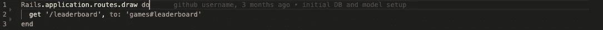
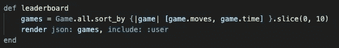
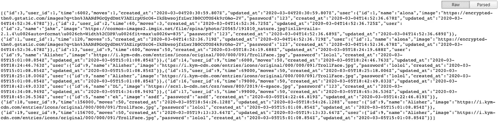
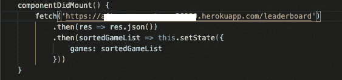

# 为 React/Rails 应用程序创建排行榜

> 原文：<https://levelup.gitconnected.com/creating-a-leaderboard-for-a-react-rails-application-2281b82c8470>

如果第一批尼安德特人和他们远走他乡的后代一样，他们会喜欢一场精彩的比赛。我喜欢想象，由于他们所处的环境，他们的比赛会与我们今天看到的有所不同。他们不是看谁能把标枪扔得最远，或者举起最重的杠铃，而是在为生存而竞争——谁能找到最多的蘑菇吃，谁能从强大的卡诺拉牛的嘴里逃脱，以及更多类似的事情。


上方——牛头人/下方——尼安德特人

一旦人类变得更加舒适，生存竞争就变得不那么激烈了，但是人类天生仍然需要竞争。

公元前 776 年，古希腊人参加了第一届*有记载的*奥运会。这很重要，因为，(我在这里推测)，这可能是我们现在普遍倾向于寻找客观地说谁在各种活动中最优秀的方法的开始。向前跳过几年，人类仍然喜欢一场精彩的竞争，但计算机提供了一种新的媒介，我们可以通过它来竞争——这很棒，现在比以往任何时候都更棒，因为我们甚至不再需要和我们的竞争对手在同一个房间里。如果两个人同时玩一个游戏，通常谁是赢家是很明显的，但是如果我们想让多人在不同的时间玩这个游戏，那么必须有不同的方式来显示顶级玩家。

即使在这样一个应用程序中:【https://us-game-alien.herokuapp.com/play，目标是学习，而不是太多的竞争，我和我的合作伙伴仍然本能地感到需要进行竞争，所以我们需要创建一个排行榜。

我们的应用程序有一个 React 前端和一个 Rails 后端，因此可能有几种不同的方法来解决这个问题，但其中一些不同的方法可能比其他方法更容易实现。我将讨论我们考虑过的两种选择。

在决定如何设置排行榜时，有两个重要的事情需要考虑:排行榜数据来自哪里，以及它是如何排序的。我和我的搭档最终在 Rails 后端处理了排行榜的大部分逻辑和创建工作。这里需要特别注意的是，对于我们的项目，我们有一个游戏模型，它包含了从游戏开始以来经过的时间和正确回答所有 50 个问题的猜测次数。一个完美的游戏应该有 50 步棋，所以为了提高玩家的准确性，我们希望首先按照步数排序，然后使用时间作为决胜局。例如，在四分钟内完成 50 次猜测的人在排行榜上比在四分钟内完成 60 次猜测的人更靠前。设置这一切需要几个步骤，没有特定的顺序。首先，我们需要为我们的 Rails 后端写一条路线。在 routes.rb 文件中，我们的排行榜路线是这样的:



然后，我们需要控制器方法来生成数据。在我们的游戏控制器中，我们编写了一个名为 leaderboard 的方法，它依赖于 Ruby sort_by 方法，就我们的目的而言，它看起来像这样:



排行榜功能

在我有限的使用 sort_by 方法的经验中，只按一个属性排序更常见，但是如上所述，它可以用于按多个属性排序。第一个属性，在这种情况下是“移动”，将首先对游戏进行排序，然后第二个属性“时间”将用于对在相同数量的移动中完成的游戏进行排序。然后，由于我们只需要排行榜的前几个游戏，切片功能将只为我们提供前 10 个游戏。最后，leaderboard 方法的最后一行使得当访问 leaderboard route 时，它将提供 json 格式的数据，这是 React.js 前端显示信息所必需的。



以 JSON 格式显示的当前排行榜

拼图的最后一块是在前端显示信息。根据应用的不同，这可能需要以不同的方式来完成，但要遵循的一般步骤是:

1.  对/leaderboard 进行获取调用，并将收到的数据保存到组件的状态中。在这里，使用 componentDidMount()生命周期方法来确保数据在页面加载后立即可用可能会有所帮助。这是我们的样子:



2.在有序列表元素中，循环访问状态中的数据，为每个元素创建列表项。代码可能看起来像这样:

```
<ul>
{this.state.leaderboardGames.map(game => <li key=game.id>{<game.user.name}</li>)}
</ul>
```

3.根据个人喜好，添加任何附加信息/CSS

创建排行榜的另一个选择是在前端处理游戏和信息的排序逻辑。然而，重要的是要注意，这不仅可能更困难，而且可能效率更低。步骤如下所示:

1.  仍然需要一个路由来获取游戏列表，但是在这种情况下，它可能只是提供一个已经玩过的每个游戏的未排序列表
2.  在前端，将对/games 进行一个 fetch 调用，然后将这些游戏的所有保存到状态。
3.  写几个助手函数来对游戏列表进行排序，按照移动次数和时间来排序。另外，不要忘了将列表削减到前 10 名。
4.  最后，可以使用与上一个示例的第二步相同的代码来显示游戏列表。

对我来说，选择在后端处理逻辑是显而易见的。首先，如果游戏达到更大的规模，我们不希望每次查看排行榜时都获取每个游戏的列表——如果有足够多的人玩这个游戏，这个列表可能最终包含成千上万个元素。然后就个人而言，我发现在 Ruby 中排序元素比在 JavaScript 中排序简单得多，尤其是当两个游戏的时间属性只相差几分之一秒的时候。

我希望每个人都喜欢玩我上面链接的游戏，并祝你在排行榜上好运。