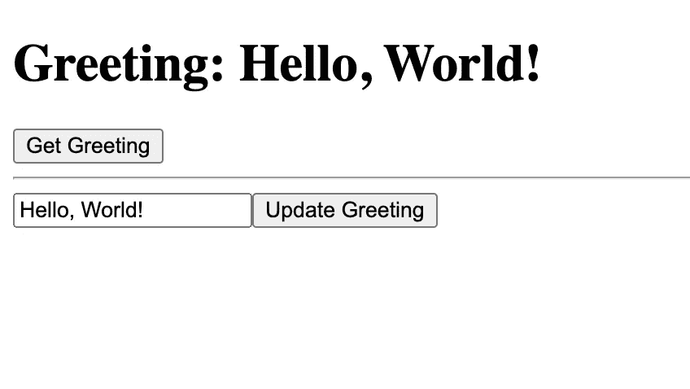

# 用 React + Hardhat 创建本地区块链网站

> 原文：<https://levelup.gitconnected.com/creating-a-local-blockchain-website-with-react-hardhat-691ba5ee6426>

【https://unsplash.com/@theshubhamdhage 

在本教程中，我们将在 Hardhat 的帮助下，构建一个非常简单的 React Webapp，它与本地主机上区块链的 Solidity 契约进行交互。该应用程序将在区块链上存储问候，并允许用户获取或更新问候。

# 创建基本的 React 和 Hardhat 应用

*   我们要做的第一件事是创建一个 React 应用程序。我们可以通过运行`npx create-react-app`来做到这一点
*   **库**:我们将需要几个库，使用`npm install --save-dev @nomiclabs/hardhat-ethers ethers @nomiclabs/hardhat-waffle ethereum-waffle chai`安装它们
*   **安全帽**:接下来我们将通过运行`npx hardhat`初始化一个安全帽应用程序(确保选择`Create a sample project`

让我们看看我们有什么…

**Greeter.sol**

这是我们的可靠性合同，我们将部署在我们当地的以太坊区块链。基本上，它接受一个初始问候语，并有一个返回该问候语的方法和一个更新该问候语的方法。一份相当简单的合同！

**App.js**

让我们去掉最初的 React 应用程序中的一些附加功能，这样我们就有了这个基本组件。

**scripts/deploy.js(注意:你的可能不叫 deploy)**

这是 Hardhat 为我们制作的一个简单的部署脚本。正如您在第 17–20 行看到的，我们创建了一个欢迎契约，然后使用初始消息“Hello，Hardhat”部署它。

**hardhat.config.js**

这个文件配置了 HardHat 如何部署我们的链。需要更新的一些关键内容是…

*   添加 chainID 1337(必须是 1337，因为元掩码如何与本地主机[https://hardhat.org/metamask-issue.html](https://hardhat.org/metamask-issue.html)交互
*   将工件的路径设置为。/src/artifacts，默认情况下，工件进入根目录，但是如果我们希望我们的应用程序能够与我们的新契约交互，我们需要将工件文件发送到 src。

## 让我们更新 App.js

这里有相当大的数量，所以让我们一行一行地看。

*   我们通过运行部署脚本(下一节)获得 **GREETER_ADDRESS**
*   **构造函数**创建一个状态，其中问候语设置为空字符串
*   在 **fetchGreeting** 中，我们检查以确保我们有一个以太坊提供者(比如 MetaMask chrome 插件)。如果是这样的话，我们用它来创建一个对我们在链上的契约的引用(第 17–18 行)。然后，我们调用契约上的 greet 方法来获取问候语，并将其存储在我们的状态中(第 22–24 行)。
*   在 **setGreeting 中，**我们为 newGreeting 接受一个字符串。由于更新合同价值需要汽油费，我们需要一个以太坊账户来支付，所以我们去申请一个账户。现在我们可以创建一个合同引用，使用我们的以太坊账户来支付汽油费(第 35–39 行)。然后，我们执行一个事务来更新链上的值，并调用我们的 fetchGreeting 方法来更新我们的状态(第 42–44 行)。
*   在**渲染**中，我们创建了一个 h1 来显示我们的问候状态。我们提供了一个输入字段和一个按钮，当点击时，这个按钮试图更新链上的问候。

## 运行它！！！

现在我们可以运行我们的应用程序了！

1.  端子 1:运行 **npx 安全帽清洗**
2.  终端 1:运行 **npx hardhat 编译**
3.  端子 2:运行 **npx hardhat 节点**(并保持运行)
4.  终端 1:运行 **npx hardhat 运行 scripts/deploy.js —网络本地主机**

您将得到如下输出

> G reeter 部署到:0x 5 fbdb 2315678 afec b 367 f 032d 93 f 642 f 64180 aa 3

那是你的 GREETER_CONTRACT，把那个放在你的 App.js 里面。

5.端子 3:运行 **npm 启动**

6.在 MetaMask 中，切换到 localhost:8545 网络，单击右上角的圆圈，并使用运行步骤 3 后显示的私钥之一导入帐户。然后单击设置>高级>重置帐户

TaDa！！现在，您可以在本地创建分散的 web 应用程序，然后将它们部署到主以太网！